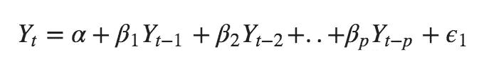

# 时间序列建模— ARIMA

> 原文：<https://medium.com/analytics-vidhya/time-series-modelling-arima-82453bac7de?source=collection_archive---------15----------------------->

> 本文描述了一个完整的使用 ARIMA 模型对时间序列数据进行预测的端到端过程。

**ARIMA** ( *自回归综合移动平均*)是一类模型，它根据给定时间序列自身的过去值来解释该时间序列。换句话说，它自己的滞后和滞后预测误差，使方程可以用来预测未来值。

**AR — *自动回归*** 。
利用自身与某些滞后观测值之间的依赖关系的模型。这基本上是时间序列对自身的线性回归。参数 **k** 代表最大滞后。它也被称为滞后阶。

输出仅取决于其自身的滞后，因此，Yt 是 Yt 的*滞后的函数。*

**一— *综合*** 。
差分观测值的使用。换句话说，从上一时间步的观测值中减去一个观测值。参数 **d** 表示使时间序列稳定所需的差值数量。

**马—*移动平均线****。
该模型表示未来观察值是所有过去观察值的平均值。我们也可以考虑移动平均模型根据最近预测的误差来修正未来的预测。*

*订单 **q** 的移动授权流程定义为:*

**

*在哪里，*

*   **c* =数值的平均值*
*   **ϵt* =一个周期内数值的变化。换句话说，就是那个时间段的误差。*
*   **t-1，t-2，…..t-q* 表示订单 1，2，…分别问。*
*   *θ₁, θ2,…..θq 表示积分的阶数。对于这个例子，让我们只考虑订单 1。*

*所以，MA 方程变成了，*

**

*参数 **q** 代表最大滞后，在该最大滞后之后，其他滞后不显著。它也被称为移动平均的顺序或窗口大小。
我们应用自相关函数图(ACF)来找出 **q.** 的值*

# *我们开始编程吧*

*对于本文，我决定选择外汇汇率数据集。*

**

*我们在 python 代码中导入数据集，并绘制值来检查序列是否真的是非平稳的。*

*但首先，我们需要确保数据被转换成时序数据。*

**

*现在，我们绘制数据，以手动显示平稳性。*

**

*上述情况清楚地表明，时间序列数据不是静止不变的，特别是由于上半年出现了上升趋势。*

## *对数据进行重采样*

*有两种类型的重采样:*

*   *上采样— *增加采样频率，比如从几分钟到几秒钟。**
*   *下采样— *减少采样频率，比如从几天减少到几个月。**

*在我们的场景中，原始数据是日常数据。因此，我们将数据降采样为月度数据。*

**

*现在，在我们进行建模之前，我们需要将数据转换为静态数据。为了实现这一点，我们必须执行差分程序，或者换句话说，滞后数据，正如我在[以前的文章](/analytics-vidhya/time-series-analysis-stationarity-check-using-statistical-test-f106e9045370)中所描述的。*

*我们同时继续执行滞后并检查平稳性，直到 **p 值**降低到低于 **0.05** 。*

****

*上述绘图结果表明 *p 值*已经低于 0.05，因此我们可以观察到时间序列数据现在已经变得有些稳定。*

*所以， *ts_monthly_log_diff* 成为我们建模的系列。*

## *找出 k 值*

**

*我们应用部分自相关函数图(PACF)来找出 **k** 的值。*

***为什么不是自相关函数(ACF)？***

*我们不能在 AR 模型中使用 ACF 图，因为它显示了很强的相关性，即使对于过去很久的滞后也是如此，因此最终可能导致多重共线性问题。PACF 图通过去除已经由过去的滞后解释的成分来避免这种情况，因此我们只得到与残差相关的滞后，即不能由过去的滞后解释的成分。*

**

*从上面的图中可以明显看出，PACF 图在 k 值= 2 时切割 x 轴。因此， **k 值**变为 2。*

## *找出 q 值*

*订单 **q** 从 ACF 图中获得。这是 ACF 第一次跨越置信区间上限的滞后时间。*

**

*从上图中可以明显看出，ACF 图在 q 值= 1 时切割了置信区间上限(蓝色区域)。*

*因此， **q 值**变为 1。*

# *培训 ARIMA 模型*

*现在，我们准备建立我们的第一个模型。我们有以下内容:*

*   *k = 2*
*   *d = 1*
*   *q = 1*

**

## *残留的；剩余的*

*我们执行残差的核密度估计(KDE)图，它几乎是正态分布，因此表明我们的预测是可信的。*

**

# *让我们做一些预测*

**

*上图显示预测在数据上有差距。如果我们仔细观察数据，预测是从 1980 年 1 月开始的，而在原始时间序列中，我们有从 1979 年 12 月开始的数据。*

**

*发生这种情况是因为我们之前进行的移位，它为第一个值创建了一个空白或 null 数据，如下所示。*

****

*因此，我们对移位的时间序列进行累积求和。我们将原始时间序列的第一个值添加到累积和中。*

*这将最终把我们带到数据的原始结构。*

**

*我们现在尝试绘制包含原始时间序列和预测时间序列的图表。*

****

*我们还将原始时间序列分成训练集和测试集，并对测试数据执行相同的预测过程，以将预测输出与实际或预期输出进行比较。*

**

# *评估绩效*

*由于时间序列分析属于回归的范畴，由于自动回归的存在，我选择 MSE 或均方误差作为评估指标。*

**

*均方误差为 0.0001，这是相当小的，该模型目前是好的。*

# *摘要*

*让我们总结一下我们在这个实验中执行的所有步骤。*

1.  *将导入的数据集转换为时序数据集。*
2.  *基于当前数据的频率，执行下采样或上采样。*
3.  *执行平稳性检查并保持滞后/差分，直到 p 值降低到小于 0.05 的值。*
4.  *绘制 PACF 和 ACF 图，以便分别找出 *k* 值和 *q* 值。*
5.  *使用 ARIMA 模型训练最终的滞后时间序列数据，并提供 *k* 、 *d* 和 *q* 值作为参数。*
6.  *对预测的时间序列执行累积求和，以便将其转换为原始时间序列格式。*
7.  *对合计的预测时间序列执行预测，并使用 MSE 评估性能。*

*仅此而已。希望你真的喜欢这篇文章。*