# 人工智能交易系列№4:时间序列建模

> 原文：<https://medium.com/analytics-vidhya/time-series-modelling-d6531c9a6338?source=collection_archive---------14----------------------->

## 了解时间序列分析的高级方法，包括 ARMA，ARIMA。


艾萨克·史密斯在 [Unsplash](https://unsplash.com/s/photos/graphs?utm_source=unsplash&utm_medium=referral&utm_content=creditCopyText) 上拍摄的照片

在本系列中，我们将介绍以下执行时间序列分析的方法

1.  随机游动
2.  移动平均线模型(MA 模型)
3.  自回归模型(AR 模型)
4.  自回归移动平均模型(ARMA 模型)
5.  自回归综合移动平均线(ARIMA 模型)

# 随机行走模型

随机游走假说是一种金融理论，认为股票市场价格根据随机游走而变化，因此无法预测。一个随机游走模型相信[1]:

1.  股票价格的变化具有相同的分布，并且相互独立。
2.  股票价格或市场过去的运动或趋势不能用来预测其未来的运动。
3.  在不承担额外风险的情况下，跑赢市场是不可能的。
4.  认为技术分析是不可靠的，因为它导致图表分析师只在波动发生后才买入或卖出证券。
5.  认为基本面分析不可靠，因为收集的信息质量通常很差，而且容易被误解。

随机行走模型可以表示为:

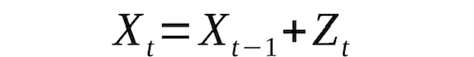

随机行走方程

该公式表示当前时间 t 的位置是先前位置和噪声的和，用 *Z.* 表示

## 用随机游走模拟收益

1.  **导入库**

这里，我们正在导入可视化和模拟随机行走模型所需的重要库。

```
from statsmodels.graphics.tsaplots import plot_acf
from statsmodels.tsa.stattools import acf

import matplotlib.pyplot as plt
import seaborn as sns
import pandas as pd
import numpy as np

sns.set()
plt.style.use('ggplot')
plt.rcParams['figure.figsize'] = (14, 8)
```

现在我们生成 1000 个随机点，方法是给上一个点加上一个随机度，以 0 为起点生成下一个点。

```
*# Draw samples from a standard Normal distribution (mean=0, stdev=1).*
points = np.random.standard_normal(1000)

*# making starting point as 0*
points[0]=0

*# Return the cumulative sum of the elements along a given axis.*
random_walk = np.cumsum(points)
random_walk_series = pd.Series(random_walk)
```

**2。绘制模拟随机漫步**

现在，让我们绘制数据集。

```
plt.figure(figsize=[10, 7.5]); *# Set dimensions for figure*
plt.plot(random_walk)
plt.title("Simulated Random Walk")
plt.show()
```

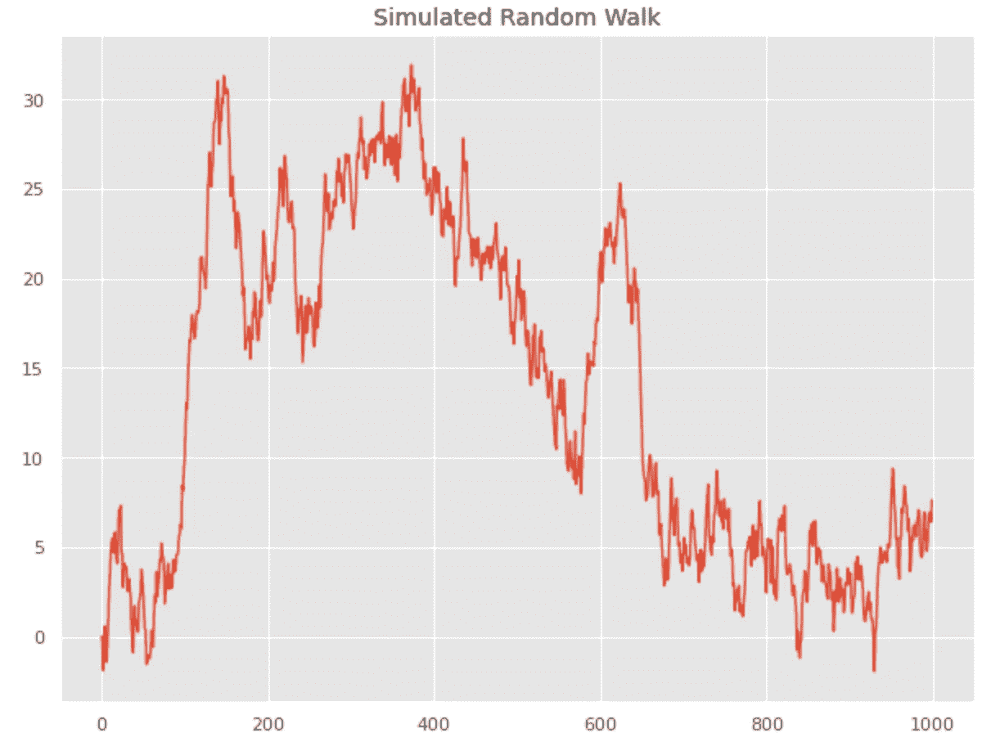

模拟随机行走

**3。自相关图**

自相关图旨在显示时间序列的元素是正相关、负相关还是相互独立。自相关图在纵轴上显示自相关函数(acf)的值。它的范围从–1 到 1。

我们可以计算时间序列观测值与先前时间步长观测值的相关性，称为*滞后*。因为时间序列观测值的相关性是用先前时间的相同序列的值计算的，这被称为序列相关性，或*自相关*。

滞后时间序列的自相关图称为自相关函数，或缩写为 ACF。该图有时被称为相关图或自相关图。

```
random_walk_acf = acf(random_walk)
acf_plot = plot_acf(random_walk_acf, lags=20)
```

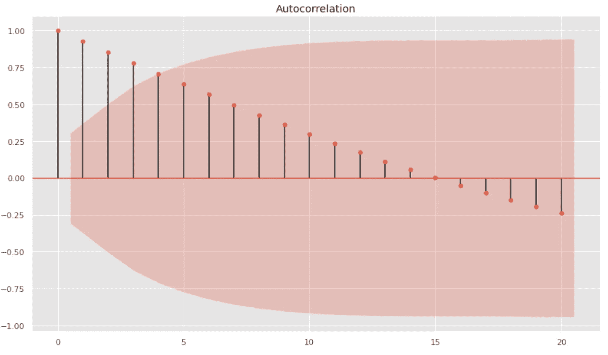

自相关图

查看相关图，我们可以说*过程不是静止的。*但是有一种方法可以去除这种趋势。我会尝试不同的方法，使这个过程成为一个静态过程-

1.  知道一个随机游走给前一个点增加了一个随机噪声，如果我们取每个点和它前一个点的差，就应该得到一个纯随机的随机过程。
2.  获取价格的对数收益。

**4。2 分之差**

```
random_walk_difference = np.diff(random_walk, n=1)

plt.figure(figsize=[10, 7.5]); *# Set dimensions for figure*
plt.plot(random_walk_difference)
plt.title('Noise')
plt.show()
```

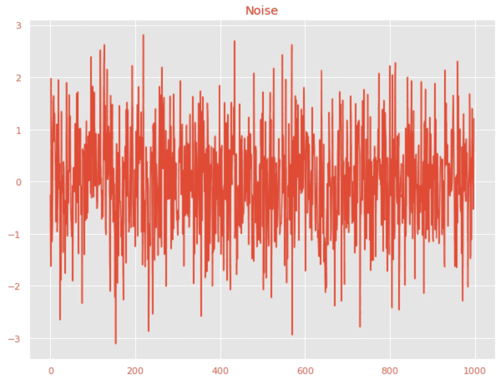

```
cof_plot_difference = plot_acf(random_walk_difference, lags=20);
```

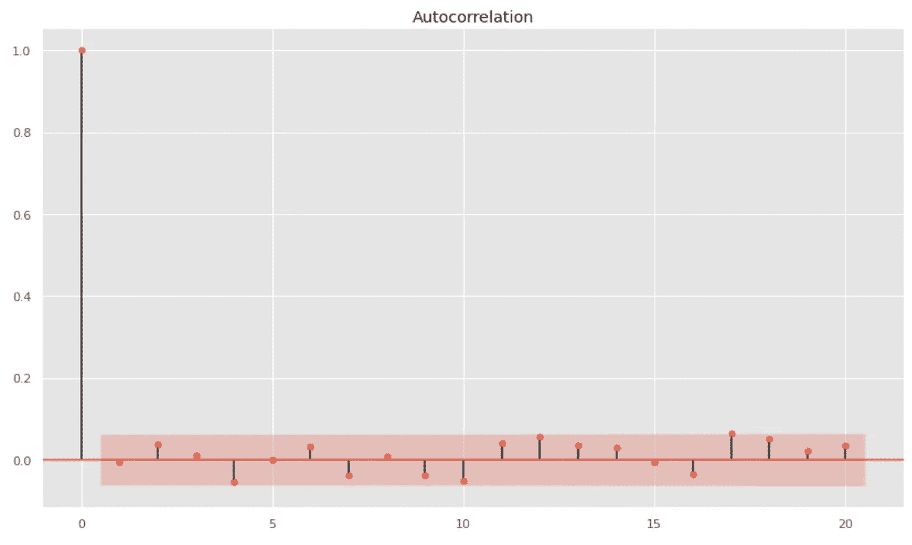

我们看到这是一个纯随机过程的相关图，自相关系数在滞后 1 时下降。

# 移动平均模型(移动平均模型)

在 MA 模型中，我们从平均 mu 开始，为了获得时间 t 的值，我们添加来自先前时间戳的残差的线性组合。在金融中，残差是指过去的数据点无法捕捉到的新的不可预测的信息。残差是模型过去预测值和实际值之间的差值。

移动平均模型被定义为 MA(q ),其中 q 是滞后。

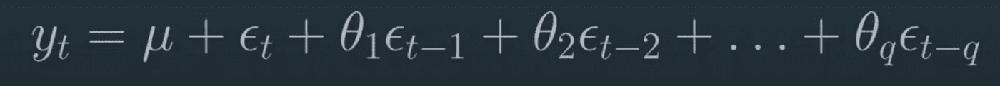

用滞后' *q '表示移动平均模型；*(来源: [AI 在 Udacity 上交易纳米学位课程](https://www.udacity.com/course/ai-for-trading--nd880))

以 3 阶 MA 模型为例，表示为 MA(3):

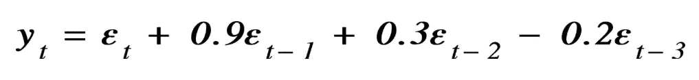

滞后=3 的移动平均模型的表示；马(3)

上面的等式表明，时间 t 处的位置 y 取决于时间 t 处的噪声，加上时间 t-1 处的噪声(具有某个权重ε)，加上时间 t-2 处的一些噪声(具有某个权重)，加上时间 t-3 处的一些噪声。

```
from statsmodels.tsa.arima_process import ArmaProcess

*# start by specifying the lag*
ar3 = np.array([3])

*# specify the weights : [1, 0.9, 0.3, -0.2]*
ma3 = np.array([1, 0.9, 0.3, -0.2])

*# simulate the process and generate 1000 data points*
MA_3_process = ArmaProcess(ar3, ma3).generate_sample(nsample=1000)plt.figure(figsize=[10, 7.5]); *# Set dimensions for figure*
plt.plot(MA_3_process)
plt.title('Simulation of MA(3) Model')
plt.show()
plot_acf(MA_3_process, lags=20);
```

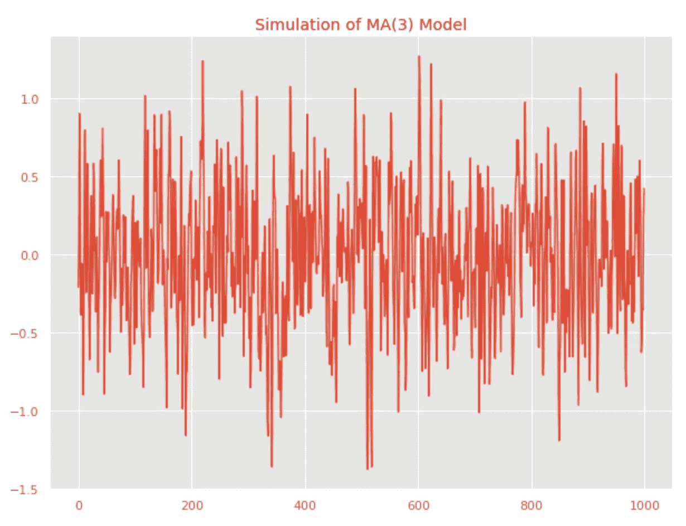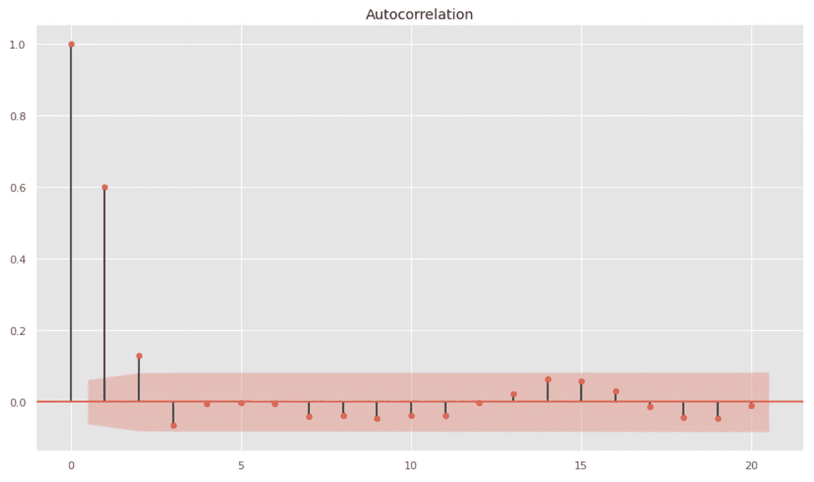

正如你所看到的，在第三阶段有显著的相关性。之后，相关性不再显著。这是有意义的，因为我们指定了一个滞后为 3 的公式。

# 自回归模型(AR 模型)

自回归模型(AR 模型)试图拟合以前值的线性组合线。它包括一个*截距*，该截距与之前的值无关。它还包含*误差项*来表示先前项无法预测的运动。

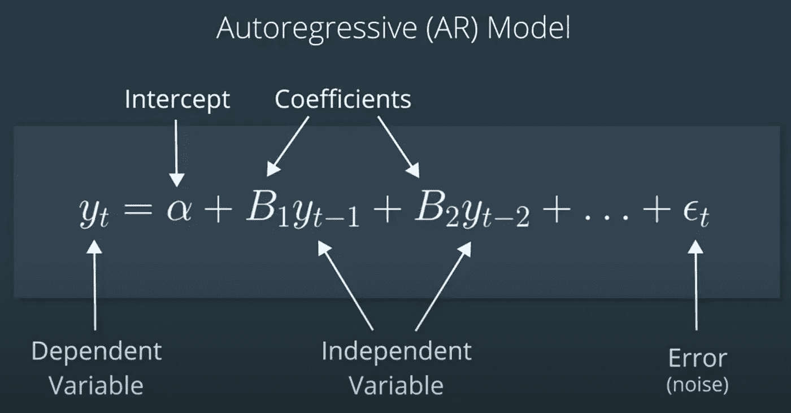

AR 模型(来源: [AI 在 Udacity](https://www.udacity.com/course/ai-for-trading--nd880) 上交易纳米学位课程)

AR 模型由其*滞后*定义。如果一个 AR 模型只使用昨天的值而忽略其他的，它被称为 *AR 滞后 1* ，如果模型使用前两天的值而忽略其他的，它被称为 *AR 滞后 2* 等等。


AR Lag(来源: [AI 在 Udacity](https://www.udacity.com/course/ai-for-trading--nd880) 上交易纳米学位课程)

通常，自回归模型仅适用于平稳时间序列。这限制了参数φ的范围。例如，AR(1)模型会将 phi 限制在-1 和 1 之间。随着模型阶数的增加，这些约束变得更加复杂，但是在 Python 中建模时会自动考虑这些约束。

## 模拟具有自回归特性的收益序列

为了模拟 AR(3)过程，我们将使用 [ArmaProcess](https://www.statsmodels.org/stable/generated/statsmodels.tsa.arima_process.ArmaProcess.html) 。

为此，让我们举一个我们用来模拟随机行走模型的例子:


MA(3)模型的表示

因为我们正在处理一个 3 阶的自回归模型，我们需要定义滞后 0，1，2 和 3 的系数。此外，我们将取消移动平均线过程的影响。最后，我们将生成 10000 个数据点。

```
ar3 = np.array([1, 0.9, 0.3, -0.2])
ma = np.array([3])
simulated_ar3_points = ArmaProcess(ar3, ma).generate_sample(nsample=10000)plt.figure(figsize=[10, 7.5]); *# Set dimensions for figure*
plt.plot(simulated_ar3_points)
plt.title("Simulation of AR(3) Process")
plt.show()
```

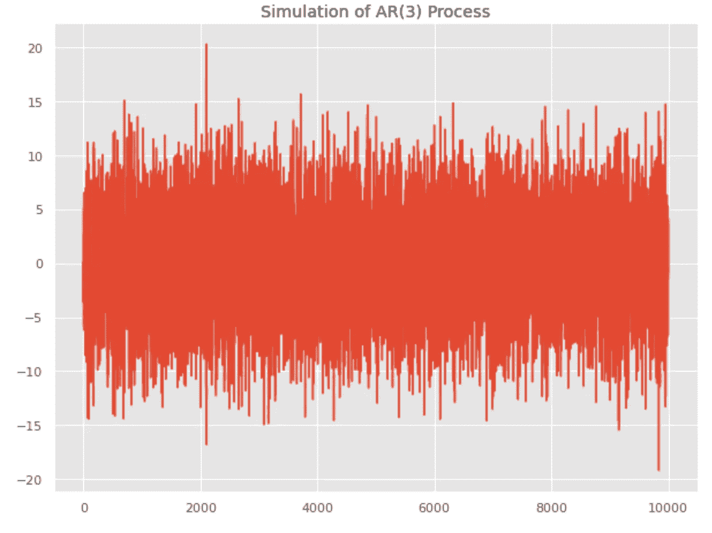

```
plot_acf(simulated_ar3_points);
```

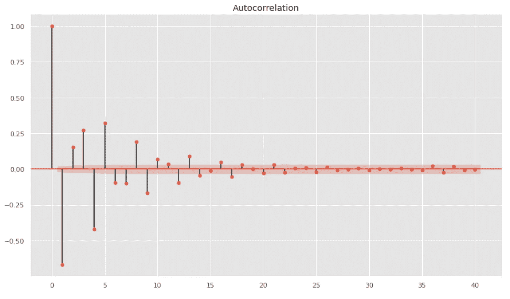

查看相关图，我们可以看到系数在缓慢衰减。现在让我们画出相应的偏相关图。

## 部分自相关图

观测值和先前时间步长的观测值的自相关由直接相关和间接相关组成。这些间接相关性是观测值相关性的线性函数，观测值位于中间时间步长。

偏相关函数试图消除的就是这些间接相关性。

```
from statsmodels.graphics.tsaplots import plot_pacf

plot_pacf(simulated_ar3_points);
```

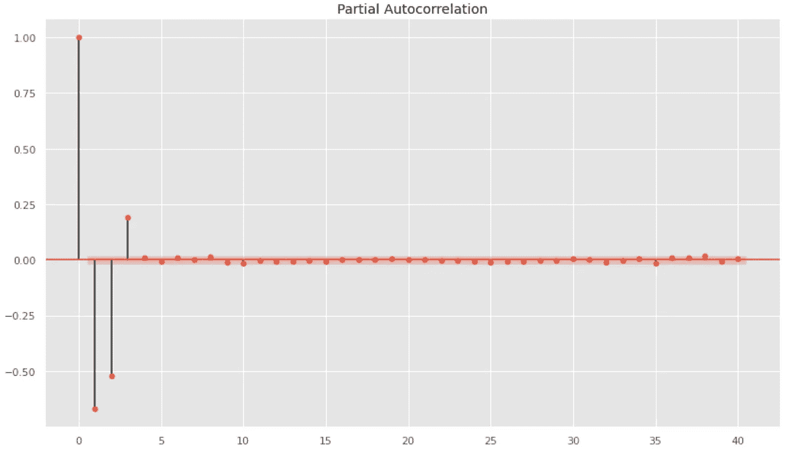

正如你所看到的，滞后 3 之后，系数并不显著。因此，部分自相关图对于确定 AR(p)过程的阶数是有用的。您也可以使用 import 语句`from statsmodels.tsa.stattools import pacf`查看这些值

```
from statsmodels.tsa.stattools import pacf

pacf_coef_AR3 = pacf(simulated_ar3_points)
print(pacf_coef_AR3)
```

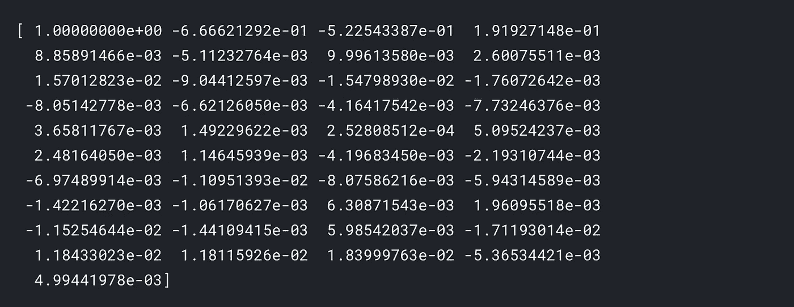

# 自回归移动平均模型

ARMA 模型用一个 *p 和 q* 来定义。 *p* 是自回归的滞后， *q* 是移动平均的滞后。基于回归的训练模型要求数据*稳定*。对于非平稳数据集，均值、方差和协方差可能会随时间而变化。这造成了根据过去预测未来的困难。

回顾自回归模型(AR 模型)的方程:


AR 模型。(来源: [AI 在 Udacity 上交易纳米学位课程](https://www.udacity.com/course/ai-for-trading--nd880))

看移动平均线模型(MA 模型)的方程:


马模型。(来源: [AI 在 Udacity 上交易纳米学位课程](https://www.udacity.com/course/ai-for-trading--nd880))

ARMA 模型的方程就是两者的简单组合:

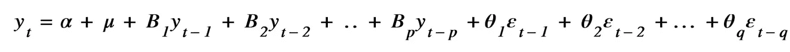

ARMA 模型

因此，该模型可以解释随机噪声(移动平均部分)和前一步(自回归部分)的时间序列之间的关系。

## **模拟 ARMA(1，1)过程**

这里，我们将模拟一个 ARMA(1，1)模型，其方程为:

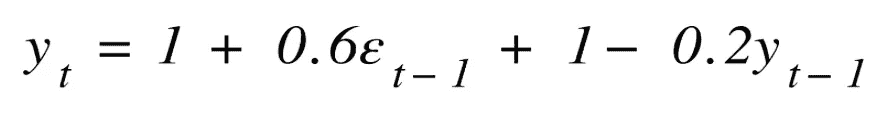

```
ar1 = np.array([1, 0.6])
ma1 = np.array([1, -0.2])
simulated_ARMA_1_1_points = ArmaProcess(ar1, ma1).generate_sample(nsample=10000)plt.figure(figsize=[15, 7.5]); *# Set dimensions for figure*
plt.plot(simulated_ARMA_1_1_points)
plt.title("Simulated ARMA(1,1) Process")
plt.xlim([0, 200])
plt.show()
```

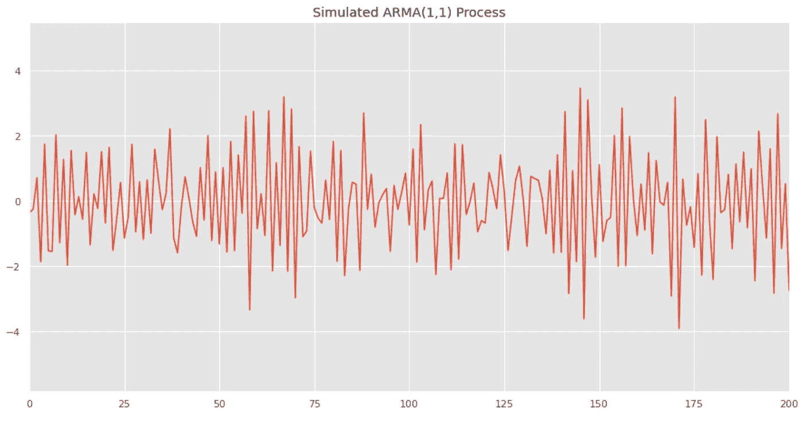

```
plot_acf(simulated_ARMA_1_1_points);
plot_pacf(simulated_ARMA_1_1_points);
```

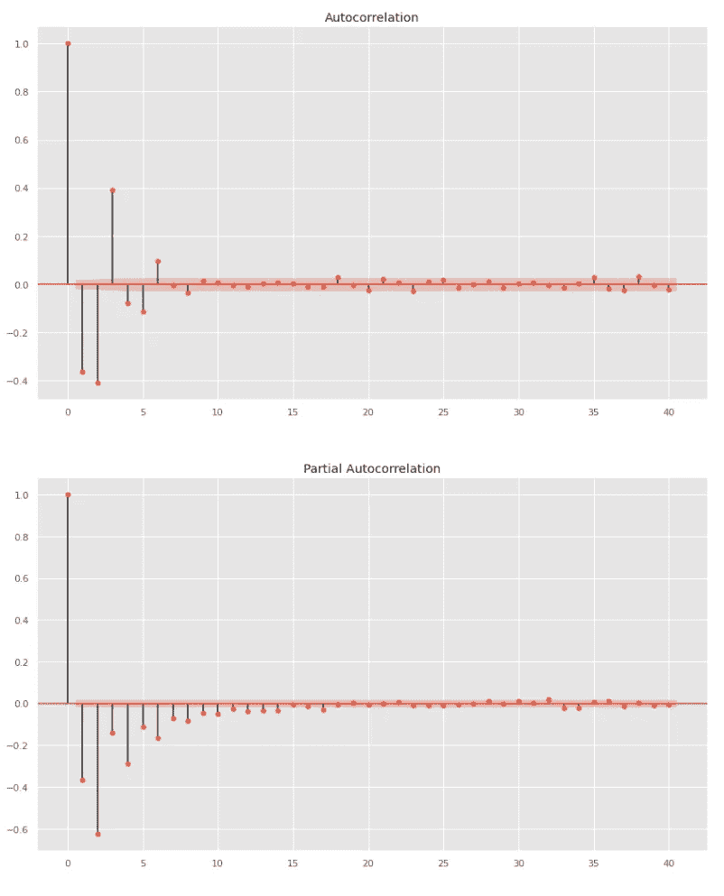

正如你所看到的，两条曲线显示了相同的正弦趋势，这进一步支持了 AR(p)过程和 MA(q)过程都在起作用的事实。

# 自回归综合移动平均(ARIMA)

这个模型是自回归、移动平均模型和差分的结合。在这种情况下，整合是分化的对立面。

微分有助于消除时间序列中的趋势，使其保持平稳。
它只是简单地包括从时间 t 中减去点 a t-1

数学上，ARIMA(p，d，q)现在需要三个参数:

1.  p:自回归过程的阶
2.  d:差异程度(差异的次数)
3.  问:移动平均线过程的顺序

该等式可以表示如下:

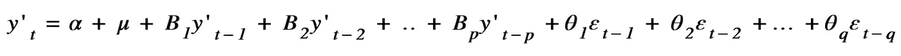

ARIMA 模型的表示

```
np.random.seed(200)

ar_params = np.array([1, -0.4])
ma_params = np.array([1, -0.8])

returns = ArmaProcess(ar_params, ma_params).generate_sample(nsample=1000)

returns = pd.Series(returns)
drift = 100

price = pd.Series(np.cumsum(returns)) + driftreturns.plot(figsize=(15,6), color=sns.xkcd_rgb["orange"], title="simulated return series")
plt.show()
```

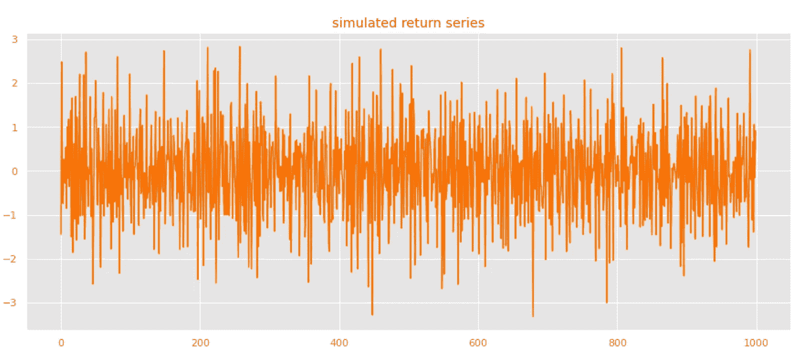

```
price.plot(figsize=(15,6), color=sns.xkcd_rgb["baby blue"], title="simulated price series")
plt.show()
```


## 提取静态数据

获得平稳时间序列的一种方法是获取时间序列中各点之间的差值。这个时间差叫做*变化率。*

`rate_of_change = current_price / previous_price`

相应的*日志返回*将变为:

`log_returns = log(current_price) - log(previous_price)`

```
log_return = np.log(price) - np.log(price.shift(1))
log_return = log_return[1:]
_ = plot_acf(log_return,lags=10, title='log return autocorrelation')
```

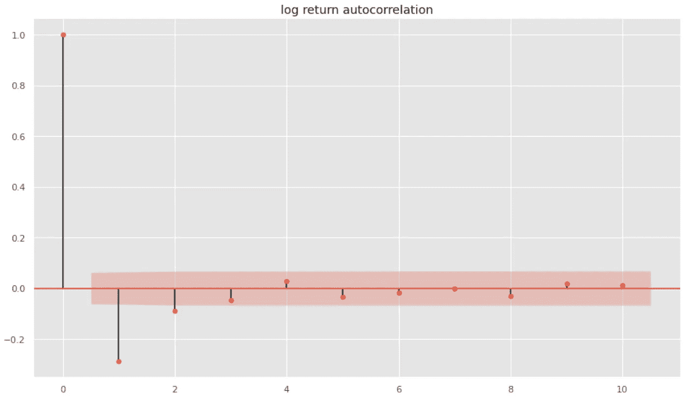

```
_ = plot_pacf(log_return, lags=10, title='log return Partial Autocorrelation', color=sns.xkcd_rgb["crimson"])
```

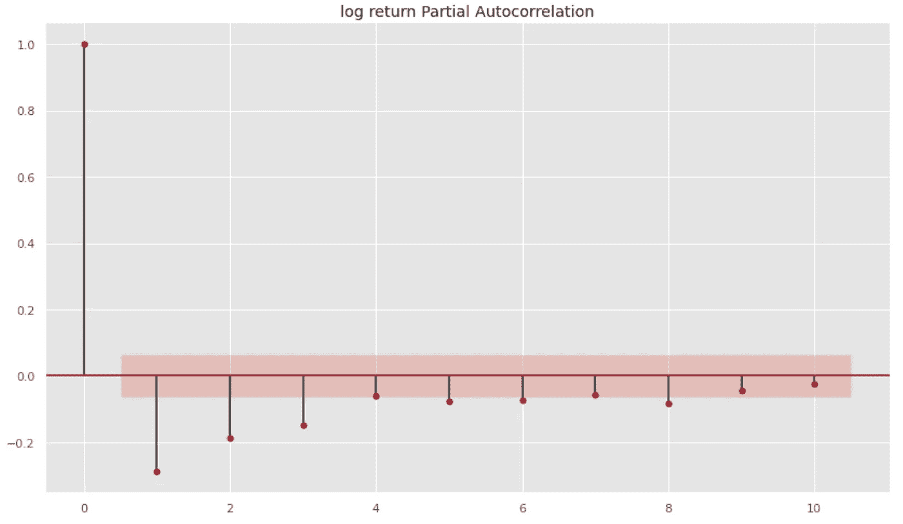

```
from statsmodels.tsa.arima_model import ARIMA

def fit_arima(log_returns):
        ar_lag_p = 1
        ma_lag_q = 1
        degree_of_differentiation_d = 0

        *# create tuple : (p, d, q)*
        order = (ar_lag_p, degree_of_differentiation_d, ma_lag_q)

        *# create an ARIMA model object, passing in the values of the lret pandas series,*
        *# and the tuple containing the (p,d,q) order arguments*
        arima_model = ARIMA(log_returns.values, order=order)
        arima_result = arima_model.fit()

        *#TODO: from the result of calling ARIMA.fit(),*
        *# save and return the fitted values, autoregression parameters, and moving average parameters*
        fittedvalues = arima_result.fittedvalues
        arparams = arima_result.arparams
        maparams = arima_result.maparams

        return fittedvalues,arparams,maparamsfittedvalues,arparams,maparams = fit_arima(log_return)
arima_pred = pd.Series(fittedvalues)
plt.plot(log_return, color=sns.xkcd_rgb["pale purple"])
plt.plot(arima_pred, color=sns.xkcd_rgb["jade green"])
plt.title('Log Returns and predictions using an ARIMA(p=1,d=1,q=1) model');
print(f"fitted AR parameter **{**arparams[0]**:**.2f**}**, MA parameter **{**maparams[0]**:**.2f**}**")
```

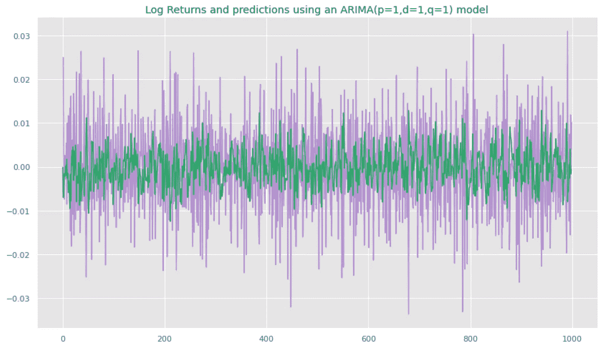

## 参考

1.  [https://towards data science . com/how-to-model-time-series-in-python-9983 ebbf 82 cf](https://towardsdatascience.com/how-to-model-time-series-in-python-9983ebbf82cf)
2.  [https://towards data science . com/advanced-time-series-analysis-with-ARMA-and-ARIMA-a7d 9b 589 ed6d](https://towardsdatascience.com/advanced-time-series-analysis-with-arma-and-arima-a7d9b589ed6d)
3.  [https://towards data science . com/time-series-forecasting-with-auto regressive-processes-ba 629717401](https://towardsdatascience.com/time-series-forecasting-with-autoregressive-processes-ba629717401)
4.  [https://stack overflow . com/questions/52815990/value error-the-computed-initial-ma-coefficients-is-not-inverse-you-should-I](https://stackoverflow.com/questions/52815990/valueerror-the-computed-initial-ma-coefficients-are-not-invertible-you-should-i)
5.  [在 Udacity 上交易纳米学位课程的 AI](https://www.udacity.com/course/ai-for-trading--nd880)。
6.  [交易用 Github AI 时间序列](https://github.com/purvasingh96/AI-for-Trading/tree/master/Term%201/Theorey%20%26%20Quizes/04.%20Time%20Series%20Modelling)
7.  [基于 ARMA 和 ARIMA 的时间序列分析](https://www.kaggle.com/purvasingh/time-series-analysis-with-arma-and-arima)