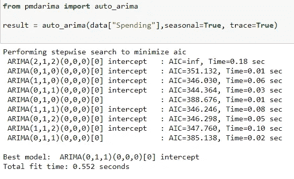

# 用机器学习进行时间序列预测(入门)。

> 原文：<https://medium.com/analytics-vidhya/time-series-prediction-with-machine-learning-getting-started-8763eda1127f?source=collection_archive---------2----------------------->


> **什么是时间序列数据？**

时间序列数据(带时间戳的数据)是按时间顺序索引的数据点序列。时间戳是在不同时间点收集的数据。

这些数据点通常由同一来源在一段时间间隔内进行的连续测量组成，用于跟踪随时间的变化。


**举例**:这里有一个数据集，是一个男人从 2004 年 1 月 1 日到**2007 年 1 月 1 日到 2007 年 5 月 1 日的个人消费情况，数据在每个月的第一天定期收集。**

> **时间序列数据有什么用？**

使用时间序列数据，我们可以发现数据中的模式，然后可以用它来预测任何给定变量的值。

这也有其局限性，如果给定的变量很大程度上依赖于任何外部因素，我们的模型将不会给出最佳结果。

然而，时间序列预测是机器学习的一个重要领域，因为有许多预测问题涉及时间成分。


做时间序列分析/预测时有很多组成部分。使用**个人支出**数据集的例子对其进行分析&预测，我们将研究随之而来的所有组成部分。

> **1。获取正确格式的时间序列数据**

我们将处理个人支出数据集，该数据集包含一名男子从 2004 年 1 月 1 日到 2007 年 1 月 1 日的个人支出，数据在每月的第一天定期收集。

*   将包含时间戳数据的变量传递给 index_col，并设置 parse_date=True，以正确的格式读取数据。
*   检查我们的数据集的频率(可以是每天，每月，每年等。)并相应地设置索引频率。


> 2. **EDA**

*   我们有月度数据，所以我们总共有 37 行，我们拥有的总数据是 **3 年零 1 个月**(**2004–01–01**到**2007–01–01**)。


*   绘制数据图以获得洞察力:从这张图中我们可以看到，数据中明显存在上升趋势和季节性。这两个术语在时间序列分析中非常重要，因此我们将了解它们的真正含义。


> **重要概念**

1.  **趋势**:**趋势**表示**数据**在**时间**的一段长时间内增加或减少的总趋势。一个**趋势**是一个平滑的、一般的、长期的、平均的趋势。在**时间**的给定时间段内，增加或减少不一定总是在相同方向上。趋势的三种类型:1 .**向上** 2。**向下** 3。**水平/静止**
2.  **季节性** : **季节性**是**时间序列**的一个特征，在该时间序列中，数据会经历每个日历年都会出现的有规律且可预测的变化。任何可预测的波动或模式，如果在一年内反复出现，就被称为季节性波动
3.  **平稳性**:如果一个时间序列数据的统计特性如**均值、方差随时间保持不变**，则称该时间序列数据是平稳的。大多数时间序列模型都假设数据是平稳的，因此**如果我们的数据是非平稳的，我们必须将其转换为平稳数据**。将数据转换为静态数据的另一个好处是，与静态数据相关的理论更加成熟，也更容易实现。

看上面的图，我们可以说我们的数据有明显的上升趋势，也有一些季节性。但是对于所有的数据集来说，这可能不是那么简单。因此，我们可以使用**季节性分解**来确定我们的数据是否具有季节性、趋势性。

> **季节性分解**

季节性分解将返回 4 样东西:

1.
观察到的(原始数据)2。
趋势(大势)3。季节性数据
4。误差/残差(无法用季节性或季节性解释的数据)

季节性分解有 **2 个选项**:

1.可加性(当趋势更加线性时，季节性和趋势似乎是常数)
2。乘法(趋势更加非线性)


从这张图中我们可以看到，季节性分解清楚地告诉我们，数据中有一些**上升趋势**和一些**季节性**。

> **3。检查平稳性。**
> 
> **迪基-富勒函数**:检查数据是否稳定。

如果 **p < 0.5** :数据为**静止**， **p > 0.5** :数据为**非静止。**


使用 Dickey-Fuller 测试来检查平稳性的函数

因此，在用这个函数检查之后，我们得出结论:**数据是非平稳的**。


> **4。选择正确的型号并使数据稳定**

**ARIMA** :自回归综合移动平均线。

**ARIMA** 是预测的最佳模型之一，详情[此处](https://www.investopedia.com/terms/a/autoregressive-integrated-moving-average-arima.asp)。

*   为了有效地使用 ARIMA，我们需要理解数据中的**平稳性**。
*   如果我们已经确定数据不是平稳的，我们将需要使它平稳来预测它。
    -一个简单的方法是使用差分。
*   数据稳定后，我们需要选择 **p，d，q** 参数。(**p**:AR 中的滞后数， **d** :差异度，**q**:MA 模型的阶)

**我们可以在这里使用 auto_arima 函数找到 p，d，q 的最佳值**。我们会的。

**auto_arima():**

```
Automatically discover the optimal order for an ARIMA model.

The auto-ARIMA process seeks to identify the most optimal
parameters for an `ARIMA` model
```

所以从 **auto_arima()，**我们得到了最佳参数为: **p=1，d=1，q=1**



auto_arima()的输出

现在，我们真的不需要对数据求微分来使它稳定，将 d=1 传递给 ARIMA 将为我们把它微分 1。

> **5。建立 ARIMA 模型，并根据测试数据进行预测。**

*   在 ARIMA()中，我们传递了 order=(p，d，q)，我们传递了 p，d，q，它们是 0，1，1


> **6。绘制预测图并评估结果。**

这是我们得到的结果，考虑到我们使用了一个简单的 ARIMA 模型，并且我们的训练数据很小，输出/RMSE 得分还不错。


绘制预测数据和原始数据。


RMSE 为榜样。

> **7。预测未来数据。**

我们现在将对全部数据(3 年)进行训练，并对未来 1 年进行预测。


这是入门，只是为了用一个简单的 ARIMA 模型感受一下时间序列预测，我会举更多的例子，我们使用更复杂的模型，如 SARIMA，SARIMAX，也使用多个列进行预测。

感谢阅读:)