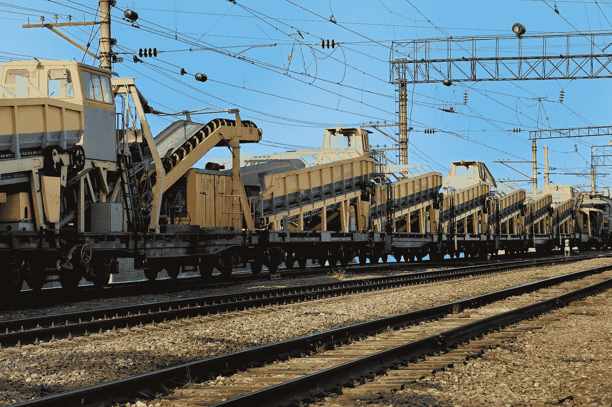
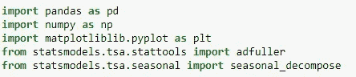
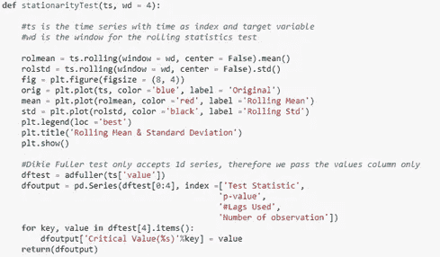
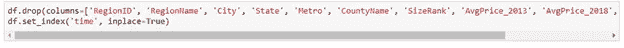
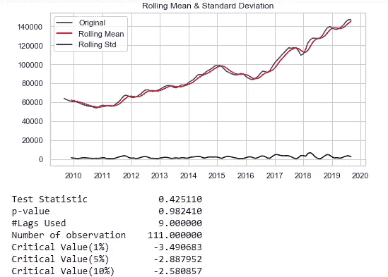
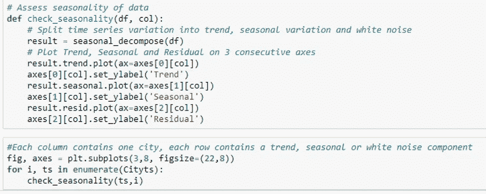
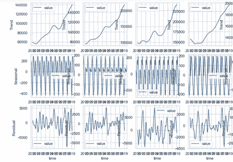
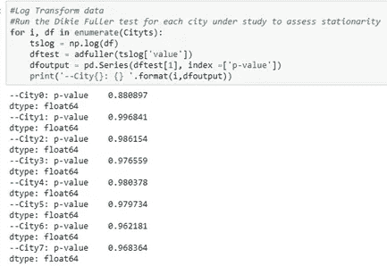
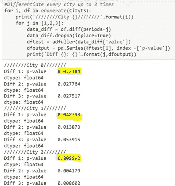
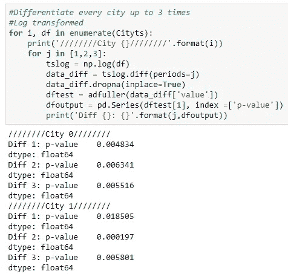

# 时间序列:平稳性检查

> 原文：<https://medium.com/analytics-vidhya/time-series-stationarity-check-57f0f018201a?source=collection_archive---------14----------------------->

图片由 [ds_30](https://pixabay.com/users/ds_30-1795490/?utm_source=link-attribution&utm_medium=referral&utm_campaign=image&utm_content=4887138) 来自 [Pixabay](https://pixabay.com/?utm_source=link-attribution&utm_medium=referral&utm_campaign=image&utm_content=4887138)

时间序列的平稳性是预测技术的一个常见假设。根据 NIST 的工程统计手册，平稳过程具有这样的性质，即**均值**、**方差**、**自相关**结构**不随时间变化**。换句话说，平稳时间序列不依赖于时间(平稳序列在任何时间“冲击”后往往会返回到一个恒定值)。

这篇博文一步一步地描述了我用来检查平稳性的方法，以及我为满足这个假设而应用的数据转换。

## 索引

> 1.平稳性检查
> 
> 2.趋势和季节性分析
> 
> 3.数据转换
> 
> 4.结论

## 平稳性检查

在用于本示例的资源列表下面:

*   数据集:中位数家庭价值。选择了八个邮政编码。2009 年至 2019 年的月值。从 zillow.com/research/data 下载
*   Jupyter 实验室笔记本
*   Python 库(图 1)

图一。Python 库

我绘制了**滚动统计数据**，并使用来自 statsmodels 的**增强 Dickey-Fuller** (adfuller)测试来评估每个邮政编码时间序列的平稳性。下面是迪基-富勒检验的零假设和替代假设:

*H0 = AR 模型中存在一个单位根(序列呈现时间相关趋势)*

*H1 =过程是平稳的(序列不依赖于时间)*

图 2 显示了我用来评估平稳性的函数。我将这个函数应用于每个邮政编码的时间序列。在将数据传递给函数之前，一定要将数据转换成时间序列格式:包含测量值的单个变量，并将时间列设置为数据的索引。图 3 显示了我如何将我的 pandas 数据框转换成合适的时间序列格式。

图二。用于绘制滚动统计数据和应用 Adfuller 测试的函数

图 3。将数据帧转换为时间序列格式

来自 statsmodels 的 adfuller 测试结果包括用于评估的 p 值、测试统计和临界值。为了评估假设，我检查了 p 值是否低于我的阈值(0.05)，并将测试统计量与临界值进行了比较。

在我的一个时间序列中运行上述函数的结果如图 4 所示。下面是结果汇总:

平均值(红线)随着时间的推移而增加

p 值> 0.05 阈值

检验统计>临界值

因此，我无法拒绝 H0(时间序列不是平稳的)。我对我的每个时间序列(总共 8 个)运行了这个函数，没有一个是稳定的。

图 4。滚动统计和 Adfuller 结果

## 趋势和季节性分析

因为我的时间序列没有一个是稳定的，所以我做了一些额外的分析来定义接下来的步骤。

首先，我使用来自 **statsmodels** 的 **seasonal_decompose** 将我的时间序列分解成季节、趋势和剩余属性。在选择任何数据转换方法之前，理解时间序列的组成部分是很重要的。图 5 显示了我用来绘制每个时间序列的趋势、季节性和噪声的代码。图 6 显示了四个生成的图(我总共有 8 组图，每个城市/邮政编码一组)。请注意，您可以在代码中调整图形尺寸，以便更清楚地查看轴。

图 5。绘制季节性分解属性的函数

图 6。季节性 _ 分解绘制结果

## 数据转换

在分析了图 6 中的图之后，我能够看到我的所有时间序列都呈现出上升趋势和季节性。我采取的下一步是为每个单独的时间序列确定适当的数据转换，以满足平稳性假设。

有几种数据转换方法可用于将序列转换为平稳序列。在这个练习中，我对我的序列应用了对数变换(稳定方差)和差分(去趋势)以达到平稳性。

**对数变换**

我首先对我的每个时间序列进行对数转换，并对每个转换后的时间序列应用 statsmodels adfuller 测试来检查平稳性。图 7 显示了 adfuller 测试的代码和结果 p 值。正如你所看到的，没有一个时间序列在对数变换后变得稳定(所有 p 值> 0.05)。

图 7。对数变换时间序列

**差分**

我对数据应用的第二个转换是差分。图 8 显示了对时间序列进行差分后获得的代码和部分结果。我对每个时间序列进行了多达三次的差分，并打印了每个变换的 adfuller 测试 p 值(请注意，在这一步中，我对原始时间序列进行了差分，而不是对数变换的时间序列)。这样做之后，我能够看到我的五个城市在差分后达到平稳(p 值< 0.05). Keep in mind that, when differencing, you want to look for the minimal level of differencing that will give you a stationary time series.

Figure 8\. Differencing time series

**对数变换&差分**

为了确保所有时间序列的平稳性，我做的第三个尝试是对经过对数变换的时间序列进行差分。图 9 显示了一些转换后的时间序列的代码和 adfuller 的 p 值。经过对数变换和差分后，其余三个时间序列达到平稳。

图 9。对数变换和差分时间序列示例

## 结论

为了达到平稳性，必须对时间序列进行转换。如果最终目标是通过组合自回归(AR)-移动平均(MA)模型(即 ARIMA、萨里玛)进行建模，请确保让算法处理差分步骤。现在，如果您需要对数据进行日志转换，这需要在建模之前进行。

如果您对如何更好地做到这一点有任何建议，请在下面分享您的评论。我总是乐于学习新的东西！