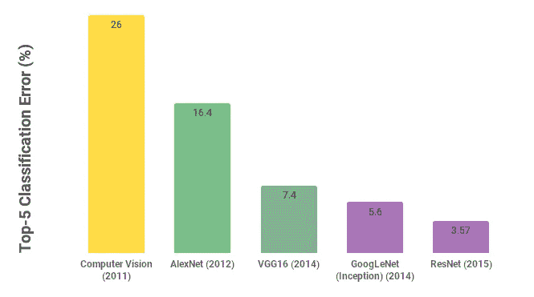

# 迁移学习模型的时间线

> 原文：<https://medium.com/analytics-vidhya/timeline-of-transfer-learning-models-db2a0be39b37?source=collection_archive---------7----------------------->

在本帖中，我们将列出一些用于图像分类的最强大的迁移学习模型的时间表，以及它们在过去几年中是如何发展的。在迁移学习中，我们可以使用预先训练的模型，并添加一些紧密连接的层，以便从新的数据集中识别对象。在 Keras 的[文档中，我们可以找到一些可以导入的预训练模型，如 VGG、ResNet 和 Inception。在进入每个模型的更多细节之前，让我们检查这些模型来自哪里。这些模型来自一个名为 ImageNet 的年度竞赛。](https://keras.io/applications/)

# ImageNet

ImageNet 是一个大型视觉数据库，用于研究视觉对象识别软件。该项目手动注释了超过 1400 万张图像，以将对象分为 20，000 多个类别。自 2010 年以来，ImageNet 项目发起了一年一度的软件竞赛，名为 ImageNet 的大规模视觉识别挑战(ILSVRC)，其中软件程序竞争正确分类和检测对象和场景。该挑战使用原始数据集的子集，其中 120 万幅图像作为输入，1000 个类别作为输出。

在过去几年中，平均误差一直在不断下降。自 2012 年以来，从经典计算机视觉技术到深度学习出现了重大转变。AlexNet 是第一个使用深度学习技术的获胜者，与前一年使用计算机视觉的获胜者相比，它的错误减少了 10%以上。让我们进一步讨论其中的一些模型。

# 2012 年— AlexNet

2012 年，AlexNet 能够以 10%的巨大差距超越经典计算机视觉模型。这是深度神经网络第一次赢得这种类型的比赛，从那以后，深度学习成为图像分类问题的标准方法。它由五对卷积层和两对全连接层组成，如图 2 所示。由于当时的计算限制，训练是在两个 GPU 上进行的，这就是为什么他们的网络被分成两个管道的原因。

图 2: AlexNet 模型

AlexNet 帮助推广和标准化了以下实践:

*   **ReLu(校正线性单元)**作为隐藏层的默认激活函数，而不是早期标准的 Tanh 或 Sigmoid。ReLu 的优点是它可以训练，因为它的导数对于正值是常数。这也有助于解决渐变消失的问题。
*   **在每个完全连接的层之后，去除**层，以减少过拟合。它随机关闭作为参数给出的一部分单位的激活(默认为 50%)。其工作的原因是，dropout 通过迫使单元从先前单元的不同子集学习，帮助网络开发独立的功能。

2013 年的获胜者是 ZFNet。它的架构类似于 AlexNet，但在过滤器和超参数的数量上有所改进。总的来说，想法是一样的。

# 2014 年——VGG 和谷歌网

2014 年，得益于更深层次的网络，性能再次跃升。从前一年的 8 层，到现在的 2014 年，有两个势均力敌的赢家，VGG 和谷歌网，分别有 19 层和 22 层。让我们先更详细地看看 VGG。

## VGG

牛津大学 VGG 小组的 VGG 有两个版本，一个 16 层，另一个 19 层。它由五组卷积层组成，每组卷积层都有一个最大池。卷积层使用 3x 3 内核大小的过滤器，而不是 AlexNet 使用的 11 个过滤器，这有助于减少参数数量，同时仍能捕捉前一层的特征。由于其简单性，这是一个被用作起点的流行模型。然而，该模型的参数数量相当大，并且加载到内存中的量很大。当时，由于消失梯度问题，具有大约 20 层的模型被认为是非常深的模型。正如我们将很快看到的，批量标准化和残差网络的发明使得训练具有更多层的模型成为可能。

VGG 建筑([图片来源](http://webia.lip6.fr/~cord/pdfs/news/TalkDeepCordI3S.pdf)

VGG 帮助推广和规范了以下做法:

*   **大小为 3×3 的卷积滤波器**

## 谷歌网(盗梦空间)

GoogLeNet 也被称为 Inception，其参数比 AlexNet 少 12 倍，是 ILSVRC 2014 年分类冠军。它由 22 层组成。它的主要关键点是，他们设计了一个名为 inception 的模块，以处理计算效率的问题。初始模块将许多这样的模块堆叠在一起，以便更有效地计算网络。他们基本上是在进入同一层的相同输入之上并行应用几种不同类型的过滤操作。然后，它们将所有这些滤波器输出在深度方向上连接在一起，因此这在最后创建了一个更紧张的输出，该输出将传递到下一层。关于该模块的另一点是瓶颈层，它是一个接一个内核大小的过滤器。它们通过减少滤波器的数量来降低计算复杂度。最后，在卷积滤波器之后的网络输出中没有完全连接的层。相反，它们使用全局平均池层，允许使用更少的参数。

GoogLeNet 帮助传播和标准化了以下实践:

*   **初始模块**具有不同的并行操作和深度连接。
*   **全局平均池**代替卷积滤波器后的末端全连接层，以降低复杂度。

# 2015 年— ResNet

ResNet 模型([图片来源](https://arxiv.org/pdf/1512.03385.pdf))

ResNet 凭借 152 层的模型赢得了 2015 年的比赛。他们能够获得 3.57%的分类准确度的前 5 名误差，这优于人类的表现。层数量的急剧增加是可能的，因为有两个主要的关键点:使用他们所谓的剩余连接，以及使用批量标准化来处理早期层中的梯度流。剩余连接是具有先前层的身份映射的连接。这些联系背后的直觉是，他们注意到由于梯度消失问题，非常深的模型比浅的网络表现得更差。作为一个解决方案，他们假设更深的模型应该至少和更浅的模型表现一样好。这可以通过使用与先前层的身份映射的连接来实现，跳过一些层，使网络相当于一个较浅的模型，但也具有学习更复杂的决策边界的潜力。他们还使用全局平均池，而不是在完全连接的层之后进行扁平化。网络中的另一个要点是批量标准化的使用，这避免了梯度的传播或者爆炸或者趋向于零。

ResNet 帮助推广下列做法并使之标准化:

*   **剩余连接**以使模型至少与较浅的网络一样好，但也有可能变得更好。
*   **在每个卷积层后进行批量标准化**，以提高训练过程的稳定性、速度和性能。

# 摘要

总之，我们已经看到了不同种类的 CNN 架构。我们看了四种广泛使用的主要架构。AlexNet，早期非常流行的网络之一。VGG 和谷歌网，它们仍然被广泛使用。但是 ResNet 有点接管了你最应该看的东西。有一种趋势是设计我们如何连接层，跳过连接，什么连接到什么，并使用这些来设计您的架构，以改善梯度流。提到了每个模型的以下关键点:

*   **AlexNet:** ReLu 为激活函数，每 FC 层后 Dropout。
*   **VGG:** 我们通常会看到的最常见的架构，包括最大池、3x3 内核大小的过滤器、卷积过滤器以及全连接层。
*   **Inception/GoogLeNet:** 不同操作并行的 Inception 模块；全球平均池而不是完全连接的层；“瓶颈”层使用一个接一个内核大小的过滤器来减少卷积层的深度。
*   **ResNet:** 剩余连接，以便使模型等效于较浅的网络；提高性能的批处理规范化。

# 进一步阅读

*   [https://en.wikipedia.org/wiki/ImageNet](https://en.wikipedia.org/wiki/ImageNet)
*   [https://cv-tricks . com/CNN/understand-resnet-Alex net-vgg-inception/](https://cv-tricks.com/cnn/understand-resnet-alexnet-vgg-inception/)
*   [第 9 讲| CNN 建筑|斯坦福大学](https://www.youtube.com/watch?v=DAOcjicFr1Y)