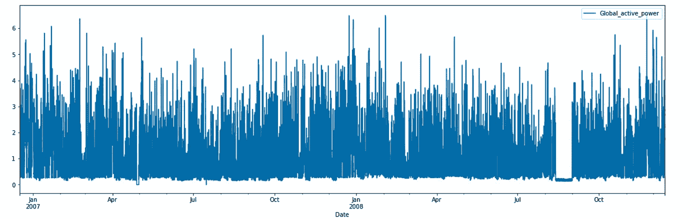
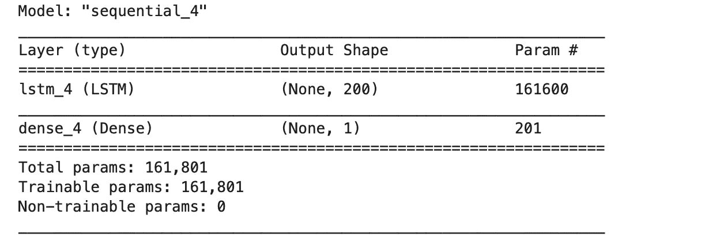

# 利用 LSTM 进行时间序列预测

> 原文：<https://medium.com/analytics-vidhya/timeseries-forecasting-using-lstm-57640c57e105?source=collection_archive---------6----------------------->

LSTM(长短期记忆网络)是 RNN(递归神经网络)的变体，能够学习长期依赖性，特别是在序列预测问题中。

在这里，我将使用 LSTM 来演示我们如何使用这种技术来做一些时间序列预测。


[图像来源](https://giphy.com/gifs/3o7abKJnlA3n2YqHe0/html5)

**数据**:[https://www . ka ggle . com/UC IML/electric-power-consumption-Data-set](https://www.kaggle.com/uciml/electric-power-consumption-data-set)


data.head()输出

**数据预处理:**

```
#Derive a column as Date from Date and Time 
data.loc[:,**'Date'**] = pd.to_datetime(data.Date.astype(str)+**' '**+data.Time.astype(str))#Drop the column time
data.drop([**"Time"**],inplace=**True**,axis =1)#Set the Date column as index
data.set_index([**"Date"**],inplace=**True**)#change the series to dataframe
data = data[[**"Global_active_power"**]]#check if there is any unwanted characters in the column
print (data[pd.to_numeric(data['Global_active_power'], errors='coerce').isnull()]["Global_active_power"].unique())#remove the character (in this case it is '?')
data["Global_active_power"] = data["Global_active_power"].apply(lambda x: float(x) if "?" not in x else None)
```

数据每分钟都可用，因此我们可以按天、月或小时对数据进行重新采样。我将选择按小时重新采样，否则按月会减少数据点的数量。使用日的预测没有给出任何有趣的预测结果，所以我选择小时而不是日来对数据集进行重采样。

```
data_sampled_hr=data[**"Global_active_power"**].resample(**'H'**).mean().iloc[1: , ]
data_sampled_hr = pd.DataFrame(data_sampled_hr)
```


data_sampled_hr.head()

```
#Let's fill the nans with 0 and visualiza the data
data_sampled_hr = data_sampled_hr.fillna(0)
```



可视化无助于理解是否有任何季节性或趋势。所以，让我们用季节分解来分解时间序列。

```
**from** statsmodels.tsa.seasonal **import** seasonal_decompose 
results = seasonal_decompose(data_sampled_hr)
results.seasonal[:1000].plot(figsize = (12,8));
```


让我们做一些 ACF 来看看时间序列如何与其过去的值相关联

```
**from** statsmodels.graphics.tsaplots **import** plot_acf
plot_acf(data_sampled_hr)
plt.show();
```


这就有意思了！看看相关性如何在一天的最初几个小时很高，然后在一天的晚些时候再次上升。肯定是有趋势的。

**模型建立和评估:**

让我们看看 LSTM 模型能否做出一些预测或了解数据的总体趋势。

对于预测，我们可以做的是使用 48 小时(2 天)的时间窗口来预测未来。让我们来设计训练和测试数据。

```
train = data_sampled_hr[:-48]
test = data_sampled_hr[-48:] # last 48 hours is my test data
```

现在，我们需要我们的数据被缩放，这对任何深度学习模型都是必不可少的。

```
**from** sklearn.preprocessing **import** MinMaxScaler

scaler = MinMaxScaler()
scaler.fit(train)scaled_train = scaler.transform(train)
scaled_test = scaler.transform(test)
```

现在，我们将使用 Keras 库中的时间序列生成器来设计训练数据和标签，这意味着生成器将从一开始就使用 48 个数据点，并将第 49 个数据点映射为标签，然后接下来的 48 个数据点将第一个和第 50 个数据点映射为标签，依此类推。

```
*#Time series generator* **from** keras.preprocessing.sequence **import** TimeseriesGenerator
*#define generator* *#I have used batch_size as 10 so that it's faster, one can use 1 as well* n_input = 48
n_features = 1generator = TimeseriesGenerator(scaled_train,scaled_train,length = n_input, batch_size = 10)#Note: both the parameters of TimeseriesGenerator are scaled_train #because to generate the data and the label it will use scaled_train
```

现在让我们定义模型，

```
**from** keras.models **import** Sequential
**from** keras.layers **import** Dense
**from** keras.layers **import** LSTM

*# define model* model = Sequential()
model.add(LSTM(200,activation= **"relu"** , input_shape = (n_input , n_features)))
model.add(Dense(1))
model.compile(optimizer = **"adam"** , loss=**"mse"**)
```



模型.摘要()


```
model.fit_generator(generator , epochs=5)
```

请注意我是如何使用 epoch 作为 5 的，我们可以使用更多的 epoch 来查看模型的执行情况。

为了了解损失随时代的变化，我们可以快速绘制一个图表:


```
loss_per_epoch = model.history.history[**"loss"**]
plt.plot(range(len(loss_per_epoch)), loss_per_epoch);
```

现在，让我们看看它在测试数据上的表现。

```
first_eval_batch = scaled_train[-48:]
first_eval_batch = first_eval_batch.reshape((1, n_input, n_features))
test_predictions = []

first_eval_batch = scaled_train[-n_input:]
current_batch = first_eval_batch.reshape((1, n_input, n_features))

**for** i **in** range(len(test)): # 2d to 1d conversion
    current_pred = model.predict(current_batch)[0] #store the prediction
    test_predictions.append(current_pred) #update batch to now include prediction and drop first value
    current_batch = np.append(current_batch[:, 1:, :], [[current_pred]], axis=1)

test_predictions = scaler.inverse_transform(test_predictions)
test[**"pred"**] = test_predictions
```


test.head()

**绘制预测图:**


test.plot(figsize = (12，8))；

虽然预测并不完全完美，但您可以看到模型是如何选择趋势的。

我们现在可以改变**的历元数**，**改变时间窗口**，意思是用 96 小时或 24 小时代替 48 小时，看看模型是否能够做出准确的预测。我们还可以执行一些其他重采样模式来试验数据集。

最后，代替一个 LSTM 层，我们也可以使用多个层来做进一步的实验。

这是一个小小的努力，展示了我们如何轻松地使用 LTSM 模型来预测时间序列。我希望这是有帮助的，如果你注意到任何需要改进的地方，请随时留言。感谢您阅读文章！！！