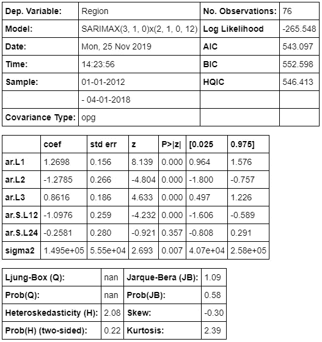
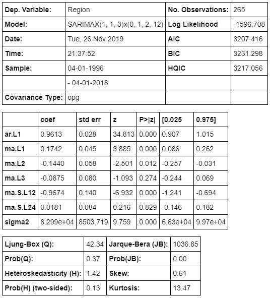
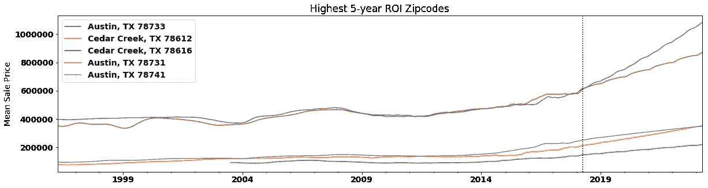

# 时间序列项目

> 原文：<https://medium.com/analytics-vidhya/timeseries-project-cc02ffa9da38?source=collection_archive---------17----------------------->

## 大奥斯汀地区投资公司

杰里米·班克斯在 [Unsplash](https://unsplash.com?utm_source=medium&utm_medium=referral) 上的照片

正如我在上一篇博文中所说，我再次发现自己处于项目中最不喜欢的部分。但是当我写下我的第四篇博文时，我可以说我不再觉得这是我最不喜欢的部分。录下我自己的演讲，然后把它呈现给我的老师，这就是我的成功。

不要误解我，我仍然不是写这个的超级粉丝，但是还有更糟糕的事情。

那么这次我给自己惹了什么麻烦呢？老实说，我仍然不完全确定，但我至少对我的结果感到满意，即使我仍然不确定得到它们的工作流程。

# 目标

本项目的目标是分析一个区域，在本例中是大奥斯汀地区，并确定投资的五个最佳邮政编码。为了这个项目的目的，我将“最好”视为在五年内提供最大的投资回报。和我的其他项目一样，这是从一家投资公司顾问的角度出发的。

# 方法

提供的数据库是一个 CSV 文件，其中包含来自 Zillow 的美国各大城市的数据，所以我首先只提取大奥斯汀地区的数据，该地区包括 5 个县的 30 个城市，总共有 71 个邮政编码。这些数据采用了广泛的格式，每个邮政编码作为自己的行，列中有各种数据，如所在城市、所在县，以及从 1994 年 4 月到 2018 年 4 月每个月的平均房屋销售价格。为了便于访问，我首先将格式设置为长格式，每个邮政编码作为自己的列，月份作为行，然后创建数据的子集，这些数据按县和整个地区获取每个月的平均房屋销售价格，以便进行比较。

之后，我执行了一些 EDA 来寻找模式，并分解县级数据来查看趋势、季节性和残差图，以寻找平稳性。

在那里，我测试了各种 SARIMA 参数，以确定我的模型的最佳组合，然后在我的区域时间序列上使用这些参数运行模型，与我的 ACF 和 PACF 图进行比较，以确定它的表现如何。

最初，我根据 2008 年房地产市场崩盘创建了我的数据的进一步子集，只查看了 2012 年及以后的所有数据。对于这个子集，我的模型的 AIC 非常好，但是，它在 PACF 图和最终结果中都有一些异常值，我无法解释，所以我回去重新在整个数据集上运行我的参数测试和模型，以获得最终更加平滑的结果。

# 模型

**2012–2018 款**

**1994–2018 款**

如上所述，虽然与第一个模型相比，第二个模型有许多问题，但最终我对这个模型感到更舒服，因为第一个模型以一些我无法解释的非常严重的异常值结束，并且对此感到不舒服。所以说，这里是…

# 结果

这些结果都来自第二个模型，使用完整的数据集。

有趣的是，78733 是第一个模型中最糟糕的邮政编码之一，但不管出于什么原因，它最终超过了第一个模型中最好的 78612。

从图的标题可以看出，5 年投资回报的前五个邮政编码是 78733、78612、78616、78731 和 78741。

# 未来的工作

我觉得在这个特定的主题上，我还有很多东西要学。我磕磕绊绊地完成了这个项目的大部分，使用各种例子来帮助找出我下一步需要做什么，在某些情况下，如何去做。我对我的结果很满意，但对我的工作流程不满意，我绝对需要开发一个符合我思维过程的工作流程，因为我使用的那个让我对项目的大部分感到困惑。

我还需要回去确定 A:为什么我的第一个模型在我的 PACF 图和结果中有这些异常值，B:如何解决这些问题。

现在，我必须沉浸在我的悲伤中，因为我的邮政编码在第一个模型中是最差的投资，在第二个模型中是第二差的投资，这意味着无论我使用哪种模型，这个邮政编码目前对投资来说都非常糟糕。