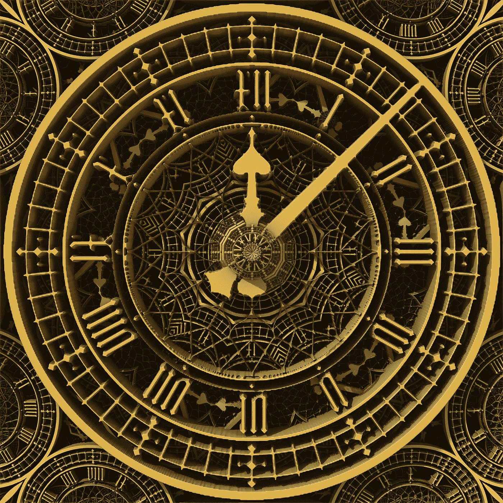

# 时间戳是数据黄金，我讨厌它们

> 原文：<https://medium.com/analytics-vidhya/timestamps-are-data-gold-and-i-hate-them-ee5e35877f82?source=collection_archive---------19----------------------->

## 如何将各种数据源中的日期转换为 python DateTime。

图片由 Pixabay 提供

时间戳是数据科学家最重要的数据元素。时间戳为数据提供深度和层次。那么问题是什么呢？各种各样的格式！我该怎么处理这件事？

## 场景