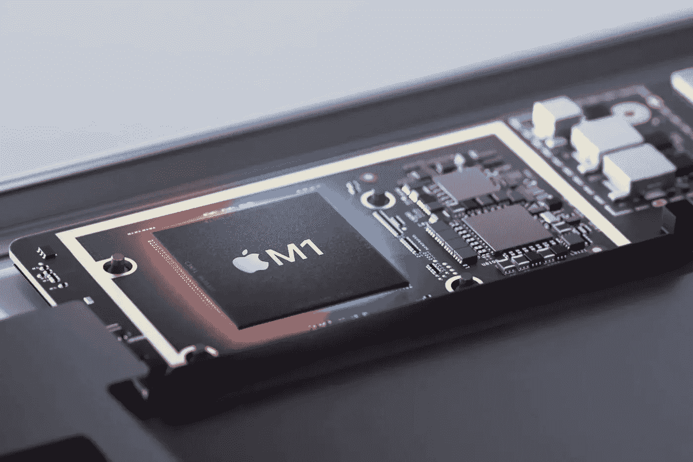

# 苹果芯片上 Python 的计时莫顿码

> 原文：<https://medium.com/analytics-vidhya/timing-morton-code-on-python-on-apple-silicon-767567094ed6?source=collection_archive---------11----------------------->



上周，我得到了我的新苹果硅 Macbook Pro M1。我非常兴奋地做了一些非常简单的测试，看看 python 可以多快地计算出 3D 情况下的[莫顿代码](https://en.wikipedia.org/wiki/Z-order_curve)。我正在做的一个小项目需要这个，我在之前的一次迭代中发现这需要相当多的 CPU 时间。我之前的 MacBook 是 13 英寸，2.7GHz 四核 i7——2019 年 13 英寸线的顶端；外面的承诺表明 M1 应该更快。让我们看看。

# TL；速度三角形定位法(dead reckoning)

正如许多其他评论所显示的，M1 macbook 是*快*。对于这个简单的任务，无论是使用纯 python 还是使用 numpy，M1(本机)的速度至少是我的旧 macbook 的 1.5 倍，对于 numpy 100 的情况，这个数字提高到 1.9 倍。

都说了，我对*非常*印象深刻。


如果以 100、10k 和 1M 为一批，计算 1 个莫顿码所需的纳秒数。使用 Rosetta 的速度似乎可以与我的旧英特尔 macbook 媲美。python 和 numpy 的本机速度要快 50%到 90%。OpenCL 的速度是否公平比较，我不知道……但它快了 3 倍多！

# 设置

## 装置

首先简单说一下安装的事情。M1 机器可以运行 ARM 代码(本机)和 Intel 代码(通过 Rosetta 2)。我认为苹果实际上在罗塞塔上做得很好；几乎所有的软件运行起来都很顺畅，速度也很快。然而为 ARM 安装东西要稍微复杂一点(因为许多包需要小的改动)。你已经可以看到在 ARM 上成功运行的(自制)包的日常改进。我不会在这里深入讨论我如何安装东西的细节(因为这些信息可能在下周就过时了)；然而，在这个实验中，我使用了 homebrew 的 python 3.9.0(适用于 M1 英特尔和 arm ),以及 numpy 1.20rc1，它可以通过以下方式安装:

```
pip install cython
pip install --no-binary :all: --no-use-pep517 numpy==1.20rc1
```

注意，这将给你一个没有 BLAS/LAPACK 支持的 numpy 版本。我还试图在我的 pyenv 安装的 python 3.8.5 和 numpy 上从旧的 intel-macbook 上的一个轮子(包括 BLAS/LAPACK)运行这个。有趣的是，在 python 3.9.0 安装中，纯 python 函数实际上要慢一些，而 numpy 代码则没有什么不同。

安装`pyopencl`是从 repo 中完成的(对于 arm ),因为目前只有`master`生成 arm 兼容的代码。

```
pip install git+https://github.com/inducer/pyopencl
```

如果 OpenCL 让我们选择是在硬件上执行还是在虚拟处理器上执行，我们总是选择硬件。

## 莫顿码

莫顿码是一个你通过交织比特组合 2 个(或更多)其他数得到的数。如果你有 2 个数字，它们的位是`ABCDEFGH`和`abcdefgh`，那么莫顿码就是`AaBbCcDdEeFfGgHh`。对于 3 个数字，思路是一样的:`Aa*A*Bb*B*Cc*C*Dd*D*Ee*E*Ff*F*Hh*H*`，如果第三个数字是`*ABCDEFGH*`。

计算莫顿码显然可以一点一点地完成(如下面的`python_morton_naive`方法中所做的)。然而，有一些更快的方法可以做到这一点；幻数如何工作超出了这篇文章的范围——我认为这篇 stackoverflow 文章做得很好。然而，应该提到的是，这个计算并不简单。

## 代码

我们首先设置一些不同大小的数组，每个元素有 3 个整数(这 3 个整数我们将要合并)。(注意:在这篇文章的底部有完整的代码(带高光)

```
import numpy as npdef setup(count):
    return np.arange(3 * count, dtype="uint32").reshape((-1, 3)) & 0x3FFnp_setup_e2 = setup(100)
np_setup_e4 = setup(10000)
np_setup_e6 = setup(1000000)
np_setup_e7 = setup(10000000)
np_setup_e8 = setup(100000000)setup_e2 = np_setup_e2.tolist()
setup_e4 = np_setup_e4.tolist()
setup_e6 = np_setup_e6.tolist()
```

我们在 pure python 中使用了两种方法来得到结果。首先，天真的一个:

```
def python_morton_naive(numbers):
    result = []
    for triplet in numbers:
        r = 0
        for i in range(30):
            b, e = divmod(i, 3)
            r |= ((triplet[e] >> b) & 0b1) << i
        result.append(r)
    return result
```

还有一个是带魔法数字的

```
def python_morton(numbers):
    result = []
    for (x, y, z) in numbers:
        x = (x | (x << 16)) & 0x030000FF
        x = (x | (x <<  8)) & 0x0300F00F
        x = (x | (x <<  4)) & 0x030C30C3
        x = (x | (x <<  2)) & 0x09249249
        y = (y | (y << 16)) & 0x030000FF
        y = (y | (y <<  8)) & 0x0300F00F
        y = (y | (y <<  4)) & 0x030C30C3
        y = (y | (y <<  2)) & 0x09249249
        z = (z | (z << 16)) & 0x030000FF
        z = (z | (z <<  8)) & 0x0300F00F
        z = (z | (z <<  4)) & 0x030C30C3
        z = (z | (z <<  2)) & 0x09249249
        result.append(x | (y << 1) | (z << 2))
    return result
```

numpy 方法

```
def np_morton(x):
    x = (x | (x << 16)) & 0x030000FF
    x = (x | (x <<  8)) & 0x0300F00F
    x = (x | (x <<  4)) & 0x030C30C3
    x = (x | (x <<  2)) & 0x09249249
    x = x << np.arange(3)
    return np.bitwise_or.reduce(x, axis=1)
```

最后是 opencl 方法

```
ctx = cl.create_some_context()
queue = cl.CommandQueue(ctx)prg = cl.Program(ctx, """
__kernel void sum(
    __global const uint *numbers, __global uint *res_g)
{
  int gid = get_global_id(0);
  uint res = 0;
  for (int i = 0; i < 3; i++) {
    uint x = numbers[3 * gid + i];
    x = (x | (x << 16)) & 0x030000FF;
    x = (x | (x <<  8)) & 0x0300F00F;
    x = (x | (x <<  4)) & 0x030C30C3;
    x = (x | (x <<  2)) & 0x09249249;
    res |= x << i;
    }
  res_g[gid] = res;
}
""").build()def cl_morton(numbers):
    mf = cl.mem_flags
    cl_numbers = cl.Buffer(ctx, mf.READ_ONLY | mf.COPY_HOST_PTR, hostbuf=numbers)
    res_np = np.empty(numbers.shape[:1], dtype="uint32")
    res_g = cl.Buffer(ctx, mf.WRITE_ONLY, res_np.nbytes)
    prg.sum(queue, res_np.shape, None, cl_numbers, res_g)
    cl.enqueue_copy(queue, res_np, res_g)
    return res_np
```

请注意，我并没有试图单独地完全优化这些方法——每种方法可能会减少几个百分点(或者更多)。这些方法之间的比较仅适用于“magintude 级”。

运行测试(仅复制一行，完整列表见下文):

```
print(round(timeit.timeit(lambda: python_morton(setup_e2), number=10000) / 100 / 10000 * 1000000 * 1000, 1))
....
```

注意，我们每个测试运行两次，并且只查看第二个结果。这是因为我确实看到了第一次和第二次运行之间相当大的差异，我认为这与第二次测试开始时内存被“放置”有关。因此，从第二次测试中获取结果似乎是最公平的。

# 结果

在计时的时候，我喜欢先了解一下我能期望的理论上的最大值。在这种情况下，让我们看看神奇的数字代码。计算单个莫顿码，这要做 3 *(4 *(shift+or+and)+shift+or)= 50 次左右的运算。假设我们有一个 5GHz 的处理器，这意味着我们应该能够在一秒钟内完成 100 兆次，或每代码 10 纳秒(注意:这是在做许多假设——处理器在每个时钟周期内不能完成 1 次操作，但它适用于数量级计算)。显然，一旦 python 参与进来，事情就会变得慢得多(通常大约是 100 倍)，让我们达到每个数字 1000 纳秒(或每秒 1 米)。

现在，让我们看看结果。

所有计时都以纳秒为单位，每 1 莫顿代码计算一次


计算 1 个莫顿码所需的纳秒数。

首先，我们看到结果或多或少是我们所期望的。我们的简单解决方案是最慢的，python magic numbers 需要 1000 到 2000 纳秒(我们估计大约需要 1000 纳秒)，而 numpy 解决方案需要 10 到 40 纳秒(事实上，在 numpy 中更大的批处理实际上需要更长的时间，这可能是因为分配大量内存需要更长的时间——我们可以通过重用内存来加快速度)。

OpenCL 的启动成本相对较高(可能是为了复制内存)，但之后会快得多。这很可能是因为 OpenCL 将工作分布在多个 GPU 核心上(所以在这种情况下 2 *ns* 并不意味着计算一个代码需要 2ns，只是它每秒可以做 500M)。旧的英特尔 macbook 无法在 100M 代码上运行 OpenCL 我猜是因为它们不适合 GPU 内存。

## 比较

至于系统之间的对比。正如之前多次提到的，苹果发布了苹果芯片，做了两件了不起的事情。首先，他们生产了一种速度更快的芯片(使用更少的电力——我的旧 macbook 在这些测试中经常打开风扇，而 M1 从来没有)，他们创造了 Rosetta 2，允许英特尔程序在这种芯片上无缝运行。

在这些测试中，运行 x86_64 Python 和 x86_64 Numpy 的 M1 运行代码的速度通常比我的旧 Core i7 快 0%到 50%。当我们将旧的 i7 与 M1 的 running ARM 原生 python 和 numpy 进行比较时，加速在 50%到 90%之间(因此在某些情况下几乎是*的两倍快*)。

OpenCL 的差异更加令人印象深刻。有了罗塞塔，M1 的速度是 i7 的两倍；ARM 原生，甚至快三倍。现在，关于 OpenCL 测试的方式，我们可以说很多——例如，复制内存似乎仍然浪费了很多时间，我们可以调整一些设置，因此加速可能在很大程度上取决于确切的工作负载。这可能是另一篇文章的好主题。

如果我们使用 Metal 而不是 OpenCl，看看事情是否真的变得更快也是很有趣的。这也可能是下一篇文章的主题。

## 完整代码

下面是我用的全部代码。我很乐意听到别人的结果！