# 我的 Tinder 数据里有什么

> 原文：<https://medium.com/analytics-vidhya/tinder-data-54ba494e0a59?source=collection_archive---------7----------------------->


几天前我了解到，多亏了 GDPR，很多网站都允许导出你的账户数据(包括 Tinder)。它能让你看到这些网站储存了你的哪些信息。

除了对隐私透明之外，这些数据还可以帮助提供这些网站以前从未提供过的统计数据。

在 Tinder 上分析量化自己无意识做的事情岂不是很酷？带着这种想法，我请求 Tinder 提供我的账户数据。

# **如何获取我的 Tinder 数据？**

您可以在 https://account.gotinder.com/data[的](https://account.gotinder.com/data)索取自己的数据


数据会在一两天内通过电子邮件发给你。

# 数据

现在你有了你的数据，让我们看看它是什么样子的。

您将设置一个包含以下内容的 zip 文件:

*   data.json —包含您所有统计数据的文件
*   *index.html*—浏览数据的网页
*   y *our_photos* 文件夹:包含您所有照片的文件夹

我们将只使用 data.json 文件，因为该文件包含所有的统计数据和消息。

让我们来看看文件结构。

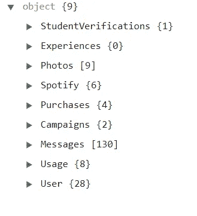

内容是不言自明的。照片将包含您在 Tinder 中的所有个人资料照片。“信息”将包含您发送/接收的所有匹配的信息。使用将有使用统计。Spotify 会有顶级 Spotify 艺人等细节。

我只对使用数组感兴趣，因为我在 Tinder 上的所有活动都在那里量化。

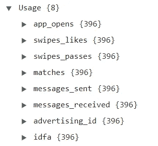

是时候投入数据了。我们打开一个 Python 笔记本，开始吧。

# 潜入我的火绒数据

首先，让我们导入一些我们将要使用的基本库。

```
import json 
import pandas as pd
import matplotlib.pyplot as plt
from datetime import datetime
```

我们将使用 *json* 来解构我们的 json 文件。*熊猫*将用于构建数据帧。 *MatPlotLib* 用于绘制图形， *datetime* 用于日期运算。

现在，我们将读取文件的内容，并将 JSON 存储在一个名为“data”的变量中。

```
f = open('./data.json', 'r', encoding="utf8")
data = json.load(f)
```

从这里，我们将提取“Usage”数组，因为我们只关心该数组的数据成员。

```
usageData = data["Usage"]
```

现在我们有了数据，作为一个好的实践，我们需要关闭到文件的连接

```
f.close()
```

数据被锁定和加载。🔫是时候开始修补了。

# 味道平淡的低级啤酒

首先，我们来看看刷卡。

喜欢(向右滑动)和通行证(向左滑动)位于使用对象内的 *swipes_likes* 和 *swipes_passes* 中。

我们将对刷卡赞和刷卡次数列表进行汇总，以获得每个对象的数量。并且，从常识来说，通过对赞和 passes 进行求和，我们可以得到总刷次数的计数。

```
noOfLikes = sum(usageData["swipes_likes"].values())
noOfPasses = sum(usageData["swipes_passes"].values())
totalSwipes = noOfLikes + noOfPassesprint('Total swipes: ', totalSwipes)
print('Number of likes: ', noOfLikes)
print('Number of passes: ', noOfPasses)
```

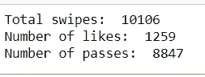

刷卡代码的输出

谁不喜欢可视化？📈那么，为什么不把我们刚刚提取的数据可视化呢？

我将绘制一个饼图，它将被划分为左击和右击的总数。为了绘制饼图，我们将使用 MatPlotLib 的 pie()函数。

```
plt.pie([noOfLikes, noOfPasses], labels=['Right Swipes', 'Left Swipes'], autopct='%.1f%%')
plt.show()
```

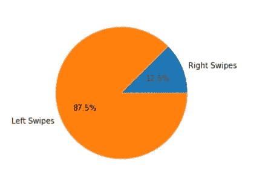

所以，我在 Tinder 上刷的所有东西中，12.5%是右刷，87.5%是左刷。

# 比赛

现在该看比赛了。😁将 *matches* object 的值相加可以得到匹配的个数。

```
noOfMatches = sum(usageData[“matches”].values())
print(‘Number of matches: ‘, noOfMatches)
```

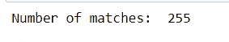

哇哦。255.255 个对男人没品味的倒霉蛋。不管怎样，适合我😅

此外，不要听起来太书呆子气，但 255 是 24 位 RGB 模型中您可以分配给颜色的最大值。很酷，是吧？🤓

为什么不把比赛和我的右拳次数进行比较呢？

```
slices_hours = [noOfLikes-noOfMatches, noOfMatches]
activities = ['People who I swiped right but didn\'t match', 'Matches']
plt.pie(slices_hours, labels=activities, autopct='%.1f%%')
plt.show()
```

这里 *slice_hours* 有两个数据项——我刷对了但他们没刷对的人数和我匹配的人数。简单地说，活动是我的饼状图的标签。

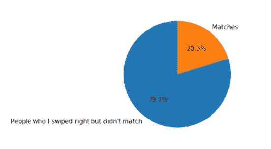

所以，在所有我刷对的人中，只有 20.3%的人刷对了我。五分之一。我希望那不是太糟糕…

继续前进…

# 量化我的绝望

现在是时候看看我有多绝望了。

让我们来看看我们将要关注的关键事物以及它们的位置。通过获取列表的最大值，可以很容易地计算出受尊重的值。

*   一天中最喜欢的— *扫一扫 _ 喜欢*
*   一天中最多的通行证—刷卡 _ 通行证
*   一天内收到的最多消息— *消息 _ 已收到*
*   一天内发送的最多消息— *消息 _ 已发送*
*   一天中定时器打开的最多次数— *app_opens*

把它写成代码:

```
mostLikesInDay = max(usageData["swipes_likes"].values())
mostPassesInDay = max(usageData["swipes_passes"].values())print('Most number of swipes in a day: ', mostLikesInDay + mostPassesInDay)
print('Most number of likes in a day: ', mostLikesInDay)
print('Most number of passes in a day: ', mostPassesInDay)
print('---------------------------------------------------------')mostMessagesRecievedInDay = max(usageData["messages_received"].values())
mostMessagesSentInDay = max(usageData["messages_sent"].values())
mostAppOpenInDay = max(usageData["app_opens"].values())print('Most messages sent in a day: ', mostMessagesSentInDay)
print('Most messages received in a day: ', mostMessagesRecievedInDay)
print('Most app opens in a day: ', mostAppOpenInDay)
```

让我们运行代码。

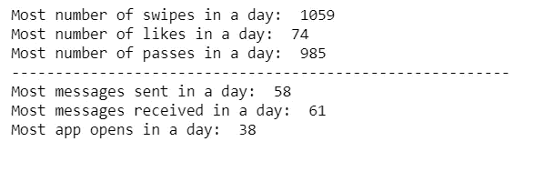

嗯……一天刷了 1059 次。


绝望的时代

还有，一天打开火绒 38 次。嗯。我想有时候大学讲座很无聊。

# 比赛 vs 星期几🗠

我有个主意。我的数据在一周的某一天是否遵循一些模式？

所以我决定按照一周中的每一天来分类我的数据。

假设我想按一周中的某一天来分析我的匹配。我们将创建一个数据框，列名为*日期*和*匹配*。然后，我们将初始化一个列表，该列表包含一个名为' *cats* '的变量中的一周中各天的列表。

```
matchesDf = pd.DataFrame(columns=['Date', 'Matches'])
cats = [ 'Monday', 'Tuesday', 'Wednesday', 'Thursday', 'Friday', 'Saturday', 'Sunday']
```

我们要做的下一步是用来自使用数据*的*匹配*对象的值填充这个数据框。*

```
for key, value in usageData['matches'].items():
    matchesDf = matchesDf.append(pd.DataFrame([[key,value]], columns=matchesDf.columns))
```

现在，我们将根据活动发生的日期提取一天的名称。

为此，我们首先需要将 date 列转换为一种类型的 *DateTime* ，然后它们使用 *dt.day_name()* 来获取日期的名称。

```
matchesDf['Weekday'] = pd.to_datetime(matchesDf['Date']).dt.day_name()
```

最后一步。我们需要按工作日对匹配进行分组，然后按一周中的某一天对匹配进行求和。为了绘制条形图，我们将使用 MatPlotLib 的 *plot.bar()* 函数。

```
matchesDf.groupby('Weekday')['Matches'].sum().reindex(cats).plot.bar()
```

运行代码后…

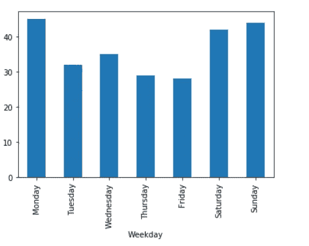

你可以看到我得到的比赛大多是在周末或周一——我们最空闲或对生活感到无聊的日子。

# 应用程序打开与一周中的某一天

按照类似的次数结构，我根据星期几打开了应用程序。

```
appOpenDf = pd.DataFrame(columns=['Date', 'app_opens'])for key, value in usageData['app_opens'].items():
    appOpenDf = appOpenDf.append(pd.DataFrame([[key,value]], columns=appOpenDf.columns))appOpenDf['Weekday'] = pd.to_datetime(appOpenDf['Date']).dt.day_name()appOpenDf.groupby('Weekday')['app_opens'].sum().reindex(cats).plot.bar()
```

运行代码后，我们得到:

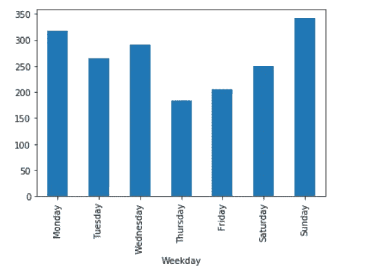

该图相当一致，大多数应用程序打开发生在一周的结束或开始。这是有道理的，因为大部分时间，就是在这些天里，我得到了我的比赛。

# 收到的消息与一周中的某一天

这里，我们也将遵循类似的代码模式。我们将只使用使用数据中的 *messages_received* 对象。

代码看起来会像这样:

```
df = pd.DataFrame(columns=['Date', 'messages_received'])for key, value in usageData['messages_received'].items():
    df = df.append(pd.DataFrame([[key,value]], columns=df.columns))

df['Weekday'] = pd.to_datetime(df['Date']).dt.day_name()df.groupby('Weekday')['messages_received'].sum().reindex(cats).plot.bar()
```

运行代码后:

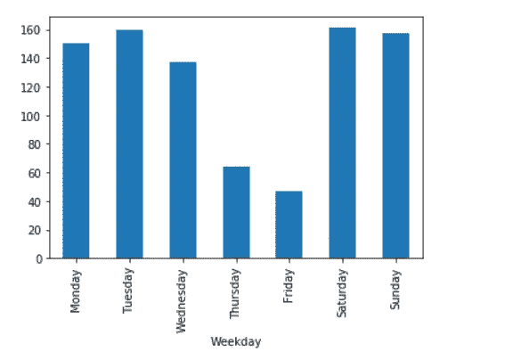

我们可以看到周四和周五收到的消息明显很少。这可能意味着一周结束时繁重的工作，或者为聚会做准备🍻在周末忘记打火。

# 发送的消息与一周中的某一天

最后一点分析。

代码结构将保持不变，除了在 *messages_sent* 数组中查找。

代码:

```
#Making an empty data frame with Date and matches as column names
df = pd.DataFrame(columns=['Date', 'messages_sent'])#Appending all the matches in the data frame
for key, value in usageData['messages_sent'].items():
    df = df.append(pd.DataFrame([[key,value]], columns=df.columns))

#Extracting the day names into another column
df['Weekday'] = pd.to_datetime(df['Date']).dt.day_name()#Summing values by the day of the week and then plotting a bar graph
df.groupby('Weekday')['messages_sent'].sum().reindex(cats).plot.bar()
```

运行代码后的图形:

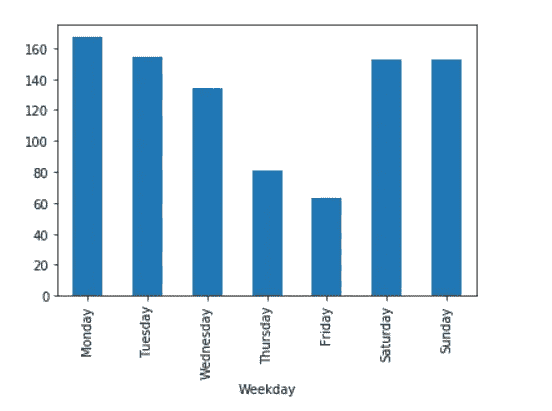

该图与我们收到的消息图非常相似。这是有道理的。大多数对话都是在同一天发生的聊天，因此发送和接收的消息遵循相似的模式是有道理的。

# 下一步是什么？

我刚刚得到了我的 Tinder 数据的冰山一角。你可以做得更多。

你可以把你的短信列表化，看看你交换了多少次问候，比如嗨，你好等等。你可以查看平均有多少次聊天后你得到了他们的号码或 Instagram 用户名。你可以做得更多。

玩得开心！💏

我在下面提供了代码库和后续笔记本以及其他相关文章的链接。

# 链接到笔记本

如果您想在线编辑此笔记本，请访问此处:

 [## Deepnote -数据科学家的协作

### 我们会试着理解我的 Tinder 数据。你可以在这里下载你的数据:https://account.gotinder.com/data 如果你…

beta.deepnote.com](https://beta.deepnote.com/publish/40c1986d-61ec-486e-b068-d8dc614e7ad5-b75a1acc-6c0b-4c29-ac7f-931594e650e6) 

如果您想在 Github 上更改此笔记本:

[](https://github.com/mukundmadhav/tinder-data-analysis) [## mukundmadhav/tinder-数据分析

### 在这本笔记本中，我将分析并尝试理解我的 Tinder 数据——mukundmadhav/Tinder-data-analysis

github.com](https://github.com/mukundmadhav/tinder-data-analysis) 

感谢阅读。快乐打火😃

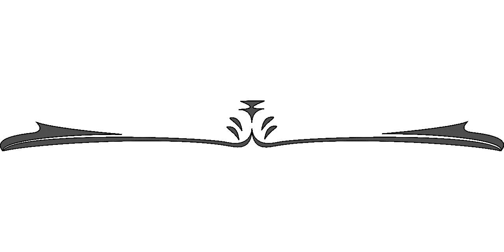[](/analytics-vidhya/build-flipkart-price-tracker-using-python-b2271aa41987) [## 使用 Python 构建 Flipkart 价格跟踪器

### 你和我一样穷，买不起他们真实价格的新 iPhone。你是做什么的？你等价格…

medium.com](/analytics-vidhya/build-flipkart-price-tracker-using-python-b2271aa41987) [](/@mukundmadhav/build-and-deploy-react-app-with-spring-boot-and-mysql-6f888eb0c600) [## 使用 Spring Boot 和 MySQL 构建和部署 React 应用程序

### 从为 SpringBoot 编写 POJO modal java 类到在我们自己的服务器上部署 React + Spring Boot 应用程序。

medium.com](/@mukundmadhav/build-and-deploy-react-app-with-spring-boot-and-mysql-6f888eb0c600) [](/@mukundmadhav/understanding-the-logarithmic-scale-9a2136211ab6) [## 了解对数标度

### 为什么越来越多的网站使用新冠肺炎的日志规模？为什么使用对数刻度不同于线性刻度？

medium.com](/@mukundmadhav/understanding-the-logarithmic-scale-9a2136211ab6)