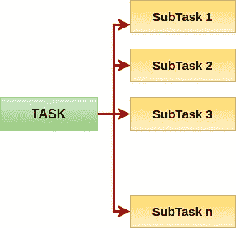

# Python 并发性的小(快速)备忘单

> 原文：<https://medium.com/analytics-vidhya/tiny-quick-cheat-sheet-to-python-concurrency-dc90ba6c5de?source=collection_archive---------15----------------------->

我们都读过术语*、*、*、【纵向扩展】、*；然而，确保在我们的日常编码实践中使用这些原则是很重要的。至少，我们应该尽可能地并行操作。

为什么你会问？

数据量正在增长。你不想几天都停留在预处理阶段吧！人们可能会想写懒惰的代码，认为“这已经足够好了！”——结果却发现并非如此。这可能是我们甚至没有注意到的瓶颈之一。当然，在实际的学习部分，库确实会处理并发性。

— — — — — — — — — — — -

**熊猫**:

`pd.apply`是最通用的功能之一。Apply 有点像`map`。文档在这里:[https://pandas . pydata . org/pandas-docs/stable/reference/API/pandas。DataFrame.apply.html](https://pandas.pydata.org/pandas-docs/stable/reference/api/pandas.DataFrame.apply.html)

当你有一个将输入作为一行的函数时，使用`axis=1`。您可以从函数中返回一个`series`对象，结果将是一个 dataframe。或者您可以返回一个值，并将它赋给正在操作的数据帧的一列。

有时，如果你的函数使用单个列值，**将其矢量化**。那是什么意思？使用`axis=0`，在一个系列上调用`apply`，即单个数据帧列。原因是:它比按行应用快两倍多。

**> >** **什么不可以做？**不要使用“df.iterrows()”。太慢了！

如果您的数据帧很大，并且您想将它分块并同时处理这些块，该怎么办？

[***pandarallel***](https://pypi.org/project/pandarallel/)是一个你应该签出的库。

— — — — — — — — — — — — — — -

**常规平行度**

Python 有一套非常精细的并行内置支持。

有两个非常好的图书馆

1.  **Joblib**
2.  **多重处理**

*joblib* 的简单应用

为了获得您想要的作业数量，而不是将其硬编码为您自己的开发机器上的 CPU 数量，让我们编写代码，以便您的代码可以使用所有内核，如果部署在具有更多或在某些情况下更少内核的机器上的话！。

`import multiprocessing`

`n_jobs = multiprocessing.cpu_count()`

就这么简单！

**OOP 呢？**

啊，我们写了一个类，里面有一个类函数。现在我们想并行调用这个函数。我们不能使用 joblib。很遗憾，是吧？为什么你会问？简而言之，Joblib pickles 一个对象，当一个类对象被直接 pickle 时会产生问题。

使用`multiprocessing`。一个好的做法是使用`multiprocessing.Pool`。如图所示，将工作线程数设置为核心数。并将类方法设为静态。你可以通过使用装饰者`@staticmethod`来完成。

简而言之，这可以帮助你开始。还有更多的可以说，但我们的目标是简洁。根据您的具体情况，查找文档中的正确用法，这样就万事俱备了。