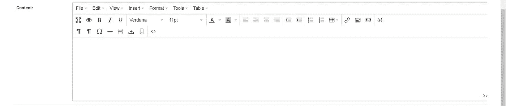

# Django 项目的 Tinymce 编辑器

> 原文：<https://medium.com/analytics-vidhya/tinymce-editor-for-django-project-a949066c31f7?source=collection_archive---------14----------------------->

嘿伙计们！这次我想分享一下关于 django 项目上的 tinymce。Tinymce 允许管理员用户在 html 表单中添加一些数据。我们开始吧！


Tinymce

## **Tinymce 安装**

对于安装，打开您的终端并运行以下代码:

```
**pip3 install django-tinymce4-lite**
```

接下来打开 setting.py，在 INSTALLED_APPS 上添加‘tiny MCE’。仍在 settings.py 上。转到底部并键入以下代码:

## Tinymce 设置

```
**TINYMCE_DEFAULT_CONFIG = {
    'cleanup_on_startup': True,
    'custom_undo_redo_levels': 20,
    'selector': 'textarea',
    'theme': 'modern',
    'plugins': '''
            textcolor save link image media preview codesample contextmenu
            table code lists fullscreen  insertdatetime  nonbreaking
            contextmenu directionality searchreplace wordcount visualblocks
            visualchars code fullscreen autolink lists  charmap print  hr
            anchor pagebreak
            ''',
    'toolbar1': '''
            fullscreen preview bold italic underline | fontselect,
            fontsizeselect  | forecolor backcolor | alignleft alignright |
            aligncenter alignjustify | indent outdent | bullist numlist table |
            | link image media | codesample |
            ''',
    'toolbar2': '''
            visualblocks visualchars |
            charmap hr pagebreak nonbreaking anchor |  code |
            ''',
    'contextmenu': 'formats | link image',
    'menubar': True,
    'statusbar': True,
}**
```

接下来是转到您的 urls.py 并键入 tinymce 的路径:

```
**path('tinymce/', include('tinymce.urls')),**
```

最后，转到 models.py，如果您想在模型类型上添加 HTML 表单，请在模型顶部和内部键入“from tinymce import HTMLField ”:

```
**content = HTMLField()**
```

接下来是运行 makemigrations 和 migrate，然后尝试运行 server 并打开 djangoadmin，您将得到如下结果:



正如你所看到的，你可以在 html 表单中输入，甚至可以添加一些照片或视频，字体样式，方程等等。谢谢大家！