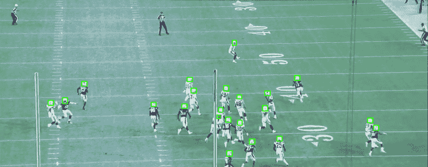
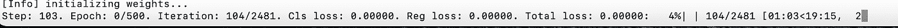
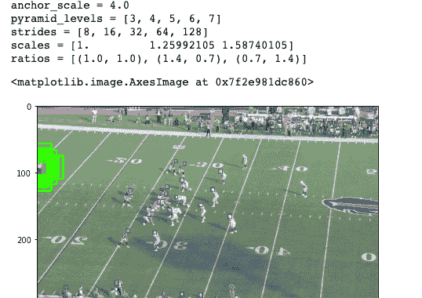
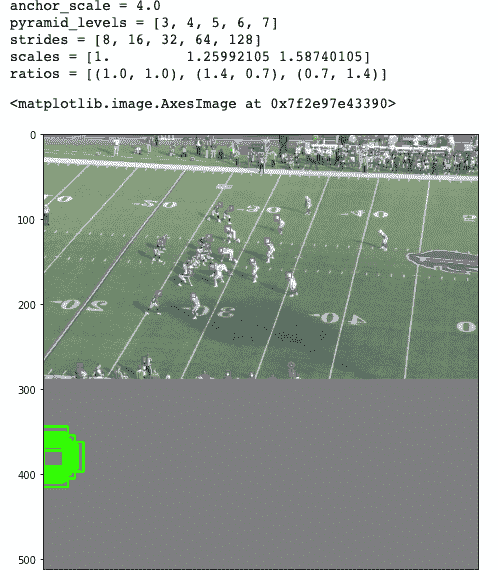
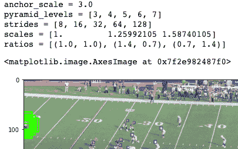
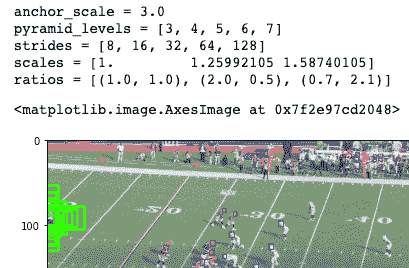

# 单次拍摄物体探测器提示

> 原文：<https://medium.com/analytics-vidhya/tips-for-single-shot-object-detectors-aa8ad4b3ea06?source=collection_archive---------19----------------------->

目标检测是计算机视觉中最核心和最关键的任务之一。这也是一项有许多实际好处的任务。从自动驾驶到监控，训练有素的物体检测器可以带来很多性能优势。

主要由卷积神经网络(CNN)架构以及最近由 Transformer 架构驱动的深度学习辅助计算机视觉的最新进展，已经产生了许多优秀的对象检测器，供计算机视觉从业者使用。针对中枢神经网络，已经开发了一系列两阶段方法的模型。这些包括快速的 R-CNN 和更快的 R-CNN，两个是为从业者设计的。正如描述所暗示的，这些设计需要两次通过图像:在快速通过中，网络学习制定良好的感兴趣区域(RoI ),在第二次通过中，RoI 被链接到要检测的对象。

可以想象，两遍设计使得这些设计训练起来更慢，因此开发了单次检测器(SSD ),要求单次通过图像。该网络执行产生感兴趣区域的任务，在该设计中称为锚盒，以及在这些设计中同时进行物体分类。这种架构的例子包括 SSD、YOLO、RetinaNet 和 EfficientDet。虽然最初的单次检测器不够精确，但最近的修改极大地提高了这些设计的精度，并且它们更快的训练时间使它们非常适合实际应用。

深度学习架构的性能往往取决于精心选择的超参数，毫不奇怪，单次检测器也不例外——特别是， ***锚定比例*** 和 ***锚定比例*** 就是这种参数的主要例子。这些参数以及所使用的图像大小和形状(例如 512x512 或 1024x1024 等)决定了被训练模型的整体准确性。让我们更深入地了解一下，我们如何为一项任务确定这些因素的最佳值。对于我们的例子，我们将在不同角度拍摄的图像中检测 NFL 球员的头盔。该数据集是最近 NFL 第一届和未来 Kaggle 挑战赛的一部分。我们将使用 EfficientDet 作为正在研究的模型。数据以复合系数 0 (512x512 图像)和批量大小 4(由于 GPU 限制)呈现用于训练。

图像为 720x1280 RGB，并在头盔周围标注了边框:

请注意，上面的基本图像是矩形的，与整个图像相比，对象(头盔)较小。默认情况下，EfficientDet 带有 COCO 参数。

***anchors_scales: '[2 ** 0，2 ** (1.0 / 3.0)，2 ** (2.0 / 3.0)]'***

***anchors_ratios: '[(1.0，1.0)，(1.4，0.7)，(0.7，1.4)]'***

在没有调整的情况下，当模型在 NFL 数据上训练时，我们看到许多 0 损失步骤:

不幸的是，这并不意味着我们已经完美地拟合了数据。要了解发生了什么，我们需要深入了解这个模型是如何工作的。该模型使用不同要素图层的有效网络主干要素(BiFPN)来(1)生成回归量，(2)计算覆盖图像的锚点，然后(3)计算与回归量生成最佳 IoU(联合交集)的锚点。换句话说，该模型在不同的部分检查图像，但不使用原始像素值，而是由主干模型在不同层构建的抽象。欠条交集才是问题所在。

下面(图 1)，我们形象地看到 10 个随机锚点:

图 1

可以看出，由于小头盔盒的尺寸，锚并没有被设置成用小头盔盒产生好的白条。大多数模型认为 0.5 或以上的 IoU 为正匹配。

另一件要记住的事情是，如果模型使用正方形图像，而源图像是矩形的，那么大量的“锚定房地产”可能会被浪费掉。灰色区域中建议的所有锚定框都不会导致重叠，因此对训练没有任何帮助(图 2)。假设图像中的大部分信息被保留，将图像裁剪成正方形可以使训练更有效。

图 2

最后，上面的 **anchor_scale、scales** 和**ratio**参数可用于调整每个盒子的分辨率/覆盖范围。下面，我们展示了对(1)锚定比例(4.0 → 3.0)，(2)比例(生产的盒子)和(3)盒子的(纵横比)的调整。这些图像清楚地显示了每次修改所产生的不同形状和大小的盒子。图 1 使用默认的参数集生成了盒子。

用一些样本图像试验这些参数的不同值，以挑选产生良好 IoU 分数的选项，可以帮助训练更准确的 SSD 对象检测器。

如果我上面的分析有任何错误，或者如果你想提供任何建议，我将很高兴收到反馈。

资源:

1.  PyTorch EfficientDet 实施[https://github.com/zylo117/Yet-Another-EfficientDet-Pytorch](https://github.com/zylo117/Yet-Another-EfficientDet-Pytorch)
2.  卡格尔 NFL 比赛[https://www.kaggle.com/c/nfl-impact-detection](https://www.kaggle.com/c/nfl-impact-detection)
3.  EfficientDet:可扩展且高效的对象检测[https://arxiv.org/abs/1911.09070](https://arxiv.org/abs/1911.09070)