# 基于 k-最近邻(KNN)算法的机器学习

> 原文：<https://medium.com/analytics-vidhya/titanic-machine-learning-by-k-nearest-neighbors-knn-algorithm-530d8bdd8323?source=collection_archive---------1----------------------->

安妮·斯普拉特在 [Unsplash](https://unsplash.com?utm_source=medium&utm_medium=referral) 上的照片

对于任何进入机器学习世界的人来说，泰坦尼克号案例研究可能是最受欢迎的实践之一。当然，有许多不同的方法和模型可以用来做预测。但是今天我想重点说一下 k 近邻算法，简单分析一下。更多的背景信息，你可以访问 ka ggle:https://www.kaggle.com/c/titanic

## 数据导入和概述

首先，我们需要导入列车数据，并找出与乘客存活率相关的特征。

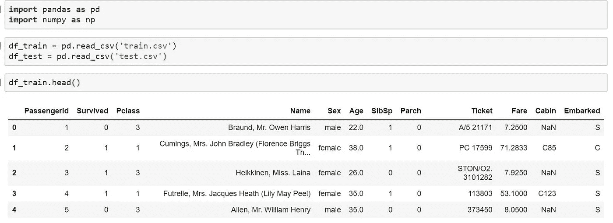

使用 corr 函数找出存活与其他数值特征之间的线性相关性。我们可以看到存活与 Fare 和 Pclass 的特征有很强的相关性。

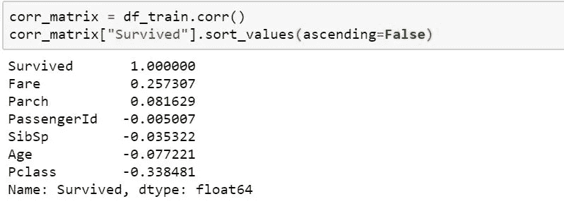

别忘了我们还需要可视化幸存和其他非数字特征的相关性。

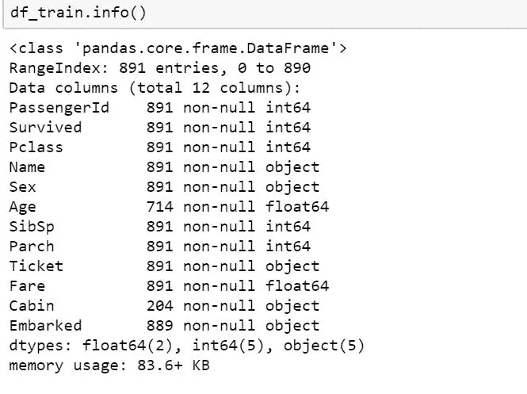

客舱功能中缺少太多值，我们可以考虑稍后删除此功能。性和着手性似乎是这一点上需要研究的特征。

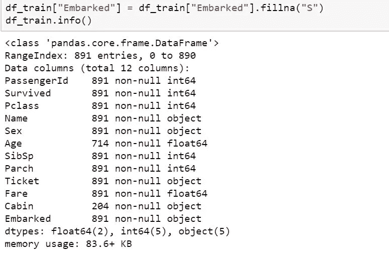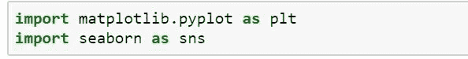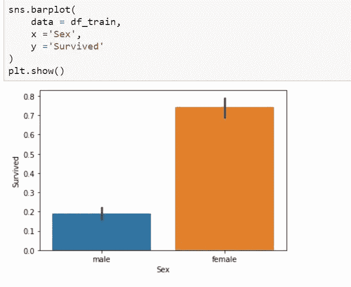

显然，女性的存活率比男性高得多。

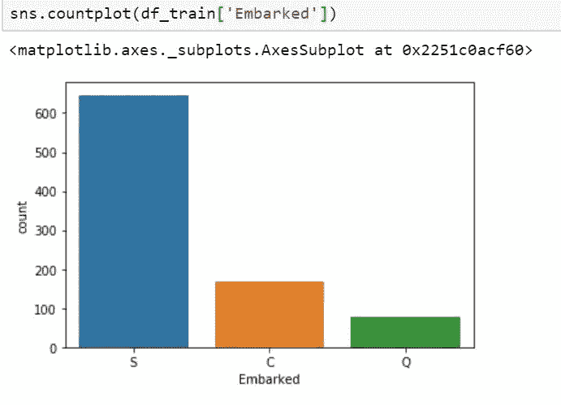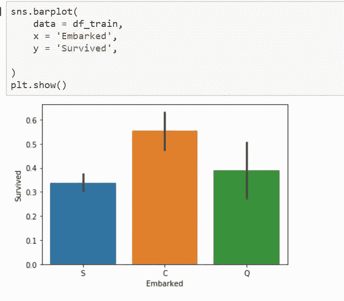

大多数乘客是在南安普敦港登上泰坦尼克号的，但是在瑟堡登上的人相比其他人有最高的存活率。

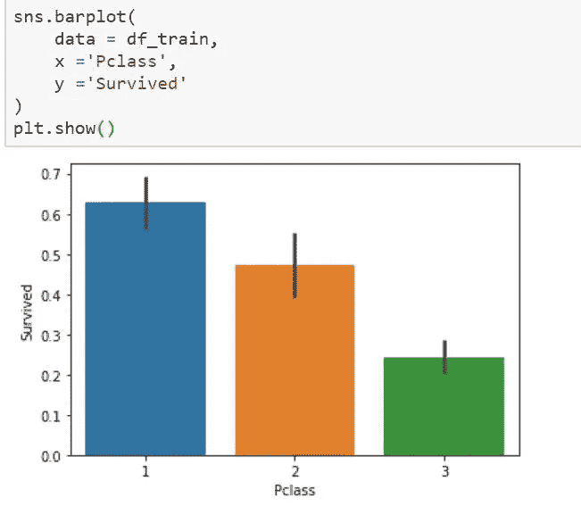

同样，上层阶级的乘客存活率最高，接近 65%。下层乘客的存活率最低(约 27%)

## 数据准备

现在，我们已经知道选择什么特征来构建预测模型。这些特征是阶级、性别、费用和船上的。在我们建立模型之前，我们需要做一些数据准备。

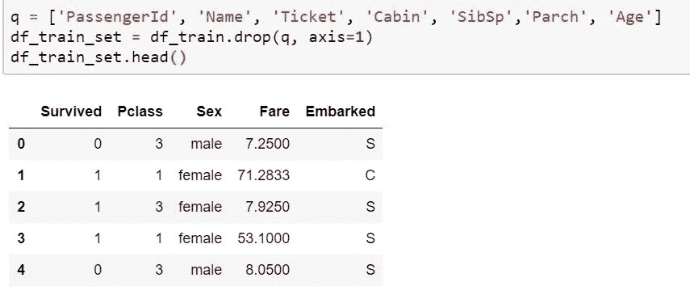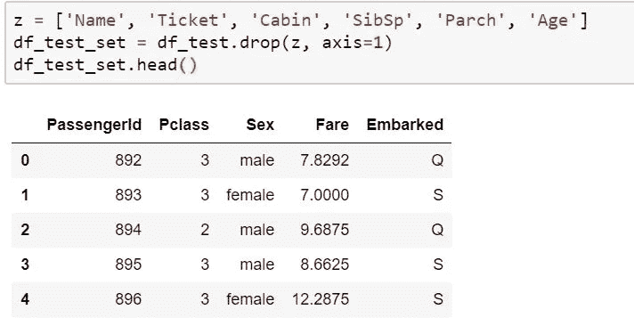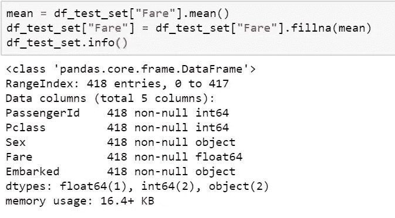

然后将非数值特征转化为数值特征。

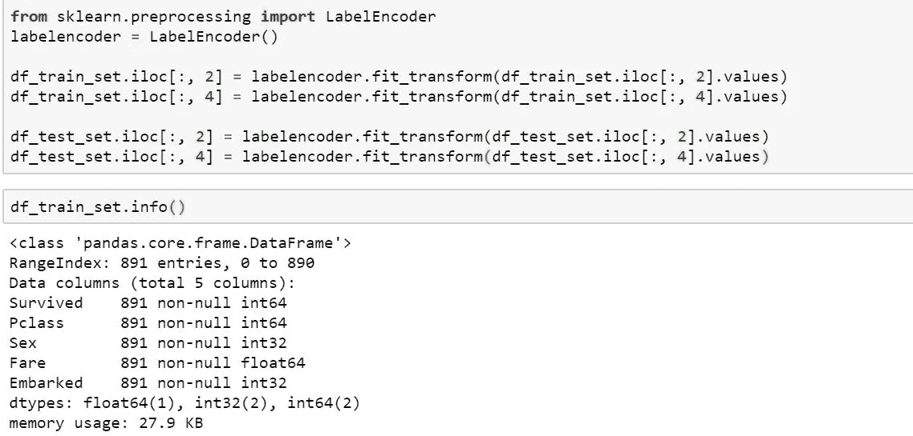

## 列车数据分割

将训练数据拆分成 X_train，X_test，y_train，y_test。

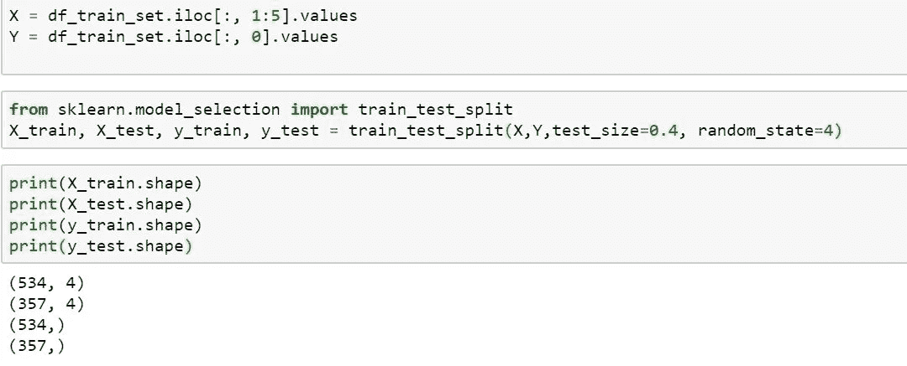

# k 近邻(KNN)模型

现在我们可以建立我们的 KNN 模型了。

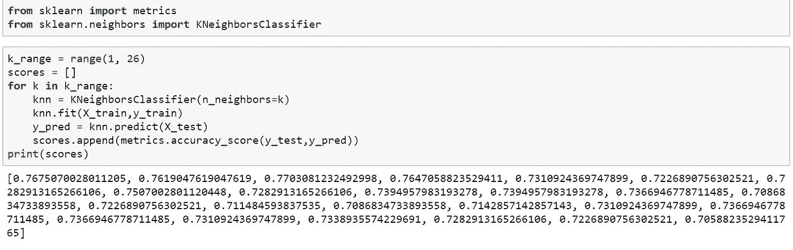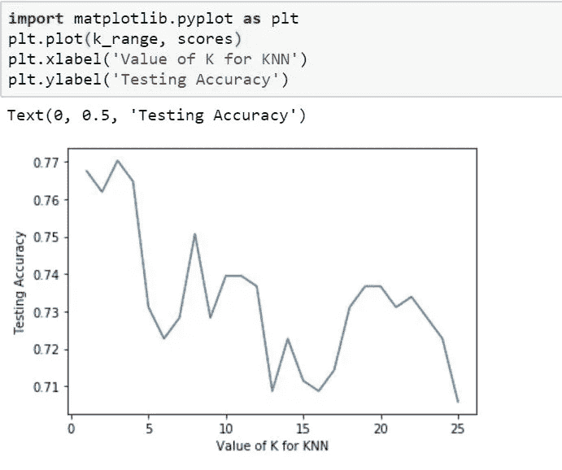

k 值等于 3 的准确率最高。

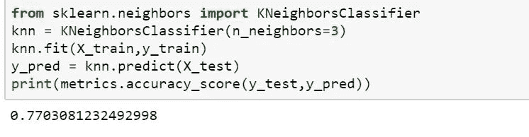

## 对样本外数据进行预测

最后，我们可以使用这个模型对样本数据进行预测。并生成新的数据帧“提交”。

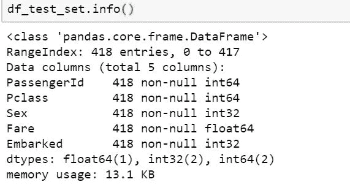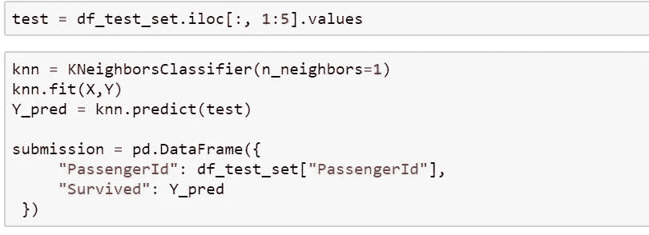