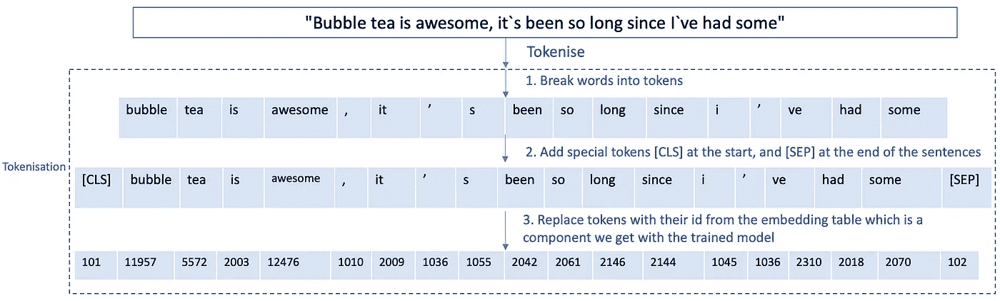
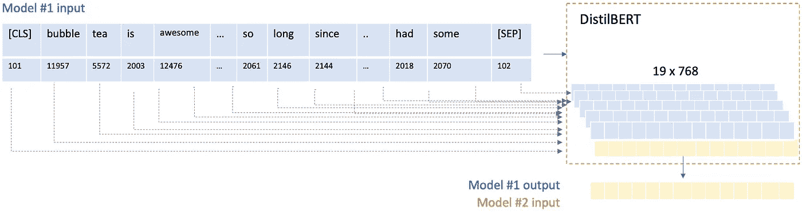
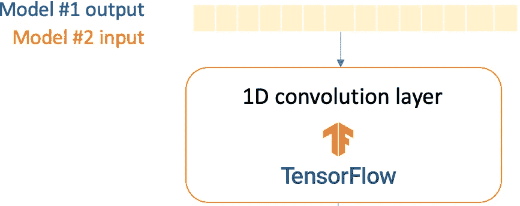
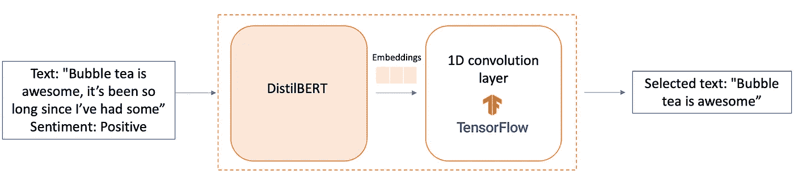

# 生存还是毁灭

> 原文：<https://medium.com/analytics-vidhya/to-be-rt-or-not-to-be-rt-7b7b1f008d37?source=collection_archive---------18----------------------->

当前 SOTA NLP 模型的初学者友好漫游

[图片信用](/tensorflow/using-tensorflow-2-for-state-of-the-art-natural-language-processing-102445cda54a)

有各种各样的 NLP 技术，从简单的单词包方法(例如 TF-IDF)，到静态单词嵌入(例如 word2vec，Glove)，到上下文化(即动态)单词嵌入。静态单词嵌入在不同的上下文中为相同的单词生成相同的嵌入。例如，这两个句子——“这部电影一点也不好”和“这个提议好得不像真的”有相同的单词“好”，但它们在这两个句子中有不同的意思。静态单词嵌入将为“good”返回相同的嵌入。另一方面，当前最先进的 NLP 技术 BERT(来自变压器的双向编码器表示)使用变压器，它引入了注意机制，可以同时处理整个文本输入，以学习单词(或子单词)之间的上下文关系。因此，BERT 会返回单词“good”的不同嵌入。同时，与只输出下游任务的向量的静态单词嵌入不同，BERT 输出训练的模型和向量。这意味着我们可以为自己的用例微调一个预先训练好的转换器模型。

从 tfhub，google-research，huggingface 等都有相同模型的不同版本。我将使用 Huggingface，因为他们可以很容易地在不同的模型之间切换(例如，BERT，DistilBERT，RoBERTa，XLNet。我在本文的第二节中介绍了这些变体之间的简单区别)并且这些模型与 PyTorch 和 Keras 兼容。

本教程将基于从 [Kaggle](https://www.kaggle.com/c/tweet-sentiment-extraction/overview) 获得的一条推特情感摘录。一个训练输入具有 4 个变量，`id`、【全文】、【情感标签】和最能代表情感标签的【所选文本】。给定只有全文和情感标签的新输入，该模型将从全文中提取最能代表相应情感的支持短语。情感分析在自然语言处理的许多方面都很普遍，例如理解聊天机器人上用户消息的语气，以便根据用户情绪提供适当的响应，并帮助对服务和故障进行下游分析。捕捉导致情感描述的支持短语有助于下游分析。

# I)用于变压器模型的通用管道

1.  文本预处理
2.  模特培训
3.  微调
4.  推理

## 1.让我们对数据进行预处理，使其与训练 DistilBERT 的数据相匹配。

## 2.模特培训

对于输入句子中的每个标记，DistilBERT 将输出一个 768 维向量(即嵌入。我使用默认的隐藏层大小，但这是可配置的)。DistilBERT 的第一个输出是所有输入令牌的嵌入。这代表了 DistilBERT 对句子上下文中单词含义的“理解”,并作为微调步骤的输入。

## 3.微调

这些嵌入作为第二个模型的输入，我构建这个模型是为了让 DistilBERT 适应我的用例。为了提取支持短语，该模型将基于完整的文本和情感标签来预测记号的开始和结束索引(其是空间的，即单词所在的位置)。因此，我使用 1D 卷积层来保存这些空间信息。在展平和应用 softmax 之后，输出是开始和结束标记索引的一个热编码。

## 4.推理

我使用微调后的模型基于全文和情感标签来预测支持短语的位置。随后，我通过定位它们对应的索引来提取支持短语。

对预测是如何做出的说明

# 二)BERT 模型的比较

1.伯特

*   通过给出屏蔽记号，BERT 将使用两侧(目标记号之前和之后)来预测屏蔽记号，以便学习文本表示。

*限制*

*   [掩码]标记存在于训练阶段，而它不存在于预测阶段。
*   无法处理长文本序列。默认情况下，BERT 最多支持 512 个令牌。通过忽略 512 个记号之后的文本或者将记号分成 2 个或更多个输入并分别预测来克服它。

2.蒸馏啤酒

*   使用一种称为蒸馏的技术，这种技术近似于谷歌的 BERT，即一个较小的大型神经网络。这个想法是，一旦一个大的神经网络被训练，它的全部输出分布可以用一个较小的网络来近似。

3.罗伯塔

*   为了改进训练过程，RoBERTa 从 BERT 的预训练中移除了下一句预测(NSP)任务，并引入了动态屏蔽，使得屏蔽的令牌在训练时期期间改变。

4.XLNet

*   通过使用置换语言建模(PLM)克服单向的文本编码方式，在置换语言建模(PLM)中，所有的标记都是以随机顺序预测的。这与 BERT 的屏蔽语言模型相反，在该模型中，仅预测屏蔽的(15%)标记。这也与传统的语言模型形成对比，在传统的语言模型中，所有的标记都是按顺序而不是随机顺序预测的。这有助于模型学习双向关系，从而更好地处理单词之间的依赖性和关系。
*   PLM 不改变原始序列顺序，但在注意部分对其进行操作。
*   使用隐藏状态处理长文本序列(来自 Transformer-XL)

我希望这篇文章能让您直观地了解如何将 BERT 用于各种各样 NLP 应用，比如文本分类、问答系统、文本摘要等。更多细节请看拥抱脸的[文档](https://huggingface.co/transformers/)。

> 我目前正在寻找一个数据科学家的机会，加入一个团队，让我能够将我的数据科学知识应用于现实生活中的商业挑战，从而带来商业价值。如果你觉得这篇文章有用，请点击下面的掌声按钮，它对我来说意义重大，也有助于其他人看到这个故事。如果你的数据科学团队正在扩大，请随时通过 [LinkedIn](https://www.linkedin.com/in/valerie-lim-yan-hui/) 联系我。我很高兴分享更多关于我的个人资料:)

查看我为其他数据科学项目撰写的文章[也在这里](/@valerielimyh)。

保重，注意安全:)