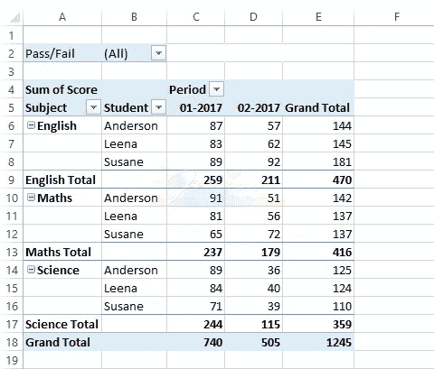
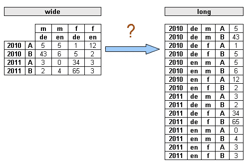

# 让你的视觉更清晰:数据的宽长格式

> 原文：<https://medium.com/analytics-vidhya/to-sharp-your-visualization-the-wide-and-long-format-of-data-2dad6a06bb75?source=collection_archive---------9----------------------->

你将如何开始你的可视化项目？这是每个数据分析师在项目开始时都应该问的问题。在本文中，我将从通过两种表格格式准备整齐的数据这一点开始，并比较它们的优缺点。

# 宽大的桌子

每个人都有使用 excel 中数据透视表功能的经历，数据透视表向我们展示了表格的宽度。使用宽表呈现数据的优点是，它为用户提供了清晰的可视化效果，尤其是当用户使用它和筛选功能时。在控制面板中使用矩阵或表格功能与 Power BI 中的功能非常相似。然而，当分析师收到这种数据时(例如来自利益相关者的月度报告)，不仅在可视化工具中，而且在 python 或 r 中直接使用这种数据都是极其困难的。作为一名分析师，您有几种方法来解决这个问题:

1.  如果您有数据库的授权，请转到数据库获取原始数据
2.  向数据工程师寻求帮助
3.  请你的利益相关者向你提供他们收集的原始数据
4.  恭喜，是时候提高你的 python 或者 R 技能了

宽表的格式

# 长桌

在构建 ML 模型或显示仪表板之前，分析师通常会清理来自各种来源的不同数据，该阶段的目的是整合长表格中显示的整齐数据。长表的优点是可以通过给列添加限制或条件来对数据进行切片(比如限制 2010 年的索引，那么就可以在整齐的数据中得到满足条件的所有信息)。

宽而长的桌子

那么，我们该如何转换表格格式呢？

*在 python 中，*

1.  使用 pandas 和 pivot()、groupby()逐个添加列，将长表转换为宽表。
2.  使用 pandas wide_to_long()将宽表格转换为长表格

*在 R，*

1.  使用 gather()进行单列转换
2.  使用 gather_()进行一系列列转换

分析师应该熟悉这两种格式，并考虑在面对不同情况时正确使用它们。