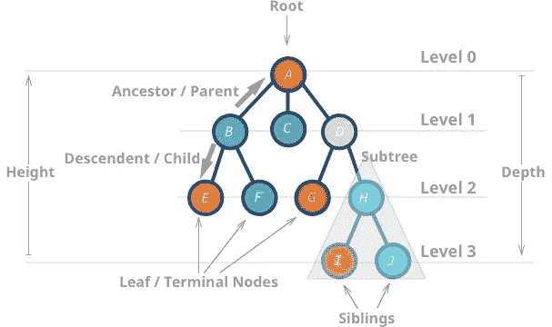
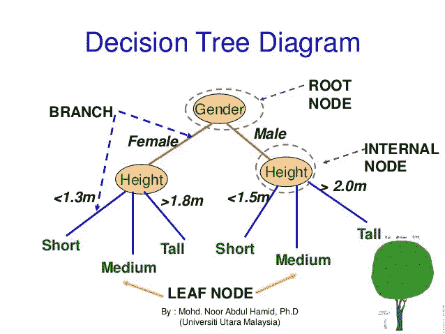
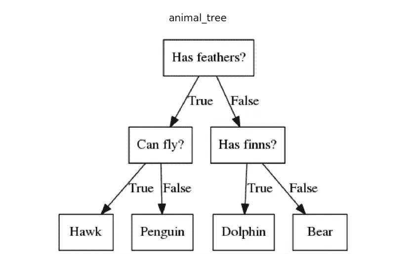
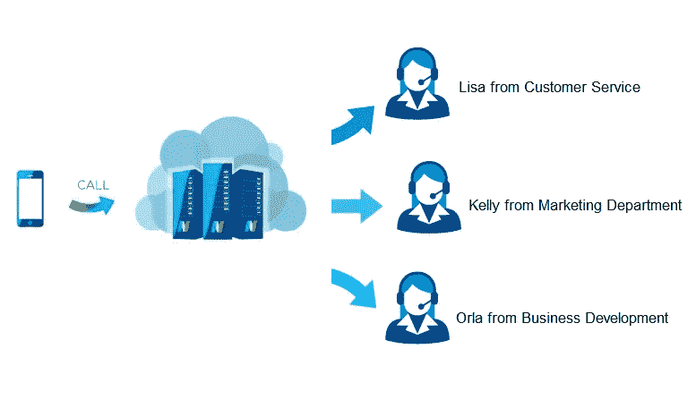
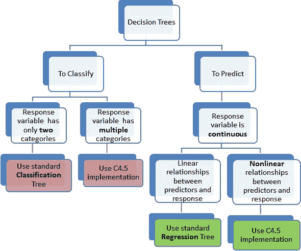
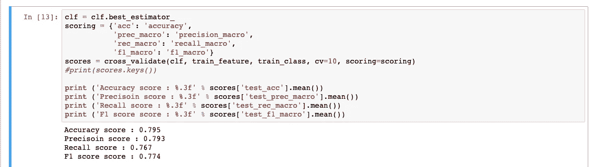
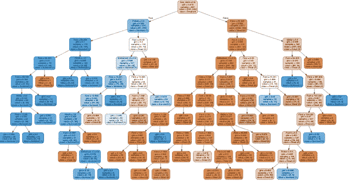

# 种树还是不种树？就这样决定。

> 原文：<https://medium.com/analytics-vidhya/to-tree-or-not-to-tree-that-is-the-decision-90ae1a9114c2?source=collection_archive---------10----------------------->

来源:[https://fineartamerica . com/featured/colorful-tree-painting-brahaman-dhu MSI . html](https://fineartamerica.com/featured/colorful-tree-painting-brahaman-dhumsi.html)

如果我让你说出一种有羽毛但不会飞的动物的名字会怎么样？如果我让你预测埃隆·马斯克是否会在泰坦尼克号上幸存下来呢？你有多大把握能提供正确的答案？你在脑子里执行什么步骤来计算答案？

我的猜测是，你可能会通过询问其他引导性问题来找到解决方案，然后帮助你找到答案。恭喜你！实际上，你正处于在头脑中创建和实现自己的决策树算法的边缘。这种方法在概念上与决策树的工作方式非常相似。事实上，我们每天都在使用决策树来对日常生活做出有意义的判断。

# 决策树

决策树是一种通用的机器学习算法，可用于分类和回归任务。决策树是一种受监督的机器学习算法，用于基于特定条件的决策的所有可能解决方案的图形表示。决策树背后的思想来自于计算机科学中被称为树的基本数据结构。一棵树有一个根节点，每个根节点可以有零个或多个子节点。单个节点的子节点的最大数量和子节点的最大深度在某些情况下受到树所表示的确切数据类型的限制。

## 性能

*   决策树是一种用于监督学习的分类算法
*   决策树以树结构的形式建立分类模型
*   每个分支节点代表一个选项，每个叶节点代表一个决定。

树的一个常见例子是 XML 文档。顶层文档元素是根节点，在其中找到的每个标记都是子节点。这些标签中的每一个都可能有子标签，依此类推。在每个节点，标签的类型和任何属性构成了该节点的数据。”在这样的树中，节点的层次和顺序被很好地定义，并且是数据本身的重要部分。另一个很好的例子是论文的提纲。整个大纲本身是一个根节点，包含每个顶级项目符号，每个顶级项目符号可能包含一个或多个子项目符号，依此类推。大多数磁盘上的文件存储系统也是树形结构。

# 决策树

# 为什么叫决策树？

嗯，它从根节点开始，然后像一棵真正的树一样，分支到许多不同的解决方案。决策树可以随着新的解决方案和可能性变得越来越大，这些解决方案和可能性具有一定的权重，就像一棵树上的真实分支可能与另一个分支的权重不同一样。

来源:[https://www . slide share . net/jaseelashajahan/decision-trees-91553243](https://www.slideshare.net/jaseelashajahan/decision-trees-91553243)

# 现代决策树的例子

来源:https://mc.ai/machine-learning-algorithms-decision-trees/

1.  当与国际银行或电话服务机构通话时，接线员会说:“英语请按 1，西班牙语请按 2，法语请按 3，汉语请按 4，重复这些选项请按#号。”然后会根据一个人打电话的原因提出后续问题。该公司的目标不是让客户厌烦，而是帮助他们找到正确部门的正确人员，以提高客户满意度。

来源:https://nuacom.ie/call-routing-for-business-phone-systems/

2.公司结构:“公司结构也很适合树木。在经典的管理层级中，一个总裁可能有一个或多个副总裁，每个副总裁负责几个经理，每个经理又负责几个员工。

# 决策树 vs 二分搜索法树

二叉查找树是一种基本的数据结构，可用于存储便于日后查找的数据。该数据结构的优点在于它的平均案例查找时间为 log n 次。在二叉树的每一个节点上，你都在询问你要找的数字是大于(高于)还是小于(低于)你要找的数字，直到你找到你要找的项目。

相反，在机器学习中，二叉决策树将数据的输入空间映射到类的输出空间。例如，如果一家公司想知道一个在线用户是否会购买他们的产品。他们会生成关于屏幕时间、点击时间、他们正在看的商品有多贵、他们是回头客等等的数据。结果可以归结为一个简单的是或否。

决策树中的每个节点都会询问有关数据的二元问题。这种产品打折吗？还有多少库存？根据每个问题的答案，您将向下遍历到底部的叶子，要么以客户购买结束，要么以客户不购买结束。

照片由 [Jens Lelie](https://unsplash.com/@leliejens?utm_source=medium&utm_medium=referral) 在 [Unsplash](https://unsplash.com?utm_source=medium&utm_medium=referral) 上拍摄

最终，二叉决策树是一种工具，可以在减少人为偏见的情况下做出更高层次的决策。算法会问一系列问题来给你答案。

# 理解决策树

照片由 [Unsplash](https://unsplash.com?utm_source=medium&utm_medium=referral) 上的[延斯·勒列](https://unsplash.com/@leliejens?utm_source=medium&utm_medium=referral)拍摄

决策树的美妙之处在于它们易于理解，因为它们是图形化的。决策树也更容易清理，不受数据集中离群值和缺失值的影响。决策树也可以保存数值和分类数据。在决策树方法中，有几种不同的算法可供使用。在本文中，重点是 CART:分类和回归树算法。

# 决策树的实现

废话和理论够多了。我支持边做边学。世界属于采取行动的人！让我们建立一个决策树，根据泰坦尼克号的训练数据来预测某人在泰坦尼克号上幸存的可能性。

## 导入我们的依赖性

## 缺失值标识

## 处理分类数据

## 培训结果

看起来我们的模型有 79%的准确率和 79%的精确度。让我们做一些参数调整和可视化我们的模型。

## 参数调谐

## 分类分析结果

## 用图形可视化树

想象这棵树

## 对我们的测试数据集进行预测

让我们通过将模型应用到我们的测试数据集来测试我们的模型！

# 结论

恭喜你在 titanic 数据集上实现了自己的决策树！决策树也可以用于更严肃的任务。公司每天都使用它们来帮助做出信息丰富的数据驱动的决策；因此，人们每天都与决策树算法进行交互。本文中提到的决策树有许多不同的应用，如预测天气、识别动物或预测某人在船上死亡的可能性，如本文中的泰坦尼克号示例。我希望决策树的实际实现及其真实世界的应用程序能够很好地帮助您应用这个概念。更多的理论解释，请访问下面列出的一些来源。

# 决策树的理论解释

*   [https://www . research gate . net/publication/303318878 _ theory _ Study _ of _ Decision _ Tree _ Algorithms _ to _ Identify _ Pivotal _ Factors _ for _ Performance _ Improvement _ A _ Review](https://www.researchgate.net/publication/303318878_Theoretical_Study_of_Decision_Tree_Algorithms_to_Identify_Pivotal_Factors_for_Performance_Improvement_A_Review)
*   [https://medium . com/@ ankitnitjsr 13/math-behind-decision-tree-algorithm-2aa 398561 d6d](/@ankitnitjsr13/math-behind-decision-tree-algorithm-2aa398561d6d)
*   [https://mc.ai/mathematics-behind-decision-tree/](https://mc.ai/mathematics-behind-decision-tree/)
*   [https://www-users.cs.umn.edu/~kumar001/dmbook/ch4.pdf](https://www-users.cs.umn.edu/~kumar001/dmbook/ch4.pdf)

# 文章来源:

*   [https://www . top coder . com/community/competitive-programming/tutorials/data-structure/](https://www.topcoder.com/community/competitive-programming/tutorials/data-structures/)
*   [https://sefi ks . com/2017/11/20/a-step-by-step-ID3-decision-tree-example/](https://sefiks.com/2017/11/20/a-step-by-step-id3-decision-tree-example/)
*   [https://www-users.cs.umn.edu/~kumar001/dmbook/ch4.pdf](https://www-users.cs.umn.edu/~kumar001/dmbook/ch4.pdf)
*   [https://scikit-learn.org/stable/modules/tree.html](https://scikit-learn.org/stable/modules/tree.html)