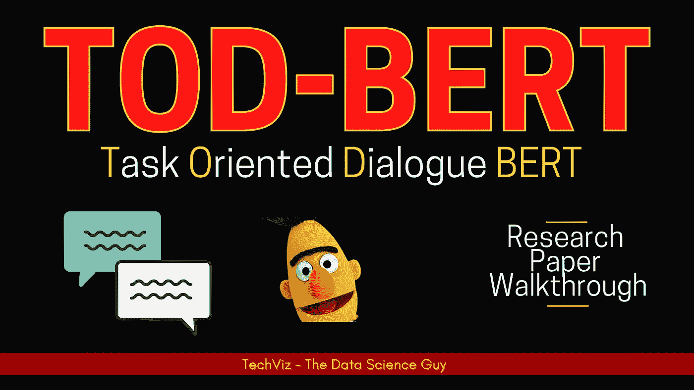

# TOD-BERT:面向任务对话系统的预训练转换器

> 原文：<https://medium.com/analytics-vidhya/tod-bert-pre-training-transformer-for-task-oriented-dialogue-systems-80750c510134?source=collection_archive---------29----------------------->

## 研究论文演练

对话代理(Conversational agents)是计算机系统，用于在输入和输出通道上以一种或多种文本、语音和其他通信模式与人对话。

来自 [EMNLP 2020](https://2020.emnlp.org/) 的这篇论文针对面向任务的对话系统/聊天机器人在现有的 BERT 基础架构上提出了一个新的预训练目标，因为一般文本和面向任务的对话之间的语言模式的潜在差异使得现有的预训练[语言模型](https://en.wikipedia.org/wiki/Language_model)在实践中用处不大。

面向任务的聊天机器人只能帮助用户完成各种各样的任务。它们可以帮助一个人完成明确定义的任务，如查看账户余额、预订或找到正确的食谱。

作者使用 9 个不同的人-人多回合对话数据集来用修改的目标函数预训练他们的模型。他们的方法优于现有的方法，如 **DialoGPT** 、 **GPT2** 、 **BERT** 等。在这个领域，作者使用下游任务如意图检测、对话状态跟踪、对话状态预测、响应选择来验证它。他们还表明 **TOD-BERT** 具有更强的少数镜头能力，可以缓解面向任务对话的数据稀缺问题。

# 你对此感兴趣吗？

然后，观看详细的论文演练—

> ⏩论文链接:[https://arxiv.org/pdf/2004.06871.pdf](https://arxiv.org/pdf/2004.06871.pdf)
> 
> ⏩论文作者:钱，史蒂文·海，理查德·索契，熊
> 
> ⏩组织:Salesforce Research

*一定要让* ***分享*******像*** *一样的工作！**

**干杯！**