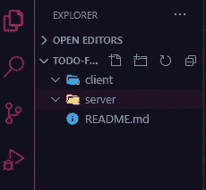
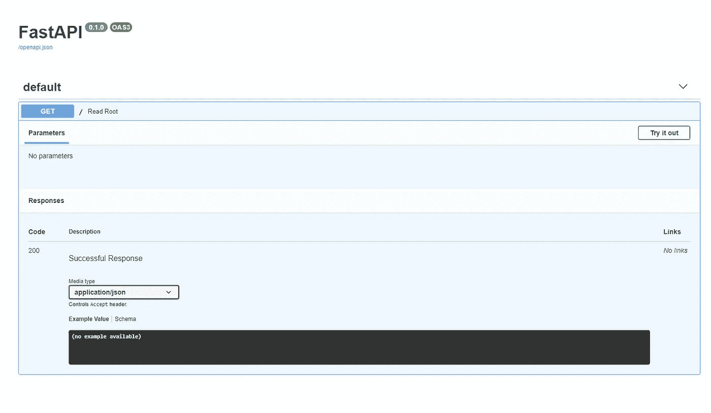
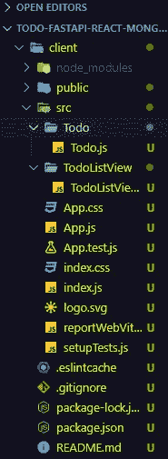
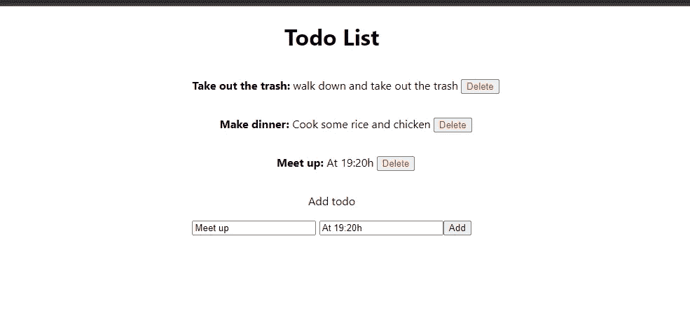

# 带有 FastAPI、React、MongoDB(motorIO)的 Todo 应用程序

> 原文：<https://medium.com/analytics-vidhya/todo-app-with-fastapi-react-mongodb-motorio-738e4fb992c4?source=collection_archive---------0----------------------->

一个简单的应用程序，展示了用 fastapi、mongo 和 react 构建一个完整的应用程序是多么容易。

所以你正在寻找一个速度极快、易于实现并且有很好的社区的框架？答案可能是 FastAPI，我强烈建议你在这里查看官方文件，并加入 Discord 社区。在撰写本文时，文档中没有任何 mongodb 示例，所以这就是我们使用 mongo 的原因。这个项目会在 github 上，所以如果你想跳过所有的阅读，这里有一个[链接](https://github.com/valentin994/todo-fastapi-react-mongo)给你。

# 我们开始吧

## 后端

因此，首先我们必须创建一个存储项目的地方，然后创建一个主文件夹，我的文件夹名为“todo-fastapi-react-mongo ”,在那里创建两个新文件夹，server 和 client。



开始文件夹结构

打开一个终端并将目录更改为 server，现在我们将创建我们的虚拟环境并安装我们的包(Python3.6+)。更多关于虚拟环境的信息可以在[这里](https://docs.python.org/3/tutorial/venv.html)找到。

```
$ cd server
$ server/python3.8 -m venv venv
$ server/source venv/bin/activate
$ server/pip install fastapi
$ server/pip install uvicorn[standard]
$ server/pip install motor
```

在安装完虚拟环境后，我们必须按照我们将要使用的包对其进行采购。Uvicorn 用于运行服务器，motor 是我们的 mongoDB 异步驱动程序。完成安装后，终于到了写代码的时候了。创建一个 main.py 文件，现在将它放在:

之后运行$ uvicon main:app—reload 运行我们的服务器，你可以在 [localhost:8001](http://localhost:8001/) 上打开它。转到/docs 查看交互式 api 文档。



交互式 api 文档

在 main.py 中，我们将指定我们的路由，我们将构建一个 CRUD 服务器，因此我们必须实现以下选项:GET、POST、PUT、DELETE。我们可以删除 get("/")路径，并插入我们将要使用的路径。

我们将暂时保留它，稍后再回来讨论它，现在让我们定义我们的模型。创建一个 model.py 文件，并执行以下操作。

在我们定义了模型之后，现在我们可以开始对数据库进行操作了。下面的操作应该包括我们在 main.py 中定义的路由。现在让我们创建我们的 database.py 文件，在这里我们将连接到 db 和 CRUD 操作。

这里，我们定义了将要使用的五种方法。现在所有的方法都定义好了，我们必须调整我们的 main.py 并开始使用所有这些方法。更改 main.py，使其看起来更像这样。

现在，我们的路线实际上做了一些事情，并与我们的数据库通信，有一些异常处理，但这还远远没有完成，但对于本教程来说，这足以让你得到一个东西挂。我邀请你摆弄这个，添加或改变一些东西，甚至可能改变前提，而不是做一个食谱或书籍模型，并在此基础上进行操作。添加一些检查，就好像一个文档存在，如果它存在，不要添加一个新的，并向该事件发送相应的消息。您可以进行许多改进，我邀请您在继续阅读本文之前进行这些改进，对于本文的目的来说，这已经足够了，我们现在就去实现客户端。

## 前端

打开一个新的终端，转到我们在开始时创建的客户端目录，在那里我们将创建我们的 react 应用程序。

```
$ cd ../client
$ client/npx create-react-app .
$ client/npm i axios
```

圆点在那里，所以 react 应用程序进入客户端文件夹。等一两分钟，你会看到这些文件。Axios 用于向我们的后端发送请求。安装好所有东西后，创建两个文件夹，Todo 和 TodoListView，并在其中创建一个同名的. js 文件。



文件夹结构

首先，让我们创建 Todo，它将包含我们将通过 props 接收的标题和描述。TodoListView 将显示数据库中的待办事项。

样式将小到没有，这只是一个演示，让我们看到后端工作。这里我们显示 todo 和一个按钮，该按钮有一个绑定到自己的 deleteHandler，我们可以用它从数据库中删除 todo。旁边的幻灯片视图应该是这样的。

在这里，我们只从 App.js 发送的 props 中获取 todoList 并显示它。最后是 App.js。

这里我们得到所有的待办事项，通过将它们传递给我们的子组件来显示它们，我们有一个 addHandler 来添加更多的待办事项。



# 结论

在本文中，我们构建了一个支持所有 CRUD 操作的后端，之后我们使用 react 在客户机上显示它。我们把它保持得非常简单，所以这里还有很多需要改进的地方，添加一些样式、异常处理等等。希望这篇文章对你有用，感谢你的阅读！

[github](https://github.com/valentin994/todo-fastapi-react-mongo) 上的代码。