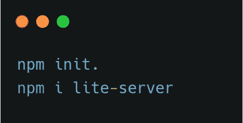
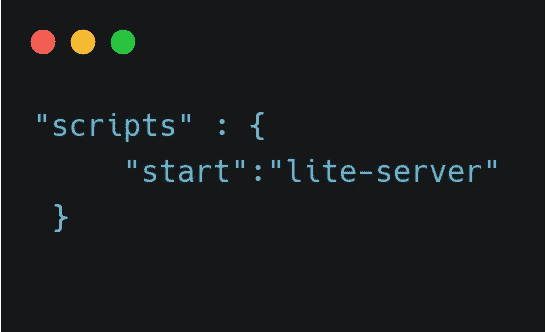
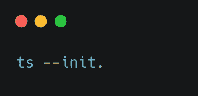

# Todolist- Typescript

> 原文：<https://medium.com/analytics-vidhya/todolist-typescript-67a324604cb5?source=collection_archive---------2----------------------->


在这篇文章中，让我们使用 typescript 构建一个简单的 TodoList。

让我们通过使用面向对象的方法使这个构建变得有趣和令人惊奇。

# *文件夹结构*

```
|index.html
+\---dist
+\---src
        app.ts
```

创建两个文件夹 dist 和 src。在 src 文件夹中创建类型脚本文件 app.ts。



上面的命令创建了一个 package.json 文件。

Lite-server 是一个轻量级开发服务器，它服务于一个 web 应用程序，在浏览器中打开它，并在对源代码进行 HTML 或 JavaScript 更改时刷新页面

在 package.json 文件中



是时候创建 tsconfig json 文件了。



上面的命令创建了一个 tsconfig.json 文件。您需要在 tsconfig 文件中包含基本选项

```
“target”: “es6”,“module”: “commonjs”,“lib”: [“dom”,es6”,“dom.iterable”,“scripthost”],"outDir": "./dist", "rootDir": "./src",
```

当我们运行 typescript 文件时，编译器将检查 src 文件夹中的 typescript 文件，然后将其转换为 JavaScript 文件，该文件将存储在 dist 文件夹中。

运行 typescript 文件:

```
tsc -w
```

上面的命令在 dist 文件夹中创建 app.js 文件

基本 index.html

HTML 文件包含用于提交待办事项列表的 form 标签，用于显示待办事项列表的 ul 和 li 标签。

作为第一步，让我们创建一个 TodoInput 类。它的功能包括获取用户输入，验证用户输入和添加待办事项到列表中。

创建了两个变量，它们被初始化为预定义的 Typescript 类型。Typescript 不知道 document.querySelector 的结果，因此它存储为 null。因此，我们无法访问它的属性。为了避免这种情况，我们使用“！”告诉 TypeScript 该元素存在于 HTML 中，它永远不会导致 null。“as”用于类型转换，因此存储的最终值将是一个 HTML 元素。创建一个提交方法来处理用户输入。

在接下来的步骤中，我们将为用户输入创建一个简单的验证

在这里，我通过创建接口对象实现了一个简单的验证，其中文本必须是一个字符串，最小长度必须是一个可选字段的数字。名为 validate 的函数在条件满足时返回 true，否则返回 false。

在 TodoInput 类中创建了一个新的方法 validation，并调用了 validate 函数。如果 validate 函数返回 false，我们将显示一条警告消息并返回 undefined，否则它将返回 todoInput 值

上述方法返回一个 todoInput 值。我们需要将这个值存储在全局范围内，这样我们就可以在任何地方对其进行编辑和删除。我认为这个过程是有意义的。让我们创建一个 AppState 类，它在整个应用程序中持久保存数据。

创建 todos 变量，该变量存储所有 todo 项目的列表。我们还可以为 AppState 实例化一个对象，而不是使用静态方法，这样我们就可以在其他类中使用它。创建 addTodo 方法，将 todoItem 推送到 todos。

getter 和 setter 用于访问和修改 todo 项。

现在是时候在 todos 数组中添加 todo 项了。在 TodoInput 中，我们在 submitHandler 上添加了以下代码

提交处理程序后，我们需要清除输入。TodoInput 类的最终代码。

我们已经向 todos(AppState 中的变量)添加了 todo 项。是时候显示所有待办事项列表了。这里我们创建了两个类 TodoItem 和 TodoList。

在 TodoList 类中，我们通过实例化 TodoItem 类来遍历 todos 数组。在 TodoItem 类中，我们创建了一个列表并将文本内容添加到 html 中。

现在我们需要在 TodoList 中创建列表，并在 todos(AppState 类中的变量)中添加编辑和删除 todo 等功能

TodoItem 构造函数从 TodoList 接收 id、todoInput 和 todoItems。上面的代码很长，但是如果我们仔细阅读，它可以完成简单的任务。我们正在提取模板标签(包含 li，编辑和删除按钮)的子标签，并将其附加到 ul 标签。对于每个 todo 项，我们都创建了一个附加和显示方法。在 attach 方法中，我们创建了一个 li 标签并将其附加到 ul 标签上。在显示方法中，我们添加了文本(todo 项),然后提供 todoId 作为编辑和删除按钮的 Id。使用这个 id，我们可以很容易地删除和编辑待办事项。(按钮 id 包含相应待办事项的 id)

删除 todo-当单击删除按钮时，我们可以通过选择删除按钮来获得 todo 并访问其 Id。在获得 todoId 之后，我们通过使用 AppState 类中提供的 get 方法来获得 todos 列表(appState 类)。Todos 数组被过滤，并通过使用 setter 进行设置，setter 更改 todos(AppState 中的变量)数组。

edit todo-访问 todoId，将其值设置为 input 标记，并删除相应的 todo 项。

现在我们遇到了一个问题。当我们将 todo 项添加到 todos 数组(AppState 中的变量)时，todos 数组会得到更新，但 UI 不会呈现。这是因为当我们添加 todo 时，我们并没有重新呈现 todoList。为了解决这个问题，我们需要在两个地方实例化 todoList。一个在 addTodo 方法中，另一个在 setter 方法中(因为我们正在 set 方法中进行修改(todos 数组)以进行编辑和删除)

就是这样。有许多比这更好的方法来实现 todoList，您可以遵循。

Github 链接

[](https://github.com/charanpy/TS-todo) [## charanpy/TS-todo

### 在 GitHub 上创建一个帐户，为 charanpy/TS-todo 开发做贡献。

github.com](https://github.com/charanpy/TS-todo)