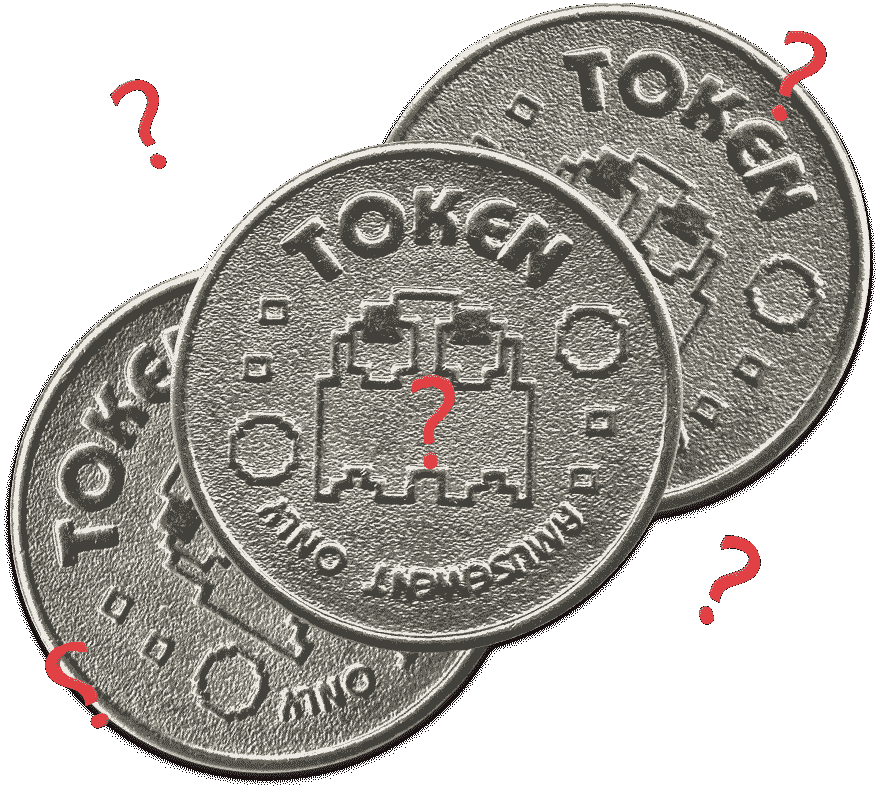
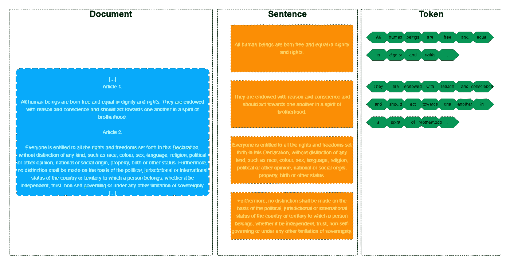
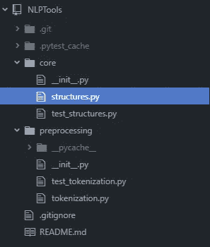
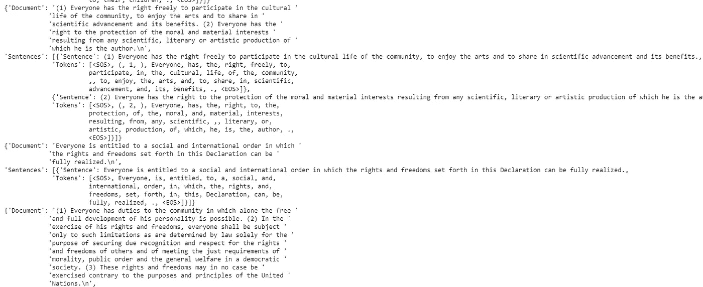

# 构建分词器和句子分析器

> 原文：<https://medium.com/analytics-vidhya/tokenization-building-a-tokenizer-and-a-sentencizer-c19a00393c19?source=collection_archive---------1----------------------->

## 理解给予 NLP 其结构的基础骨骼

因此，我们已经了解了预处理管道可以采取的许多不同步骤。如果您来自我以前的文章(或 NLP 类)，您可能对什么是**标记化**以及它的用途有一个大致的概念。本文的目的是帮助更好地阐明什么是记号化，它是如何工作的，最重要的是，实现一个记号化器。

如果您来自我的上一篇文章，您可能还想知道“裸字符串预处理”步骤发生了什么。答案是，我不会写一篇关于它的完整文章，因为它只包括几个在未来的实用文章中会重复多次的功能。

现在，回到标记化——这个预处理步骤意味着将非结构化的自然语言输入转换成更好的结构化形式(用计算机术语来说)。主要思想是将文本输入分解成包含有用的粒度数据的片段——这些片段被称为**标记**。

记号化本质上就是定义记号之间的边界是什么。更简单的情况是由空白分割组成。但情况并非总是如此——例如，日语和汉语使用不同类型的空格(这不是大多数“split”函数的默认设置)。此外，可能会出现空格以外的字符将一个单词分成两个标记的情况。最后，需要决定是否将特殊搭配，如二元结构和习语(如“踢了桶”或“下了倾盆大雨”)划分为单独的标记(这可能会“踢了桶”您的处理)。

另一个通常与标记化一起完成的步骤是“**造句**”。或将输入文本分割成句子。如果每个文档有多个句子，这是非常重要的。它之所以重要的主要原因与解析有关——你需要有句子(而不是整个文本)结构来定义词类、依存关系等。句子化比标记化稍微复杂一点，因为文本结构比句子结构更自由(我的意思是，不是从形态学的角度，而是从图形的角度)。

提醒一句，一些工具在标记和解析之后创建句子**——这种造句形式考虑的不是标点符号，而是一系列词法规则。这样，即使两个标点符号之间的单词包含不止一个句子，它们也会被捕获。这里有一个简单的例子:“约翰吃了鸡蛋，玛丽吃了土豆”会变成:[“约翰吃了鸡蛋”，“玛丽吃了土豆”]。**

正如之前提到和解释过的，我们将用 Python 和英语来完成这一切，英语是我和你之间的通用语言。我将尽量不使用任何特殊的第三方工具，但我将遵循 spaCy 如何进行标记化和句子化的类似结构。

聊够了——该动手了(又一个习语，我的键盘是干净的，先生/女士！).

## 虚拟方法

我们可以从一个不需要太多细节的简单方法开始。我们将首先使用 Python OOP 标准和一些良好的开发实践来创建我们的 DummySentencizer。

为此，我们将从一个 ***根*** 文件夹(带有我们项目的名称)和一个内部 ***预处理*** 文件夹开始组织我们的文件，这将是我们所有预处理模块的主目录，包括我们将创建的***tokenization . py***文件。(稍后我们将看到，标记化对于 NLP 是如此重要，我们将把它放在下面列出的*核心*文件夹中)。事情是这样的:

项目的文件组织。稍后将在完整解决方案中使用“core”文件夹。如果您不是 python 专家，那么 __init__。模块导入需要 py，所以现在只需用这个名称创建一个空白文件。

在我们的***token ization . py***中，我们创建了一个 DummySentencizer 类。我们将把所有的处理任务集中在构造函数本身，这意味着仅仅实例化这个类就会给我们一个句子列表。作为构造函数参数，我们将要求输入文本、用于拆分的字符和一个分隔符标记。

我们的 DummySentencizer 将在每个点、感叹号、问号或冒号处创建一个新句子。用户可以通过提供一个独特的字符列表来改变这一点，但是我们有一个默认值。

接下来，我们提供一个特殊的“标签”( *delimiter_token* )来划分我们的文本。它将被附加到标点符号之后，这样我们就可以保留它们，因为它们在很多情况下都是有用的。为此，我们创建了一个特殊的“标签”，它不应该出现在其他任何地方(任何字符都可能是文本特征，所以我们不能使用其中的一个)。这也可以由用户替换。

这里还有一些其他重要的细节:用户可访问的属性是 ***句子*** (这是一个列表，将保留*句子*之后的句子)和 ***原始文本*** (如果用户需要，将保留原始文本)。然后，我们有 ***_index*** ，这是一个私有属性，用于将对象变成一个 *iterable* (我们将允许用户在我们的 DummySentencizer 中为做一个*)。最后，我们调用***_ sentencize()***函数，你猜对了，它将在实例化时对我们的原始输入进行句子化！*

逻辑很简单:我们复制原始数据，迭代所有标点符号，并为它们添加特殊的拆分标记。最后，我们根据特殊的分割标记分割结果字符串，并清除尾随空格(这就是[x.strip() for x in …]所做的)。我们也避免空分割。请注意，沉默将被打破(这可以用正则表达式解决)。

最后，我们覆盖了几个神奇的方法来使我们的类可迭代:

我们的 DummySentencizer 准备好了！既然我们可以将输入字符串拆分成句子，那么我们可以转到 DummyTokenizer。它将非常类似于我们的句子分析器，只有很少的修改。同样在**中*标记化. py* 中**:

我们又一次有了输入文本( ***句子*** )、分隔符(***token _ boundaries***，默认为空格和连字符)、特殊的“tag”(***delimiter _ token***)。那么 ***标点符号*** *呢？*它被提供用来净化标点符号，允许它们被算作标记，并将其与连接的单词分开。我们使用 python 字符串模块标点符号属性(这就是为什么我们必须在开头添加导入)，但是您可以提供一个字符串或字符列表。接下来，我们的 _tokenize()方法。

很像我们的造句法，不是吗？这里的区别在于，在添加特殊的 split 标签之前，我们将标点符号与连接的字符串分开(因此替换为“+标点+”，在标点符号前后添加一个额外的空格)。

最后一部分是迭代器部分:

简单吧？

但是你可以想象，这种做法并不是很聪明。例如，如果我们输入一个十进制数(比如说， *19.3* ，它会被分解成*[‘19’，‘.’，' 3']* 。如果我们想要一个更完整的方法，我们必须更加努力！

顺便说一句，如果您想就此打住，请记住，所有这些代码都可以在本系列的 Github 项目中找到。[在这里访问](https://github.com/Sirsirious/NLPTools/tree/a2bda8fb7ad51a4d9ace6bc1eda9ea34ea23dec5)！

## 更稳健的方法

我们现在将创建一个更健壮的方法。从某种意义上说，它是健壮的，因为我们将拥有可以在本系列的后续步骤中重用的持久性结构。

在这种方法中，我们将创建三个类:文档、句子和令牌。此外，我们将创建两个新的静态函数，我们的**记号赋予器**和**句子赋予器**。这些函数在返回值的方式上与早期的不同:使用记号或句子的实例，而不是字符串列表。

它将如何工作？我们希望用户通过传递一个输入字符串来创建一个文档类，从而开始整个过程。这个过程启动了一个连锁反应:文档被建立，它调用句子分析器把文档分成句子；接下来，当创建一个句子时，它调用记号赋予器将句子划分成记号。在实例化文档时，用户实际上完成了整个句子化/标记化部分(类似于使用 spaCy 所做的，当用户执行 doc = nlp( *"String"* ))。

在这一部分，我将重点展示结构和主要变量。我将在创建这些结构的 commit done 中添加一个链接，这样您就可以掌握细节了(例如，我覆盖了一些神奇的方法，允许您通过文档/句子中的索引来调用句子/标记，并循环遍历文档/句子元素)。

这些类和静态函数是在 **core/structures.py** 中创建的。

这是我们工作的地方。不要担心测试文件或者 *__pycache__* ，我只是试图遵循一些好的实践来为你做一个好的记号赋予器！

文档、句子和令牌类

这里最大的细节是这样一个事实，一个句子是根据它在文档中的开始/结束位置从原始文档中提取出来的，对标记也是如此。这可以(稍加调整)使我们避免将句子和标记作为重复信息存储在内存中，这在庞大的语料库中是一个很好的优势(在列表中搜索索引是恒定的时间，所以如果您担心，这里不会有更多的计算复杂性)。

**文档:**我们的文档是通过输入一个原始字符串创建的。然后它调用**句子**。和虚拟方法一样，这里的 _index 用于迭代。

**句子:**句子是用它在文档中所处位置的“坐标”、在哪里搜索的原始文档字符串和一些空的句子引用创建的——这些在以后的时间里在句子之间导航可能是有用的。然后，它调用**令牌化**。

**token:** 对于 Token 来说，一个句子并没有太大的区别，但是事实上，Token 可以被创建为 SOS(表示句子的开始)或 EOS(表示句子的结束)。后者，我们还可以创建其他属性，如 lemma 或 POS。

但是，由于我们没有创建一个有自己字符串的句子/标记，如何进行比较，打印它们，等等？一种方法是创建一个“get()”方法，该方法返回一个字符串表示，并在类的神奇函数中使用它进行比较、打印等。下面是令牌类的示例:

Token 类的 get()方法和 magic 方法。

现在是最好的部分，推理结构本身:句子化和标记化函数。

但是在此之前，让我们先讨论一下 NLP 中的一个重要话题(我提到的“裸字符串预处理”步骤的一部分)——**正则表达式**。

正则表达式(Regex)是一种在字符串中匹配特定表达式的方法。正则表达式引擎使用一组特定的符号在字符串中查找并找到模式。这些在 NLP 中非常有用，因为它们可以帮助我们解决许多问题，而无需深入解析。因为它寻找模式，我们可以使用它们在文档中找到信息。想象一张购物优惠券—它包含产品、数量和价格(在许多情况下，在列表中)—我们可以寻找以下模式:

*   产品名称由单词字符[a-z，0–9]和空格组成。
*   数量通常是一个 n 位数字[0–9]，后跟一个特定的字符串['UN '，' LBS '，' OZ '，' KG']。
*   价格通常是一个十进制数字，前面有一个货币符号($，，)。

使用 **Regex** ，您可以通过查找如下模式找到价格:'[$| | ]\d*\。\d*' ( [见此处示例](https://regex101.com/r/WBweUl/1))。有许多不同的“记号”(或特殊的“标记”，如代表数字的\d)组成一个模式，Regex 本身就是一个非常复杂的主题。我推荐你在一个在线引擎中使用正则表达式，比如令人敬畏的正则表达式 101。

我不得不提到正则表达式，因为它是使我们的“健壮的”记号赋予器和句子赋予器区别于伪记号赋予器的主要资源。为此，我创建了两个模式系列:一个用于检测句子边界，另一个用于转义标点符号。它们以包变量的形式出现，并作为默认值传递给标记器和语句器。这些是:

关于将要使用的正则表达式的简要说明。

现在我们已经了解了我们的工具，让我们看看它们是如何协同工作的:

在 sentencize 函数中，用户需要传递的只是 raw_input_document 字符串。剩下的是可选的，用我们的参数和正则表达式列表填充。第一个重要的步骤是迭代我们所有的正则表达式来寻找句子边界，并在它们后面附加我们的分隔符标记，这样我们就可以在将文档分割成句子时保留标点符号。

这是使用一个特殊的 python 模块来完成的，这个模块是必须导入的 ***re*** (用于 **R** 正则 **E** xpression)。我们使用 ***sub*** 函数—它接受三个参数:1)要匹配的正则表达式；2)用什么来代替匹配(我们使用一个特殊的正则表达式标记' \g < 0 >'，它获取找到的第一个组并重复它——这样我们可以保持标点匹配，即使它是点或感叹号的重复)；3)待处理的字符串。最后一个标志只是为了避免 unicode 字符的问题。

接下来，我们对引用进行拆分和一些杂耍(我们用句子制作一个[链表](https://www.geeksforgeeks.org/data-structures/linked-list/)，填充那些 next_sentence 和 previous_sentence 属性)——这样，也许我们可以在以后的时间里从**上下文**中受益，但这都是可选的。

对于标记化，差别不大:

首先，我们尝试解决我过去遇到的一个问题——在我为硕士学位工作的一个语料库(从 PDF 中提取)中，有几个单词被连字符打断，以使“打印”更具人类可读性(但扼杀了计算机的“处理能力”)。有一个正则表达式替代连字符，连字符前面是[a-z]，后面是换行符[\n]。当然，这是可选的，可以在参数中禁用。

接下来，我们对标点符号做了类似的事情，但是我们没有添加拆分标记，而是添加了空格来将标点符号转换为标记。最后，对于分割，我们对那些由 regex 定义的特殊字符进行分割。我们有代币了！

当然，这里有更多的杂耍来制作令牌链表并添加 SOS 和 EOS 令牌(例如，这些在 Transformer 模型中可能很有用，但也可以变成可选的)。

很好，我们有一些强大的功能！让我们测试一下？

假设我们有一个名为“data.txt”的世界人权宣言文件，我们可以编写一个简单的脚本来进行测试(在这种情况下，我将每一段都视为一个文档，但这可以根据您的需要而有所不同——您甚至可以制作一个“parahraphizer”:P)。

结果是:

太好了！打印不是很漂亮，但很有效。

如果你想看看我们到目前为止做了什么，但是没有未来的添加(这样你就可以检查代码)，那么[转到这个提交](https://github.com/Sirsirious/NLPTools/tree/e697af0f42894bebadc4edd4f2118aabe220cf77)。

你可以在这个 GitHub 回购中拥有整个项目:【https://github.com/Sirsirious/NLPTools

如果你想知道更多关于如何在一些特定的工具中做记号化，而不是花时间写更多，看下面的帖子，它非常完整，给了你很多尝试的可能性。

 [## 如何开始使用 NLP - 6 独特的方法来执行标记化

### 概述想开始学习自然语言处理(NLP)吗？这是完美的第一步，学习如何…

www.analyticsvidhya.com](https://www.analyticsvidhya.com/blog/2019/07/how-get-started-nlp-6-unique-ways-perform-tokenization/) 

现在，如果你想知道 spaCy 是如何以一种更符合逻辑的方式处理符号化的，看看马志威的另一篇非常有趣的帖子:

 [## NLP 管道:单词标记化(第 1 部分)

### 为了处理机器学习领域中的文本相关问题，标记化是常用的预处理方法之一。在这个…

medium.com](/@makcedward/nlp-pipeline-word-tokenization-part-1-4b2b547e6a3) 

最后，您可以联系 spaCy docs 本身:

 [## 令牌化器空间 API 文档

### 将文本分割成单词、标点符号等。将文本分段，并使用发现的分段创建文档对象…

空间. io](https://spacy.io/api/tokenizer/) 

所以我们“完成”了标记化部分。接下来是词干！我们能从中得到多少乐趣？[让我们来看看](/@tfduque/building-a-stemmer-492e9a128e84)。