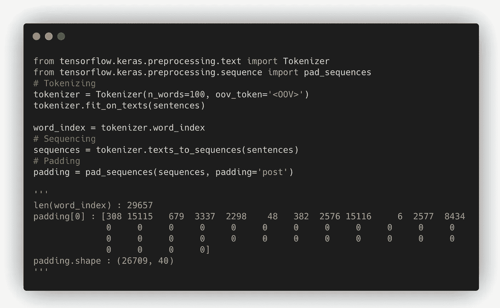

# 对讽刺数据集进行标记化、排序和填充

> 原文：<https://medium.com/analytics-vidhya/tokenizing-sequencing-and-padding-a-sarcasm-dataset-1ebc6f055985?source=collection_archive---------26----------------------->

在之前的文章中，我们已经讨论了句子的标记化、排序和填充…现在我们将在真实数据集上应用这些方法。

**讽刺检测数据集的新闻标题数据集—**

**每条记录包含三个属性:**

1.  如果记录是讽刺性的，则为 1，否则为 0

2.标题:新闻文章的标题

3.article_link:链接到原始新闻文章。有助于收集补充数据

数据集中的单个项目

点击此链接了解更多关于数据集… [Kaggle](https://www.kaggle.com/rmisra/news-headlines-dataset-for-sarcasm-detection/home)

现在我们将看到如何应用我们所学的方法

1.  加载数据集并创建 3 个列表来存储每个数据点的“article_link”、“headline”和“url”信息。

2.对句子列表进行标记、排序和填充。

word_index 的长度是 29657。我们可以看到一个大小为 40 的填充句子，即最大序列的长度为 40。

在接下来的文章中，我们将探索 BBC 新闻档案！