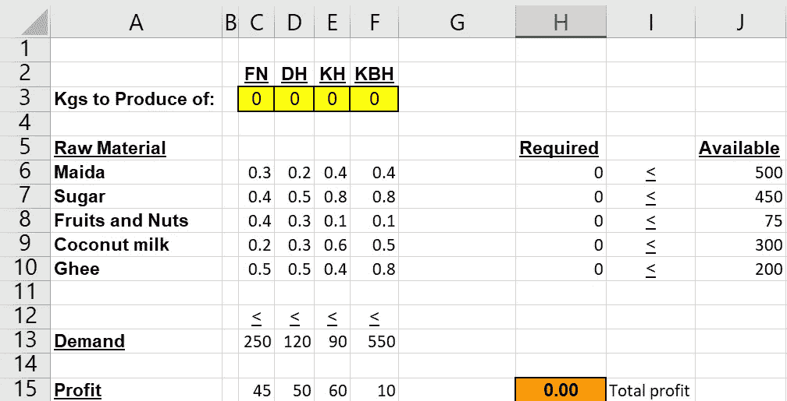
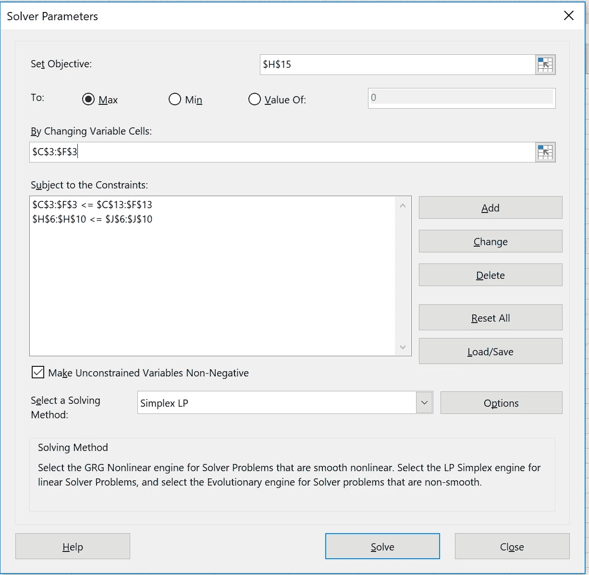
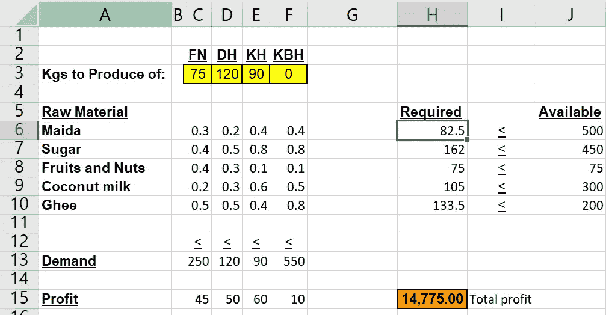
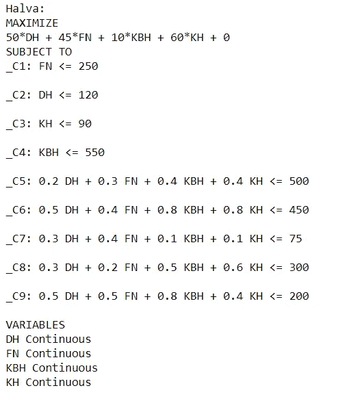
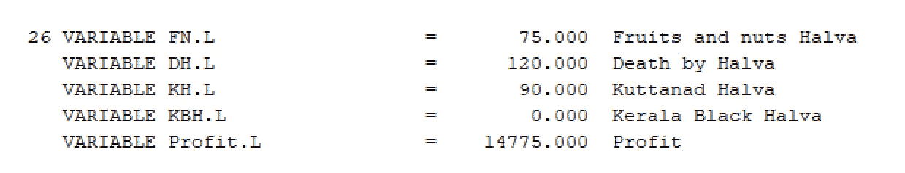

# 解决优化问题的工具选项

> 原文：<https://medium.com/analytics-vidhya/tools-options-for-solving-optimization-problems-16b6ebde5d72?source=collection_archive---------13----------------------->


当解决优化问题时，有许多工具/软件可供我们选择。我已经探索了其中的一些。我将尝试展示相同的内容供您阅读，希望我的探索能为您节省一些时间，并帮助您选择最适合您需求的内容。

我将尝试使用我选择的所有工具来解决一个基本的资源分配问题。这是我的问题——

Halva 商店需要找到每种 Halva 的最佳生产量，以实现利润最大化。以下是该店提供的四种 halvas

a.水果和坚果

b.哈尔瓦死亡(DH)

c.库塔纳德哈尔瓦(KH)

d.喀拉拉黑哈尔瓦(KBH)

5 种不同的主要成分用于制作这 4 种 Halva。下表列出了每千克 Halva 所需的配料数量以及每千克的相关利润。

哈尔瓦斯 FN、DH、KH 和 KBH 的需求量分别为 250 公斤、120 公斤、90 公斤和 550 公斤。原料麦达、糖、水果和坚果、椰奶和酥油的供应量分别为 500 公斤、450 公斤、75 公斤、300 公斤和 200 公斤。

让我们来看看，对于上述优化问题，我们的公式在纸面上会是什么样子

**决策变量**

FN =要生产的水果和坚果的数量

DH =由 Halva 产生的死亡数量

KH =将要生产的 Kuttanad Halva 的数量

KBH =要生产的喀拉拉黑哈尔瓦的数量

**约束**

需求约束

FN < = 250

DH <= 120

KH <= 90

KBH <= 550

Supply Constraints

Maida

0.2 DH + 0.3 FN + 0.4 KBH + 0.4 KH <= 500

Sugar

0.5 DH + 0.4 FN + 0.8 KBH + 0.8 KH <= 450

Fruit and Nut

0.3 DH + 0.4 FN + 0.1 KBH + 0.1 KH <= 75

Coconut Milk

0.3 DH + 0.2 FN + 0.5 KBH + 0.6 KH <= 300

Ghee

0.5 DH + 0.5 FN + 0.8 KBH + 0.4 KH <= 200

**目标函数**

最大化:50*DH + 45*FN + 10*KBH + 60*KH

让我们开始探索我们的工具。

**Excel**
大部分分析最广泛使用的工具是 Excel。Excel 有一个求解器插件，可以用来为我们解决优化问题。它有单纯形和整数编程选项。对于整数编程，excel 使用 GRG 非线性算法。对于这个问题，我们将使用单纯形算法，尽管在这种情况下单纯形和 GRG 将产生相同的结果。这是我们的输入在 excel 中的样子-



Halva 输入

决策变量用黄色突出显示，目标函数用橙色突出显示。每个 halva 的需求添加在底部。这些单元格将与黄色单元格进行比较，黄色单元格是我们的决策变量。每个 halva 所需的原材料在下面的单元格中列出。这些单元格将帮助我们确定每种原材料的使用总量。我们将通过将要生产的每种 halva 的数量乘以所需的原材料来确定所用原材料的总量。例如，Maida(单元格 H6)的需求公式为" =SUMPRODUCT($C$3:$F$3，C6:F6)"

然后，我们进入数据选项卡- >求解器
(如果您无法看到求解器，请从文件选项卡- >选项安装插件)
这是我们的求解器参数看起来的样子-



Halva 解算器参数

H15 是我们的利润，我们希望通过改变生产的 halva 数量(细胞 C3 到 F3)来最大化该利润，服从约束窗口中提到的需求和供应约束。当我们点击求解，这是我们得到的结果-



哈尔瓦输出

以上产量解释如下——
最优生产计划为 FN 75kg，DH 120kg，KH 90kg，KBH 0kg。按照上述最优方案，总利润为 14775 英镑。实现这一最佳生产计划所用的原料量为 82.5 公斤玉米、162 公斤糖、75 公斤水果和坚果、105 公斤椰奶和 133.5 公斤酥油。

**Python** Python 社区是当今最积极的开源社区之一。从统计分析到维护系统，我们都有 python 插件和包。不用说，他们也有一个优化包。

在 python 中，我们可以使用一个名为“PULP”的库。申报我们纸浆配方的代码如下-

```
my_lp_problem  = pulp.LpProblem("Halva",pulp.LpMaximize)
FN = pulp.LpVariable('FN', lowBound=0, cat='Continuous')
DH = pulp.LpVariable('DH', lowBound=0, cat='Continuous')
KH = pulp.LpVariable('KH', lowBound=0, cat='Continuous')
KBH = pulp.LpVariable('KBH', lowBound=0, cat='Continuous')
# Objective function
my_lp_problem += 45 * FN + 50 * DH + 60 * KH + 10 * KBH, "Profit"
# Constraints
my_lp_problem += FN<=250
my_lp_problem += DH<=120
my_lp_problem += KH<=90
my_lp_problem += KBH<=550
my_lp_problem += 0.3*FN+0.2*DH+0.4*KH+0.4*KBH<=500
my_lp_problem += 0.4*FN+0.5*DH+0.8*KH+0.8*KBH<=450
my_lp_problem += 0.4*FN+0.3*DH+0.1*KH+0.1*KBH<=75
my_lp_problem += 0.2*FN+0.3*DH+0.6*KH+0.5*KBH<=300
my_lp_problem += 0.5*FN+0.5*DH+0.4*KH+0.8*KBH<=200
my_lp_problem
```

上述代码的输出如下所示



纸浆配方声明

我们可以用下面的代码片段求解上面的公式，看看它是否有最优解

```
my_lp_problem.solve()
pulp.LpStatus[my_lp_problem.status]
```

一旦我们得到了“最优”输出，我们就可以使用下面的代码打印决策变量的值

```
for variable in my_lp_problem.variables():
    print("{} = {}".format(variable.name, variable.varValue))
```

我们将得到下面的输出-

```
DH = 120.0
FN = 75.0
KBH = 0.0
KH = 90.0
```

我们可以用下面的表格打印出我们的最佳利润和所需的原材料数量

```
print (pulp.value(my_lp_problem.objective))
FN =FN.varValue
DH =DH.varValue
KH =KH.varValue
KBH=KBH.varValue
M=0.3*FN+0.2*DH+0.4*KH+0.4*KBH
S=0.4*FN+0.5*DH+0.8*KH+0.8*KBH
F=0.4*FN+0.3*DH+0.1*KH+0.1*KBH
C=0.2*FN+0.3*DH+0.6*KH+0.5*KBH
G=0.5*FN+0.5*DH+0.4*KH+0.8*KBH
print('Raw material required:-')
print('Maida = '+str(M))
print('Sugar = '+str(S))
print('Fruits and Nuts = '+str(F))
print('Coconut Milk = '+str(C))
print('Ghee = '+str(G))
```

我们将得到下面的输出

```
14775.0
Raw material required:-
Maida = 82.5
Sugar = 162.0
Fruits and Nuts = 75.0
Coconut Milk = 105.0
Ghee = 133.5
```

可以理解的是，对上述结果的解释保持不变。

**CPLEX**

现在我们来看一个最强大的优化工具；IBM CPLEX。虽然在我们的小示例中，我们不会看到这些工具的计算速度有任何差异，但当我们有许多变量、约束和一些重型计算要做时，CPLEX 是首选工具，因为它具有强大的后端工程。

在 CPLEX 中，您可以将数据作为模型的一部分。mod 文件)或. dat 文件的一部分，在. dat 文件中，数据在多个数组中声明，代码逐个调用数组中的每个元素。我使用了第二种方法。

以上公式的代码看起来是这样的-

```
{string} Products = ...;{string} Components = ...;float Availability[Products][Components] = ...;float Profit[Products] = ...;float Stock[Components] = ...;float Demand[Products]=...;dvar float+ Production[Products];dvar float+ ProfitFrom[Products];maximizesum( p in Products )Profit[p] * Production[p];subject to {forall( c in Components )ct1:sum( p in Products )Availability[p][c] * Production[p] <= Stock[c];ct2:forall( p in Products )Production[p]<=Demand[p];ct3:forall( p in Products )ProfitFrom[p] <=Profit[p] * Production[p];ct4:forall( p in Products )ProfitFrom[p] >= Profit[p] * Production[p];}
```

输出如下所示-

```
Production = [75 120 90 0];ProfitFrom = [3375 6000 5400 0];
```

对上述产量的解释是-
最佳生产计划是生产 75 公斤 FN、120 公斤 DH、90 公斤 KH 和 0 公斤 KBH。相应的利润是 FN 的 3375 印度卢比，DH 的 6000 印度卢比，KH 的 5400 印度卢比和 KBH 的 0 印度卢比，这样我们就增加了 14775 印度卢比。

**GAMS**

**GAMS** 是优化行业的领先工具提供商之一，也是第一个将数学代数语言与传统编程概念相结合的软件系统，以便高效地描述和解决优化问题。

就像 CPLEX 一样，我们可以将数据作为单独公式的一部分。对于 GAMS，我采用了第一种方法。

这是上述公式的 GAMS 代码的样子

```
*Halva
Positive variables
         FN      Fruits and nuts Halva
         DH      Death by Halva
         KH      Kuttanad Halva
         KBH     Kerala Black Halva;
Variable
         Profit  Profit;
Equations obj, FHDemand, DHDemand, KHDemand, KBHDemand, MaidaSupply, SugarSupply, FruitNutSupply, CoconutMilkSupply, GheeSupply;obj.. Profit =E= 45*FN+50*DH+60*KH+10*KBH;
FHDemand.. FN =L= 250;
DHDemand.. DH =L= 120;
KHDemand.. KH =L= 90;
KBHDemand.. KBH =L= 550;
MaidaSupply.. 0.2*DH + 0.3*FN + 0.4*KBH + 0.4*KH =L= 500;
SugarSupply.. 0.5*DH + 0.4*FN + 0.8*KBH + 0.8*KH =L= 450;
FruitNutSupply.. 0.3*DH + 0.4*FN + 0.1*KBH + 0.1*KH =L= 75;
CoconutMilkSupply.. 0.3*DH + 0.2*FN + 0.5*KBH + 0.6*KH =L= 300;
GheeSupply.. 0.5*DH + 0.5*FN + 0.8*KBH + 0.4*KH =L= 200;Model HalvaLP /all/;Solve HalvaLP using LP maximizing Profit;Display FN.L,DH.L,KH.L,KBH.L,Profit.L;
```

虽然它产生了巨大的输出，但这是我们对输出感兴趣的一部分-



Halva 哈尔瓦

对上述输出的解释与对 excel 的解释相同。

希望这对你有帮助。:)