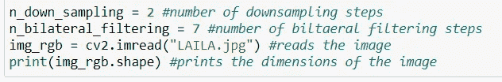
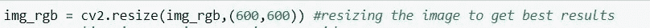
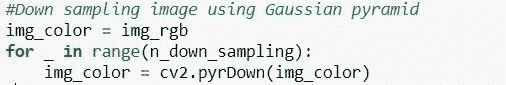
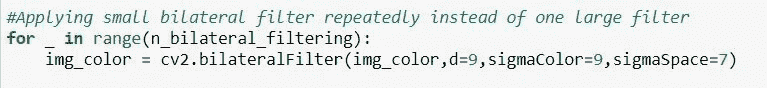
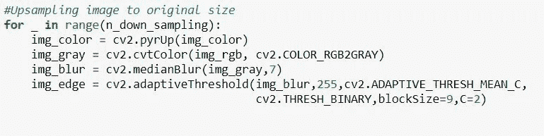
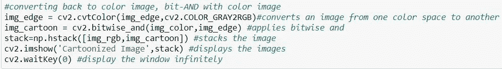
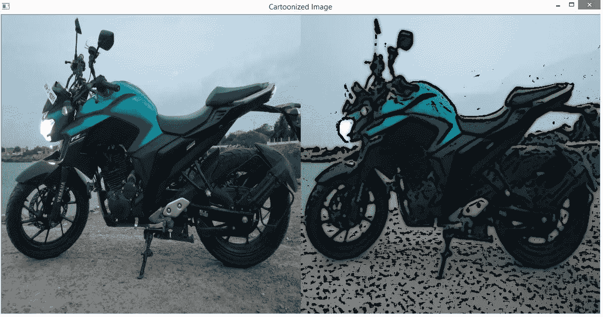
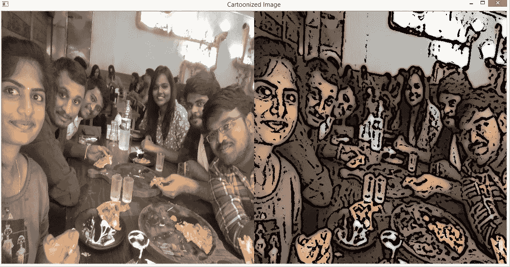
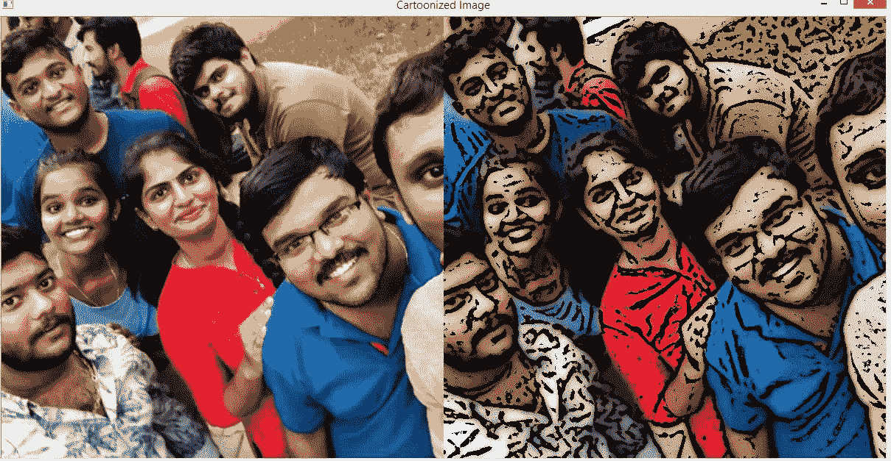
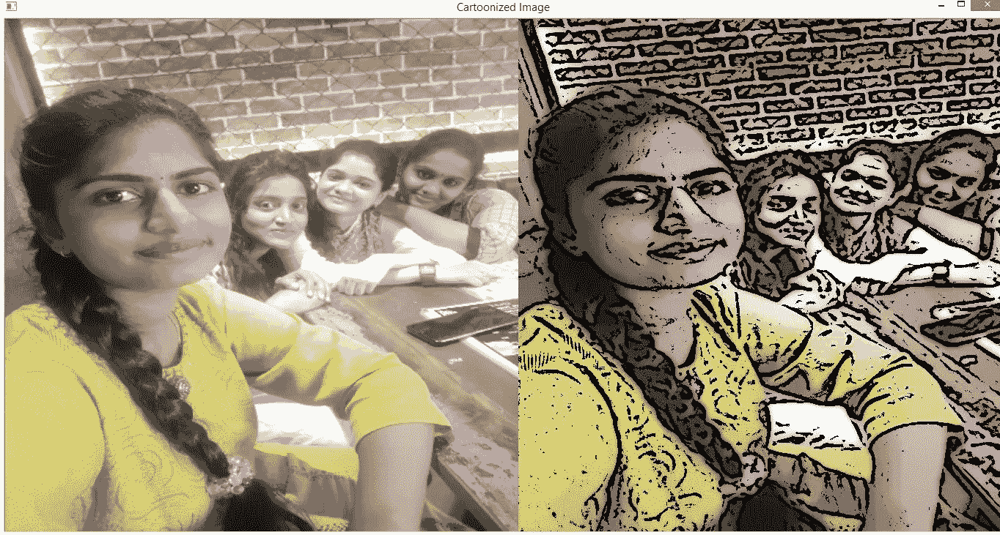

# 使用 OpenCV 和 NumPy Python 库动画(卡通化)图像

> 原文：<https://medium.com/analytics-vidhya/toonify-cartoonization-images-using-opencv-and-numpy-python-libraries-ef460a3a0a79?source=collection_archive---------7----------------------->

## 卡通化意味着对一个人、一辆车或一件事物的幽默的素描或绘画。有很多软件应用程序可以完成这一任务，但这需要更多的时间，而且价格也很高。为了节省时间和金钱，更简单的方法是使用 OpenCV 和 NumPy Python 库进行开发。它需要几行代码。很多人担心编码，在几个步骤上面临困难，就像他们不明白那个功能或步骤到底是什么意思。这个基本的卡通效果项目会让你清楚地理解每一个步骤。

在进行代码之前，我们需要了解 OpenCV 和 NumPy Python 库。

让我们从 OpenCV 库开始:

## OpenCV:

OpenCV 是由英特尔创建的图像处理库。它提供了简单而有用的方法来读取和写入图像。OpenCV 库允许您实时高效地运行计算机视觉算法。OpenCV 是一个流行的计算机视觉库，它有许多用于图像分析的内置工具。OpenCV 的主要优势之一是它高度优化，几乎可以在所有平台上使用。OpenCV 读取 BGR 格式的图像。

## NumPy:

Numpy 是 Python 中的科学计算库。它提供了一个高性能的多维数组对象和工具来处理这些数组。NumPy 数组类似于这个列表。我们可以通过首先导入一个列表来将它转换成一个 NumPy 数组。Numpy 数组包含相同类型的数据，我们可以使用属性“dtype”来获取数组元素的数据类型。

## 项目所需的内置函数:

—双边过滤

—边缘检测

## *双边过滤:*

双边滤波是一种在保持边缘的同时平滑图像的技术。它仅取决于两个参数，这两个参数指示要保留的特征的大小和对比度。图像平滑用于降低图像中边缘和细节的锐度。

## 边缘检测:

边缘检测是一种图像处理技术，通过确定图像亮度快速变化的位置来寻找图像中对象的边界或边缘。

到了编码部分，让我们从导入所需的资源开始:

导入库

接下来，让我们开始读取和显示图像的尺寸。规定的代码如下所示:

加载并打印图像的尺寸

—下采样用于减小图像的大小，双边滤波用于平滑图像。

— cv2.imread("image.jpg ")加载图像，shape 定义图像的尺寸。

要调整图像的大小，我们可以使用 cv2.resize()函数如下:

调整图像大小

— cv2.resize()有助于减少图像的像素数量。

下一步是使用高斯金字塔执行下采样:

使用高斯金字塔对图像进行下采样

—高斯金字塔用于对图像进行缩减像素采样。cv2.pyrDown()用于降低图像中的空间分辨率。通常用于缩小图像。

接下来，我们将重复应用小型双边过滤器，而不是一个大型过滤器，如下所示:

应用小型双边过滤器

— img_color 是输入图像

— d =过滤过程中使用的每个像素邻域的直径

— sigmaColor 过滤色彩空间中的 sigma。该值越大，像素邻域内混合在一起的颜色就越远

sigmaSpace 过滤坐标空间中的西格玛。如果该参数的值较大，那么只要较远的像素的颜色相似，它们就会相互影响。

注意:大滤波器非常慢，建议实时应用使用 d=5，需要滤除重噪声的离线应用使用 d=9。

接下来，我们需要执行如下的上采样:

上采样图像

—上采样用于增加空间分辨率，即增加图像的大小。它通常用于放大图像的小区域，并用于消除在相对较大的帧上显示低分辨率时出现的像素化效应。

— cvtColor()用于将图像从一种颜色空间转换到另一种颜色空间。这里，img_rgb 是必须改变其颜色空间的图像。

— medianBlur()取内核区域中所有像素的中值，中心元素替换为该中值。这里 img_gray 是输入图像，7 是内核大小。

— adaptiveThreshold()计算较小区域的阈值。这里 img_blur 是输入图像，255 是分配给像素的最大值。

— ADAPTIVE_THRESH_MEAN_C 表示邻域值减去常数值后的平均值。

— blockSize 决定邻域的大小。

— C 只是一个从平均值中减去的常数值。

最后一步是使用按位 and 将图像转换回彩色图像，以显示堆叠的图像:

— cv2.bitwise_and()用于执行图像遮罩。这里，img_color 是第一输入图像，img_edge 是第二输入图像。

— np.hstack()用于在一个窗口中显示多个图像。

— cv2.imshow()显示指定的图像。

— cv2.waitkey(0)将无限显示窗口，直到按下任何键。

指定代码的几个输出图像如下所示:

要了解更多关于 NumPy 和其他 Python 库的信息，可以参考以下链接:

 [## 使用 Pandas、NumPy 和 Matplotlib Python 库实现数据可视化

### 众所周知，数据可视化如何影响方方面面。从学校到行业，数据都是批量生成的…

medium.com](/towards-artificial-intelligence/data-visualization-using-pandas-numpy-and-matplotlib-python-libraries-768ad5357ec)