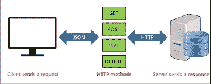
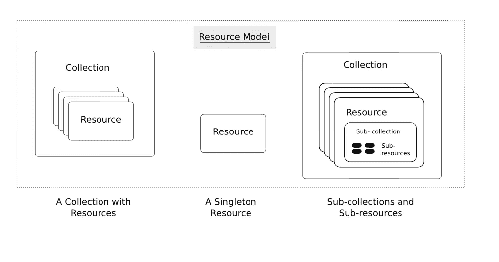

# 构建 REST APIs 的 10 大设计技巧

> 原文：<https://medium.com/analytics-vidhya/top-10-design-tips-for-building-rest-apis-38f39196dd4f?source=collection_archive---------29----------------------->

软件设计是功能性艺术。如今，一个普通人每天至少要处理 25 个这样的功能性数字艺术，它们都是以手机或网络应用的形式出现的。大多数数字软件都依赖于编写良好的 API，REST 是编写这种可伸缩 API 的首选和通用风格之一。

Roy Fielding 在他的博士论文[(https://www . ics . UCI . edu/~ Fielding/pubs/dissertation/REST _ arch _ style . htm)](https://www.ics.uci.edu/~fielding/pubs/dissertation/rest_arch_style.htm)中创造了一种架构风格的缩写 REST(representative State Transfer)来为可伸缩的架构制定指导方针，该架构通过使 web 程序员能够将大规模分布式网站的设计分解为更小的独立自足的资源来简化应用程序设计。

下面是一些重要的设计考虑因素，它们会使编写高效的 REST APIs 变得更加容易。

## **客户端-服务器架构**

REST 设计必须遵循**客户端-服务器**架构。客户端和服务器应该在关注点上没有重叠。服务器存储和/或处理信息，并以有效的方式使其对用户可用。客户端获取该信息并将其显示给用户和/或使用它来执行后续的信息请求。

只要接口保持不变，这种关注点的分离对于让客户机和服务器独立发展是很重要的。

## 无国籍

REST 应用程序是无状态的。这意味着客户机和服务器之间的通信总是包含执行请求所需的所有信息。会话状态应该完全保存在客户端。如果对资源的访问需要身份验证，那么客户端需要对每个请求进行身份验证。

## 可缓存性

REST 是可缓存的。客户端、服务器和任何中间组件都可以缓存资源以提高性能。

## **统一接口架构**

REST 在组件之间提供了**统一接口**。这意味着所有组件遵循相同的规则相互通信。这也使得理解系统的不同组件之间的交互变得更加容易。

## 分层系统设计

所有 REST 应用程序都应设计成一个**分层系统**。单个组件无法看到与其交互的直接层之外的内容。这意味着连接到一个中间组件(如代理)的客户机不知道除此之外还有什么。

这允许组件是独立的，因此容易替换或扩展。

## **按需编码**

REST 可选地按需提供**代码**。可以下载代码来扩展客户端功能。但是这是可选的，因为客户端可能无法下载或运行这段代码，所以 REST 组件不能依赖它的执行。

## HTTP 动词

REST 坚持使用协议提供的方法。这意味着虔诚地遵循 GET、POST、PUT 和 DELETE 的含义。

*   **POST** 总是用于创建资源(不管它是否被复制)
*   **PUT** 用于检查资源是否存在，然后更新，否则创建新的资源
*   **补丁**总是用于更新资源，并且只包含要更新的字段
*   **删除**不言自明

## 可理解的错误消息

由于 REST APIs 被设计为被视为资源，一旦定义和部署，它们将从一系列接口被访问。为了使 API 普遍适用，程序员需要确保错误消息有意义，并遵循可理解的标准，如使用 HTTP 错误代码。使用定制的错误消息需要定制的代码来处理这些消息，无论 REST API 在哪里被访问，都需要全面的文档。

## **HATEOAS** :作为应用状态引擎的超媒体

REST 世界中的一个新的首字母缩略词是 HATEOAS，即作为应用程序状态引擎的超媒体。这意味着服务器以超媒体的形式提供有关数据或操作的信息。REST 架构风格允许在响应内容中包含超媒体链接(URL ),这样客户机就可以通过遍历超媒体链接动态地导航到适当的资源。

## 可寻址资源。

REST API 中的每个端点都封装了一个资源，该资源是一个具有类型、数据和一组对其进行操作的标准 HTTP 方法的对象。资源可以与其他资源相关联，也可以独立存在。

Web 应用程序设计人员决定如何在每个端点级别处理资源集合。根据数据可访问性要求，端点可以封装一个集合或一个资源集合。REST 设计中的每个资源都应该在 REST APIs 中有一个 ID 或一个可访问的 URI

设计者的任务是以一种方式构建 REST 资源模型，使得每个端点有效地返回数据，同时保持跨端点的独立性。

## 以名词命名的 REST 端点

判断 REST 设计的一个快速指标是查看定义的 uri 的名称。资源设计的重点应该是资源与其子资源之间的关系。这些资源 URIs 是 RESTful 服务的端点。

例如，考虑一个应用程序，其中设备是顶级资源。配置是设备下的子资源。一套好的 URIs 应该是

`/devices`

`/devices/{id}`

请注意，这些 URIs 没有使用任何动词或操作。在 URIs 中不要包含任何动词，让 http 动词决定端点的行为，这一点非常重要。