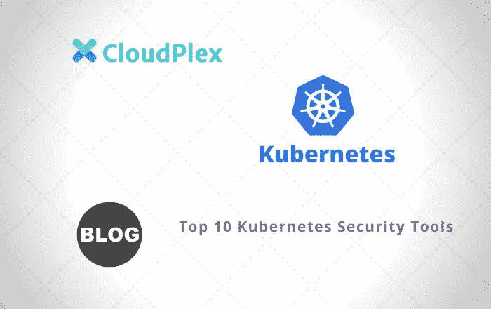

# 十大 Kubernetes 安全工具

> 原文：<https://medium.com/analytics-vidhya/top-10-kubernetes-security-tools-4d6140e9f2a5?source=collection_archive---------23----------------------->

Kubernetes 使通过容器化快速构建和部署应用程序环境变得比以往任何时候都更加简单。然而，伴随这种便利而来的是一个额外的问题——如何保护您所有的新容器和集装箱。您不能简单地应用一揽子规则，如“拒绝来自外部的访问”，因为有时您的一些应用程序/pod 可能需要这种外部访问。

还需要注意的是，Kubernetes 本质上既不安全也不不安全。它只是一个平台，而这个平台就像 Windows 或 Linux 或 MySql 数据库一样，只有你创造了它，它才是安全的。当然，每个系统都有缺陷，包括 Kubernetes 和 Docker，但在大多数情况下，关键的安全问题是由用户及其应用程序直接或间接造成的。

默认情况下，Kubernetes 为集群中的每个 pod 提供了自己的 IP 地址，并由此提供了非常基本的基于 IP 的安全性。然而，您的集群的几个方面仍然需要其他形式的安全性和锁定—网络策略、针对各个 pod 的访问策略、 [RBAC](https://cloudplex.io/pain-points/kubernetes-rbac/) 和名称空间访问策略，等等。值得注意的是，Kubernetes 像任何其他复杂的平台一样，几乎总是会有一个会危及其安全性的漏洞和错误的[列表](https://cve.mitre.org/cgi-bin/cvekey.cgi?keyword=kubernetes)。

听起来很吓人，对吧？别害怕。有许多很棒的、大多是开源的工具可以帮助您管理和跟踪这些与安全相关的问题。让我们来看看一些最有用和最常用的工具:

# 库贝长凳

来自互联网安全中心(CIS)的 Kube-bench 是一个优秀的工具，可以检查您的 Kubernetes 集群和节点是否符合 CIS 的基准。CIS 是一个半监管的行业团体，为编写安全代码提供指导和基准测试。
Kube-bench[在 Github 上有售。](https://github.com/aquasecurity/kube-bench)它非常有用，因为除了突出显示您的 Kubernetes 环境中不合规的地方，它还为您提供了解决方案和如何修复它们的建议。简而言之，Kube-bench 检查以确保用户授权和身份验证符合 CIS 指导原则，Kubernetes 部署遵循最小特权原则，并且数据在静态和传输过程中都是加密的。

# 库贝-亨特

Kube-hunter 是 Aqua Security 创建的一个实用程序，可以在 Github 上获得。它系统地搜索您的 Kubernetes 集群，搜寻安全威胁。它使管理员能够在攻击者利用漏洞之前查明漏洞。Kube-hunter 与 Kube-bench 配合使用时效果特别好，因为前者的发现和渗透测试功能增强了 Kube-bench 的 CIS 验证点。你可以把 Kube-hunter 看作是一个特定于 Kubernetes 的自动化渗透测试器。

# 印花布项目

[这个开源解决方案](https://github.com/aquasecurity/kube-bench)并不是 Kubernetes 特有的，它主要是一种网络技术，但可以用于安全目的。它实际上可以在各种平台上工作——Kubernetes、Docker enterprise、OpenStack，甚至裸机服务。Calico 的工作原理是为每个工作负载创建一个微防火墙，并将预定义的连接策略应用和呈现到每个微防火墙的规则中。
有趣的是，通过在工作负载级别创建防火墙，Calico 甚至可以在单个网络路由器和交换机上管理和路由特定于 pod 的网络流量。

# 伊斯迪奥

Istio 是一个开源服务网,允许你控制、连接和保护你在 Kubernetes 上的服务。它提供自动负载平衡、细粒度流量控制、自动度量、日志收集和集群内安全的服务到服务通信等功能。

# Kubeaudit

Kubeaudit 是一个只支持命令行的工具，用于根据预定义的安全检查来审计集群。这些检查包括:是否禁用了“root”帐户，系统是否允许权限提升，以及是否有任何 Kubernetes 图像具有不正确的标签。

# 神经向量

NeuVector 是一个与 Kubernetes 和 OpenShift 都兼容的安全套件。它的主要特点是全生命周期容器安全和容器级网络安全。NeuVector 提供插件来集成在主要云平台上创建的集群——AWS、Azure、Google Cloud，甚至 IBM 和阿里云。
neu vector 解决方案本身是一个容器，可轻松部署在每台主机上。然后，它创建一个容器防火墙、主机监控和安全、带有 CIS 基准的安全审计，以及一个漏洞扫描器。

# Audit2rbac

aud ti 2 RBC 是一个有用的工具，可以从您的 Kubernetes 审计日志中生成 [RBAC(基于角色的访问控制)](https://kubernetes.io/docs/reference/access-authn-authz/rbac/)策略。首先需要在 Kubernetes 集群中启用审计，然后调用 audit2rbac。然后，该工具将使用生成的 Kubernetes 审计日志来创建 RBAC 角色和所有受影响的对象。

# 照明

[illumination](https://github.com/inovex/illuminatio)是德国厂商 Inovex 推出的一款网络策略验证工具。网络策略验证主要是检查和确认集群防火墙的功能。启动时，Illuminatio 会在您的 Kubernetes 集群上运行一个针对所有网络策略的扫描，为每个策略构建快速测试用例，并执行这些用例来确定这些策略是否真的有效并按照定义工作。验证您的网络策略很重要，而不是简单地假设它们已经定义并实施。有时会声明网络策略但不强制实施，尤其是当群集中的某些节点尚未及时将其网络策略与群集定义的整体策略同步时。

# 扭锁

[Twistlock](https://www.paloaltonetworks.com/prisma/cloud/compute-security/container-security) 是 Kubernetes 的另一个全功能监控解决方案，尽管由于其云原生和支持 API 的特性，它也可以用于其他几个平台。它可以设置为持续监控 Kubernetes 应用程序中多达 200 个内置的 CIS 基准，以发现漏洞和合规性问题。这可以在基本主机/机器以及 Kubernetes 容器和映像上完成。注意 Twistlock 不是开源工具；它只对试用版或单个独立集群免费。

# Kubesec.io

Kubesec.io 是一款开源安全分析工具，它可以扫描您的 Kubernetes 资源(部署和 pod ),然后根据预定义的安全特性列表为其打分。它有助于验证资源配置并使其符合 Kubernetes 安全最佳实践。

# 结论

正如我们所看到的，Kubernetes 在安全性方面是一本“开放的书”——由您来配置和定义，在访问和安全性这两个经常相互竞争的需求之间进行平衡。上面列出的安全和监控工具非常有助于确保您的 Kubernetes 集群尽可能安全。但是也要记住，当您不想为您的 Kubernetes 设置担心设置和管理安全性时，另一个可行的替代方案是利用预配置的环境，例如 [Cloudplex](https://cloudplex.io/)

阿萨德·法伊兹

创始人、CEO
CloudPlex.io，Inc
asad @ cloud plex . io

*原载于 2020 年 7 月 28 日*[*https://cloud plex . io*](https://cloudplex.io/blog/top-10-kubernetes-tools/)*。*