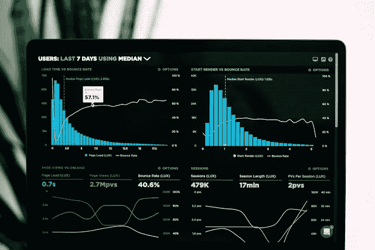

# 数据可视化中最有用的 10 个图表

> 原文：<https://medium.com/analytics-vidhya/top-10-most-useful-charts-in-data-visualization-a4c9365d03e4?source=collection_archive---------1----------------------->

# 分析师日常使用的最佳数据可视化图表列表。

图片来源:卢克·切瑟在 [Unsplash](https://www.blogger.com/blog/post/edit/4088105331609541123/7691312185759680709#) 上拍摄的照片

以可视格式呈现信息或数据是最有效的方式之一。研究人员已经证明，与原始数据或表格数据相比，人脑在处理视觉信息方面更容易接受。