# 数据科学家的十大播客

> 原文：<https://medium.com/analytics-vidhya/top-10-podcasts-for-data-scientists-1a1f5b649dc1?source=collection_archive---------15----------------------->

大家好 O/

我想写这篇文章有一段时间了。听播客帮助我成长为一名初级数据科学家。不管你是不是完全的初学者，播客都是一种有趣且吸引人的学习方式。你会发现在以下播客中讨论的主题将在数据科学、统计学和机器学习/人工智能领域打开你的视野，拓宽你的思维。以下是我亲自挑选的前 10 个，对所有从事数据科学家来说是最有信息量和最值得一听的。如果你到达终点，你会得到一些奖金。

尽情享受吧！

在 [Unsplash](https://unsplash.com?utm_source=medium&utm_medium=referral) 上由 [Mohammad Metri](https://unsplash.com/@mohammadmetri?utm_source=medium&utm_medium=referral) 拍摄的照片

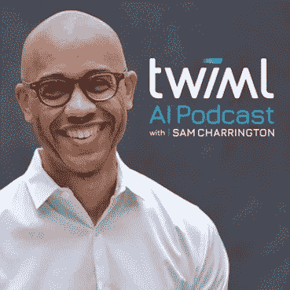

1.本周的机器学习和人工智能。[图片来源](https://www.stitcher.com/podcast/this-week-in-machine-learning-ai)

1.  [**本周机器学习和人工智能**](https://twimlai.com/)

每周一次的播客，有许多嘉宾发言，涵盖了各种各样的话题。我们的主持人萨姆·查林顿(Sam Charrington)用精彩的问题引导嘉宾深入主题，允许他们公开谈论自己的工作，这使本播客超越了许多其他播客。

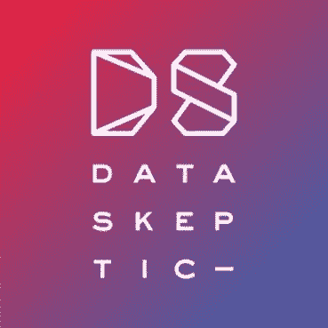

2.数据怀疑论者。[图像来源](https://dataskeptic.com/)

2. [**数据怀疑论者**](https://dataskeptic.com/)

Data 怀疑论者是一个专注于数据科学、机器学习和统计的播客。对于第一次接触基础数据科学统计原理的人来说，这是一次很好的聆听，但也提供了与嘉宾的详细讨论。

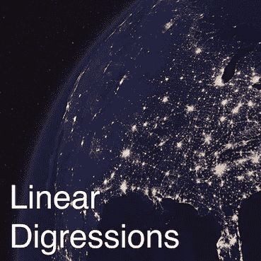

3.线性题外话。[图像来源](https://soundcloud.com/linear-digressions)

3. [**线性题外话**](http://lineardigressions.com/)

由 Katie Malone 和 Ben Jaff 共同主持，倾向于统计方面，当你跟随主持人职业道路的双重性时，这个播客提供了数据科学领域内部的独特视角。

4.数据框。[图像来源](https://www.stitcher.com/podcast/datacampdataframed/dataframed#/)

4. [**数据框**](https://www.datacamp.com/community/tags/dataframed)

这个播客来自 Datacamp，由独一无二的 Hugo Bowne-Anderson 主持。Hugo 的个性在这次有趣的聆听中熠熠生辉。播客充满活力，从不沉闷。虽然生产似乎已经停止，但听听目录还是有很多好处。

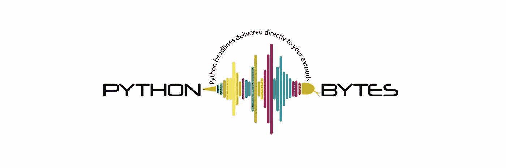

5.Python 字节。图像[来源](https://twitter.com/pythonbytes)

5. [**Python 字节播客**](https://pythonbytes.fm/)

主题是更少的数据科学和更多的 python 新闻和头条新闻。对于任何学习 Python 的人来说，这是一个非常有价值的播客。主题是多样的，涵盖了很好的深度，而且总是有很好的尝试 pythonic 式幽默。真正博学的主机和对改进代码非常有用的提示！Python Bytes 和 Talk Python To Me 播客是我获取 Python 相关内容的首选。

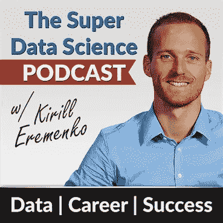

6.超级数据科学播客。[图像来源](https://tunein.com/podcasts/Business--Economics-Podcasts/SuperDataScience-p919559/)

6. [**超级数据科学播客**](https://www.superdatascience.com/podcast/)

由基里尔·叶列缅科主持，他也许不需要介绍。这个播客不仅涵盖数据科学，还经常有关于幸福和生活哲学概念和想法的片段。一个很好的聆听，因为有嘉宾发言的剧集和 youtube 上的剧集录像。

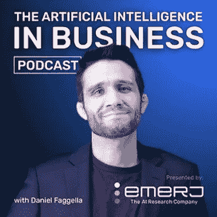

7.商业播客中的人工智能。[图像来源](https://www.stitcher.com/podcast/techemergence/tech-emergence-podcast)

7. [**AI 在商业播客**](https://emerj.com/artificial-intelligence-podcast/)

作为一名数据科学家，您的业务就是业务。这个播客提供了商业中人工智能的独特视角，可以成为数据科学家如何在商业中运作的一个有见地的窗口。

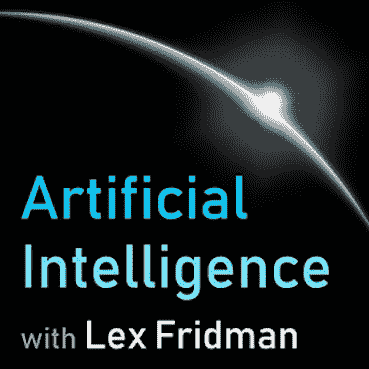

8.人工智能。[图像来源](https://lexfridman.com/ai/)

8. [**人工智能播客**](https://lexfridman.com/ai/)

只要看看莱克斯在他的播客上主持了谁…精彩的讨论往往会突破到哲学，哈哈。享受吧。

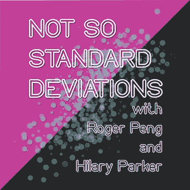

9.不是标准偏差。[图像来源](https://twitter.com/nssdeviations)

9. [**不那么标准差**](http://nssdeviations.com/)

罗杰·彭(Roger Peng)和希拉里·帕克(Hilary Parker)主持了一个很好的通用数据科学播客，肯定会感觉比其他播客轻松一些。对我来说，这是一天工作后最理想的聆听方式。

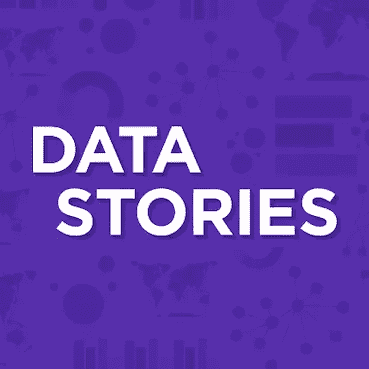

10.数据故事。[图像来源](https://datastori.es/)

10. [**数据故事**](https://datastori.es/archive/)

由 Enrico Bertini 和 Moritz Stefaner 主持，这个播客深入到数据科学的可视化方面。这是一个我不太熟悉，但却是独一无二的焦点话题。最近的内容包括 COVID 数据可视化和曲线 vis 变平。

# 奖金回合

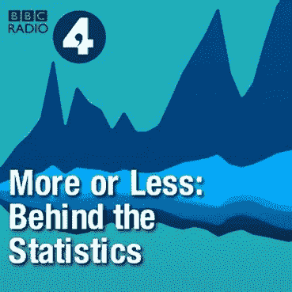

或多或少:统计数据的背后。[图像来源](https://www.stitcher.com/podcast/bbc/more-or-less-behind-the-stats-7209)

[**多多少少—统计数据后面**](https://www.bbc.co.uk/programmes/b006qshd)

这个基于英国的播客致力于剖析统计数据。这需要一个侦探的方法来发现有缺陷的统计索赔，往往涉及到该领域的专家。它之所以出现在奖励名单上，是因为它与统计数据严格相关，不属于数据科学领域。

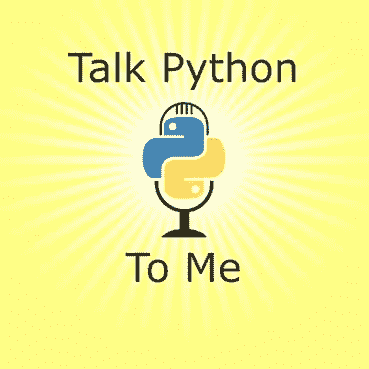

跟我说 Python。[图像来源](https://training.talkpython.fm/)

[**跟我说说 Python**](https://talkpython.fm/)

前面提到了，这是 Python 字节的老大哥播客。跟随这份关于 Python 的优秀目录，我受益匪浅。宿主有巨大的能量，如果它是巨蟒，你可以打赌他们已经覆盖了它。