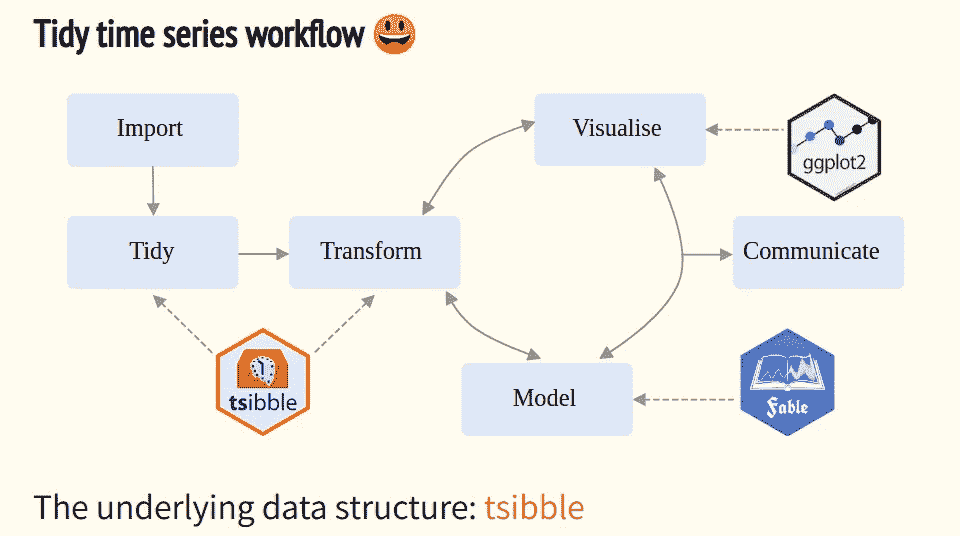

# Top 10 Presentations from rstudio::conf 2019 — The Best R Conference of the Year!

> 原文：<https://medium.com/analytics-vidhya/top-10-presentations-from-rstudio-conf-2019-the-best-r-conference-of-the-year-38057aff87c1?source=collection_archive---------0----------------------->

*A collection of my top picks from this year’s awesome conference on all things R!*


First, a confession — I’m a big fan of R! It has been a bit under the radar in recent years with the rise of Python, but it remains my go-to tool of choice for doing data science tasks.

Let me list down the key reasons why I’ve always appreciated R:

*   The packages (both pre-installed and external) have always helped me even when Google couldn’t give me a solution
*   Since it was my first coding language, the syntax and functions have become second nature to me
*   RStudio! Hands down the best IDE I have ever used (yes, I’ve used both Jupyter and JupyterLab)

I feel like a kid on Christmas eve whenever someone pulls out R code on the stage! So when I came to know about the rstudio::conf last year (which I covered [here](https://www.analyticsvidhya.com/blog/2018/02/highlights-rstudio-conference-2018/)), I felt giddy with joy. An entire conference on R!

This year’s conference, rstudio::conf 2019, promised an ever bigger and better show than 2018\. And in this article, I have penned down my thoughts on my favorite topics presented at rstudio::conf 2019.

I have provided as many resources as I could find regarding each presentation. These resources should help you get started with the topic or package on your own.

*Note: This year’s conference was held in Austin, Texas, from 15th to 18th January, 2019\. The first two days, 15th and 16th, were exclusively for workshops. This article focuses on the main conference talks which were held on 17th and 18th January.*

# Talks Covered in this Article

I have categorized the presentations according to the content.

**Tools and Frameworks in R**

*   Deploying a Machine Learning Model via the ‘Plumber” Package
*   pagedown: Create Beautiful PDFs with R Markdown and CSS

**Mastering Data Science Techniques in R**

*   Working with Categorical Data in R without Losing your Mind
*   Melt the Clock: Tidy Time Series Analysis
*   Visualizing Uncertainty with Hypothetical Outcome Plots (HOPs)

**Learning R**

*   Teaching Data Science with Puzzles

**R for Organizational Thinking**

*   Empowering a Data Team with RStudio Addins
*   Using Data Effectively: Beyond Art and Science
*   Data Science as a Team Sport

**Deep Learning**

*   Why TensorFlow Eager Execution Matters

**Bonus:** The Next Million R Users

*Click on each presentation title to access the slide deck for that talk.*

# Tools and Frameworks

# [Deploying a Machine Learning Model via the Plumber Package](https://github.com/sol-eng/plumber-model) — James Blair


我们对机器学习中的模型部署谈得不够。当我们学习进入这一行时，它在我们参加的黑客马拉松和竞赛中迷失了。但是如果不了解部署是如何工作的，我们的模型就不会问世。

因此，这是一个受欢迎的景象，看到一个关于这个主题的实际介绍。詹姆斯·布莱尔向我们介绍了“ [plumber](https://www.rplumber.io/) ”包，它将我们现有的 R 代码转换成其他服务可以连接的 web API。你应该查看一下这个包的[官方文档](https://www.rplumber.io/docs/)，浏览一些例子，了解如何在你的项目中使用它。

您可以通过以下代码从 CRAN 安装“水管工”软件包:

```
install.packages("plumber")
```

# [pagedown:用 R Markdown 和 CSS 创建漂亮的 pdf](https://slides.yihui.name/2019-rstudio-conf-pagedown.html)—谢一辉& Romain Lesur


降价是一件美好的事情。但是我个人一直在努力从中生成用户友好的 HTML 或 PDF 格式(也许我需要在这方面更加努力)。“pagedown”包看起来肯定会成为我的新朋友。

正如易慧和罗曼在他们的演讲中展示的那样，你可以使用“pagedown”生成漂亮的 PDF 文档，包括名片、简历、海报、信件、电子书、研究论文等等。你可以在上面链接的演示中查看这些例子。看起来真的很整洁！

你可以使用下面的命令从 [GitHub](https://github.com/rstudio/pagedown) 安装包(也可以通过 CRAN 获得):

```
remotes::install_github('rstudio/pagedown')
```

# 掌握 R 中的技术

# [在 R 中处理分类数据而不失去理智](http://www.amelia.mn/WranglingCats.pdf) — Amelia McNamara


当我开始研究 r 时，因子的概念迷惑了我。我在其他地方没有听说过这个概念。但是当我处理分类数据时，我开始看到它对我过去所做的那种分析的价值。

我承认这仍然是一个令人沮丧的特性。我在 Stackoverflow 和其他网站上发现的大多数分类数据问题都与因子的使用有关。当然，有变通的办法，但是你不能在不回复因素的情况下真正离开很长时间。

Amelia McNamara 的这个演示谈到了[“forcats”包](https://github.com/tidyverse/forcats)，这是一套解决带有因子的常见分类数据问题的工具。这个包是 tidyverse 的一部分，所以如果你已经安装了它，只需加载它:

```
library(forcats)
```

# [融化时钟:整理时间序列分析](https://slides.earo.me/rstudioconf19/#1) — Earo Wang

时间序列数据很乱。任何接触过这个话题的人都有过这样的经历。我曾经尝试过一些拙劣的技巧来使我的时间序列分析看起来不错，但是这花费了我太多的时间。

所以当我看到 Earo Wang 的演讲题目时，我就被吸引住了。Earo 谈到了使用两个软件包来统一时间序列工作流——T2 tsibble T3 和 T4 寓言 T5。这个演示基本上是用例子来谈论这两个包。请看下面两张幻灯片，它们展示了整齐的时间序列管道的价值:



是的，演示文稿本身包含了大量代码，因此您可以在自己的机器上复制它，并观看魔法的展现。

# [用假设结果图(HOPs)可视化不确定性](https://docs.google.com/presentation/d/1zMuBSADaxdFnosOPWJNA10DaxGEheW6gDxqEPYAuado/edit#slide=id.p1)——克劳斯·威尔基


可视化不确定性？对于大多数数据科学专业人士来说，这可能是令人生畏的。并把这种不确定性传达给非技术人员？那只是在上面增加了一层全新的难度！

假设结果图是让非专家理解数据中不确定性的非常有用的方法。你应该阅读 [UW 互动数据实验室关于这个概念的论文](http://idl.cs.washington.edu/papers/hops/)来理解 HOPs 是如何工作的。根据他们的研究，“啤酒花使观众能够使用计数和积分等心理过程来推断分布的属性”。

本演示介绍了几个关于如何在 r 中生成这些跳转的想法。值得花几分钟浏览一下他们的想法和代码。你也可以安装[‘ungeviz’包](https://github.com/wilkelab/ungeviz)，这是一套可视化不确定性的工具。

# 学习 R

# [用谜题教授数据科学](https://github.com/isteves/ds-puzzles) —艾琳·史蒂文斯


会议中我最喜欢的演讲之一。谜题在衡量一个人如何思考以及他/她是否有潜力在数据科学领域取得成功方面发挥着关键作用。我不能向所有有抱负的数据科学家推荐它们——实践、实践、实践。

这个演示及其背后的思想，集中在处理杂乱数据所需的编程技巧上。是的，我也很好奇。艾琳·斯蒂文斯女士展示了一系列她创造的“三月拼图”。这个名字来自流行的“tidyverse”包，因为这些谜题测试你在 r。

上面链接的 GitHub 库中有一个非常酷的三明治示例，你应该去看看。在艾琳的介绍中，它真的很受欢迎。

# r 代表组织思维

# [用 RStudio 插件增强数据团队的能力](https://haozhu233.github.io/rstudioconf2019_addin_talk/#1) —朱浩


你以前和 RStudio 里面的 addins 合作过吗？如果没有，你会发现这个演示是一个很好的开始。内容足够全面，涵盖以下主题:

*   如何创建加载项
*   演示者团队在其 RStudio 服务器上创建的加载项示例
*   关于外接程序如何大大提高团队生产力的用例

如果您以前曾经创建过 R 包，您会发现使用 addins 轻而易举。

# [有效利用数据:超越艺术和科学](https://www.slideshare.net/hilaryparker/rstudioconf2019l) —希拉里·帕克


我非常喜欢 StitchFix 如何围绕数据科学构建他们的整个商业战略。查看他们的[算法特定网页](https://algorithms-tour.stitchfix.com/)——这是任何数据科学专业人士的天堂之路。

StitchFix 的数据科学家 Hilary Parker 向我们介绍了他们组织的基本数据科学流程。最精彩的部分出现在第 25 张幻灯片上，她介绍了[“魔法”套装](https://cran.r-project.org/web/packages/magick/vignettes/intro.html)。**该软件包的目的是更新和改进 r 中的高质量图像处理。**

演示中还有一些设计建议、提示和技巧，可能对您有所帮助。

# [作为团队运动的数据科学](https://github.com/angelabassa/rstudioconf-2019/blob/master/RStudioConf%20ABassa%20-%20DSTeamSport%202019.pdf) —安吉拉·巴萨


数据科学项目经理和首席执行官——这是你的拿手好戏。当您的小型数据科学团队开始扩大时，您应该做些什么？一旦团队开始产生成功的结果，这种想法是不可避免的。是否应该将团队融入某个学科？

Angela Bassa 的精彩演示还涵盖了一些问题，如您应该聘请专家担任不同的角色，还是坚持聘用独角兽数据科学家？雇佣初级人才和少数高级人才的权衡是什么？数据科学团队的组成应该是什么样的？

这些不仅仅是理论问题。随着我们进入数据收集的黄金时代，领导层需要了解数据科学团队如何在整体方案中发挥作用。无法有效回答这些问题可能会对组织产生长期影响。

# 深度学习

# [为什么 TensorFlow 渴望执行至关重要](https://github.com/skeydan/rstudio_conf_2019_eager_execution) — Sigrid Keydana


众所周知，R 宇宙在采用深度学习框架方面速度很慢。这也是 Python 在业界领先的原因之一。但是最近大多数 DL 库已经进入了 R。

在这个演讲中，Sigrid Keydana 向我们概述了 Keras 框架。然后，演讲转移到主要话题——r 中的 TensorFlow 渴望执行。这在两个关键的深度学习概念上得到了证明:

*   生成对抗网络
*   可变自动编码器

演示文稿中有大量可用的代码。你应该通过 [**这篇文章**](https://www.analyticsvidhya.com/blog/2017/03/tensorflow-understanding-tensors-and-graphs/) 来了解 TensorFlow 是如何工作的，以防你以前没有使用过。

*注意:要查看完整的演示，你必须下载/复制我在上面链接的 GitHub 库。然后解压文件夹并点击。“html”文件。*

# 奖金:[下一个百万 R 用户](https://github.com/rstudio/learning-r-survey/blob/master/slides/Next-Million-R-Users.pdf) —卡尔·豪


虽然这不适合任何特定的类别，但我已经包括了这个演示来展示情节是多么有效。这个演讲是关于 RStudio 在全球范围内的调查，以了解他们的用户群并预测他们的下一个一百万用户。

他们问(并通过情节回答)的四个关键问题是:

*   谁学 R？
*   他们为什么学 R？
*   他们是如何学习 R 的？
*   是什么阻止他们学习 R？

# 结束注释

我爱 R 社区。在 R 用户中有一种奇妙的包容感，这是我在其他地方没有发现的。你有规律地使用(并且热爱)R 吗？在这篇文章下面的评论区给我打电话，让我们讨论一些想法！

这些是我在 rstudio::conf 2019 所有演讲中的首选。卡尔·布罗曼花时间将所有会谈的资源集中在一个地方。讲座分为三个平行的部分，你可以根据自己的兴趣进行挑选。

*原载于 2019 年 1 月 22 日*[*【www.analyticsvidhya.com*](https://www.analyticsvidhya.com/blog/2019/01/top-highlights-rstudioconf-2019-best-r-conference/)*。*