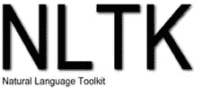

# 数据科学的 10 大 Python 库

> 原文：<https://medium.com/analytics-vidhya/top-10-python-libraries-for-data-science-78a6a2c3871f?source=collection_archive---------9----------------------->

> "我们的目标是将数据转化为信息，将信息转化为洞察力."
> 
> *卡莉·菲奥莉娜——惠普公司前首席执行官。*

每天都有这么多精彩的库被添加到 Python 生态系统中，但这些是我发现的最直观和最有用的(不出所料也是最受欢迎的)！

1.  [**【Numpy】**](https://numpy.org/)-数据处理

✔强大而复杂的数学运算

✔支持多维数组

2.**-数据处理**

****

**✔在微积分、线性代数和概率论等数学基础上发展了高级运算**

**✔支持信号处理**

**3. [**熊猫**](https://pandas.pydata.org/) **-** 数据清理&分析**

****

**✔容易操纵大量数据**

**✔多种内置数据类型，如系列、数据框**

**4.****-**数据可视化****

********

****✔图簇****

****✔高度可定制****

****5.**-**-**数据可视化******

********

****✔与熊猫紧密结合****

****✔的视觉效果很棒****

****✔处理复杂的数据****

****6.[**SciKit-学习**](https://scikit-learn.org/stable/) **-** 数据分析&挖掘****

********

****✔支持多种算法，如分类、聚类、降维等。****

****✔提供了大量的度量和视觉效果来确定监督和非监督模型的准确性****

****✔非常直观！****

****7.[**tensor flow**](https://www.tensorflow.org/)**——**深度学习****

********

****✔非常擅长物体识别和语音识别****

****✔模型对于大规模系统来说是非常有效的****

****✔奇妙的社区支持****

****8.[**Keras**](https://keras.io/)**-**深度学习****

********

****可以通过组合现有的神经网络模型来创建✔复杂模型****

****✔伟大的内置可视化****

****✔支持大多数神经网络模型，如卷积、嵌入、全连接、递归等。****

****9. [**PyTorch**](https://pytorch.org/) **-** 计算机视觉&自然语言处理****

********

****✔强大的张量计算****

****✔帮助创建动态计算图****

****10. [**NLTK**](https://www.nltk.org/) **-** 自然语言处理****

********

****✔支持符号和统计 NLP****

****✔提供词法分析****