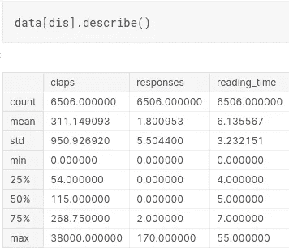
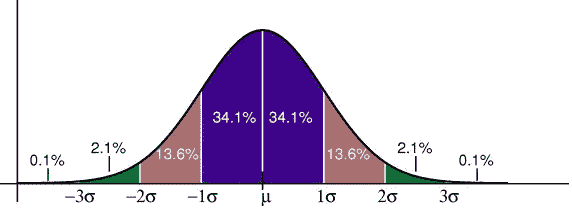

# 在任何数据科学面试之前要知道的 10 大统计概念！

> 原文：<https://medium.com/analytics-vidhya/top-10-statistics-concepts-to-know-prior-to-any-data-science-interview-fee24807beb6?source=collection_archive---------14----------------------->

[统计学](https://statisticsbyjim.com/glossary/statistics/)的领域是从数据中学习的科学。统计知识有助于你使用正确的方法收集数据，进行正确的分析，并有效地展示结果。[统计学](https://statisticsbyjim.com/glossary/statistics/)是我们如何在科学中做出发现、基于数据做出决策以及做出预测的关键过程。统计学能让你更深刻地理解一个主题。

**统计学**——众所周知，这是数据科学工作的首要先决条件。我个人在阅读线性回归时确实理解了一些概念，但如果有人随机问我关于标准差的问题，我肯定会感到困惑。

所以在这篇文章中，我试图建立一个友好的方法来回答一些常见的统计问题。我相信这将对许多人有益。

**常用术语:**

1.  平均
2.  方式
3.  中位数
4.  差异
5.  标准偏差
6.  z 分数
7.  相互关系
8.  正态分布
9.  经验法则
10.  抽样

我们也要记住 python 库**。描述()，**这将有助于我们在开始理解之前进行实践。

图 1

*我将在后续阅读中引用该图。*

# 我们开始吧！

## **1。平均值**

也称为中心趋势之一，平均值基本上是一个特征的所有数据点的平均值。

但是什么是**中心倾向呢？**

**集中趋势**用于表示我们数据分布的中间或中心位置。

**问题**:这些度量中的哪些是用来分析数据的集中趋势的？

a)平均值和正态分布。

b)平均值、中间值和众数。

c)模式、Alpha 和范围。

d)标准偏差、范围和平均值

e)中位数、范围和正态分布。

**解决方案(b)** :均值、中值、众数是帮助我们分析数据集中趋势的三个统计量。我们使用这些度量来找到数据的中心值，以汇总整个数据集。

**计算:**

资料来源:educba.com

## 2.**模式:**

它用于指示最频繁的数据点，也就是出现次数最多的数据点。

## 3.**中位数:**

它是数据的中间部分。如果数据按升序排列，那么出现在正中央的数据元素称为中位数。

> 如果观察次数(n):
> **为奇数:**中值为位置 **(n+1)/2**
> **为偶数**:中值为位置-**(n+1)/2 和 n/2** 的平均值

来源:谷歌。

## **4。差异:**

在统计学中，**变异**用于显示数据是如何分散或展开的。在统计学中有几种变量的度量方法，其中之一是:

a) **范围**:数据集中的最高值和最低值。Range 告诉我们数据中最低值和最高值之间的距离。
值的范围介于

> **5，10，7，9，60，80，15，35 的范围**为
> 
> **->80–5 = 75**
> 即最高值-最低值

b) **方差**:在概率论和**统计学**中，**方差**是随机变量与其均值的方差的平方的期望值。通俗地说，它衡量一组数字偏离平均值的程度。

样本变异公式

上式中，如果要计算总体方差，只需将(n-1)替换为 n. *就这么简单！*

> 请记住，我们使用的是数据点与其平均值的平方差之和，而不是数据点的绝对值

## **5。标准偏差**

用于表示**大小**，组成员与组平均值的差值。

形象。

> 记住，标准差是标准差的平方根。

它们告诉我们我们的数据集是多么的多样化。从图 1 中，我们可以看到我们的数据集对于不同的特性是多么的多样化。它被表示为“std”。

## 6.z 分数

也称为标准分数，是数据点与其平均值的标准偏差数。但从更专业的角度来说，这是一个衡量原始分数低于或高于总体均值多少标准差的指标。

*   z 值为 1 是平均值以上 1 [标准差](https://www.statisticshowto.com/probability-and-statistics/standard-deviation/)。
*   得分为 2 比平均值高 2 [标准差](https://www.statisticshowto.com/probability-and-statistics/standard-deviation/)。
*   -1.8 的分数是低于平均值的-1.8 [标准差](https://www.statisticshowto.com/probability-and-statistics/standard-deviation/) *。*

这里有一个 [YouTube 链接](https://www.youtube.com/watch?v=16vAjsnazEM&feature=emb_logo)，我发现它对于计算 Z 值非常有用。

## 7 .**。关联:**

它是两个定量变量之间线性关系的强度。

假设你有一个数据集，其中有你的身高和年龄，所以随着你年龄的增加，你的身高也会增加。这就是所谓的正相关。相关性可以取值为-1 和+1。

> “1”表示两个变量之间呈负相关。
> 
> “+1”倾向于证明两个变量之间的正相关

Python 提供了一个名为**的包。corr()** 执行相关操作。

## 8.正态分布

一个[正态分布](https://www.statisticshowto.com/probability-and-statistics/normal-distributions/)，有时被称为钟形曲线，是一个在许多情况下自然出现的分布。例如，钟形曲线出现在 IIT-JEE 考试和 GRE 考试中。钟形曲线是对称的。一半的数据将落在平均值的左边；一半会倒向右边。

**应用**:

*   人的高度。
*   测量误差。
*   血压。
*   考试的分数。
*   智商分数。
*   薪水。

当绘制在图形上时，它们倾向于表示一个钟形曲线图形，如下所示。

钟形曲线图。

**正态分布的性质:**

*   平均值、众数和中位数都是相等的。
*   曲线在中心对称(即围绕平均值μ)。
*   正好一半的值在中心的左边，正好一半的值在右边。
*   曲线下的总面积为 1。

## 9.经验法则

经验法则表明，对于正态分布，几乎所有的数据都落在平均值的三个标准差之内。

> 经验法则告诉你，你的数据有多少百分比落在平均值的某个标准偏差内:
> **68%的数据**落在平均值的一个标准偏差内**。
> **95%的数据**落在平均值**的两个标准偏差**内。
> **99.7%的数据**落在平均值**的**三个标准差内。**

正态分布的标准差。

## 10。采样

抽样是一个过程，通过这个过程，我们从一个更大的数据集中选取一个子集，专门用来对其进行分析。它有助于我们对人口进行统计推断。

重要性:当我们的数据有 1000 万条记录时，计算机要花很长时间才能处理完。因此，我们不是对整个数据集进行采样，而是对子集进行采样。

> **样本 vs 总体:** 样本是数据集的子集。
> 群体代表整个数据集。

希望这篇文章能为你的数据科学面试提供价值。欢迎通过 LinkedIn 与我联系，获取更多关于机器学习/数据科学/统计学的文章。

 [## Lokesh Rathi -自由职业技术作家-分析 Vidhya | LinkedIn

### “让我担心的是谷歌”，-埃隆·马斯克。当像他这种地位的人说出这样的话时，人们必须知道…

www.linkedin.com](https://www.linkedin.com/in/lokeshrathi/)