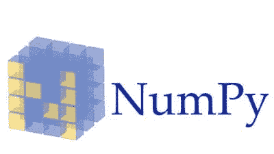
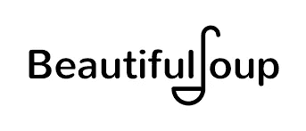
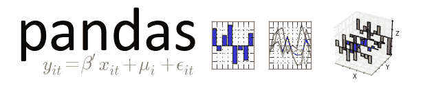
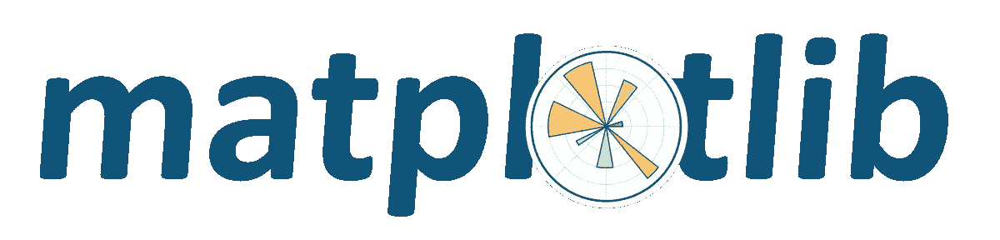
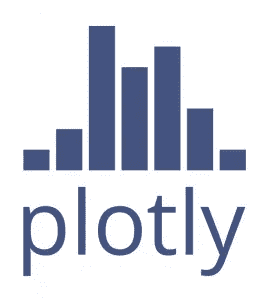
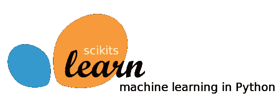
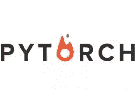

# 每个数据科学爱好者都必须知道的 13 个 Python 库！(和他们的资源)

> 原文：<https://medium.com/analytics-vidhya/top-13-python-libraries-every-data-science-aspirant-must-know-and-their-resources-3b00fb84fbbf?source=collection_archive---------15----------------------->

# 概观

*   了解 python 中排名前 13 的数据科学库
*   找到合适的资源来了解这些用于数据科学的 python 库
*   这份清单绝非详尽无遗。欢迎在评论中添加更多内容。

# 介绍

毫无疑问，Python 已经迅速成为数据科学领域的热门语言，并且是招聘人员在数据科学家的技能组合中首先搜索的东西之一。它在全球数据科学调查中一直名列前茅，其广泛的受欢迎程度只会不断增加！

但是是什么让 Python 对数据科学家如此特别呢？

就像我们的人体由完成多项任务的多个器官和保持它们运行的心脏组成，同样，核心 Python 为我们提供了简单易编码、面向对象的高级语言(心脏)。我们为每种类型的工作提供不同的库，如数学、数据挖掘、数据探索和可视化(器官)。

最重要的是，我们掌握每一个库，这些是核心库，不会在一夜之间改变。 [***AI 和 ML BlackBelt+***](https://courses.analyticsvidhya.com/bundles/certified-ai-ml-blackbelt-plus?utm_source=top-python-libraries-ram&utm_medium=medium&utm_campaign=blackbelt)***程序帮助你掌握这 13 个库以及更多。不仅如此，您还将获得个性化的导师课程，在课程中，您的专家导师将根据您的职业需求定制学习路径。***

让我们了解一下您必须掌握的 13 个顶级数据科学 Python 库！

# 目录

1.  NumPy
2.  SciPy
3.  美丽的声音
4.  Scrapy
5.  熊猫
6.  Matplotlib
7.  Plotly
8.  海生的
9.  Scikit 学习
10.  PyCaret
11.  张量流
12.  克拉斯
13.  PyTorch

# 数学:

# NumPy

NumPy 是科学计算中最重要的 Python 库之一，它被大量用于机器学习和深度学习的应用。NumPy 代表数字 PYthon。机器学习算法计算复杂，需要多维数组运算。NumPy 提供了对大型多维数组对象和各种工具的支持。

我们将要进一步讨论的各种其他库，如 Pandas、Matplotlib 和 Scikit-learn 都是建立在这个令人惊叹的库之上的！我正好有合适的资源让你开始使用 NumPy -

*   [数据科学初学者的终极数字教程](https://www.analyticsvidhya.com/blog/2020/04/the-ultimate-numpy-tutorial-for-data-science-beginners/?utm_source=top-python-libraries-ram&utm_medium=blog&utm_campaign=blackbelt)

# SciPy

SciPy(科学 Python)是数学、科学和工程领域大量使用的科学计算的首选库。相当于使用 Matlab 这种付费工具。

正如文档中所说的那样，SciPy“提供了许多用户友好且高效的数值例程，例如用于数值积分和优化的例程。”它建立在 NumPy 库的基础上。

# 数据挖掘-

# 美丽的声音

*BeautifulSoup* 是 Python 中一个令人惊叹的解析库，支持从 HTML 和 XML 文档中抓取网页。

*BeautifulSoup* 自动检测编码，优雅地处理包含特殊字符的 HTML 文档。我们可以浏览一个解析过的文档，找到我们需要的东西，这使得从网页中提取数据变得快速而轻松。在这篇文章中，我们将详细学习如何使用 Beautiful Soup 构建 web 抓取器。

# Scrapy

Scrapy 是一个用于大规模网页抓取的 [Python](http://courses.analyticsvidhya.com/courses/introduction-to-data-science-2?utm_source=top-python-libraries-ram&utm_medium=blog&utm_campaign=blackbelt) 框架。它为您提供了高效地从网站中 ***提取*** 数据所需的所有工具， ***根据您的需要处理*** ，并以您喜欢的 ***结构*** 和格式存储它们。

在这篇文章中，你可以学到所有关于网络抓取和数据挖掘的知识

*   [Python 中 Web 抓取的实践介绍:为您的数据科学项目提取数据的强大方法](https://www.analyticsvidhya.com/blog/2019/10/web-scraping-hands-on-introduction-python/?utm_source=top-python-libraries-ram&utm_medium=blog&utm_campaign=blackbelt)

# 数据探索和可视化-

# 熊猫

从数据探索到可视化再到分析— Pandas 是您必须掌握的全能库！

Pandas 是一个开源包。它帮助你用 Python 语言进行数据分析和数据操作。此外，它为我们提供了快速灵活的数据结构，使我们能够轻松处理关系数据和结构化数据。

如果你刚接触熊猫，你一定要看看这个免费课程-

*   [熊猫进行数据分析](https://courses.analyticsvidhya.com/courses/pandas-for-data-analysis-in-python?utm_source=top-python-libraries-ram&utm_medium=blog&utm_campaign=blackbelt)

# Matplotlib

Matplotlib 是 Python 生态系统中最流行的探索和数据可视化库。其他所有的库都是建立在这个库之上的。

Matplotlib 提供了从直方图到散点图的无尽图表和定制，matplotlib 提供了一系列颜色、主题、调色板和其他选项来定制和个性化我们的绘图。无论你是为机器学习项目进行数据探索还是为利益相关者构建报告，matplotlib 都是有用的，它肯定是最方便的库！

如果你刚刚开始，我有一些资源可以帮助你开始-

*   [用 Python 进行数据可视化和探索的 matplotlib 初学者指南](https://www.analyticsvidhya.com/blog/2020/02/beginner-guide-matplotlib-data-visualization-exploration-python/?utm_source=top-python-libraries-ram&utm_medium=blog&utm_campaign=blackbelt)
*   [掌握 Python 数据可视化的 10 个 matplotlib 技巧](https://www.analyticsvidhya.com/blog/2020/05/10-matplotlib-tricks-data-visualization-python/?utm_source=top-python-libraries-ram&utm_medium=blog&utm_campaign=blackbelt)

# Plotly

Plotly 是一个免费的开源数据可视化库。我个人很喜欢这个图书馆，因为它的高质量，出版就绪和交互式图表。箱线图、热图、气泡图是可用图表类型的几个例子。

它是基于可视化库 D3.js、HTML 和 CSS 构建的最好的数据可视化工具之一。它是使用 Python 和 Django 框架创建的。因此，如果你正在寻找探索数据或只是想给你的利益相关者留下深刻印象，plotly 是一个不错的选择！

这里有一个很好的动手资源可以开始使用-

*   [如何在 R 和 Python 中使用 Plotly 创建漂亮的交互式数据可视化？](https://www.analyticsvidhya.com/blog/2017/01/beginners-guide-to-create-beautiful-interactive-data-visualizations-using-plotly-in-r-and-python/?utm_source=top-python-libraries-ram&utm_medium=blog&utm_campaign=blackbelt)

# 海生的

Seaborn 是一个基于 Matplotlib 的免费开源数据可视化库。许多数据科学家更喜欢 seaborn，而不是 matplotlib，因为它的高级接口可以绘制有吸引力的信息丰富的统计图形。

Seaborn 提供了简单的功能，帮助您专注于情节，现在如何绘制它。Seaborn 是你必须掌握的基本库。这里有一个很好的资源来检查-

*   [通过这本全面的 Python Seaborn 指南成为数据可视化专家](https://www.analyticsvidhya.com/blog/2019/09/comprehensive-data-visualization-guide-seaborn-python/?utm_source=top-python-libraries-ram&utm_medium=blog&utm_campaign=blackbelt)

# 机器学习

# Scikit 学习

Sklearn 是数据科学图书馆的瑞士军刀。它是你的数据科学军械库中不可或缺的工具，将开辟一条通过看似无懈可击的障碍的道路。简单来说就是用于制作机器学习模型。

Scikit-learn 可能是 Python 中最有用的机器学习库。sklearn 库包含了很多用于机器学习和统计建模的高效工具，包括分类、回归、聚类和降维。

Sklearn 是你需要掌握的必修 Python 库。分析 Vidhya 提供了一个免费的课程。你可以查看这里的资源-

*   [机器学习的 scikit-learn (sklearn)入门](https://courses.analyticsvidhya.com/bundles/certified-ai-ml-blackbelt-plus?utm_source=top-python-libraries-ram&utm_medium=medium&utm_campaign=blackbelt)
*   [7 个令人印象深刻的 sci kit——了解数据科学的诀窍、技巧和诀窍](https://www.analyticsvidhya.com/blog/2020/05/7-scikit-learn-hacks-tips-tricks/?utm_source=top-python-libraries-ram&utm_medium=blog&utm_campaign=blackbelt)

# PyCaret

厌倦了编写无尽的代码来构建您的机器学习模型吗？PyCaret 是正确的选择！

PyCaret 是 Python 中的一个开源机器学习库，可以帮助您从数据准备到模型部署。作为一个低代码库，它可以帮助你节省大量的时间。

这是一个易于使用的机器学习库，可以帮助您执行端到端的机器学习实验，无论是输入缺失值、编码分类数据、特征工程、超参数调整还是构建集成模型。这里有一个很好的资源让你从头开始学习 PyCaret

*   [时间不多了？使用 PyCaret 在几秒钟内构建您的机器学习模型](https://www.analyticsvidhya.com/blog/2020/05/pycaret-machine-learning-model-seconds/?utm_source=top-python-libraries-ram&utm_medium=blog&utm_campaign=blackbelt)

# 张量流

多年来，由谷歌大脑团队开发的 TensorFlow 已经获得了牵引力，并成为机器学习和深度学习方面的前沿库。TensorFlow 在 2015 年首次公开发布。当时，开发人员和研究人员不断发展的深度学习领域被 Caffe 和 Theano 占据。在很短的时间内，TensorFlow 成为最受欢迎的深度学习库。

TensorFlow 是一个端到端的机器学习库，包括工具、库和资源，供研究社区推动深度学习的最新发展，并供业内开发人员构建 ML & DL 支持的应用程序。

要成为面向未来的数据科学家，这里有一些学习 TensorFlow 的资源

*   [深度学习指南:使用 Python 中的 TensorFlow 实现神经网络简介](https://www.analyticsvidhya.com/blog/2016/10/an-introduction-to-implementing-neural-networks-using-tensorflow/?utm_source=top-python-libraries-ram&utm_medium=blog&utm_campaign=blackbelt)
*   [深度学习 TensorFlow 2.0 教程](https://www.analyticsvidhya.com/blog/2020/03/tensorflow-2-tutorial-deep-learning/?utm_source=top-python-libraries-ram&utm_medium=blog&utm_campaign=blackbelt)

# 克拉斯

Keras 是用 Python 编写的深度学习 API，运行在机器学习平台 [TensorFlow](https://github.com/tensorflow/tensorflow) 之上。它的开发重点是支持快速实验。根据 Keras 的说法——“*能够尽快从想法到结果是做好研究的关键。*”

Keras 比 TensorFlow 更受欢迎，因为它有更好的“用户体验”，Keras 是用 Python 开发的，因此更容易被 Python 开发者理解。它使用简单，但却是一个非常强大的库。

一些参考资料-

*   [教程:使用 Keras 优化神经网络(带图像识别案例研究)](https://www.analyticsvidhya.com/blog/2016/10/tutorial-optimizing-neural-networks-using-keras-with-image-recognition-case-study/?utm_source=top-python-libraries-ram&utm_medium=blog&utm_campaign=blackbelt)

# PyTorch

许多数据科学爱好者欢呼 Pytorch 是最好的深度学习框架(这是以后的辩论)。它通过使深度学习模型的计算速度更快、成本更低，帮助加速了对深度学习模型的研究。

PyTorch 是一个基于 Python 的库，提供了最大的灵活性和速度。Pytorch 的一些特征如下-

*   生产就绪
*   分布式培训
*   强健的生态系统
*   云支持

激动吗？你可以在这里了解更多关于 PyTorch 的信息-

*   [深度学习 PyTorch 简介【免费课程】](https://courses.analyticsvidhya.com/courses/introduction-to-pytorch-for-deeplearning?utm_source=top-python-libraries-ram&utm_medium=blog&utm_campaign=blackbelt)
*   [py torch 初学者友好指南以及它如何从头开始工作](https://www.analyticsvidhya.com/blog/2019/09/introduction-to-pytorch-from-scratch/?utm_source=top-python-libraries-ram&utm_medium=blog&utm_campaign=blackbelt)

# 结束注释

对于所有的机器学习任务来说，Python 是一种强大而简单的语言。

在本文中，我们讨论了 13 个将帮助您实现数据科学目标的库，如数学、数据挖掘、数据探索、可视化和机器学习。

从数据科学的角度来看，作为 [Analytics Vidhya 的 AI 和 ML Blackbelt+程序](https://courses.analyticsvidhya.com/bundles/certified-ai-ml-blackbelt-plus?utm_source=top-python-libraries-ram&utm_medium=medium&utm_campaign=blackbelt)的一部分，你可以掌握所有这些库以及更多。你将获得一个个性化的导师课程，在这个课程中，你的学习道路将根据你的职业需求而定制。

你还有其他我们应该知道的最喜欢的图书馆吗？请在评论中告诉我！

*原载于 2020 年 11 月 18 日*[*【https://www.analyticsvidhya.com】*](https://www.analyticsvidhya.com/blog/2020/11/top-13-python-libraries-every-data-science-aspirant-must-know-and-their-resources/)*。*