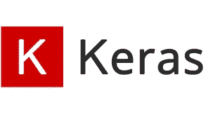
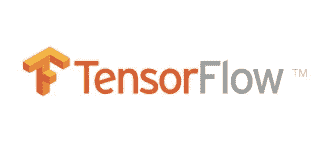

# 你必须知道的 15 大数据科学 Python 库

> 原文：<https://medium.com/analytics-vidhya/top-15-python-libraries-for-data-science-you-must-know-c183ee92d614?source=collection_archive---------22----------------------->

## Python 是数据科学家和软件开发人员用于数据科学任务的最流行的高级编程语言之一。它可用于预测结果、自动化任务、简化流程并提供商业智能见解。

> 在 Python 中处理数据是可能的，但是有相当多的开源库使得 Python 数据任务变得非常非常容易。
> 
> 你肯定听说过其中的一些，但是有没有一个有用的库是你**可能错过的**？**这里列出了用于数据科学任务的最重要的 Python 库，涵盖了数据挖掘、处理、建模和可视化等领域。**

# 数据挖掘:-

## 1.Scrapy

Scrapy 是最流行的 Python 数据科学库之一。 **Scrapy** 帮助**构建爬行程序(蜘蛛机器人)，这些程序可以从网络上检索结构化数据——例如**、**、**URL 或联系信息。**这是一个很好的收集数据的工具，例如 Python 机器学习模型。**

D **开发者用它从 API**中收集数据。这个成熟的框架在设计界面时遵循了**不要重复自己的原则**。因此，工具**激发用户编写通用代码**，这些代码可以**重用来构建和扩展大型爬虫。**

## 2.美丽的声音

**美汤**是一个 Python 库，用于**从 HTML 和 XML 文件中提取数据。它与您喜欢的解析器一起工作，提供导航、搜索和修改解析树的惯用方式。它通常可以节省程序员数小时或数天的工作。**

Beautiful soup 是**一个神奇的网页抓取和数据抓取库**。如果你想**收集在某些网站**上**可获得的数据，但不是通过适当的 CSV 或 API，BeautifulSoup 可以帮助你收集数据，并将其整理成你需要的格式。**

# 数据处理和建模:-

**3。NumPy**

**NumPy** ，代表**数值 Python** ，是一个由**多维数组对象和处理这些数组的例程集合**组成的库。使用 **NumPy** 、**可以对数组**执行数学和逻辑运算。

N **umPy** 库提供了许多**在 Python 中对 N 数组和矩阵执行操作的便利特性。**它有助于**处理存储**相同数据类型**的值**的数组，并使对数组执行**数学运算(及其矢量化)更加容易。NumPy 数组类型上数学运算的向量化提高了性能并加快了执行时间。**

**4。SciPy**

**SciPy** 是一个**免费开源的** Python 库，用于**科学计算和技术计算。** **SciPy** 包含用于**优化、线性代数、统计、积分、插值、特殊函数、FFT、信号和图像处理的模块。**

ciPy 的主要功能建立在 NumPy 的基础上，所以它的数组使用这个库。SciPy 非常适合各种科学编程项目(科学、数学和工程)。

**5。熊猫**

**Pandas** 是一个**开源**， **BSD 许可库**，为 Python 编程语言提供**高性能、易于使用的数据结构和数据分析工具**

P **和 as** 是为了**帮助开发人员和数据分析师**直观地使用**“带标签的”和“相关的”数据而创建的库。**它基于两个主要的数据结构:**“Series”(一维的，像一个条目列表)和“Data Frames”(二维的，像一个多列的表)。** **Pandas** 允许**将数据结构转换为 DataFrame 对象，处理缺失数据，从 DataFrame 中添加/删除列，输入缺失文件，用直方图或绘图框绘制数据。**它是**数据争论、处理、可视化和分析的必备工具。**

**6。Keras**

**Keras** 是一个用 Python 编写的**开源神经网络库。** **Keras** 是一个用于构建神经网络(NN)和建模的**大型库。**

Kera 非常**简单易用**并且提供了**良好的可扩展性**。该库利用其他包、(**the no**或 **TensorFlow** )的**优势作为其**后端**。在 **Keras 中，**你**组装*层*来建造*模型*。**一个模型(通常)是一个**图层图。**这是一个**高级 API** 来**构建和训练模型**，其中**包括对 TensorFlow 特定功能的一流支持，**如[**热切执行**](https://www.tensorflow.org/guide/eager) ，`[tf.data](https://www.tensorflow.org/api_docs/python/tf/data)` **流水线**，以及 [**估算器**](https://www.tensorflow.org/guide/estimator) 。`[tf.keras](https://www.tensorflow.org/api_docs/python/tf/keras)`使 **TensorFlow 更易于使用，而不会牺牲灵活性和性能。****

**7。张量流**

**TensorFlow** 是一个非常**流行的 Python 框架**，用于**机器学习和深度学习，**由一对研究人员和科学家在 **Google Brain 开发。**

这是执行对象识别、语音识别和许多其他任务的最佳工具。它有助于**处理需要处理多个数据集的人工神经网络**。该库包括各种层规定 **(tflearn、tf-slim、skflow** )，这甚至使**更加功能化**。

## 8.sci kit-学习

**Scikit** - **学**(原**Scikit**)。 **learn** 又称 sklearn)是一个免费的软件机器 **learning** 库，用于 **Python 编程语言**。这是基于 Python 的数据科学项目的行业标准**。** **Scikits** 是 SciPy 堆栈中为特定功能创建的一组**包，例如**图像处理**。 **Scikit-learn** 使用 **SciPy** 的**数学运算**向*最常见的机器学习算法展示一个 ***简洁接口*。*****

D **ata 科学家**用它来**处理标准的机器学习和数据挖掘任务，如聚类、回归、模型选择、维数减少和分类。**另一个优势？它配有 ***质量文档*** 和 ***提供高性能。***

**9。PyTorch**

**PyTorch** 是一个基于 **Torch 库**的**开源机器学习库**，用于**计算机视觉和自然语言处理等应用，**主要由**脸书的 AI 研究实验室开发。**

P **yTorch 是一个非常适合想要轻松执行深度学习任务的数据科学家的框架。**该工具允许使用 **GPU 加速**执行**张量计算**。它也用于其他任务——例如，c **创建动态计算图形**和**自动计算梯度。** **PyTorch** 基于 **Torch** ，是一个用 C 实现的**开源深度学习库，包装器在 Lua。**

**10。XGBoost**

**XGBoost** 是一个**开源软件库**，为 **C++、Java、Python、R、Julia、Perl、Scala 提供了一个**渐变增强框架**。**

M ostly **机器学习科学家**利用这个库**在梯度推进框架下实现机器学习算法。** **XGBoost** 就是**便携、灵活、高效**。它提供了**并行树提升**，帮助**团队解决许多数据科学问题**。另一个优势是**开发者可以在 Hadoop、SGE 和 MPI 等主流分布式环境中运行相同的代码。**

# 数据可视化:-

**11。Matplotlib**

**Matplotlib** 是 **Python 编程语言**及其**数值数学扩展 NumPy 的**绘图库**。**这是一个**标准数据科学库**，**帮助生成数据可视化，如二维图表和图形** ( **直方图**，**散点图**，**非笛卡尔坐标图形** ) **。** **Matplotlib** 是那些在数据科学项目中**有用的绘图库之一**如它提供了一个**面向对象的 API，用于将绘图嵌入到应用程序中。**

M **atplotlib** 应该是**感谢**Python 能与**科学工具**如 **MatLab** 或 **Mathematica** 竞争。然而，开发人员需要**编写比通常**更多的代码，同时使用这个库来**生成高级可视化。请注意，流行的绘图库可以与 Matplotlib** 无缝协作。

**12。Seaborn**

**Seaborn** 是一个 **Python 可视化库**构建在 M **atplotlib 之上。**它提供了一个**高级接口，用于绘制有吸引力的统计图形。**

S **eaborn** 是基于 **Matplotlib** 和**作为一个有用的 Python 机器学习工具**用于**可视化统计模型——热图和其他类型的可视化，总结数据和描绘整体分布**。当使用这个库时，您**可以从大量的可视化图库中获益(包括时间序列、联合图和小提琴图等复杂图库)。**

**13。阴谋地**

**Plotly** 是一家**技术计算公司，总部位于魁北克蒙特利尔，**开发在线数据分析和可视化工具。

P **lotly** 是一个基于网络的数据可视化工具，它为**提供了许多有用的现成图形**——你可以在 [**Plot.ly**](http://Plot.ly website) **网站**上找到它们。库**在交互式网络应用**中工作得非常好。它的创造者正忙着用新的图形和特性来扩展库，以支持多链接视图、动画和相声集成。

**14。散景**

**散景**是一个用于**现代网络浏览器的交互式可视化**库**。**

B **okeh** 库是一个**伟大的工具**，用于**使用 **JavaScript 小部件**在浏览器**内创建交互式和可扩展的可视化。 **Bokeh** 是**完全独立于 Matplotlib。** It **注重交互性，通过现代浏览器** — **呈现可视化，类似于数据驱动文档(**[**D3 . js**](http://d3.js)**)**。它提供了一组**图形**、**交互能力**(比如**链接情节或添加 JavaScript 小部件**)和**样式。**

**15。ggplot Python**

**ggplot Python** 是基于**Rs**gg plot**和 [***图形***](http://www.amazon.com/Grammar-Graphics-Statistics-Computing/dp/0387245448) 语法的 **Python** 的绘图系统。它是为了使**看起来专业，用最少的代码快速绘图而构建的。****

G gplot Python 使用很少的代码来制作专业的可视化图形。制作图是非常重复的:画这条线，加上这些彩色点，然后加上这些，等等。`[ggplot](http://ggplot)`不是一遍又一遍地重复使用相同的代码，而是使用一个高级但非常有表现力的 API 来实现它们。结果是花在创建图表上的时间更少，而花在解释图表含义上的时间更多。

**快乐的 Python 乡亲们！！**

**下次见！！**