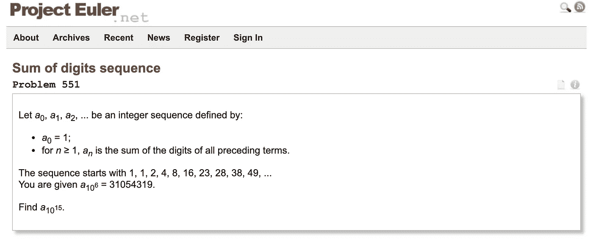

# 提高编码技能的 15 大网站

> 原文：<https://medium.com/analytics-vidhya/top-15-websites-to-improve-your-coding-skills-ca51729451e7?source=collection_archive---------17----------------------->

如今，不管是哪个行业，人们都认为每个人都应该对基本编程概念有合理的理解，并掌握至少一种“流行”语言(例如 Python、R、Javascript、SQL、Swift)。如果你在贸易、金融、汽车、医疗保健或营销领域工作，拥有编码“优势”肯定会给你加分，甚至可能让你成为关键人物。

有无数的流行网站可以帮助你建立一个基础，并提供一系列语言/问题的暴露，但这些是我个人最喜欢的:

## 1.代码学院【免费增值】

*   约 4500 万名学习者
*   **语言** : HTML/CSS、Python、Javascript、Java、SQL、Bash/Shell、Ruby、C++、R、C#、PHP、Go、Swift、Kotlin

✔美丽的 IDE

✔多种语言

✔真实世界项目

✔付费认证

✘专业会员可能会相当贵(32 英镑/月或 192 英镑/年)

## 2. [**Coursera**](https://www.coursera.org/courses?query=programming) **【自由】**

*   约 3000 万学习者
*   **语言**:所有

✔获得全球领先大学的认证

✔付费认证(雇主认可)

✔完全免费，除了评分作业和课程证书

✘未提供 IDE

## 3. [Udemy](https://www.udemy.com/) 【已付】

*   约 1000 万名学习者
*   **语言**:所有

✔专家精彩课程

✔经常打折，所以很实惠

✔评级系统让你找到“最好”的课程

✘未提供 IDE

✘的课程质量差异很大

## 4. [YouTube](https://www.youtube.com/results?search_query=python+programming) 【免费】

*   大约 20 亿用户
*   **语言**:所有

✔有一个庞大的视频图书馆

✘未提供 IDE

✘的课程质量差异很大

## 5.黑客排名【免费】

*   大约 1100 万开发人员
*   **语言** : C，Clojure，C++，C#，Erlang，Haskell，Java，Javascript，Lua，Objective-C，Perl，PHP，Python，R，Ruby，Scala，Swift

✔美丽的 IDE

✘:不是一大堆理论——只是一大堆练习

## 6.[主厨](https://www.codechef.com/)【免费】

*   大约 100 万开发人员
*   语言:所有

✔即时 IDE

✘没有多少学习内容

✘不是最好的用户界面

## 7. [Leetcode](https://leetcode.com/) 【免费增值】

*   大约 100 万开发人员
*   **语言**:所有

✔功能和美学用户界面

✔优秀的软件开发面试/角色准备(就难度而言)

✘高级订阅可能有点贵(每月 35 美元或每年 159 美元)

## 8.代码字节【免费增值】

*   大约 20 万开发人员
*   **语言**:所有

✔可爱且高效的用户界面

✔优秀的软件开发面试/角色准备(就难度而言)

✘高级订阅可能有点贵(29 美元/14 天，79 美元/90 天，35 美元/月或 150 美元/年)

## 9.[可汗学院](https://www.khanacademy.org/computing/computer-programming)【免费】

*   大约 1 亿用户
*   语言:HTML，CSS，Javascript

✔优质内容

✔混合了视频和挑战

✔令人惊叹的“视频编辑器”,其中代码由讲师键入，但您可以暂停视频，并在当前状态下播放代码

✘语言数量有限

## 10.[升级技能](https://upskillcourses.com/)【免费增值】

*   大约 7 万名开发人员
*   **语言** : HTML，CSS，Javascript

✔非常翔实的视频

✔有很多免费内容

✘没有很多实际的挑战/问题

✘未提供 IDE

✘语言数量有限

## 11. [W3Schools](https://www.w3schools.com/) 【免费】

*   大概有 1 亿多开发者(实际上每个人都在某个时候使用过这个网站)
*   **语言** : HTML，CSS，Bootstrap，Javascript，Ajax，Python，Java，C++，C#，SQL，PHP，ASP，Raspberry Pi，XML

✔看似简单的网站，却有清晰的理论

✔简单而有用的 IDE

✔大量的练习和测验

✔付费认证

✘没有结构化视频和作业等“课程式”的感觉。

## 12.[项目欧拉](https://projecteuler.net/)【免费】

*   大约 100 万开发人员
*   语言:不适用

✔易于使用

✔难度范围大

✘古老的视觉效果

✘主要是数学挑战/问题

## 13.黑客地球[免费]

*   大约 400 万用户
*   语言:所有

✔用户友好界面

✔优秀的软件开发面试/角色准备(就难度而言)

✔组织黑客马拉松

✘有限理论/教学内容

## 14.[练习](https://exercism.io/)【免费】

*   大约 33 万名开发人员
*   语言:所有

✔巨大的语言支持

✘没有交互式 IDE

✘有限理论/教学内容

## 15.免费代码营

*   大约 20 万开发人员
*   语言:HTML，CSS，JavaScript，Bootstrap，Python，MongoDB，Git，Java，Ruby，PHP，Elixir，Go

✔固体认证

✔物质财富

✔功能用户界面

✘有限理论/教学内容

希望这个列表对你有用，并祝你在编码之旅中一切顺利！

请评论你最喜欢的编程语言和网站！:)