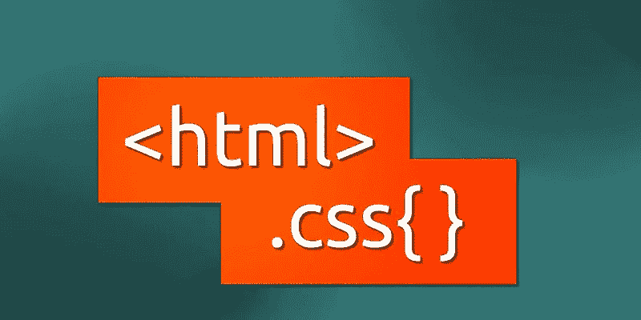

# 2020 年 HTML 和 CSS 的 20 大面试问题

> 原文：<https://medium.com/analytics-vidhya/top-20-interview-questions-from-html-and-css-in-2020-72b9cbda9fcc?source=collection_archive---------22----------------------->



来自谷歌图片

你可以把这 20 个问题放进你的篮子里。所以我们从 HTML 问题开始。

# **HTML**

**1。HTML5 增加了一些 HTML 中没有的新特性？**

**Ans: DOCTYPE 声明** : <！文档类型 html >

**section** : Section 标签定义了文档中的一个节，如页眉、页脚或文档的其他节。它用于定义文档的结构。 **<节></节>**

**header:** Header 标签定义了文档的头部分。标题部分总是贴在文档的顶部。 **<表头></表头>**

**页脚:**页脚标签定义了文档的页脚部分。页脚部分总是贴在文档的底部。 **<页脚></页脚>**

**文章:**文章标签定义了文档中独立的一段内容。 **<条></条>**

**main:**main 标签定义了文档中包含文档主要内容的主要部分。 **<主></主>**

**figcaption:** Figcaption 标签定义了图像或视频等媒体元素的标题。 **<图标题></图标题>**

**2。** **什么是锚定标签，点击后如何打开新标签页？**

**Ans:**HTML 中的 Anchor 标签用于链接两个版块或两个不同的网页或网站模板。要在单击时在浏览器的新标签页中打开一个 URL，我们需要添加一个等于 **_blank 的目标属性。**

```
**Example:**<a href=”#” target=”_blank”></a>
```

**3。HTML 中的行内元素和块级元素是什么？**

Ans: **块元素**是占据全部可用宽度的块，并且总是从新行开始。它将自己伸展到可用容器宽度的最大可用宽度。块级元素有`<div>, <p>, , <section>`等等。

**行内元素**是那些只占据容器所需宽度的元素。

**例如，**取页面上的文字流向。当文本行占据了容器的整个宽度时，它会自动换行，并以同样的方式再次换行。

然而，内联元素将只占用它们所需的空间或宽度。内联元素有`<span>, <label>, <a>, <b>` 等等。

**4。HTML 中的逻辑和物理标签是什么？**

Ans **:** ***逻辑标签*** 用于告知所附文字的含义。逻辑标签的例子是`<strong> </strong>`标签。当我们将文本包含在强标签中时，它告诉浏览器包含的文本比其他文本更重要。

***物理标签*** 用于告诉浏览器如何显示物理标签中的文本。简单地说，我们可以称之为哪个标签用于样式。物理标签的一些例子是`<b>, <big>, <i>`。

**5。什么是锚定标签？**

ans:**锚标签用于在网页中创建超链接。锚定标签有三种类型。哪些是…**

**活跃的**

**访问**

**无人访问过的**

****6。什么是应用程序缓存？****

**答:应用程序缓存是一个允许你在离线模式下运行你的项目的功能。**

****7。什么是“跑马灯”？****

**答:这是一个允许你在你的网站上设置滚动文本的功能。**

**8。HTML5 中的语义元素是什么？还有，解释一下语义元素和非语义元素的区别？**

**答:语义元素是 HTML5 的新特性之一。他们打算帮助开发人员快速创建页面结构。语义元素向浏览器和开发人员表达了它的含义。此外，所有现代浏览器都支持这一功能。但是，开发人员可以训练旧浏览器处理未知元素。下面是一些常用的 HTML5 语义元素的列表。**

```
<article><figcaption><figure><header><footer><nav><section><article><aside><summary>
```

****区别——语义与非语义。****

*****语义*** —这些元素像`, <form>, <table>` 等一样清晰地描述了它们的内容。**

*****c****—这些元素没有任何定义。他们没有描述任何关于他们的结构，如 `<span> and <div>`。***

*****9。我们如何创建一个新的 HTML 元素？*****

***答:我们甚至可以为文档创建新元素，如下所示。***

***`<script>`***

***`document.createElement﴾”myElement”﴿`***

***`</script>`***

***它可以在 HTML 中使用。***

***< 【***

*****10。使用预处理器的理由是什么？*****

***答:我们用一些特殊的语法(声明变量，嵌套语法，数学运算等)在高层写 CSS。)并编译成 CSS。另一方面，预处理器帮助你加速开发，维护，确保最佳实践，并确认连接，压缩等。***

# *****CSS*****

*****1。什么是 CSS 选择器？*****

***答:CSS 选择器是一种选择器，用于根据 HTML 元素的名称、id、类、属性等来选择 HTML 元素。有些是…元素类型选择器、id 类型选择器、类类型选择器、属性类型选择器和通用选择器。***

*****2。我们如何覆盖 CSS？*****

***Ans:通过添加这个！重要的可以覆盖 CSS。***

*****3。CSS 有多少种类型？*****

***答:CSS 有三种类型。其在下面给出***

***内嵌 CSS***

***内部 CSS***

***外部 CSS。***

*****4。CSS 的通用选择器是什么？*****

***答:星号(*)是 CSS 的通用选择器。***

*****5。什么是 CSS 盒子模型，它的元素是什么？*****

***回答:CSS 盒子模型是用来定义 CSS 元素的设计和布局的。***

***这些要素是:***

***o 边距—它删除边框周围的区域。它是透明的。***

***o 边框-它表示填充周围的区域***

***o 填充—它删除内容周围的区域。它是透明的。***

***o 内容—它代表文本、图像等内容。***

*****6。z 索引的目的是什么，如何使用？*****

***答:z 索引有助于指定可能相互重叠的已定位元素的堆栈顺序。z 索引的默认值为零，可以是正数也可以是负数。具有较高 z 索引的元素总是堆叠在较低索引之上。***

*****7。什么是补间？*****

***答:它是在两幅图像之间生成中间帧的过程。它给人的印象是第一个形象已经顺利地演变成第二个形象。在 CSS3 中，变换(矩阵，平移，旋转，缩放)模块可以用来实现补间。***

*****8。什么是 CSS 媒体查询，它们有什么用途？*****

***Ans: CSS 媒体查询根据设备特征，如宽度、高度、方向、分辨率和显示类型，调整内容样式。随着各种尺寸和长宽比的笔记本电脑、平板电脑和智能手机的推出，RWD 对现代应用开发至关重要。如果使用得当，结果是一个网站或应用程序能够在多种设备上提供流畅的用户界面/UX。***

*****9。简要描述以下常用的 CSS 长度单位:厘米、厘米、英寸、毫米、厘米、磅和像素。*****

***回答:在 CSS 中有很多方法来表达长度单位，但这只是一些比较常见的方法。***

***厘米:厘米***

***em:基于字体大小的相对度量单位***

***英寸:英寸***

***毫米:毫米***

***pc:十二点活字，相当于 12 点或 1/6 英寸的长度单位***

***磅:1/72 英寸***

***px:特定于设备的相对度量，相当于显示器上的一定数量的像素***

***10。如何在 CSS 中定义伪类？它们是用来做什么的？***

***答:我们可以通过列出选择器，后跟冒号，最后是伪类元素来定义伪类。伪类可以用来赋予元素特殊的状态——最常见的例子是 a: hover，它用于在鼠标悬停在链接上时改变链接的颜色。其他用途包括对已访问和未访问的链接使用不同的样式，以及在聚焦时对元素使用不同的样式。***

> ***你可以自己收集更多的面试问题***

***快乐编码:)***