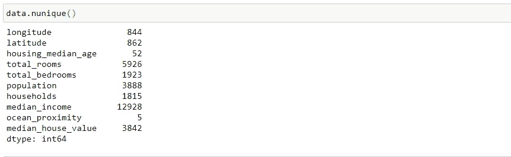
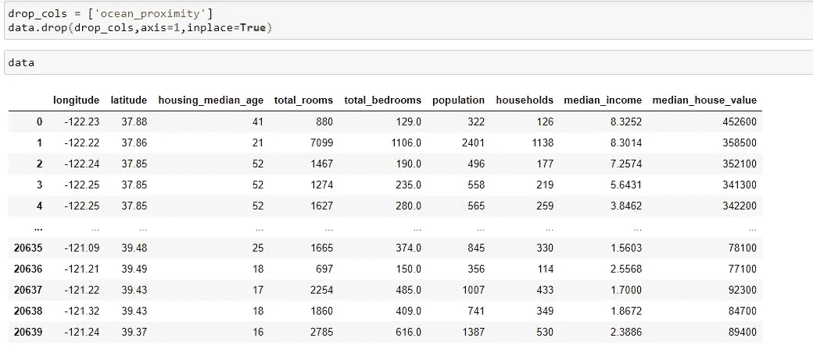

# 常用于探索性数据分析的前 20 个熊猫函数。

> 原文：<https://medium.com/analytics-vidhya/top-20-pandas-functions-which-are-commonly-used-for-exploratory-data-analysis-3cb817a60f46?source=collection_archive---------0----------------------->

当谈到数据科学或数据分析时，Python 几乎总是首选语言。它的图书馆熊猫是你不能，更重要的是，不应该回避的。

Pandas 是一个主要使用的 python 数据分析库。它提供了许多功能和方法来加快数据分析过程。使 pandas 如此普遍的是它的功能性、灵活性和简单的语法。

虽然 Pandas 本身并不难学，主要是因为它有不言自明的方法名，但是拥有一个备忘单仍然是值得的，尤其是如果您想快速编写代码的话。这就是为什么今天我想把重点放在我如何使用熊猫来做**探索性数据分析**上，向你提供我最常用的方法列表，以及对这些方法的详细解释。

# 使用的数据集

我将在加州住房数据集上做例子。该数据集和代码可在此链接中获得。

【https://github.com/jbolla368/Pandas-using-in-EDA.git 

下面是如何导入 Pandas 库并加载到数据集中:

加载的数据集

# 1.头和尾

一旦我们将一个数据集读入 pandas 数据框，我们想看一看它以获得一个概览。最简单的方法是显示一些行。Head 和 tail 允许我们分别从数据框的顶部和底部显示行。

默认显示 5 行，但是我们可以通过传递我们想要显示的行数来调整它。

# 2.DataFrame.info()

Pandas `**dataframe.info()**`函数用于获得数据帧的简明摘要。在对数据进行探索性分析时，这非常方便。为了快速浏览数据集，我们使用了`dataframe.info()`函数。

# 3.数据类型

我们需要将值存储在适当的数据类型中。否则，我们可能会遇到错误。对于大型数据集，正确的数据类型选择会极大地影响内存使用。例如，对于分类数据来说，“分类”数据类型比“对象”数据类型更合适，尤其是当类别的数量远小于行数时。

**Dtypes** 显示每一列的数据类型。

# 4.形状和尺寸

Shape 可用于 numpy 数组、pandas 系列和 dataframes。它显示维度的数量以及每个维度的大小。

因为数据帧是二维的，所以 shape 返回的是行数和列数。它衡量我们拥有多少数据，是数据分析过程的关键输入。

此外，在设计和实现机器学习模型时，行和列的比率非常重要。如果我们没有足够的关于特征(列)的观察值(行),我们可能需要应用一些预处理技术，例如降维或特征提取。

顾名思义，Size 返回数据帧的大小，即行数乘以列数。

# 5.描述( )

如果在探索性数据分析的过程中有一件事你反复做，那就是为每个(或几乎每个)属性执行一个**统计摘要**。

如果没有合适的工具，这将是一个非常乏味的过程——但谢天谢地，熊猫在这里为你做繁重的工作。`describe()`方法将对每个数字列进行快速统计汇总，如下所示:

现在我使用转置操作符从列切换到行，反之亦然。

# 6.样品

样本方法允许您从**系列**或**数据帧**中随机选择数值。当我们想从分布中选择一个随机样本时，这是很有用的。

# 7.识别缺失值是空的

处理缺失值是构建稳健数据分析流程的关键步骤。缺少的值应该是最优先考虑的，因为它们对任何分析的准确性都有重大影响。

# 8.Isna

**Isna** 函数返回用布尔值填充的数据帧，true 表示缺少值。

# 9.识别缺失值总和

让我们首先计算数据框中缺失值的总数。您可以通过`df.isnull().sum()`计算每列中缺失值的数量

# 10.努尼克岛

Nunique 计算列或行中唯一条目的数量。它在分类特征中非常有用，尤其是在我们事先不知道类别数量的情况下。让我们看看我们的初始数据框架:

# 11.索引( )和列( )

***index()*** 是 Python 中的一个内置函数，它从列表的开头搜索给定的元素，并返回该元素出现的最低索引。

# 列( )

# 12.内存使用情况

Memory_usage()以字节为单位返回每列使用的内存量。这在我们处理大型数据帧时尤其有用。考虑下面有一百万行的数据帧。

# 13.nsmallest()和 nlargest()

我想这两种方法的目的是毋庸置疑的，尽管如此，它们在探索性数据分析的过程中是有价值的。

让我们看看如何找到具有最小值的 5 个观察值

让我们看看如何找到具有最大值的 5 个观察值。

# 14.Loc 和 iloc

Loc 和 iloc 用于选择行和列。

*   位置:按标签选择
*   iloc:按职位选择

**loc** 用于按标签选择数据。列的标签是列名。我们需要小心行标签。如果我们不指定任何特定的索引，pandas 默认创建整数索引。因此，行标签是从 0 开始向上的整数。与 **iloc** 一起使用的行位置也是从 0 开始的整数。

用 loc 选择前 6 行和 2 列:

使用 iloc 选择前 4 行和前 6 列:

# 15.限幅

使用标签对行和列进行切片。您可以使用标签或按位置选择一系列行或列。切片..

# 16.分组依据

pandas groupby 函数是探索数据的一个很好的工具。它更容易揭示变量之间的潜在关系。下图概述了 **groupby** 函数的功能。

# 17.整理

使用 **sort_index()方法**，通过传递轴参数和排序顺序，可以对 DataFrame 进行排序。默认情况下，按升序对行标签进行排序。排序顺序。通过将布尔值传递给升序参数，可以控制排序的顺序。

按值排序

# 18.德罗普纳

dropna()函数用于**从数据帧中删除一行或一列，该数据帧中有 NaN 或没有值**。

# 19.询问

我们有时需要根据条件过滤数据帧或应用掩码来获得某些值。过滤数据帧的一个简单方法是**查询**函数。让我们首先创建一个样本数据帧。

# 20.插入

当我们想在数据帧中添加一个新列时，默认情况下它会被添加到末尾。然而，pandas 提供了使用**插入**功能在任意位置添加新列的选项。

我们需要通过传递一个索引作为第一个参数来指定位置。该值必须是整数。列索引从零开始，就像行索引一样。第二个参数是列名，第三个参数是包含值的对象，这些值可以是**系列**或类似于**数组的**对象。

# 在你走之前

我希望这篇文章能够在 Python、Pandas 和探索性数据分析方面为您指明正确的方向。

感谢您的阅读。如果您有任何反馈，请告诉我。