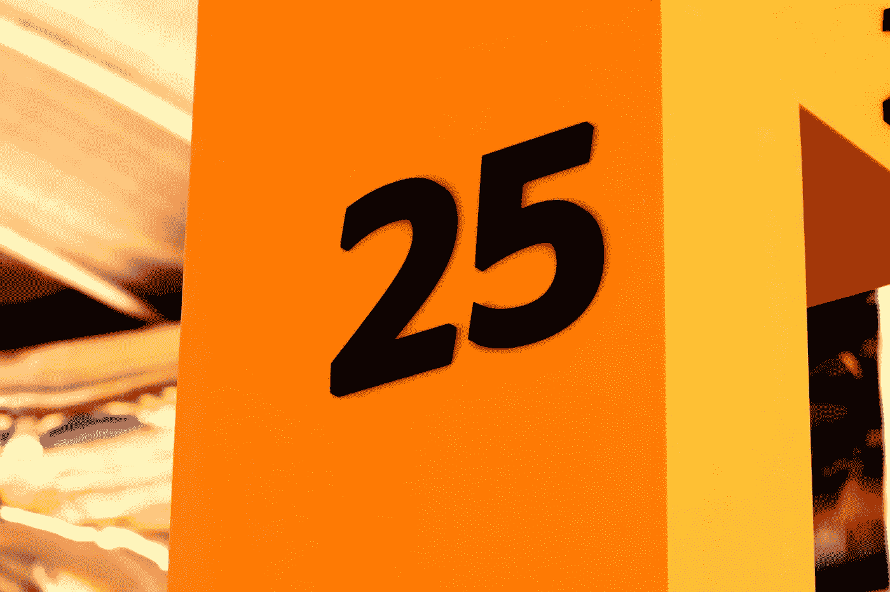

# Python 列表中的前 25 个问题

> 原文：<https://medium.com/analytics-vidhya/top-25-questions-on-python-list-e48cfef8a797?source=collection_archive---------0----------------------->

## 25 个关于列表的问题，以增强您对 python 列表的了解。

。照片由[拉利斯·T](https://unsplash.com/@im_laleeth?utm_source=unsplash&utm_medium=referral&utm_content=creditCopyText)在 [Unsplash](https://unsplash.com/s/photos/symbol?utm_source=unsplash&utm_medium=referral&utm_content=creditCopyText) 上拍摄

# 关于 Python 列表的 25 个问题

**Python 列表:**

列表是 python 中的一种数据结构，它是可变的有序元素序列。
通过将所有项目放在方括号内并用逗号分隔来创建一个列表。