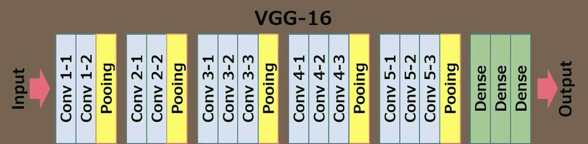

# 使用 Python 代码进行影像分类的前 4 个预训练模型

> 原文：<https://medium.com/analytics-vidhya/top-4-pre-trained-models-for-image-classification-with-python-code-a3cb5846248b?source=collection_archive---------17----------------------->

# 介绍

人脑可以很容易地识别和区分图像中的对象。例如，给定一只猫和一只狗的图像，在十亿分之一秒内，我们区分两者，我们的大脑感知这种差异。万一有机器模仿这种行为，那就是我们能得到的最接近人工智能的了。随后，计算机视觉领域的目标是模仿人类视觉系统——已经有许多里程碑突破了这方面的障碍。

而且，现在的机器可以轻松区分不同的图像，检测物体和人脸，甚至生成不存在的人的图像！很迷人，不是吗？当我开始使用计算机视觉时，我的第一个经验是图像分类的任务。机器区分物体的这种能力带来了更多的研究途径——比如区分人。


计算机视觉的快速发展，以及由此延伸的图像分类，由于迁移学习的出现而进一步加速。简而言之，迁移学习允许我们使用一个预先存在的模型，在一个巨大的数据集上训练，用于我们自己的任务。因此降低了训练新的深度学习模型的成本，并且由于数据集已经过审查，我们可以确保质量。

在图像分类中，有一些非常受欢迎的数据集，它们被用于研究、行业和黑客马拉松。以下是一些突出的例子:

*   [ImageNet](http://image-net.org/download)
*   [cifa](https://www.cs.toronto.edu/~kriz/cifar.html)
*   [MNIST](http://yann.lecun.com/exdb/mnist/)

还有很多。

在本文中，我将介绍用于图像分类的前 4 个预训练模型，它们是最先进的(SOTA ),在行业中也广泛使用。可以更详细地解释各个模型，但是我将这篇文章限制为概述它们的架构并在数据集上实现它。

*如果你想以结构化的形式学习计算机视觉，参考本课程-* [*认证计算机视觉硕士项目*](https://courses.analyticsvidhya.com/bundles/certified-computer-vision-masters-program?utm_source=blog&utm_medium=top4_pre-trained_image_classification_models)

# 设置系统

既然我们从猫和狗开始，那就让我们来看看猫和狗的图像数据集。Kaggle 上的原始训练数据集有 25000 张猫和狗的图像，测试数据集有 10000 张未标记的图像。因为我们的目的只是为了理解这些模型，所以我选择了一个更小的数据集。您可以直接在 Google Colab 上运行这个和其余的代码——所以让我们开始吧！

```
!wget --no-check-certificate \
    https://storage.googleapis.com/mledu-datasets/cats_and_dogs_filtered.zip \
    -O /tmp/cats_and_dogs_filtered.zip
```

让我们也导入基本库。此外，我将根据型号介绍未来的导入:

```
import os 
import zipfile 
import tensorflow as tf 
from tensorflow.keras.preprocessing.image import ImageDataGenerator 
from tensorflow.keras import layers 
from tensorflow.keras import Model 
import matplotlib.pyplot as plt
```

# 准备数据集

我们将首先准备数据集并分离出图像:

1.  我们首先将文件夹内容分为训练和验证目录。
2.  然后，在每个目录中，为只包含猫图像的猫创建一个单独的目录，为只包含狗图像的狗创建一个单独的目录。

```
local_zip = '/tmp/cats_and_dogs_filtered.zip'
zip_ref = zipfile.ZipFile(local_zip, 'r')
zip_ref.extractall('/tmp')
zip_ref.close()

base_dir = '/tmp/cats_and_dogs_filtered'
train_dir = os.path.join(base_dir, 'train')
validation_dir = os.path.join(base_dir, 'validation')

# Directory with our training cat pictures
train_cats_dir = os.path.join(train_dir, 'cats')

# Directory with our training dog pictures
train_dogs_dir = os.path.join(train_dir, 'dogs')

# Directory with our validation cat pictures
validation_cats_dir = os.path.join(validation_dir, 'cats')

# Directory with our validation dog pictures
validation_dogs_dir = os.path.join(validation_dir, 'dogs')
```

以下代码将让我们检查图像是否已正确加载:

```
# Set up matplotlib fig, and size it to fit 4x4 pics
import matplotlib.image as mpimg
nrows = 4
ncols = 4

fig = plt.gcf()
fig.set_size_inches(ncols*4, nrows*4)
pic_index = 100
train_cat_fnames = os.listdir( train_cats_dir )
train_dog_fnames = os.listdir( train_dogs_dir )

next_cat_pix = [os.path.join(train_cats_dir, fname) 
                for fname in train_cat_fnames[ pic_index-8:pic_index] 
               ]

next_dog_pix = [os.path.join(train_dogs_dir, fname) 
                for fname in train_dog_fnames[ pic_index-8:pic_index]
               ]

for i, img_path in enumerate(next_cat_pix+next_dog_pix):
  # Set up subplot; subplot indices start at 1
  sp = plt.subplot(nrows, ncols, i + 1)
  sp.axis('Off') # Don't show axes (or gridlines)

  img = mpimg.imread(img_path)
  plt.imshow(img)

plt.show()
```

现在我们已经准备好了数据集，让我们进入模型构建阶段。我们将在该数据集上使用 4 种不同的预训练模型。

# 用于图像分类的预训练模型

在本节中，我们将介绍以下 4 种用于图像分类的预训练模型-

## 1.用于大规模图像识别的甚深卷积网络(VGG-16)

VGG-16 是用于图像分类的最流行的预训练模型之一。它是在著名的 ILSVRC 2014 大会上推出的，即使在今天，它仍然是一个值得超越的模型。VGG-16 由牛津大学视觉图形小组开发，击败了当时的 AlexNet 标准，并很快被研究人员和业界用于图像分类任务。

这是 VGG 16 号的建筑:


这里有一个更直观的 VGG-16 模型的布局。



以下是模型的各层:

*   卷积层数= 13
*   池层= 5
*   密集层= 3

让我们详细探究这些层:

**1 —输入**:尺寸图像(224，224，3)。

**2 —卷积层 Conv1:**

*   con v1–1:64 滤波器
*   con v1–2:64 滤波器和最大池
*   图像尺寸:(224，224)

**3 —卷积层 Conv2:** 现在，我们将滤波器增加到 128 个

*   输入图像尺寸:(112，112)
*   con v2–1:128 滤波器
*   con v2–2:128 个滤波器和最大池

**4 —卷积层 Conv3:** 再次，将滤镜加倍至 256，现在添加另一个卷积层

*   输入图像尺寸:(56，56)
*   con v3–1:256 滤波器
*   con v3–2:256 滤波器
*   con v3–3:256 个滤波器和最大池

**5 —卷积层 Conv4:** 与 Conv3 相似，但现在有 512 个滤波器

*   输入图像尺寸:(28，28)
*   con v4–1:512 滤波器
*   con v4–2:512 滤波器
*   con v4–3:512 滤波器和最大池

**6 —卷积层 Conv5:** 与 Conv4 相同

*   输入图像尺寸:(14，14)
*   con V5–1:512 滤波器
*   con V5–2:512 滤波器
*   con V5–3:512 滤波器和最大池
*   这里的输出维数是(7，7)。此时，我们展平该层的输出以生成特征向量

**7 —全连接/密集 FC1** : 4096 个节点，生成大小为(1，4096)的特征向量

**8 —全连接密度 FC2** : 4096 个节点生成大小为(14096)的特征向量

**9 —全连接/密集 FC3** : 4096 个节点，为 1000 类生成 1000 个通道。这然后被传递到 Softmax 激活功能

**10 —输出层**

如您所见，该模型本质上是顺序的，并且使用了许多过滤器。在每个阶段，小的 3 * 3 过滤器被用来减少所有隐藏层使用 ReLU 激活函数的参数数量。即使这样，参数的数量也是 1380 亿个——这使得它比其他模型训练起来更慢、更大。

此外，还有 VGG16 模型的变体，基本上是对它的改进，如 VGG19 (19 层)。你可以找到详细的解释

现在让我们探索如何在我们的数据集上训练 VGG-16 模型

**步骤 1:图像增强**

因为我们之前使用了一个小得多的图像数据集，所以我们可以通过增加这个数据和数据集大小来弥补它。如果您正在处理原始的较大数据集，则可以跳过这一步，直接开始构建模型。

```
# Add our data-augmentation parameters to ImageDataGeneratortrain_datagen = ImageDataGenerator(rescale = 1./255.,rotation_range = 40, width_shift_range = 0.2, height_shift_range = 0.2, shear_range = 0.2, zoom_range = 0.2, horizontal_flip = True)

# Note that the validation data should not be augmented!
test_datagen = ImageDataGenerator( rescale = 1.0/255\. )
```

**第二步:训练和验证集**

```
# Flow training images in batches of 20 using train_datagen generator
train_generator = train_datagen.flow_from_directory(train_dir, batch_size = 20, class_mode = 'binary', target_size = (224, 224))

# Flow validation images in batches of 20 using test_datagen generator
validation_generator = test_datagen.flow_from_directory( validation_dir,  batch_size = 20, class_mode = 'binary', target_size = (224, 224))
```

**步骤 3:加载基础模型**

我们将只使用基本模型，只对最后一层进行修改。这是因为这只是一个二元分类问题，而这些模型是为了处理多达 1000 个类别而构建的。

```
from tensorflow.keras.applications.vgg16 import VGG16

base_model = VGG16(input_shape = (224, 224, 3), # Shape of our images
include_top = False, # Leave out the last fully connected layer
weights = 'imagenet')
```

因为我们不需要训练所有的层，我们使它们不可训练:

```
for layer in base_model.layers:
    layer.trainable = False
```

**第四步:编译并拟合**

然后，我们将建立最后一个全连接层。我刚刚使用了基本的设置，但是可以自由地尝试不同的 dropout 值，以及不同的优化器和激活函数。

```
# Flatten the output layer to 1 dimension
x = layers.Flatten()(base_model.output)

# Add a fully connected layer with 512 hidden units and ReLU activation
x = layers.Dense(512, activation='relu')(x)

# Add a dropout rate of 0.5
x = layers.Dropout(0.5)(x)

# Add a final sigmoid layer for classification
x = layers.Dense(1, activation='sigmoid')(x)

model = tf.keras.models.Model(base_model.input, x)

model.compile(optimizer = tf.keras.optimizers.RMSprop(lr=0.0001), loss = 'binary_crossentropy',metrics = ['acc'])
```

现在，我们将根据之前创建的训练集和验证集来构建最终模型。请注意使用原始目录本身，而不是我下面使用的扩充数据集。我只使用了 10 个纪元，但是您也可以增加它们以获得更好的结果:

```
vgghist = model.fit(train_generator, validation_data = validation_generator, steps_per_epoch = 100, epochs = 10)
```


厉害！如您所见，我们仅用 10 个时期就实现了 93%的验证准确性，并且没有对模型进行任何重大更改。这就是我们意识到迁移学习是多么强大，以及预先训练的图像分类模型是多么有用的地方。这里需要注意的是，与其他模型相比，VGG16 需要花费很长时间来训练，当我们处理大型数据集时，这可能是一个缺点。

话虽如此，我真的很喜欢这个模型的简单和直观。接受过 ImageNet 语料库培训的 VGG 16 的另一项显著成就是，它在 ImageNet ILSVRC-2014 中获得了第一名，从而巩固了其在图像分类顶级预培训模型列表中的地位。

# 2.开始

在为本文进行研究时，有一点是清楚的。就开发真正受欢迎的图像分类预训练模型而言，2014 年具有标志性。虽然上述 VGG-16 在当年的 ILSVRC 中获得了第二名，但第一名不是别人，正是谷歌——通过它的模型谷歌浏览器(GoogLeNet)或“盗梦空间”(Inception，现在被称为“盗梦空间”)。

原论文提出了 Inceptionv1 模型。它只有 700 万个参数，比当时流行的 VGG 和 AlexNet 模型要小得多。加上较低的错误率，你可以明白为什么它是一个突破性的模型。不仅如此，本文的主要创新也是另一个突破——盗梦空间模块。

正如可以看到的，简单地说，初始模块只对输入执行具有不同滤波器大小的卷积，执行最大池，并连接下一个初始模块的结果。1 * 1 卷积运算的引入极大地减少了参数。


来源:纸张

虽然 Inceptionv1 中的层数是 22 层，但是参数的大量减少使得它成为一个难以击败的强大模型。


来源:纸张

Inceptionv2 模型是对 Inceptionv1 模型的重大改进，它提高了精度，并进一步降低了模型的复杂性。在与 Inceptionv2 相同的文章中，作者介绍了 Inceptionv3 模型，并对 v2 做了一些改进。


来源:纸张

以下是包括的主要改进:

*   批次标准化简介
*   更多因式分解
*   RMSProp 优化器

*虽然本文无法对盗梦空间进行深入的解释，但您可以通读这篇详细讲述盗梦空间模型的综合性文章:* [*战壕中的深度学习:从零开始理解盗梦空间网络*](https://www.analyticsvidhya.com/blog/2018/10/understanding-inception-network-from-scratch/?utm_source=blog&utm_medium=top4_pre-trained_image_classification_models)

正如你所看到的，层数是 42 层，相比之下 VGG16 只有 16 层。此外，Inceptionv3 将错误率降低到仅 4.2%。

让我们看看如何用 python 实现它-

**第 1 步:数据增加**

您会注意到，我并没有进行大规模的数据扩充。代码和以前一样。我刚刚改变了每个模型的图像尺寸。

```
# Add our data-augmentation parameters to ImageDataGenerator
train_datagen = ImageDataGenerator(rescale = 1./255., rotation_range = 40, width_shift_range = 0.2, height_shift_range = 0.2,shear_range = 0.2, zoom_range = 0.2, horizontal_flip = True)

test_datagen = ImageDataGenerator( rescale = 1.0/255\. )
```

**第 2 步:培训和验证生成器**

```
train_generator = train_datagen.flow_from_directory(train_dir, batch_size = 20, class_mode = 'binary', target_size = (150, 150))validation_generator = test_datagen.flow_from_directory(validation_dir, batch_size = 20, class_mode = 'binary', target_size = (150, 150))
```

**第 3 步:加载基础模型**

```
from tensorflow.keras.applications.inception_v3 import InceptionV3base_model = InceptionV3(input_shape = (150, 150, 3), include_top = False, weights = 'imagenet')
```

**第 4 步:编译并安装**

就像 VGG-16，我们只会改变最后一层。

```
for layer in base_model.layers:
    layer.trainable = False
```

我们执行以下操作:

*   将基本模型的输出展平到一维
*   添加一个具有 1，024 个隐藏单元的完全连接层并重新激活
*   这一次，我们将采用 0.2%的辍学率
*   添加最终完全连接的 s 形层
*   我们将再次使用 RMSProp，尽管您也可以尝试 Adam 优化器

```
from tensorflow.keras.optimizers import RMSprop

x = layers.Flatten()(base_model.output)
x = layers.Dense(1024, activation='relu')(x)
x = layers.Dropout(0.2)(x)
x = layers.Dense(1, activation='sigmoid')(x)

model = tf.keras.models.Model(base_model.input, x)

model.compile(optimizer = RMSprop(lr=0.0001), loss = 'binary_crossentropy', metrics = ['acc'])
```

然后，我们将拟合模型:

```
inc_history = model.fit_generator(train_generator, validation_data = validation_generator, steps_per_epoch = 100, epochs = 10)
```


结果，我们可以看到，我们在 10 个时期内获得了 96%的验证准确性。还要注意，这个型号怎么比 VGG16 快很多。每个历元仅占用 VGG16 中每个历元时间的 1/4。当然，您可以尝试不同的超参数值，看看它的性能有多好/差。

我真的很喜欢研究盗梦空间模型。虽然当时的大多数模型仅仅是连续的，并遵循模型越深越大的前提，它的性能就越好——Inception 及其变体打破了这种模式。就像它的前辈一样，Inceptionv3 在 2016 年 CVPR 奥运会上以 3.5%的前五名错误率获得了冠军。

这里是这篇论文的链接:[反思计算机视觉的初始架构](https://arxiv.org/pdf/1512.00567v3.pdf)

# 3.ResNet50

就像 Inceptionv3 一样，ResNet50 并不是来自 ResNet 家族的第一款机型。最初的模型被称为剩余网络或 ResNet，是 2015 年 CV 领域的又一个里程碑。

这种模型背后的主要动机是避免模型变得更深时的不良准确性。此外，如果你熟悉梯度下降，你会遇到消失梯度问题 ResNet 模型旨在解决这个问题。这是最早的变体的架构:ResNet34(ResNet50 也遵循类似的技术，只是有更多的层)


您可以看到，从单个卷积层和最大池开始后，有 4 个类似的层，只是滤波器大小不同，它们都使用 3 * 3 卷积运算。此外，在每两次盘旋之后，我们会绕过/跳过中间的那一层。这是 ResNet 模型背后的主要概念。这些跳过的连接被称为“身份快捷连接”，并使用所谓的残余块:


简而言之，ResNet 的作者提出拟合残差映射比拟合实际映射容易得多，因此可以将其应用于所有层。另一个值得注意的有趣点是，ResNet 的作者认为，我们堆叠的层越多，模型的性能就不会越差。

这与我们在《盗梦空间》中看到的相反，在某种意义上，它几乎类似于 VGG16，只是将层堆叠在另一层之上。ResNet 只是改变了底层映射。


ResNet 模型有许多变体，其中最新的是 ResNet152。以下是 ResNet 系列在所用层方面的架构:

现在让我们在数据集上使用 ResNet50:

**步骤 1:数据扩充和生成器**

```
# Add our data-augmentation parameters to ImageDataGenerator

train_datagen = ImageDataGenerator(rescale = 1./255., rotation_range = 40, width_shift_range = 0.2, height_shift_range = 0.2, shear_range = 0.2, zoom_range = 0.2, horizontal_flip = True)

test_datagen = ImageDataGenerator(rescale = 1.0/255.)

train_generator = train_datagen.flow_from_directory(train_dir, batch_size = 20, class_mode = 'binary', target_size = (224, 224))

validation_generator = test_datagen.flow_from_directory( validation_dir, batch_size = 20, class_mode = 'binary', target_size = (224, 224))
```

## 步骤 2:导入基础模型

```
from tensorflow.keras.applications import ResNet50

base_model = ResNet50(input_shape=(224, 224,3), include_top=False, weights="imagenet")
```

同样，我们只使用基本的 ResNet 模型，所以我们将保持层冻结，只修改最后一层:

```
for layer in base_model.layers:
    layer.trainable = False
```

## 步骤 3:构建和编译模型

我们编译模型，这次让我们尝试 SGD 优化器:

```
base_model.compile(optimizer = tf.keras.optimizers.SGD(lr=0.0001), loss = 'binary_crossentropy', metrics = ['acc'])
```

## 步骤 4:拟合模型

```
resnet_history = base_model.fit(train_generator, validation_data = validation_generator, steps_per_epoch = 100, epochs = 10)
```

查看[要点](https://gist.github.com/purva91/b89d9fdd136135beb0f2843580f38d01)上的代码。


以下是我们得到的结果-

您可以看到它在我们的数据集上的表现，这使得 ResNet50 成为使用最广泛的预训练模型之一。就像 VGG 一样，它也有其他变化，正如我们在上表中看到的。值得注意的是，ResNet 不仅有自己的变种，还衍生出一系列基于 ResNet 的架构。其中包括 ResNeXt、ResNet as an Ensemble 等。此外，ResNet50 是最受欢迎的型号之一，错误率约为 5%

以下是论文链接:[用于图像识别的深度残差学习](https://arxiv.org/pdf/1512.03385v1.pdf)

# 4.效率网

我们终于看到了这 4 款产品中在这个领域掀起波澜的最新型号，当然，它来自 Google。在 EfficientNet 中，作者提出了一种新的缩放方法，称为**复合缩放。**简单来说就是:早期的模型，比如 ResNet，遵循的是任意缩放维度和添加越来越多的层的传统方法。

然而，该论文提出，如果我们同时以固定的量来缩放维度，并且统一地这样做，我们会实现好得多的性能。缩放系数实际上可以由用户决定。

虽然这种缩放技术可以用于任何基于 CNN 的模型，但作者从他们自己的基线模型开始，称为 EfficientNetB0:


MBConv 代表移动反向瓶颈卷积(类似于 MobileNetv2)。他们还提出了具有以下比例系数的复合比例公式:

该公式再次用于构建一系列高效网络——高效网络 0 至高效网络 7。下面是一个简单的图表，显示了该系列与其他流行型号的性能对比:


正如您所看到的，即使是基线 B0 模型也是以高得多的精度开始的，精度只会不断提高，而且参数也越来越少。例如，EfficientB0 只有 530 万个参数！

实现 EfficientNet 最简单的方法是安装它，其余的步骤与我们上面看到的类似。

## 安装效率网络:

```
!pip install -U efficientnet
```

## 导入它

```
import efficientnet.keras as efn
```

## 步骤 1:图像增强

我们将使用与 VGG16 和 ResNet50 相同的图像尺寸。到目前为止，您应该已经熟悉了增强过程:

```
# Add our data-augmentation parameters to ImageDataGenerator

train_datagen = ImageDataGenerator(rescale = 1./255., rotation_range = 40, width_shift_range = 0.2, height_shift_range = 0.2, shear_range = 0.2, zoom_range = 0.2, horizontal_flip = True)

test_datagen = ImageDataGenerator(rescale = 1.0/255.)

train_generator = train_datagen.flow_from_directory(train_dir, batch_size = 20, class_mode = 'binary', target_size = (224, 224))

validation_generator = test_datagen.flow_from_directory( validation_dir, batch_size = 20, class_mode = 'binary', target_size = (224, 224))
```

## 步骤 2:加载基本模型

我们将使用 B0 版本的 EfficientNet，因为它是 8 个版本中最简单的。我强烈建议您尝试其余的模型，但是请记住，模型会变得越来越复杂，这可能不是最适合简单的二元分类任务的。

```
base_model = efn.EfficientNetB0(input_shape = (224, 224, 3), include_top = False, weights = 'imagenet')
```

让我们再次冻结这些层:

```
for layer in base_model.layers:
    layer.trainable = False
```

## 步骤 3:构建模型

就像 Inceptionv3 一样，我们将在最后一层执行这些步骤:

```
x = model.output
x = Flatten()(x)
x = Dense(1024, activation="relu")(x)
x = Dropout(0.5)(x)
predictions = Dense(1, activation="sigmoid")(x)
model_final = Model(input = model.input, output = predictions)
```

## 第四步:编译和安装

让我们再次使用 RMSProp 优化器，不过在这里，我引入了一个衰减参数:

```
model_final.compile(optimizers.rmsprop(lr=0.0001, decay=1e-6),loss='binary_crossentropy',metrics=['accuracy'])
```

我们最终根据我们的数据拟合了模型:

```
eff_history = model_final.fit_generator(train_generator, validation_data = validation_generator, steps_per_epoch = 100, epochs = 10)
```


我们做到了——仅在 10 个时期内，我们就在验证集上获得了高达 98%的准确率。我强烈建议您尝试使用 EfficientNetB7 训练更大的数据集，并在下面与我们分享结果。

以下是论文的链接: [EfficientNet:反思卷积神经网络的模型缩放](https://arxiv.org/pdf/1905.11946.pdf)

# 结束注释:


总之，在本文中，我向您介绍了 4 种用于图像分类的顶级预训练模型。这里有一个方便的表格，供您参考这些型号及其性能:

我只提供了图像分类的前 4 个预训练模型以及如何实现它们的概述。然而，这是一个持续增长的领域，总是有新的模式可以期待，并进一步推动边界。我迫不及待地想探索这些新模型，我也敦促你在不同的数据集上用不同的参数尝试上述模型，并在下面的评论中与我们分享你的结果！

您也可以在我们的移动应用程序上阅读这篇文章。

*原载于 2020 年 8 月 17 日*[*【https://www.analyticsvidhya.com】*](https://www.analyticsvidhya.com/blog/2020/08/top-4-pre-trained-models-for-image-classification-with-python-code/)*。*