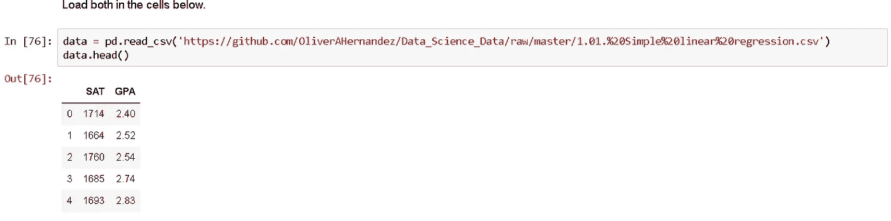

# 初学数据科学家的 5 大错误

> 原文：<https://medium.com/analytics-vidhya/top-5-beginner-data-scientist-mistakes-a67ccde88bb5?source=collection_archive---------25----------------------->

当我在大会上学习数据科学沉浸式课程前几个月学习数据科学基础知识时，我犯了很多初学者错误。有些是很疯狂的，所以你们大多数人不会犯(我希望)，但有些不是那么明显，所以我想我会分享我对初学者错误的经验，这样你就可以避免犯这些错误。我早就应该写这篇博客了，但是迟写总比不写好。

莎拉·基利安在 [Unsplash](https://unsplash.com?utm_source=medium&utm_medium=referral) 上的照片

## 错误 1 —在根目录上初始化 Git Repos

从前，我在您的根文件夹中初始化了一个 git 存储库。不要那样做！这将把你电脑上的所有东西放入一个巨大的存储库中。当你试图把你的代码推给 GitHub 时，你会意识到有些不对劲。所有的东西都会立刻停止工作。在初始化 git 存储库之前，一定要确保将目录(“cd”)更改为适当的文件夹。您可以删除回购，但如果您不知道您已经在根目录中初始化了一个回购，这可能会令人困惑。

## 错误 2 —从终端删除错误的目录

如果你上方的图片没有吓到你一点点。你可能不知道那有什么用。` *rm -rf`* 是一个非常方便的终端命令。这也是一个非常危险的命令。它允许您删除给定目录中的所有文件。“rm”代表 remove，而“-r”告诉它递归操作。最后,`-f '告诉它忽略一切，永远不要提示任何东西。这意味着你可以用这个命令从你的电脑上删除操作系统，它甚至不会问你是否确定。虽然我从未做过如此愚蠢的事情，但我删除了错误的 git 库；那些回复早就消失了。

## 错误 3 —启动 Jupyter 笔记本

一旦正确安装了 Anaconda，只需在终端中键入 Jupyter Notebook，就可以启动 Jupyter。我花了比我敢承认的更长的时间才弄明白这一点。

当我第一次开始使用 Jupyter 时，我会将我所有的 Jupyter 笔记本导入到我的根文件夹中。我不知道我可以将 cd 放入文件夹中，然后启动 Jupyter。相反，你应该做的是将 cd 放入你所有笔记本所在的目录，并在那里激活 Jupyter。

## 错误 4——以错误的方式解读 CSV

在从事数据科学之前，我从未在我的计算机上使用过终端，因此，我不熟悉如何浏览一般目录。这让我在加载熊猫数据帧时遇到了一些问题。如果数据集与 Jupyter 笔记本不在同一个目录中，您将无法通过简单地键入数据集的名称来读取 CSV。

例如，假设您将所有笔记本放在一个名为“code”的文件夹中，将所有数据集放在一个名为“data”的文件夹中。在这种情况下，您可以通过写入来读入 CSV 数据

`dataframe = pd.read_csv( ‘../data/csv_name.scv’ )`

这两个点允许您在目录中向后移动。如果你在终端中，你可以输入“cd..`例如从你的桌面转到你的根目录。或者，你可以像我一样做。

您可以将您的 CSV 上传到 GitHub。从 GitHub 上，你可以复制 CSV 链接并粘贴到你的笔记本上，从网上读取你的数据。这是我的方法，直到我明白了目录是如何工作的。

## 错误 5——曲解 R2 分数

照片由[克里斯蒂安·埃尔富特](https://unsplash.com/@christnerfurt?utm_source=medium&utm_medium=referral)在 [Unsplash](https://unsplash.com?utm_source=medium&utm_medium=referral) 拍摄

在数据科学中，我们使用 R2 分数来衡量许多模型的性能。我们还将我们的数据分为训练集和测试集，以查看我们的模型在以前从未见过的数据上的表现。我自欺欺人地认为 R2 得分就是一切的终结。在现实中，你的模型的性能可能会有所不同。在一次 Kaggle 比赛中，我失去了前 15 名的位置，并下降到大约第 50 名，我意识到你的模型在本地计算机上的表现并不能很好地反映它在现实世界中的表现。评估您的模型时使用多个指标，并记住结果可能会有所不同。