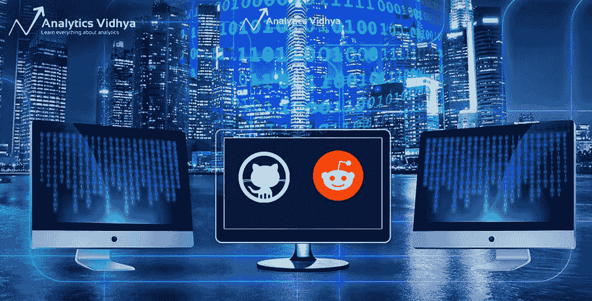
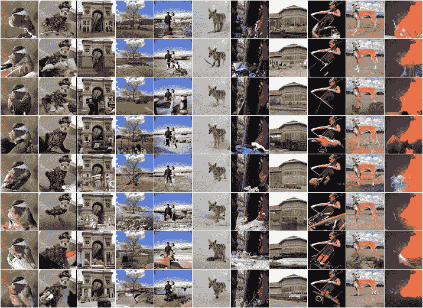
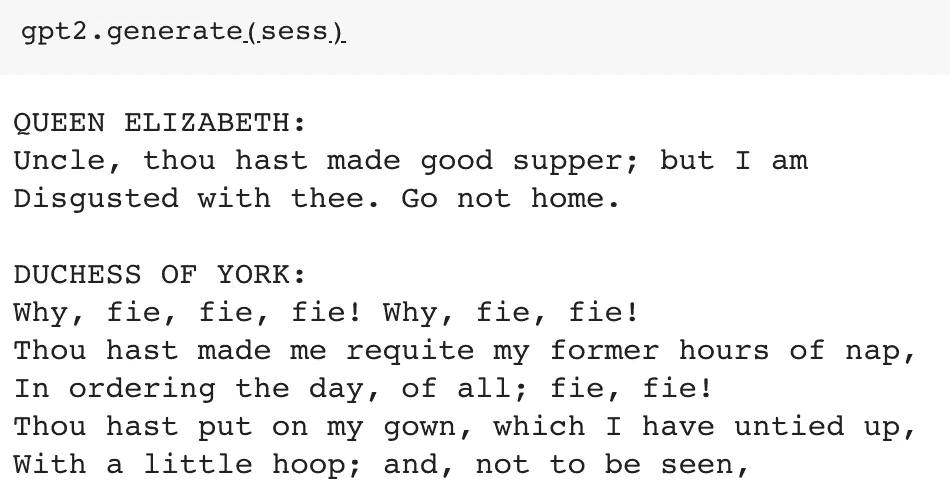
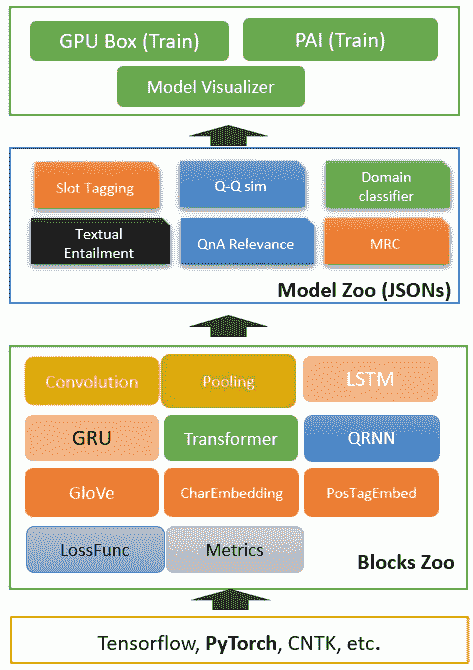
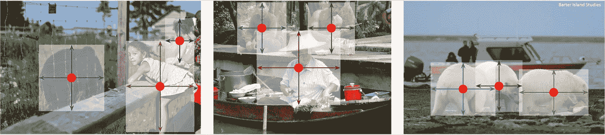
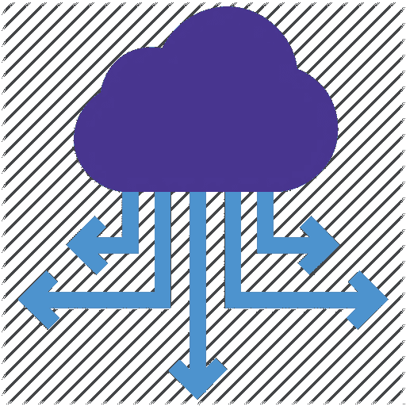

# 五大数据科学 GitHub 项目和 Reddit 讨论

> 原文：<https://medium.com/analytics-vidhya/top-5-data-science-github-projects-and-reddit-discussions-1ec2ea3035f5?source=collection_archive---------2----------------------->

*查看 2019 年 4 月以来的顶级机器学习和数据科学开源发展。*

# 介绍

[数据科学](https://courses.analyticsvidhya.com/courses/introduction-to-data-science-2?utm_source=blog&utm_medium=5-data-science-github-reddit-april)是一个不断发展的领域。作为数据科学家，我们需要掌握社区中最新算法和框架的脉搏。

**在这方面，我发现 GitHub 是一个极好的知识来源。**该平台帮助我了解最新的趋势数据科学主题。我还可以查找和下载领先的数据科学家和公司的代码——数据科学家还能要求什么呢？所以，如果你是一个:

*   数据科学爱好者
*   机器学习从业者
*   数据科学经理
*   深度学习专家

或者以上的任意组合，这篇文章就是为你准备的。我在这里挑选了顶尖的数据科学知识库，免去了浏览多个知识库的痛苦。这个月的系列非常强调自然语言处理。



我还为你挑选了五个深入的数据科学相关的 Reddit 讨论。向数据科学专家请教是一个难得的机会，但 Reddit 让我们能够深入了解他们的思维过程。我强烈建议通过这些讨论来提高你的知识和对行业的理解。

*想要查看 2019 年前三个月的顶级存储库吗？我们已经为你准备好了:*

让我们开始吧！

# 数据科学 GitHub 仓库


# [open ai 的 Sparse Transformer 出色的 NLP 框架](https://github.com/openai/sparse_attention)



对于 OpenAI 的 NLP 研究来说，这是多么美好的一年。他们[在二月份发布 GPT-2 时吸引了我们的注意力](https://www.analyticsvidhya.com/blog/2019/03/top-5-data-science-github-repositories-reddit-discussions-february-2019/)(稍后会有更多的介绍),现在他们已经提出了一个 NLP 框架，该框架建立在流行的 [Transformer 架构](https://www.analyticsvidhya.com/blog/2019/03/pretrained-models-get-started-nlp/)之上。

稀疏转换器是一种深度神经网络，它可以预测序列中的下一项。这包括文本、图像甚至音频！最初的结果打破了记录。该算法使用注意力机制(在深度学习中非常流行)，从比以前可能的时间长 30 倍的序列中提取模式。

引起你的注意了，不是吗？这个存储库包含这个框架的稀疏注意力组件。您可以克隆或下载该库，并立即开始解决一个 [NLP](https://courses.analyticsvidhya.com/courses/natural-language-processing-nlp?utm_source=blog&utm_medium=5-data-science-github-reddit-april) 序列预测问题。只要确保你使用谷歌 Colab 和他们提供的免费 GPU。

# [OpenAI 的 GPT-2 用几行代码](https://github.com/minimaxir/gpt-2-simple)

啊是的。OpenAI 的 GPT-2。我以前从未见过围绕数据科学库发布的如此大肆宣传。他们只发布了非常小的原始模型样本(由于担心恶意滥用)，但即使是这个迷你版本的算法也向我们展示了 GPT-2 对于 NLP 任务的强大。

已经有很多尝试去复制 GPT-2 的方法，但是大多数都太复杂或者太冗长。这就是为什么这个仓库引起了我的注意。这是一个简单的 Python 包，允许我们在任何看不见的文本上重新训练 GPT-2 的文本生成模型。使用 *gpt2.generate()* 命令检查下面生成的文本:



您可以通过 pip 直接安装 *gpt-2-simple* (您还需要安装 TensorFlow):

```
pip3 install gpt_2_simple
```

# [neuron blocks——微软令人印象深刻的 NLP 深度学习工具包](https://github.com/Microsoft/NeuronBlocks)

这个月的另一个 NLP 条目。它只是显示了 NLP 正在以令人难以置信的速度发展。

NeuronBlocks 是微软开发的 NLP 工具包，帮助数据科学团队为神经网络建立端到端的管道。NeuronBlocks 背后的想法是降低为 NLP 任务建立深度神经网络模型的成本。



构成神经阻滞的主要成分有两个(参考上图):

*   BlockZoo:这包含了流行的神经网络组件
*   ModelZoo:这是一套用于执行各种任务的 NLP 模型

你知道应用深度学习解决方案会有多昂贵。所以一定要检查一下 NeuronBlocks，看看它是否对你或你的组织有用。**描述神经阻滞的整篇论文可以在这里**[](https://arxiv.org/abs/1904.09535)****阅读。****

# **[CenterNet —使用中心点检测的计算机视觉](https://github.com/xingyizhou/CenterNet)**

****

**我真的很喜欢这种物体探测的方法。通常，检测算法将对象识别为给定图像中的轴对齐的框。这些方法查看多个目标点和位置，并对每个目标点和位置进行分类。这听起来很公平——每个人都是这么做的，对吗？**

**这种方法叫做 CenterNet，它把一个物体模拟成一个点。基本上，**它使用关键点估计识别任何包围盒的中心点。**事实证明，CenterNet 比我们熟悉的边界框技术更快、更准确。**

**下次你在处理物体探测问题时试试吧，你会爱上它的！**你可以在这里** **阅读解释 CenterNet** [**的论文。**](https://arxiv.org/abs/1904.07850)**

# **[BentoML —用于部署模型的工具包！](https://github.com/bentoml/BentoML)**

****

**了解和学习如何部署机器学习模型是任何数据科学家都必须要做的事情。事实上，越来越多的招聘人员开始在数据科学家面试时询问与部署相关的问题。如果你不知道它是什么，你需要马上复习。**

****BentoML 是一个 Python 库，可以帮助你打包和部署机器学习模型。您可以在 5 分钟内(大约！).**BentoML 服务可以轻松部署到你喜欢的平台上，比如 Kubernetes、Docker、Airflow、AWS、Azure 等。**

**这是一个灵活的图书馆。它支持流行的框架，如 TensorFlow、PyTorch、Sci-kit Learn、XGBoost 等。您甚至可以使用 BentoML 部署定制框架。听起来是一个不容错过的好机会！**

**这个 GitHub 存储库包含让您入门的代码、安装说明和几个例子。**

# **数据科学 Reddit 讨论**

****

# **[Tableau 和 Alteryx 这样的工具在数据科学组织中扮演什么角色？](https://www.reddit.com/r/datascience/comments/bb7581/data_analytics_lite_aka_the_colourful_and_pretty/)**

**您是否从事商业智能/MIS/报告工作？你是否经常发现自己在使用像 Tableau、Alteryx、Power BI 这样的拖放工具？如果您正在阅读这篇文章，我认为您对过渡到数据科学感兴趣。**

**这个讨论主题由一位有点沮丧的数据分析师发起，深入探讨了数据分析师在数据科学项目中可以扮演的角色。讨论的重点是数据分析师/BI 专业人员需要掌握的技能，以便有机会转向数据科学。**

**提示:学习如何写好代码是首要的建议。 **此外，请查看我们关于** [**向数据科学**](https://www.analyticsvidhya.com/blog/2019/03/11-steps-data-science-role-reporting-mis-bi-professionals/?utm_source=blog&utm_medium=5-data-science-github-reddit-april) **过渡的 11 个步骤的综合示例文章。****

# **[从硕士转到行业的经验教训](https://www.reddit.com/r/MachineLearning/comments/bi2caq/d_masters_to_industry_learnings/)**

**招聘数据科学经理的最大抱怨是候选人缺乏行业经验。对于大多数数据科学爱好者来说，弥合学术界和工业界之间的差距被证明是难以实现的。MOOCs、书籍、文章——所有这些都是很好的知识来源——但它们不能提供行业信息。**

**这个讨论，从作者的帖子开始，对我们来说是黄金素材。我喜欢作者张贴了他的采访经历的详尽描述。这些评论包括一些关键问题，旨在探究更多关于这一转变的信息。**

# **[当 ML 和数据科学成为优秀公司的死穴时:一个警示故事](https://www.reddit.com/r/MachineLearning/comments/beoxx8/discussion_when_ml_and_data_science_are_the_death/)**

**如今的共识是，你可以使用机器学习和人工智能来提高你的组织的底线。这就是管理给领导力带来的东西，也带来了投资。**

****但是当管理层不知道如何构建 AI 和 ML 解决方案时会发生什么？在考虑机器学习之前，难道不先投资建立基础设施吗？在讨论中，这一部分经常被忽视，而且对一家公司来说往往是致命的。****

**这个讨论是关于一个公司，如何使用旧的编程语言和工具，突然决定用华丽的数据科学脚本和工具取代它的旧架构。这是一个警示故事，也是你进入这个行业时应该注意的一个故事。**

# **[我们达到深度强化学习的极限了吗？](https://www.reddit.com/r/MachineLearning/comments/bgvefd/d_have_we_hit_the_limits_of_deep_reinforcement/)**

**最近在多个论坛上看到有人问这个问题。这是一个可以理解的想法。除了每隔几个月就有一家科技巨头取得一些突破之外，我们还没有看到深度强化学习有太多进展。**

**但这是真的吗？这真的是极限吗？我们刚刚开始触及表面，我们已经完成了吗？我们大多数人相信未来会有更多。这场讨论在技术层面和整体大计划之间找到了正确的点。**

**你也可以将从这次讨论中学到的经验应用到深度学习中。当话题转到深层神经网络时，你会看到相似之处。**

# **[数据科学家的日常工作是什么？](https://www.reddit.com/r/datascience/comments/bcg9ul/what_do_data_scientists_actually_do_on_their/)**

**有没有想过数据科学家一天大部分时间都在做什么？大多数有抱负的专业人士认为他们会建立一个又一个模型。这是一个你需要不惜一切代价避免的陷阱。**

**我喜欢这个讨论中的第一个评论。这个人把当数据科学家等同于当律师。也就是说，根据您所在的领域，有不同种类的角色。所以这个问题没有直接的答案。**

**其他评论提供了一个很好的视角，让我们了解数据科学家们目前正在做的事情。简而言之，**任务范围很广，这完全取决于你的项目类型和团队规模。也有一些善意的讽刺——我一直很喜欢！****

# **结束注释**

**我喜欢把这个月的版本放在一起，因为我们已经涵盖了广泛的主题。在计算机视觉技术已经触及天花板的地方(相对而言)，NLP 继续突破障碍。OpenAI 的 Sparse Transformer 看起来是一个很好的 NLP 项目。**

**你觉得这个月的系列怎么样？我错过了任何数据科学库或讨论吗？在下面的评论区给我打电话，我们一起讨论吧！**

***原载于 2019 年 5 月 1 日*[*https://www.analyticsvidhya.com*](https://www.analyticsvidhya.com/blog/2019/05/5-data-science-github-reddit-april/)*。***