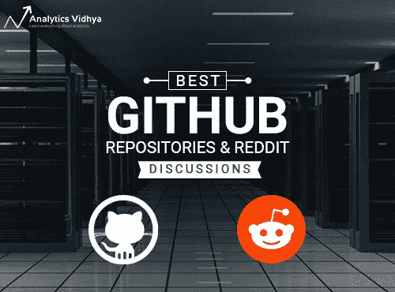
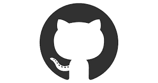
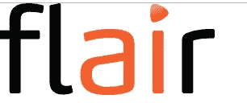
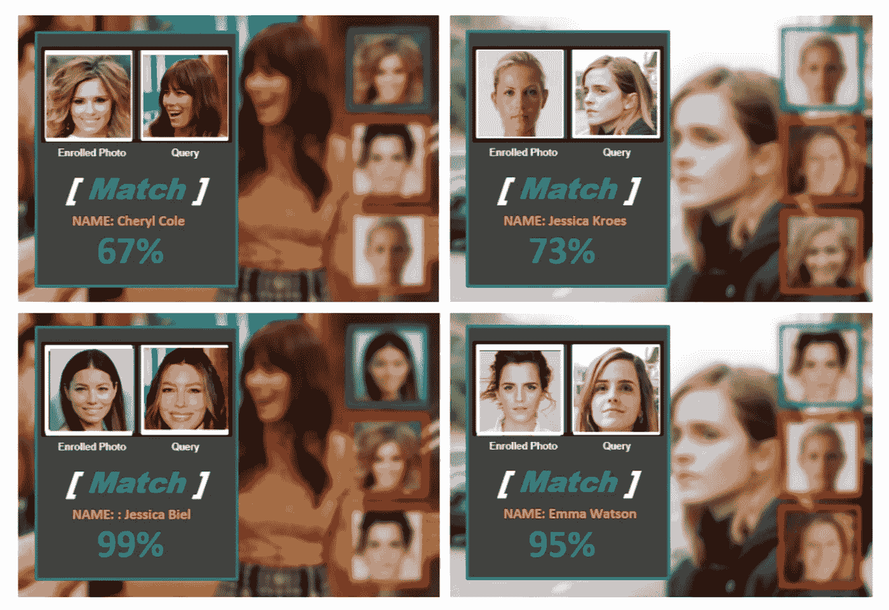
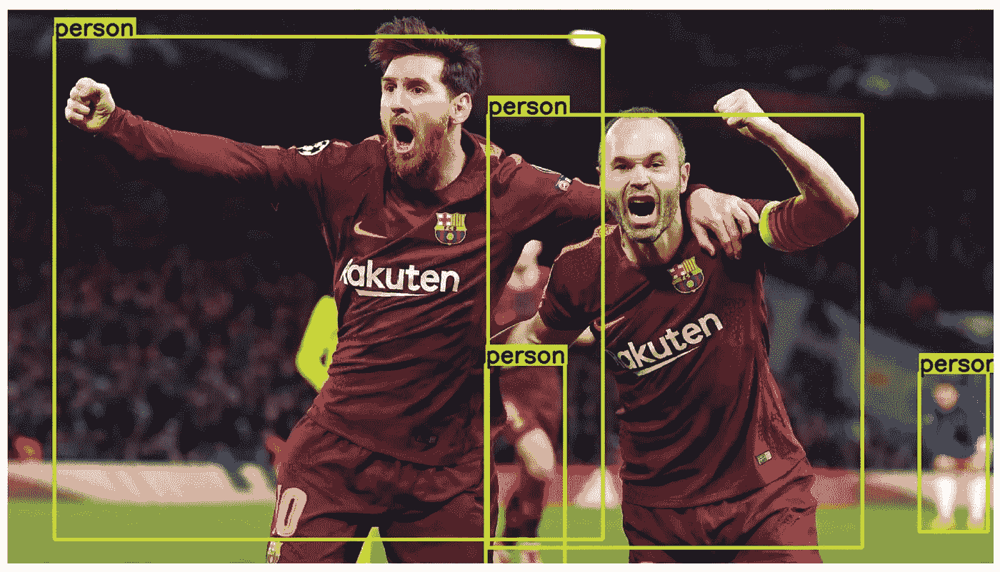
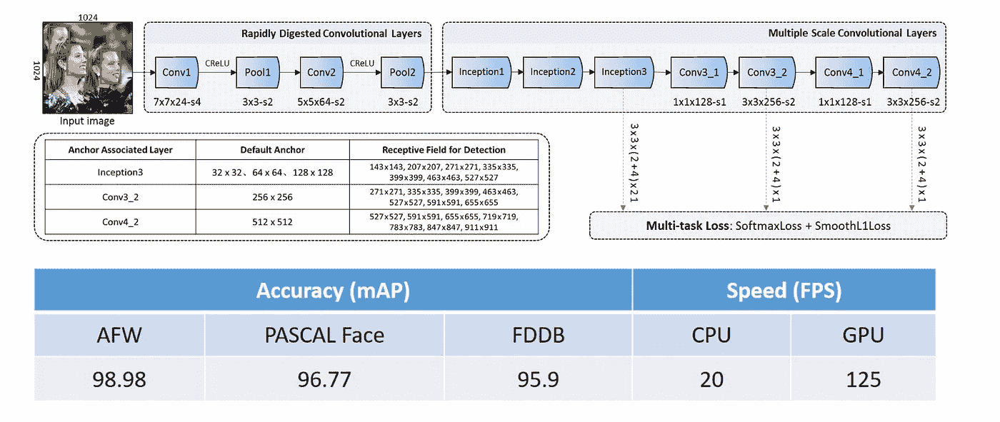
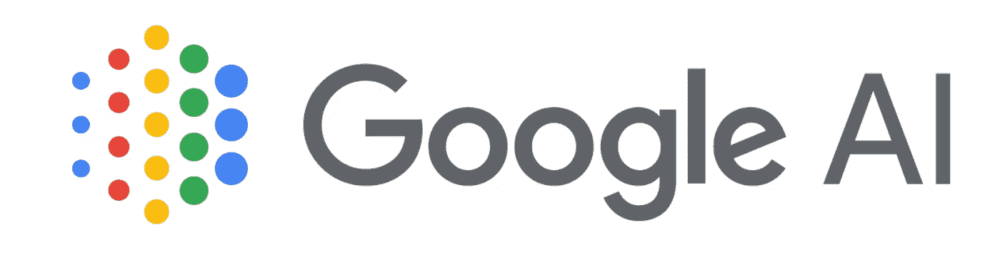

# 五大数据科学 GitHub 存储库和 Reddit 讨论(2019 年 1 月)

> 原文：<https://medium.com/analytics-vidhya/top-5-data-science-github-repositories-and-reddit-discussions-january-2019-theres-nothing-quite-cf4a6110810f?source=collection_archive---------1----------------------->

# 介绍

在数据科学领域，没有什么比 GitHub 和 Reddit 更好的了。在我的数据科学之旅中，这两个平台都给了我巨大的帮助。

GitHub 是托管代码的终极一站式平台。它擅长于简化团队成员之间的协作过程。大多数领先的数据科学家和组织都使用 GitHub 来开源他们的库和框架。因此，我们不仅能跟上我们领域的最新发展，还能在我们自己的机器上复制他们的模型！

Reddit 上的讨论也是如此。领先的研究人员和聪明的头脑聚集在一起，讨论和推断机器学习和数据科学的最新主题和突破。从这两个平台可以学到很多东西。

我已经养成了习惯，每周至少查看两次这两个平台。它改变了我学习数据科学的方式。我鼓励每个阅读这篇文章的人也这样做！

在本文中，我们将重点关注 2019 年 1 月以来最新的开源 GitHub 库和 Reddit 讨论。快乐学习！

*还可以浏览 2018 年* *起的* [*25 个最佳 GitHub 库。该列表包含涵盖多个不同领域的库，包括 NLP、计算机视觉、GANs、AutoML 等。*](https://www.analyticsvidhya.com/blog/2018/12/best-data-science-machine-learning-projects-github/)

# GitHub 仓库

# [Flair(最先进的 NLP 库)](https://github.com/zalandoresearch/flair)

2018 年是自然语言处理(NLP)的分水岭年。像 ELMo 和 Google 的 BERT 这样的库是突破性的版本。正如 Sebastian Ruder 所说，“ [NLP 的 ImageNet 时刻已经到来](http://ruder.io/nlp-imagenet/)”！

让我们在新的一年里保持这种趋势！Flair 是另一个优秀的 NLP 库，易于理解和实现。最棒的是。这是非常先进的！

Flair 由 Zalando Research 开发并开源，基于 PyTorch。该库在广泛的 NLP 任务上已经超越了以前的方法:

这里，F1 是准确度评估度量。我目前正在探索这个图书馆，并计划很快在一篇文章中写下我的想法。继续看这个空间！

# [face.evoLVe —高性能人脸识别库](https://github.com/ZhaoJ9014/face.evoLVe.PyTorch)

计算机视觉的人脸识别算法现在在数据科学中无处不在。我们在去年的 GitHub 系列中也介绍了一些库。将这一个添加到您必须尝试的不断增长的面部识别库列表中。

face.evoLVe 是一个基于 PyTorch 的“*高性能人脸识别库*”。它为面部相关分析和应用提供了全面的功能，包括:

*   人脸对齐(检测、界标定位、仿射变换)
*   数据预处理(例如，扩充、数据平衡、标准化)
*   各种骨干网(*如*，ResNet，DenseNet，LightCNN，MobileNet 等。)
*   各种损耗(*例如*、Softmax、Center、SphereFace、AmSoftmax、Triplet 等。)
*   提高绩效的锦囊妙计(*例如*、训练改进、模型调整、知识提炼、*等等。*)。

这个库是高性能深度人脸识别的实际使用和部署的必备工具，尤其是对研究人员和工程师而言。

# [约洛夫 3](https://github.com/wizyoung/YOLOv3_TensorFlow)

YOLO 是一个非常快速和准确的框架，用于执行对象检测任务。它是三年前推出的，此后经历了几次迭代，一次比一次好。

这个库是在 TensorFlow 中实现的 YOLOv3 的完整管道。这可以用于数据集来训练和评估您自己的对象检测模型。以下是该存储库的主要亮点:

*   高效的 tf.data 管道
*   重量转换器
*   极快的 GPU 非最大抑制
*   全面培训渠道
*   选择先验锚盒的 k-均值算法

**如果你刚到 YOLO，想要了解它是如何运作的，我强烈推荐你去看看这个重要的教程******。****

# **[FaceBoxes:高精度 CPU 实时人脸检测器](https://github.com/zisianw/FaceBoxes.PyTorch)**

****

**计算机视觉中最大的挑战之一是管理计算资源。不是每个人都有多个 GPU。这是一个很难克服的障碍。**

**加紧[面板盒](https://arxiv.org/abs/1708.05234)。这是一种新颖的人脸检测方法，使用 CPU 在速度和准确性上都表现出令人印象深刻的性能。**

**这个存储库在 FaceBoxes 的 PyTorch 实现中。它包含安装、训练和评估人脸检测模型的代码。不要再抱怨缺乏计算能力——今天就试试 FaceBoxes 吧！**

# **[谷歌 AI 的 Transformer-XL](https://github.com/kimiyoung/transformer-xl)**

****

**这是另一个改变游戏规则的 NLP 框架。看到它背后的谷歌人工智能团队并不奇怪(他们也是提出伯特的人)。**

**长期依赖一直是 NLP 的眼中钉。尽管去年取得了重大进展，但这个概念并没有得到很好的处理。RNN 和香草变压器使用，但他们不够好。现在，谷歌人工智能的 Transformer-XL 填补了这一空白。关于这个库，需要注意几个要点:**

*   **Transformer-XL 能够学习的远程依赖性比 RNNs 长 80%,比普通变压器长 450%**
*   **即使在计算方面，Transformer-XL 也比普通的 Transformer 快 1800 多倍！**
*   **由于长期依赖建模，Transformer-XL 在长序列上具有更好的困惑性能(在预测样本时更准确)**

**这个存储库包含 TensorFlow 和 PyTorch 中 Transformer-XL 的代码。看看你是否能在 NLP 中匹配(甚至击败)最先进的结果！**

# **一月份还创建了其他一些令人惊叹的数据科学存储库。请务必检查它们:**

# **Reddit 讨论**

****

# **[数据科学家是新的业务分析师](https://www.reddit.com/r/datascience/comments/aj6ohk/data_scientist_is_the_new_business_analyst/)**

**不要被标题中的热门话题所迷惑。这是一场关于数据科学现状以及世界各地如何教授数据科学的严肃讨论。**

**总是很难给不同的数据科学角色贴上特定的标签。功能和任务各不相同——那么谁应该学习什么呢？这篇文章探讨了教育机构是如何只讲述基本概念并声称教授数据科学的。**

**对于所有处于学习初级阶段的人，请确保浏览了这个讨论。你将了解到很多关于招聘人员如何看待拥有来自声称自己是数据科学家的机构的证书或学位的潜在候选人。**

**当然，您还将了解一些业务分析师的工作，以及这与数据科学家的角色有何不同。**

# **[数据科学中有什么让你大吃一惊的事情？](https://www.reddit.com/r/datascience/comments/aczhjc/what_is_something_in_ds_that_has_blown_your_mind/)**

**数据科学的哪一点让你惊叹不已？对我来说，是当我意识到我可以如何使用数据科学作为体育行业的游戏规则改变者的时候。**

**在这个讨论帖中有很多不可思议的理论和事实，会让你保持兴趣。以下是从帖子中摘出的几个很酷的答案:**

> **“世界上有多少可以用众所周知的分布来建模。这么多东西呈正态分布的事实，让我觉得我们是在模拟。”**
> 
> **“让我震惊并希望我从事数据科学职业的第一件事是，联合航空公司通过改变用于制作飞行杂志的纸张类型，每年节省 17 万英镑的燃料。”**

# **[顶尖数据科学家在职业生涯早期努力解决的问题](https://www.reddit.com/r/MachineLearning/comments/afl3t1/d_machine_learning_people_what_are_some_things/)**

**大多数数据科学家都承认，在最初的日子里，他们很难理解某些概念。即使是像归罪缺失的价值观这样简单的事情也可能成为令人沮丧的艰巨任务。**

**这个帖子是所有数据科学爱好者的金矿。它由经验丰富的数据科学家组成，分享他们如何设法学习或获得他们最初发现难以掌握的过去概念的经验。其中一些你可能很熟悉:**

*   ***“最难的部分是学习不同类型(DNN、RNN、CNN)的输入形状是如何工作的。我想我花了大约 20 个小时来弄清楚 RNN 输入的形状。”***
*   ***“每次都面临的挑战是在系统上设置开发环境。正在安装 CUDA，Tensorflow，PyCharm。那些总是恐怖和绝望的日子。”***
*   ***“配置 TensorFlow 与我的 GPU 一起工作需要几个小时的谷歌搜索和反复试验。”***

# **[深度神经网络为什么泛化能力好？](https://www.reddit.com/r/MachineLearning/comments/abj1mc/d_notes_on_why_deep_neural_networks_are_able_to/)**

**神经网络长期以来有一个“黑箱”的名声(现在不再是真的了)。当这个概念扩展到深度神经网络(DNNs)时，事情变得更加混乱。这些 dnn 是许多最新研究成果的核心，因此了解它们的工作原理至关重要。**

**这篇帖子中讨论的一个关键问题是深度神经网络如何推广得如此之好。如果你也有同样的想法，认为这个问题没有答案——准备好大吃一惊吧！**

**这条线索由深度学习专家提出的观点和观点组成。还包含了许多链接和资源来深入探讨这个主题。但请注意，对神经网络的基本理解将有助于你更多地参与讨论。**

**你可以在这里了解更多关于神经网络[的知识。](https://www.analyticsvidhya.com/blog/category/deep-learning/)**

# **AMA 和 DeepMind 的 AlphaStar 团队！**

**谷歌的 DeepMind 在他们创造的 AlphaGo 击败围棋冠军 Lee Sedol 时震惊了世界。他们又去做了一次！**

**他们的最新算法 AlphaStar 是在流行的星际争霸 2 游戏上训练出来的。AlphaStar 以令人印象深刻的 10 比 1 的优势击败了排名前两位的星际玩家。**

**这个 Reddit 讨论主题是由 DeepMind AlphaStar 的两位创始人举办的 AMA(问我任何问题)。他们与 Reddit 社区讨论了各种各样的话题，解释了算法如何工作，使用了多少训练数据，硬件设置是什么样的，等等。**

**讨论中涉及了几个有趣的问题:**

> **“需要打多少场比赛才能达到目前的水平？或者换句话说:200 年的学习对你来说是多少场？”**
> 
> **“还尝试了哪些其他方法？我知道人们很好奇是否会涉及到任何树搜索、深度环境模型或分层 RL 技术，看起来它们都没有；如果尝试，他们中有谁取得了令人尊敬的进步吗？”**

# **结束注释**

**2019 年是如何开始的！自然语言处理的进展速度非常快。请务必关注我即将发表的关于天赋的文章。当然，DeepMind 的 AlphaStar 也是强化学习的巨大突破。让我们希望这能很快在现实世界中模拟出来。**

**你对此有什么想法？你觉得哪个图书馆最有用？请在下面的评论区告诉我您的反馈。**

***原载于 2019 年 2 月 5 日*[*【www.analyticsvidhya.com*](https://www.analyticsvidhya.com/blog/2019/02/top-5-data-science-github-reddit-january-2019/)*。***