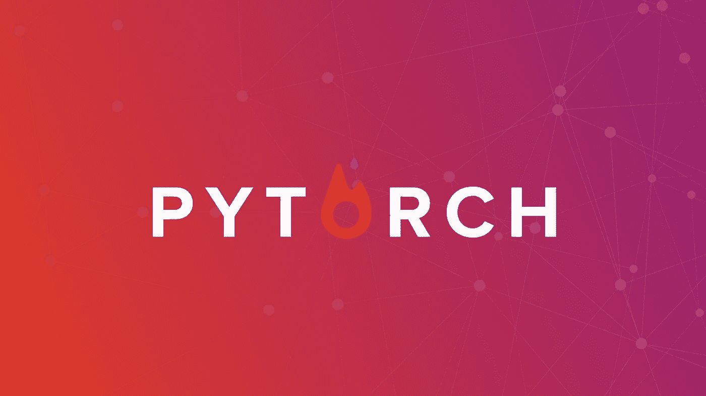

# 使用 PyTorch 学习深度学习的五大免费资源

> 原文：<https://medium.com/analytics-vidhya/top-5-free-resources-to-learn-deep-learning-with-pytorch-a92fd1d718bd?source=collection_archive---------7----------------------->

你应该在 2020 年完成的最好的 PyTorch 课程

在过去的几年里，PyTorch 一直受到关注，因为一些重要的研究企业，如今年早些时候(2020 年)转向 PyTorch 的 OpenAI，以及许多人工智能商店，如苹果、摩根大通和高通都进行了改编。此外，由于可以轻松地试验高级配置，PyTorch 是世界各地深度学习研究人员使用的主要库。

学习这个框架需要更有说服力吗？嗯…在这篇文章中，我将向你展示学习 Pytorch 的最佳免费资源。**多么美好的活着的时光啊！**

PyTorch。脸书开发的深度学习库

# 1.官方 Pytorch 教程

 [## 欢迎来到 PyTorch 教程— PyTorch 教程 1.4.0 文档

### 要了解如何使用 PyTorch，请从我们的入门教程开始。60 分钟的闪电战是最常见的开始…

pytorch.org](https://pytorch.org/tutorials/) 

显而易见的起点是 PyTorch 官方文档。事实上，PyTorch 社区已经创建了一套记录完善的教程，提供了从基础到构建各种数据的深度神经网络的指导路径，包括在生产中部署 PyTorch 模型、模型优化或并行计算等高级步骤。

你可以在 https://pytorch.org/tutorials/的[找到这个无价的资源](https://pytorch.org/tutorials/)

# 2.PyTorch 上的 DeepLizard 教程(YouTube 频道)

除了音乐、虚拟和游戏视频，YouTube 还有许多很棒的频道，可以教任何人任何东西。在 AI 和深度学习的最佳资源中，有一个被刑事低估的频道叫做 [**deeplizard**](https://www.youtube.com/channel/UC4UJ26WkceqONNF5S26OiVw) **。这真是一颗隐藏的宝石。**

Deeplizard 以令人印象深刻的制作质量呈现视频。这是中肯的，相关的，而且看起来很有趣。它使用了大量简洁的动画和图形。此外，在解释高级主题的同时，视频包括来自 DL 人物的短片和演讲，这使得学习过程更加动态，并帮助您保持动力。

除了频道上的精彩内容，deeplizard 还有一个[网站](https://deeplizard.com/)，里面有额外的资料，如代码文件和与每个特定视频相关的练习；以及深度学习的其他课程。

# 3.程序员实用深度学习(Fast.ai)

 [## 程序员实用深度学习，v3

### 欢迎光临！如果你是所有这些深度学习的新手，那么不要担心-我们将带你一步一步地完成它…

course.fast.ai](https://course.fast.ai/) 

**用莱克斯·弗里德曼的话说，** [**杰瑞米·霍华德是圣人**](https://www.youtube.com/watch?v=J6XcP4JOHmk&t=5044s) 。杰瑞米·霍华德是 Fastai 的讲师，在他的课上，他可以接触到最先进的研究和深度学习的进展。此外，Fastai 库可能是从深度学习开始并解决高级问题的最短路径。

在他们的课程中，杰瑞米·霍华德和他的团队遵循一种有趣的教学理念，即由教学整个游戏组成的教学理念。在这种特殊情况下，它意味着“从展示如何使用一个完整的、工作的、非常可用的、最先进的深度学习网络开始[…]。然后逐渐深入了解这些工具是如何制造的，以及制造这些工具的工具是如何制造的，等等……”

对于更高级的用户，您可以参加其他课程，如[面向编码人员的机器学习](http://course18.fast.ai/ml)、[从基础开始的深度学习](https://course.fast.ai/part2)和[自然语言处理](https://www.fast.ai/2019/07/08/fastai-nlp/)。

还有一本很好的书[可以免费获得](https://github.com/fastai/fastbook/blob/master/01_intro.ipynb)，它完全涵盖了课堂上介绍的内容。您也可以在此订购印刷版本[。](https://www.amazon.com/Deep-Learning-Coders-fastai-PyTorch/dp/1492045527)

莱克斯·弗里德曼没有错！

# 4.Pytorch 深度学习简介(Udacity)

 [## PyTorch 深度学习简介

### 在本课程中，您将学习深度学习的基础知识，并使用 PyTorch 构建自己的深度神经网络。你会…

www.udacity.com](https://www.udacity.com/course/deep-learning-pytorch--ud188) 

在本课程中，您将学习深度学习的基础知识，并使用 PyTorch 构建自己的深度神经网络。您将通过编码练习和实现最先进的人工智能应用程序(如样式转换和文本生成)的项目获得 PyTorch 的实践经验。

除了这门课程，你还可以加入脸书官方小组中一个庞大而充满活力的社区:[开发者圈子:机器学习](https://www.facebook.com/groups/959521250838697/)，它还在今年年初举办了最后一次“脸书 PyTorch 奖学金深度学习”挑战赛 Nanodegree。

# 5.用 Python 和 Pytorch 进行深度学习(Coursera)

 [## 深度神经网络与 PyTorch | Coursera

### 课程将教你如何使用 Pytorch 开发深度学习模型。课程将从 Pytorch 的…

es.coursera.org](https://es.coursera.org/learn/deep-neural-networks-with-pytorch) 

这个来自 IBM 的 MOOC 教你如何使用 PyTorch 开发深度学习模型，同时提供必要的深度学习背景。预计工作量为 24 小时，您可以涵盖从 PyTorch 的张量及其自动微分包到卷积神经网络和迁移学习的所有内容。

所有的内容都是免费的，但是如果你想要一个证书，你必须支付一些费用。然而，如果你没有钱，你可以向 Coursera [申请助学金](/@ghumare64/how-i-got-financial-aid-for-data-science-course-on-coursera-8880d281f9a2)，你很可能会得到；).

暂时就这样吧！在下面的博客文章中，你会找到使用 Tensorflow 学习深度学习的最佳资源。享受:)

 [## 2020 年学习 Tensorflow 的 5 个最佳资源

### 即使战争仍在进行中，TensorFlow 仍然是占主导地位的深度学习建模框架。事实上……

medium.com](/@roberto-terceros/the-5-best-resources-to-learn-tensorflow-in-2020-65b764a5fb8c)