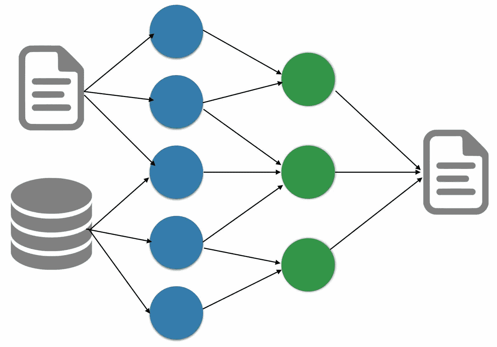

# 人工智能领域最热门的 5 项技术

> 原文：<https://medium.com/analytics-vidhya/top-5-hottest-technologies-in-ai-3d5a7d2c542?source=collection_archive---------34----------------------->

> ***本博客全部使用自然语言生成算法创建||约 90%的独特内容***

# 排名 1:自然语言生成

图片来源:[https://www . mashnlearn . com/2016/12/30/natural-language-generation/](https://www.mashnlearn.com/2016/12/30/natural-language-generation/)

技术在从海量数据集中发现见解并利用这些见解实现营销和业务目标方面发挥着重要作用。数据分析和机器学习在市场营销中有许多应用…