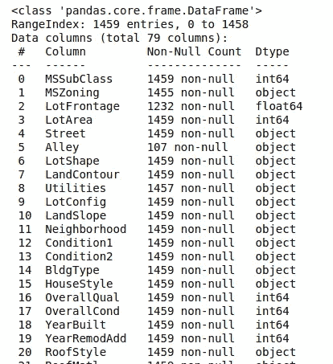

# 前 5%房价预测—初学者指南

> 原文：<https://medium.com/analytics-vidhya/top-5-housing-price-prediction-beginners-guide-dea7538dd992?source=collection_archive---------19----------------------->

本演练中使用的数据集是由 Dean De Cock 编译的用于数据科学教育的 [Ames Housing 数据集](http://www.amstat.org/publications/jse/v19n3/decock.pdf)，并被选择用于 [Kaggle 的房价:高级回归技术竞赛](https://www.kaggle.com/c/house-prices-advanced-regression-techniques/)。我参加了这个比赛，决定给数据科学新生做一篇文章。本指南将分为 4 个步骤:

1.  探测
2.  清洁
3.  特征工程
4.  建模和预测

# 探测

第一步是看看我们的特点，并对影响房价的因素做一些预测。更抽象地思考，房子的位置、面积、质量、新旧程度、豪华程度与基于个人经验的价格有很高的相关性。如果我们的预测得到证实，我们可以在以后的特征工程中使用它们。



下面我们可以看到我们的特征与我们的目标变量的绝对皮尔逊相关性。我们对影响房价的因素的猜测是正确的，让我们在以后的特征工程中记住这一点。请记住查看绝对相关性，因为有些要素可能具有很强的负相关性。


销售价格与功能的相关性

既然我们已经有了重要变量的概念，让我们从目标变量的单变量分析开始，因为它是最重要的。


销售价格直方图

该分布呈尖峰状(峰度)，正偏态(偏斜度)，明显偏离正态分布。下面你可以看到销售价格的值，如果你不知道这些值是什么意思，[看看这篇文章](https://codeburst.io/2-important-statistics-terms-you-need-to-know-in-data-science-skewness-and-kurtosis-388fef94eeaa)。

```
Skewness: 1.882876
Kurtosis: 6.536282
```

这种分布也存在于其他特征中，例如 GrLivArea。


GrLivArea 直方图

如果我们继续选择一个对[异方差](https://statisticsbyjim.com/regression/heteroscedasticity-regression/)(特性值中误差项的不等方差)敏感的模型，这将需要通过 Box-Cox 等变换或应用对数来解决。

我们分析了我们的目标变量，但是我们的特征与它有什么关系呢？这被称为双变量分析。下面我们可以看到 SalePrice 与 TotalBsmtSF 的散点图。似乎他们的关系是线性的(略呈指数关系？)我们可以开始看到一些异常值，如图表最右侧的房子，它有一个超过 6000 平方英尺的巨大地下室，但销售价格低，不跟随趋势。这个异常值可能是农村地区的一栋房子，这解释了价格和面积的差异。


销售价格 x 总 BsmtSF 散点图

同上。我们可以看到同样的离群值，居住面积超过 5000 平方英尺！我们将不得不删除它们，否则我们的模型将被离群值训练，我们的预测将会恶化。


SalePrice x GrLivArea 散点图

对于我的异常值移除，我手动检查了这些特征，并为它们中的每一个绘制了方框图和散点图，并分析了异常值，以查看它们是否真的应该被移除。

# 清洁

首先要做的是确保您的要素具有正确的数据类型。在这个数据集中，我们有许多列，如 YrSold、MoSold 和 YrBuilt，它们被视为数字，但它们应该被视为分类变量。


修复列数据类型

将一年视为一个分类变量似乎有些奇怪。但是，我们无法对这些数字进行合理的数学运算。这样想想，2000 年是 1000 年的两倍吗？它不是，我们不能这样推理，所以它应该是绝对的。

接下来，我们将删除丢失值百分比很高的所有列。


每列缺失值的百分比

剩余的列仍然有缺失值，我们必须对它们进行估算。我喜欢分别对待数字和分类特征，所以我将从数字特征开始。


缺少数字列

对于数字列，我用 0 填充了大部分缺失的值，因为这意味着该特征不存在于观测中。如果 GarageCars 或 TotalBsmtSF 缺失，则该房屋没有车库或地下室。我不同地估算的唯一一列是 LotFrontage，因为这可以由分区法确定，所以我用邻居的中间值来估算。


数字列的插补

我们将对分类列重复相同的过程。我用“无”替换了大部分缺失值，因为这意味着观察值不呈现特征，剩余的值用它们各自的模式进行估算。对于输入 MSZoning 列，该模式取自同一 MSSubClass 的观测值，该观测值确定了所售房屋的类型。


分类列的插补

我们的最后一步将是通过使我们的数据更像高斯来修复偏斜，并删除方差非常低的特征，因为它们对机器学习模型没有信息。

*   还有更复杂的方法来使我们的特征更正常，例如使用 Box-Cox 或 Yeo-Johnson 变换，但我将只使用简单的 log(x + 1)变换。我添加这个常量是因为我们的一些特性比如 TotalBsmtSF 可以是 0，而 log(0)是不可能的。
*   低方差特征是无意义的，因为我们的模型会过度拟合具有不同值的观察值。如果该列中的主要值超过 99.5%，则该值将被删除。

在下图中，我们可以直观地看到对数变换后我们的数据更接近高斯分布(正态分布)。


对数变换后的 GrLivArea


对数变换后的销售价格

# 特征工程

这就是创造力发挥作用的地方。还记得我在探索部分提到的定义房子价格的抽象属性吗？我们将使用这些属性来帮助我们思考，并从现有的属性中创建更多的功能。这可以提高你的分数这么多，有比赛已经赢得了令人印象深刻的功能工程，而不是使用先进的模型。下面你可以看到一些新的数字特征，如 YearsSinceBuilt 和 TotalOccupiedArea，它们指的是我们之前讨论过的新度和大小。

我们还可以从分类列中创建特征！我们的一些分类列是有序的，这意味着它们有一个自然的排序，我们可以使用它来创建新的特性。每个值都被一个代表其“等级”的整数所取代。

```
map1 = {'Ex': 5, 'Gd': 4, 'TA': 3, 'Fa': 2, 'Po': 1, 'None': 0}train_test_features["TotalGarageQual"] = train_test_features["GarageQual"].replace(map1) * train_test_features["GarageCond"].replace(map1)
train_test_features["TotalExteriorQual"] = train_test_features["ExterQual"].replace(map1) * train_test_features["ExterCond"].replace(map1)
```

如果您想知道为什么我没有对列本身应用这种编码，这是因为每种类型之间的距离对查看者的判断很敏感，并且不一定相等，所以我决定让它们保持原样，稍后进行热编码。我仍然将它们映射成这些新特性，因为它们为我们的模型提供了信息，并且这种权衡与实际编码序数列不同。

# 建模

好玩的部分来了，机器学习！我决定使用 sklearn 库中的 VotingRegressor，它基本上结合了多个回归变量，并对预测进行平均，以生成最终的预测。我使用了哪些基础模型？

*   套索
*   山脉
*   弹性网
*   梯度推进回归器

我们的数据有很多线性关系，所以我使用了 Lasso、Ridge 和 ElasticNet，它们是线性回归的常用回归变量。它们基本上实现了常见的最小二乘线性回归，但是对于具有高值的系数有一个惩罚。Lasso 回归甚至可以将一些系数设置为 0，并删除不重要的变量

GradientBoostingRegressor 是唯一的一个例外，因为它不一定用于线性回归，但我添加了它来平衡线性回归模型假设的偏差。


预测代码

你可以超调参数，为模型找到更好的系数，但我决定让它简单，让它保持原样。此外，请记住将预测转换回来，因为我们的模型将输出它们，就好像它们也经过了对数变换一样。在 NumPy 中，您可以使用 exmp1 函数来实现这一点。

# 结果

```
np.sqrt(-cross_val_score(pipe, X_train, y_train, scoring='neg_mean_squared_error')).mean()
```

在训练数据上对我们的模型进行交叉验证后，最终得分为 0.1002929，在 Kaggle 上，官方得分为 0.12070，在我写这篇文章时，这是本次比赛得分最高的 5%。

我希望这对您的数据科学之旅有所帮助和启发，如果您想要我的 Jupyter 笔记本，我很乐意将它送给您。