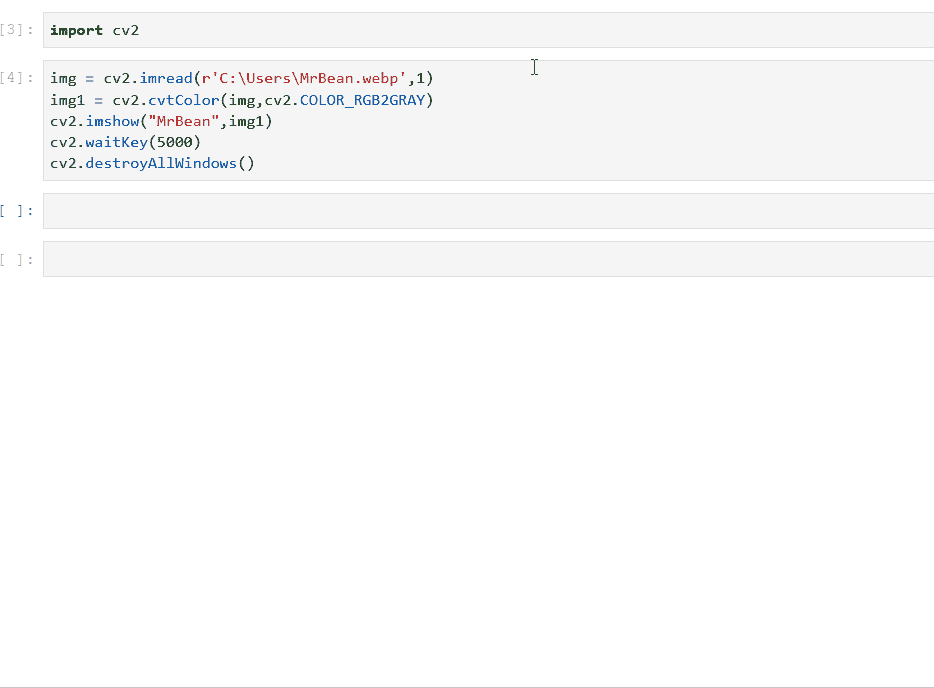

# 使用 Python 的 OpenCV 初学者不可避免的五大方法

> 原文：<https://medium.com/analytics-vidhya/top-5-inevitable-methods-for-beginners-in-opencv-using-python-9ff8e7ddb5ae?source=collection_archive---------5----------------------->

# 简介:

作为一个初学者，当你开始使用 opencv 时，有必要了解一些在你的 OpenCV 项目中几乎每次都会用到的方法。下面列出了 OpenCV 中最常用的五种方法(记住 OpenCV 是作为 cv2 导入的)

# 1.cv2.imread()

opencv 中的 imread 方法，通常称为 image read，用于从文件路径中读取图像

**参数:cv2.imread(文件名[，标志])**

在上面的参数中，您可以看到强制要求是可以作为字符串传递的文件名。文件名是您希望计算机读取的图像。

注意:alpha 通道是决定图像透明度的通道

**示例:img = cv2 . im read(r ' c:\ Users \ mrbean . webp '，0)**

# 2.cv2.imshow()

顾名思义，这种方法用于显示图像

**参数:cv2.imshow(window_name，image)**

window_name 应该是一个字符串值，因此应该用双引号或单引号引起来。该图像应该是应该的图像

**示例:cv2.imshow("MrBean "，img)**

# 3.cv2.cvtColor()

cvtColor 可以解释为 convert color，该方法用于将图像从一个颜色空间转换到另一个颜色空间(如果您不知道什么是颜色空间，请在此处查找

**参数:cv2.cvtColor(src，code[，dst[，dstCn]])**

src 是您想要更改其色彩空间的源图像。代码是指定“源图像应该转换到哪个颜色空间”的代码。由于其他参数不是强制性的，作为初学者，您可以暂时跳过它

**例子:cv2.cvtColor(img，cv2。颜色 _ RGB 2 灰色)**

# 4.cv2.waitKey()

这个函数非常重要，没有这个函数 cv2.imshow()就不能正常工作。

**参数:cv2.waitkey(以毫秒为单位的等待时间)**

因此，如果输入等待时间为 6000，图片将显示 6s，然后关闭(假设脚本中有 cv2.destroyAllWindows())。如果您使用“0”作为参数，那么图像将无限期显示，直到您按下 esc 键。

**示例:cv2.waitKey(0)**

# 5.cv2.destroyAllWindows()

这个方法破坏(换句话说就是“关闭”)所有使用 opencv 方法创建的窗口。如果您想要关闭一个特定的窗口，那么您可以将窗口名称作为参数传递给这个函数

**参数:使用 opencv 打开的窗口的名称(非强制)**

如果在脚本末尾没有提供 cv2.destroyAllWindows()，可能会导致窗口打开时崩溃

# 总结这些例子:

找到上面提到的方法，如下例所示:

你注意到上面三张图中 cv2.imread()的标志值了吗？如果没有，向上滚动，查看不同标志值的输出如何变化。

现在来看看 cv2.cvtColor 在下面两幅图中是如何工作的

蓝豆:P

哈哈，看到 c2.cvtColor 怎么把我们的憨豆先生改成蓝豆了吧？，你也可以探索的方法转换成红豆和绿豆豆先生了！！

希望 opencv 方法已经变得有趣了。

现在让我们使用下面的 gif 图片来看看 cv2.waitkey()中的指定值是如何工作的

# 结论:

现在你已经掌握了读取、显示、转换颜色和让图像在关闭前等待几秒钟的基本方法，你可以开始探索用于图像处理的其他方法。

如果这对你有用，别忘了留下两个掌声:)

> **问候，**
> 
> **维格内什·卡希尔卡马尔**
> 
> [**艾皮利努斯**](https://aipylinux.quora.com/)