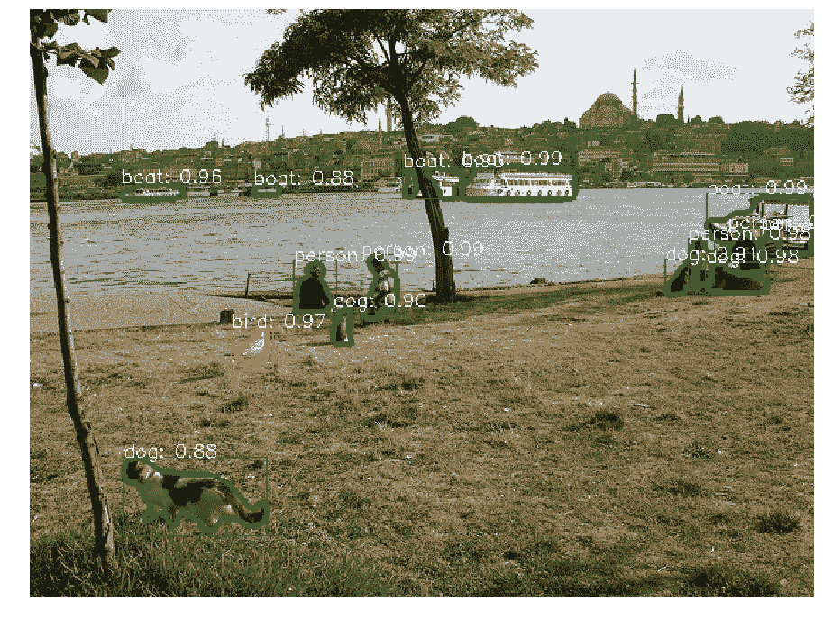

# 五大机器学习 GitHub 知识库和 Reddit 讨论(2018 年 10 月)

> 原文：<https://medium.com/analytics-vidhya/top-5-machine-learning-github-repositories-reddit-discussions-october-2018-2da39656819d?source=collection_archive---------1----------------------->


"我的项目应该使用 GitHub 吗？"—有抱负的数据科学家经常问我这个问题。对此只有一个答案——“当然！”。

对于希望脱颖而出的数据科学家来说，GitHub 是一个无价的平台。这是一份在线简历，向招聘人员和其他专业人士展示你的代码。GitHub 托管来自谷歌、脸书、IBM、英伟达等顶级科技巨头的开源项目。是什么增加了已经闪闪发光的产品的光泽。

如果你是数据科学的初学者，甚至是公认的专家，你应该有一个 GitHub 帐户。为了节省您寻找最有趣的存储库的时间(这里有很多)，我很高兴在这个每月一期的系列文章中搜索这个平台并把它们直接带给您。

本月的收集来自各种各样的用例——计算机视觉(对象检测和分割)，PyTorch 实现谷歌人工智能破纪录的 BERT 框架用于 NLP，提取最新的研究论文及其摘要，等等。向下滚动开始学习！

为什么我们在这个系列中包括 Reddit 讨论？我个人认为 Reddit 是一个令人难以置信的有益平台，原因有很多——丰富的内容，顶级机器学习/深度学习专家花时间提出他们的想法，令人惊叹的各种主题，开源资源等。我可以说一整天，但是我强烈推荐浏览我列出的这些线索——它们以自己的方式独特而有价值。

*你可以查看我们每个月在下面报道的 GitHub 知识库和 Reddit 讨论(从四月开始):*

*   [*一月*](https://www.analyticsvidhya.com/blog/2018/02/top-5-github-repositories-january-2018/)
*   [*二月*](https://www.analyticsvidhya.com/blog/2018/03/top-5-github-repositories-february-2018/)
*   [*三月*](https://www.analyticsvidhya.com/blog/2018/04/top-7-github-repositories-march-2018/)
*   [*四月*](https://www.analyticsvidhya.com/blog/2018/05/top-5-github-reddit-data-science-machine-learning-april-2018/)
*   [*五月*](https://www.analyticsvidhya.com/blog/2018/06/top-5-github-reddit-data-science-machine-learning-may-2018/)
*   [*六月*](https://www.analyticsvidhya.com/blog/2018/07/top-github-reddit-data-science-machine-learning-june-2018/)
*   [*七月*](https://www.analyticsvidhya.com/blog/2018/08/best-machine-learning-github-repositories-reddit-threads-july-2018/)
*   [T5【八月】T6](https://www.analyticsvidhya.com/blog/2018/09/best-machine-learning-github-repositories-reddit-threads-august-2018/)
*   [*九月*](https://www.analyticsvidhya.com/blog/2018/10/best-machine-learning-github-repositories-reddit-threads-september-2018/)

# GitHub 仓库


# [py torch 1.0 中更快的 R-CNN 和屏蔽 R-CNN](https://github.com/facebookresearch/maskrcnn-benchmark)



如今，计算机视觉已经变得如此令人难以置信地流行，以至于各种组织都在争先恐后地在他们的产品中实现和集成最新的算法。听起来是一个非常令人信服的赶时髦的理由，对吗？

当然，物体检测无疑是这个领域中最受欢迎的技能。这是一个来自脸书的非常酷的项目，旨在使用他们流行的 PyTorch 1.0 框架为创建分割和检测模型提供构建模块。脸书声称，这比它的 Detectron 框架快两倍，并且带有预先训练的模型。足够的资源和细节来开始！

如果你需要快速复习的话，我鼓励你去看看[对基本物体检测算法的逐步介绍](https://www.analyticsvidhya.com/blog/2018/10/a-step-by-step-introduction-to-the-basic-object-detection-algorithms-part-1/)。如果你想熟悉 PyTorch 的基础知识，可以看看这个非常棒的初学者友好教程。

# [腾讯 ML 图片(最大的开源多标签图片数据库)](https://github.com/Tencent/tencent-ml-images)


这个存储库是所有深度学习爱好者的金矿。对标题感兴趣？只要等到你检查关于这个数据集的一些数字:17，609，752 个训练和 88，739 个验证图像 URL，它们被注释了多达 11，166 个类别。难以置信！

该项目还包括一个预训练的 Resnet-101 模型，该模型目前已经通过迁移学习在 ImageNet 上实现了 80.73%的准确率。该存储库包含关于如何以及从哪里开始的详尽的细节和代码。这是向公众提供高质量数据的重要一步。

哦，我有没有提到这些图片是有注释的？您还在等什么，现在就开始下载吧！

# [PyTorch 实现 Google AI 的 BERT (NLP)](https://github.com/codertimo/BERT-pytorch)


等等，又一个 PyTorch 条目？这显示了这个框架有多受欢迎。对于那些没有听说过 BERT 的人来说，它是一种语言表示模型，代表来自转换器的**B**I 方向**E**n 编码器 **R** 表示。听起来很拗口，但是一直在机器学习界兴风作浪。

BERT 在 11 个自然语言处理(NLP)任务中设定了各种新的基准。一个预先训练好的语言模型被广泛应用于 NLP 任务中，对一些人来说可能听起来很奇怪，但是 BERT 框架已经把它变成了现实。它甚至在流行的小组问答测试中明显超过了人类。

这个存储库包含在您自己的机器上实现 BERT 的 PyTorch 代码。正如谷歌大脑的研究科学家 Thang Luong 在推特上所说，这很可能是自然语言处理新时代的开始。

如果你有兴趣阅读研究论文，也可以在[这里](https://arxiv.org/abs/1810.04805)找到。如果你(像我一样)渴望看到官方的谷歌代码，书签(或星星)[这个库](https://github.com/google-research/bert)。

# [摘录最新 Arxiv 研究论文及其摘要](https://github.com/chiphuyen/sotawhat)


我们如何才能在机器学习的最新研究中保持领先？似乎我们几乎每周都会看到突破，要跟上它们是一项艰巨的挑战，如果不是完全不可能的话。大多数顶级研究人员都在 arxiv.org 上发布他们的完整论文，那么有没有办法整理出最新的论文呢？

有，有！这个存储库使用 Python (v3.x)通过抓取 arxiv 论文并总结其摘要来返回最新的结果。这是一个非常有用的工具，因为它将帮助我们了解最新的论文，并让我们选择我们想要阅读的论文。如存储库中所述，您可以运行下面的命令来搜索关键字:

```
$ python3 sotawhat.py "[keyword]" [number of results]
```

如果您未能指定想要多少个实例，默认情况下，脚本会返回五个结果。

# [深度模仿](https://github.com/xbpeng/DeepMimic)


我总是试图在这些列表中包括至少一个强化学习知识库——主要是因为我觉得这个领域的每个人都应该了解这个领域的最新进展。而本月的参赛作品更是引人入胜——深度强化学习的动作模仿。

该知识库是 SIGGRAPH 2018 上提交的“ [DeepMimic:基于物理的角色技能](https://xbpeng.github.io/projects/DeepMimic/index.html)的示例引导的深度强化学习”论文的实现。引用知识库中的话，“该框架使用强化学习来训练一个模拟的人形机器人来模仿各种运动技能”。查看上面的项目链接，其中包括如何自己实现这个框架的视频和代码。

# [奖金:由谷歌人工智能提供的津贴](https://github.com/tensorflow/adanet)


我不能忽略这个非常有用的知识库。AdaNet 是一个轻量级和可扩展的基于 TensorFlow 的框架，用于自动学习高质量的模型。它最好的部分是你不需要过多的干预——这个框架足够智能和灵活，可以构建更好的模型。

你可以在这里阅读更多关于 T4 的信息。像往常一样，谷歌在解释复杂概念方面做得很好。

# Reddit 讨论


# [未来 5 年，我们可以期待机器学习的哪些发展？](https://www.reddit.com/r/MachineLearning/comments/9rtc7q/d_what_developments_do_you_expect_to_see_in/)

啊，每个人心中的疑问。autoML 会独领风骚吗？硬件会有怎样的进步？最终会有围绕伦理道德的官方规则和政策吗？机器学习会将自己融入社会结构吗？强化学习最终会在行业中找到一席之地吗？

这些只是这次讨论中提出的许多想法中的一部分。每个人都有自己的预测，他们期待什么，他们想看到什么，这个讨论很好地将两者结合起来。技术和非技术话题之间的对话各不相同，因此您可以自由选择您更喜欢阅读的话题。

# [给管理机器学习研究人员的非 ML 工程师的建议](https://www.reddit.com/r/MachineLearning/comments/9mbo2g/d_whats_your_advice_to_an_engineer_that_manages/)

有趣的话题。我们以前看到过这种趋势——一个非 ML 的人被指派领导一个 ML 专家团队，这通常以双方都感到沮丧而告终。由于各种各样的原因(时间限制是最重要的)，经常感觉事情陷入了僵局。

我恳求所有项目经理，领导，cxo 等。花点时间浏览一下这个讨论主题。有一些真正有用的想法，你可以尽快在自己的项目中实现。让所有技术人员和非技术人员达成共识是整个项目成功的关键，因此领导者树立正确的榜样非常重要。

# [机器学习项目的主题创意](https://www.reddit.com/r/MachineLearning/comments/9nu9hs/d_grad_students_of_rml_whats_your_topic_why_is_it/)

寻找一个新的项目进行实验？或者论文需要思路？你降落在正确的地方。这是一个想法的集合，研究生正在努力磨练和微调他们的机器学习技能。其中一些让我印象深刻的是:

*   预测行人的轨迹
*   通过声学估计天气现象(使用信号处理和机器学习)
*   使用深度学习改进助听器语音处理管道

这就是 Reddit 变得如此有用的地方——你可以在这个讨论中提出你的想法，你会收到来自社区的关于如何应对挑战的反馈。

# [为什么机器学习论文有这么可怕的数学？](https://www.reddit.com/r/MachineLearning/comments/9l7j46/d_why_do_machine_learning_papers_have_such/)

这是一个完全技术性的讨论，您可能已经从标题中了解到了。这是一个完全主观的问题，答案取决于读者的经验水平和研究人员如何表达他/她的想法。我喜欢这个讨论，因为有非常具体的链接研究论文的例子，所以你可以探索它们并形成自己的观点。

众所周知(也是公认的)事实是，相当多的论文都是将数学和发现拼凑在一起——不是每个人都有耐心、意愿甚至能力以清晰的方式展示他们的研究。尽你所能提高你的演讲技巧总是一个好主意。

# [围绕机器学习大肆宣传的弊端](https://www.reddit.com/r/MachineLearning/comments/9p9ccz/d_ml_is_losing_some_of_its_luster_for_me_how_do/)

当他们的领域开始受到新手的大量关注时，成熟的专业人士是什么感觉？这是一个有趣的问题，可能会跨越多个领域，但这个主题专注于机器学习。

这本质上不是一个技术讨论，但有趣的是，顶级数据科学家和应用机器学习专业人士对该领域最近的兴趣激增有何感受。讨论有 120 多条评论，富有思想和建议。当谈到如何与非技术领导和团队成员打交道时，事情变得特别有趣。这里有大量的创意可以借鉴！

# 结束注释

今年真的看到了一些惊人的开源研究。无论微软正式收购 GitHub 后会发生什么，它仍然是程序员、开发人员和数据科学家之间合作的主要平台。我恳求阅读这篇文章的每个人开始更经常地使用 GitHub，即使只是为了浏览最新的存储库。

哪个 GitHub 库和/或 Reddit 讨论让你印象深刻？您认为我应该在本文中包含其他的库或框架吗？请在下面的评论区告诉我。

*原载于 2018 年 11 月 1 日*[*【www.analyticsvidhya.com】*](https://www.analyticsvidhya.com/blog/2018/11/best-machine-learning-github-repositories-reddit-threads-october-2018/)*。*