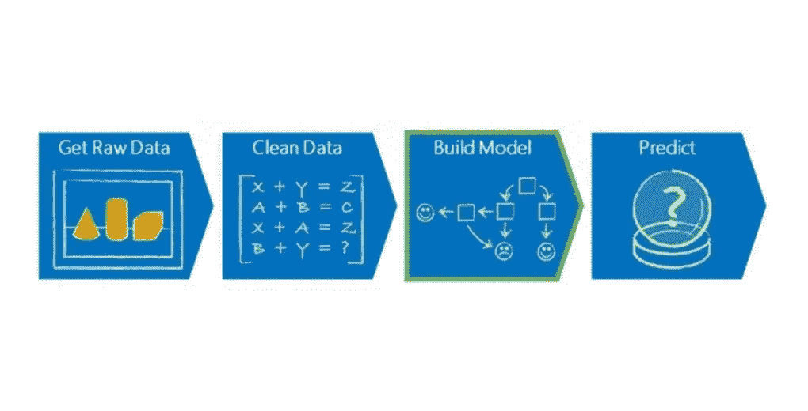
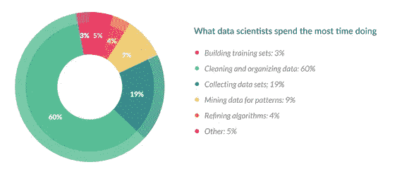
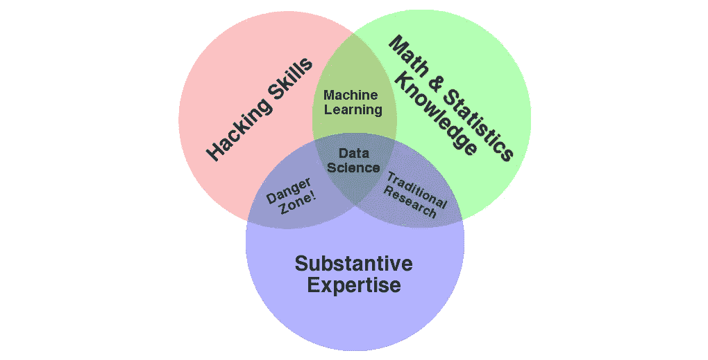

# 5 大必读答案—数据科学家每天都在做什么？

> 原文：<https://medium.com/analytics-vidhya/top-5-must-read-answers-what-does-a-data-scientist-do-on-a-daily-basis-b85e5d2cba51?source=collection_archive---------0----------------------->

# 概观

*   数据科学家的日常工作是什么？一个流行且必须知道的问题
*   我们从数据科学家的角度，通过来自经验丰富的数据科学家的 5 个详细而深刻的答案来分析这个问题

# 介绍

我天生是个好奇的人。每当我遇到一个我以前没有听说过的概念，我就迫不及待地挖掘并找出它是如何工作的。这在我自己的[数据科学](https://courses.analyticsvidhya.com/courses/applied-machine-learning-beginner-to-professional?utm_source=blog&utm_medium=what-does-data-scientist-do-daily-basis-top-5-quora-answers)旅程中非常有用。

但在我第一次在数据科学领域获得突破之前，我一直很好奇数据科学家每天到底在做什么。我应该一直简单地建立模型吗？或者，经常被引用的关于花费我们 70–80%的时间清理数据的说法实际上是真的吗？

我相信你也问过(或者至少想知道)这个问题。数据科学家的角色可能是“21 世纪最性感的工作”，但这意味着什么呢？

我决定研究这个。我想拓展我的视野，了解数据科学家如何看待他们在不同领域(如 NLP)中的角色。这帮助我对我们的角色有了更广泛的理解，以及为什么在涉及数据科学时我们应该总是阅读不同的观点。

因此，这里列出了前 5 个答案，以帮助您了解数据科学家的典型日常工作。准备好大吃一惊吧——构建模型并不是数据科学家日常任务中的主要(也是唯一)功能！

**我也鼓励你在这里参加** [**关于这个问题的讨论**](https://discuss.analyticsvidhya.com/t/what-does-a-data-scientist-do-on-a-daily-basis-share-your-experience-and-hear-from-experts/82223) **。这将丰富您当前对数据科学家工作的理解，您的想法将在我们的社区中引发讨论！**

*注意:我从 Quora 上一字不差地摘录了答案，并在每个答案的开头添加了我的想法。这将有助于你很好地理解答案所涵盖的内容，而不会冲淡作者的想法。尽情享受吧！*

# [机器学习是非常面向过程的](https://www.quora.com/What-do-you-do-as-a-data-scientist-on-a-daily-basis) —迈克·韦斯特

我喜欢这个答案，因为它干脆、中肯、简单。作者甚至设计了一个流程图，并用一种精彩的图解方式解释了他的思维过程。以下是他的完整回答:

机器学习是非常面向过程的。因此，我总是在下面某张照片的某个地方:

机器学习工程师在前两张图片(或阶段)上花费了大量时间。有趣的部分确实在第三阶段，但这只是现实世界中发生的一小部分。

关于现实世界中的数据科学，需要记住的一些关键事项:

1.  **几乎所有的应用机器学习都是有人监督的。**这意味着我们针对结构化数据集构建模型
2.  **数据争论是现实世界中发生的很大一部分事情**
3.  **当你听到监督这个词时，想想分类和回归。**我的大部分模型都是分类问题
4.  模型制作大约是我工作的 20%。没错，就是它！
5.  **很多中小公司根本不用深度学习。**为什么？因为像 XGBoost 这样的结构化数据算法每次都会赢
6.  我做的一切都是程序化的
7.  大多数真实世界的数据驻留在关系数据库中。**您的工作将是创建查询以提取您需要的数据**
8.  大数据是非结构化数据。**如果你必须针对大数据构建模型，那么你需要学习另一套技能**
9.  乌云在这里停留。**我对非常大的结构化数据使用 BigQuery。**大多数大型模型无法在您的笔记本电脑上构建
10.  电脑是单语的。他们只会说数字。当您将数据传递给模型时，您传递的是一个高度结构化的、经过良好清理的数值数据集。

# [数据科学家日常角色的百分比细分](https://www.quora.com/What-is-your-day-to-day-work-as-a-data-scientist)—Vinita silaparasety

我很喜欢维尼塔对视觉化的运用。每个数据科学任务的百分比描述都很有帮助，也很有见地。Vinita 还根据自己的经验解释了数据科学家的一步一步工作。是必读答案！

与普遍的看法相反，数据科学并不都是魅力所在。CrowdFlower 的以下调查结果准确总结了数据科学家典型的一天:

这涉及到大量的回溯。有时你甚至需要能够预测删除/添加一个变量可能会有什么后果。

*   **收集数据集**:数据是数据科学的生命线，所以我们花了大量的时间来管理它。在极少数情况下，一些项目可能已经有大量数据
*   **清理&整理数据:这是整个过程中最耗时也是最关键的一步。**这对最终结果有很大影响。通常，在这一步之后，曾经大量的数据会减少，因此我们可能需要收集更多的数据来进行有效的训练
*   **数据挖掘:**数据挖掘是检查大型已有数据库以生成新信息的实践。一旦数据被组织并存储在数据库中，我们就可以通过发现数据中的模式来从中获取价值
*   **建立训练集&测试集:**一旦我们有了相当数量的数据，**我们需要把它分成训练集和测试集。**训练集是一组用于发现潜在预测关系的数据。它包含关于预期输出的所有信息。测试集是用于评估预测关系的强度和效用的一组数据。它包含混合变量
*   **细化算法:**我们从骨架算法开始。这是非常基本的，粗略地定义了预期的输出。几个环节下来，准确度，精密度等。并且算法被改进以最大化其效率

# [来自小型公司的数据科学家视角](https://www.quora.com/What-is-an-average-work-day-for-a-data-scientist) —贾斯汀·菲斯特尔

这是一个极好的答案，也是一个我能理解的答案。注意，机器学习，一个数据科学家工作中最值得期待的方面，只占总时间的 5%！就像维尼塔一样，他也用百分比来解释他的任务。以下是贾斯汀的观点:

*   **NLP 相关任务(15%)** 。毫不奇怪，PaperRater 的自动校对技术需要大量使用解析器、标记器、正则表达式和其他 NLP 好东西作为核心算法和反馈模块的一部分
*   **机器学习(5%)** 。这往往是最令人愉快的部分。数据清理、特征提取/工程/选择和模型构建
*   **报告和分析(10%)** 。运行查询、审查分析和协助战略决策
*   **数据管理(5%)** 。设置和管理数据库服务器，包括 MySQL、Redis 和 MongoDB。较大的项目可能需要 Hadoop 或 Spark
*   **通用软件开发(40%)** 。许多数据科学家都有计算机科学的背景，所以如果你有合适的背景，就要准备好加入进来。API 集成，网络开发，以及任何我能增加价值的地方。即使在人工智能初创公司，大部分开发也不会涉及人工智能
*   **其他(25%)** 。这包括各种各样的任务，包括博客帖子、营销、管理、技术文档、技术支持、网站文案、电子邮件、会议等。

# “数据科学家”有点像神话

作者 Tim Kiely 使用维恩图来解释什么是数据科学。只要看看下面这张维恩图——它会让你大吃一惊。Tim 还谈到了数据科学家应该是什么样的人，他对一般定义的看法有些矛盾。以下是蒂姆的回答:

在我看来,“数据科学家”有点荒诞。这并不是说它们不存在，而是它们比人们普遍理解的要罕见得多，更像是例外而不是规律。

我把它比作网络泡沫中的“网络大师”——这些假定的人可以做全栈编程、前端开发、市场营销等等。所有这些角色/技能一直都是专业化的，今天依然如此。

“数据科学家”应该是数据库架构师，理解分布式计算，对统计学和一些业务领域或领域专业知识有深刻的理解。当这些技能中的任何一个都需要一个职业生涯来建立时，这是一个很高的要求。

与我一起工作的数据科学家通常拥有人工智能或机器学习的博士学位，并且是有效的沟通者，这使他们能够指导分析师、开发人员、程序员和数据库管理员使用数据驱动的解决方案来解决问题。他们概述了所需的解决方案，并将其留给他们的团队来填补空白。

# [从事 NLP 任务的机器学习工程师](https://www.quora.com/What-do-data-scientists-and-data-analysts-do-on-a-daily-basis) —埃文·皮特·沃什

让我们深入研究机器学习的一个特殊领域。我的最爱之一——！我想在这里提出一个机器学习工程师的观点(每个数据科学家都应该熟悉的角色)。看看 Evan 的完整回复:

目前主要致力于自然语言处理，包括意图分类和实体抽取。这是我典型的一天:

*   开始工作，打开 GitHub，在 ZenHub 板上查看(有点像吉拉，除了酷多了)。我有一些模型昨晚在我们的服务器上训练，我应该收到他们完成的电子邮件。我做到了。
*   我可能会花几分钟测试这些新模型，然后调整一些参数，然后重新开始训练过程
*   一天的其余时间，我通常是埋头编码，要么是开发一个后端 Python 应用程序，为我们的一个产品提供人工智能，要么是实现一个我想尝试的新算法
*   例如，最近我读了一篇关于耦合模拟退火(CSA)的论文，我想尝试调整 XGBoost 的参数，作为网格搜索的替代方法。CSA 是模拟退火(SA)的推广形式，它是一种优化函数的算法，不使用函数导数的任何信息
*   不幸的是，我找不到 Python 中的实现，所以我决定自己写。两天后，我向 PyPI 提交了我的第一个包！

# 结束注释

数据科学家的角色确实是多方面的，不是吗？许多有抱负的数据科学家认为他们将主要整天构建模型，但事实并非如此。

在一个典型的数据科学项目中，您会发现自己每天都在从事各种各样的任务。我很喜欢这一点，因为它开辟了学习新概念并将其应用于现实世界的途径。

我将在 Analytics Vidhya 上发布更多与职业相关的文章，敬请关注并继续学习！

你也可以在分析 Vidhya 的 Android 应用上阅读这篇文章

相关文章

*原载于 2019 年 6 月 27 日*[*【https://www.analyticsvidhya.com】*](https://www.analyticsvidhya.com/blog/2019/06/what-does-data-scientist-do-daily-basis-top-5-quora-answers/)*。*