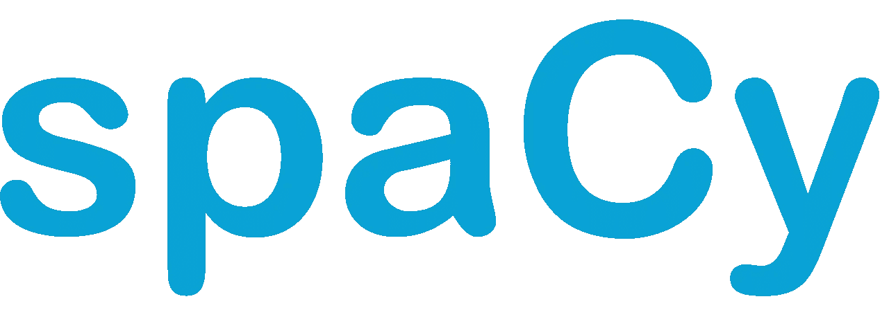

# 面向数据科学家的 5 大自然语言处理 Python 库。

> 原文：<https://medium.com/analytics-vidhya/top-5-natural-language-processing-python-libraries-for-data-scientist-32463d36feae?source=collection_archive---------1----------------------->

## 以非冗长的方式全面概述了用于自然语言处理的流行 python 库。


马库斯·斯皮斯克在 [Unsplash](https://unsplash.com?utm_source=medium&utm_medium=referral) 上的照片

一轮互联网上超过 70%的可用数据都不是结构化格式的。由于数据是数据科学中非常重要的组成部分，研究人员正在努力将我们的极限从结构化数据处理推向非结构化数据处理。

非结构化数据包括传感器数据、图像、视频文件、音频文件、网站和 API 的数据、社交媒体数据、电子邮件以及更多文本相关信息。

由于其典型性质，我们无法以更简单的方式处理数据，以便在应用程序中使用它。为了在大数据和数据科学环境中避免这一问题，出现了许多解决这一问题的技术和工具。

从人工智能领域获得的先进技术之一是自然语言处理。它试图理解文本和人类语言中的意义和上下文，并借助深度学习算法来分析数据。

## 自然语言处理

它是人工智能的一个分支，使用自然语言处理计算机和人类之间的交互。自然语言处理的最终目标是以一种有价值的方式阅读、破译、理解和理解人类语言。 大多数 NLP 技术依靠机器学习从人类语言中获取意义。

基于 NLP 技术构建的著名应用程序有—

1.  谷歌语音识别。
2.  苹果的 Siri。
3.  微软的 Cortona。
4.  亚马逊的 Alexa。
5.  好吧，谷歌在安卓手机上。
6.  用于呼叫中心的交互式语音应答。
7.  Grammarly【许多作者和组织使用的著名拼写检查器】。

这种技术的应用是无止境的，在研究和发展的基础上日益迅速增长。基于应用的系统正在出现，它们使用 NLP 的核心特性来解决我们现实世界中的问题。

> 让我们看看 python 中有哪些最常用的库可以用来构建我们自己的 NLP 模型—

## 宽大的

*极其优化的 NLP 库，旨在与深度学习框架(如 TensorFlow 或 PyTorch)一起运行。*



资料来源:google.com

这是一个用 Python 和 Cython 编写的高级 NLP 库。它帮助我们为一个应用程序做非常真实的快速开发。spaCy 带有预先训练的统计模型和词向量，目前支持 50 多种语言的标记化。它具有最先进的速度、用于标记、解析和命名实体识别的卷积神经网络模型以及简单的深度学习集成。

**实施例**

```
# Importing the Library
import spacy NLPLagnguageType = spacy.load('en')
text = NLPLanguageType('Earth Revolves around the sun.')# Iterating over the text
for token in text:
   print(token.text,token_pos_)
```

**解释和输出:**

在上面的例子中，我们实现了一个简单的 NLP 例子，它将文本作为输入，并为每个单词生成词性

>>>地球名词

>>>旋转动词

这样的例子不胜枚举。它将为给定文本中的每个单词生成词性。

## 根西姆

*Gensim 是一个 Python 库，用于大型语料库的主题建模、文档索引和相似性检索。*

目标受众是自然语言处理(NLP)和信息检索(IR)社区。

Gensim 的特点是—

1.  所有算法都是独立于内存的。
2.  流行算法的高效实现。
3.  分布式计算可以在计算机集群上运行潜在的语义分析和潜在的狄利克雷分配。
4.  直观的界面。

**实现示例**

```
import gensimid2word **=** gensim**.**corpora**.**Dictionary**.**load_from_text('wiki_en_wordids.txt')mm **=** gensim**.**corpora**.**MmCorpus('wiki_en_tfidf.mm')

lda **=** gensim**.**models**.**ldamodel**.**LdaModel(corpus**=**mm, id2word**=**id2word, num_topics**=**10, update_every**=**1, chunksize**=**10000, passes**=**1)

lda**.**print_topics(1)
```

**解释:**

上面你可以看到一个通过 LDA 从*维基百科*转储中提取主题的非常简单的例子。这个库的缺点是我们无法解决如何从(纯)文本数据中加载/构建矢量化语料库和词典。

## **图案**

*这是一个 python 的数据挖掘库，用于抓取和解析各种来源，如 Google、Twitter、Wikipedia 等等。*

它附带了各种 NLP 工具(词性标注、n-Grams、情感分析、WordNet)、机器学习功能(向量空间模型、聚类、分类)以及各种用于进行网络分析的工具。它是由 CLiPS 维护的，因此不仅有好的文档和许多例子，还有许多学术出版物在使用这个库。

**实施例**

```
# Importing Libraries
from pattern.web import Google
from pattern.en import ngrams

engine **=** Google(license**=**API_LICENSE)

for result in engine**.**search('NLP', cached**=**False):
   	print(result**.**url, result**.**text)
    print(ngrams(result**.**text, n**=**2))
```

**解释**

在上面的例子中，我们在谷歌上搜索包含关键词“NLP”的结果。它将打印所有的结果 URL 和文本。它还打印每个结果的二元模型。虽然这真的是一个毫无意义的例子，但是它显示了通过*模式*可以很容易地统一执行爬行和 NLP 任务。

**自然语言工具包【NLTK】**

这是训练 NLP 模型的最好的库之一。这个库很容易使用。这是一个适合初学者的 NLP 库。它有许多预先训练好的模型和语料库，这有助于我们非常容易地分析事情。

**实施例**

```
# Importing Librariesimport nltktext = 'Earth Revovles around the Sun.'# Token Generator--> Separates the sentence into tokens
tokens = nltk.word_tokenize(text)for token in tokens:
   print(token)
```

**解释**

word_tokenize()将帮助我们将一组文本创建成简单的单词。这我们称之为令牌。

**输出**

```
Earth
Revolves
around
the 
Sun
```

## 文本 Blob

*它基于模式和 NLTK，为所有常见的 NLP 操作提供了很好的 API 调用。*

它不是最快或最完整的图书馆，它以一种极其容易访问和管理的方式提供了人们日常所需的一切。

**实现示例**

```
# Importing Module
from textblob import TextBlob

text **=** 'Earth Revolves around the sun.'

text_blob **=** TextBlob(text)

for sentence in blob**.**sentences:
    print(sentence**.**sentiment**.**polarity)
```

**解释**

在上面的例子中，我们考虑了 NLTK 库中的同一个示例文本。最初，在这个程序中，textblob 将句子分割成记号，并在这些记号上执行情感分析，这只是计算句子的极性。

# 结论

我希望您对 python 中用于自然语言处理的流行库有一个完整的了解。由于自然语言处理是一个困难的课题，初学者可能无法正确理解。但是那些想开始学习 NLP 的人，你应该去上面的任何一个库。

***如果你是自然语言处理的新手，我强烈推荐从 NLTK 开始将是一个很好的开始*** *。*