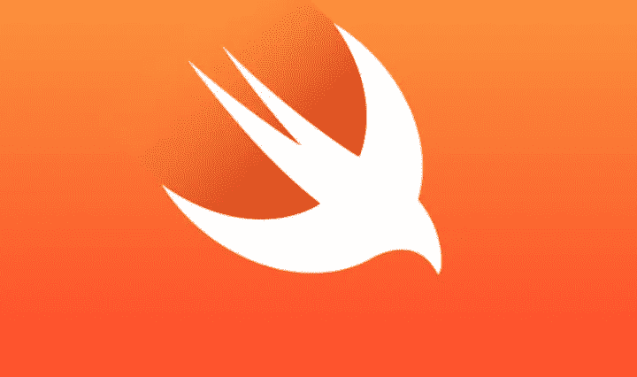

# 2021 年你需要学习的 5 大编程语言

> 原文：<https://medium.com/analytics-vidhya/top-5-programming-languages-you-need-to-learn-in-2021-66cb4efa6de1?source=collection_archive---------7----------------------->

## **2021 年你需要学习的 5 大编程语言！！！**

在本文中，**排名前五的编程语言是**将由两个因素排名；
*1。即使你是一个完全的初学者，你学习这门语言和构建真实世界的项目所需要的时间。
2。2021 年这个编程语言领域的开发者需求和平均工资是多少(就业市场)*

顺便说一句，如果你对此感到兴奋并准备好了，请按下那个按钮，如果你还没有的话，请跟我来。

**本文末尾有一条重要消息(加分提示)等着你。**

**我是 Agbejule kehinde favour。
我们继续！**

*这里* ***我们 gooooo*** *！*

**数字 5**

# r 编程语言

这种编程语言是一种综合的统计分析语言。在以下情况下效果最佳:
# Linux
#微软 windows。

它被用于以下领域:
#数据科学
#统计计算
#机器学习

它很难学，但被视为未来的编程语言。

使用 R 编程语言作为编程语言的公司有:
#埃森哲
#凯捷

在美国，研发人员的平均年薪大约是 15 万美元

**数字 4**

# **斯威夫特**

它是苹果公司开发的开源编程语言。
又快又好学。
既然是苹果创造的，就用来创造 iOS 和 mac os 的应用。
这很棒，因为 appstore 中超过一半的应用都是使用 swift 构建的。

使用 swift 作为编程语言的公司有:
# Apple
# Slack

Swift 是一种编程语言，主要服务于苹果的软件生态系统。然而，这限制了它在某些领域的应用。

但总的来说，这是 2021 年要学习的一门伟大的语言。
**在美国，Swift 开发人员的年薪约为 10.7 万美元**

**数字 3**

# 科特林

Kotlin 是一种广泛用于 Android 原生应用开发的编程语言，最初由 jet brains 开发。

虽然 Android 应用程序可以使用 Java 8 开发，但 Kotlin 现在是大多数开发者在这方面的首选语言。

Kotlin 是一种基于 JVM 的语言，它支持所有的 Java 库。因此，使用 Kotlin 开发后端服务也将成为趋势。

Kotlin 得到了 Google 的支持，这是这种语言的一个巨大的优势。

建立在 JVM 上，Kotlin 的可移植性给了这种语言很大的范围；
#从移动开发到
#使用 Spring 等框架的服务器端到使用编译 JavaScript 的
# web 前端

开发人员喜欢空安全、协程支持等特性，以及它支持函数式编程语言的事实。

Kotlin 也用于**桌面应用开发**

像 YouTube、Google drive 等大多数谷歌应用都是用 kotlin 开发的。

使用 kotlin 作为编程语言的公司有:
# Cousera
# Pinterest

在美国，没有几年经验的 Kotlin 开发人员年薪约为 14 万美元。

相关搜索

 [## 2021 年薪酬最高的五大技术工作| 2021 年薪酬最高的 IT 工作

### 你想知道 2021 年最性感、最受欢迎、薪酬最高的技术工作吗？

medium.com](/analytics-vidhya/top-5-highest-paying-tech-jobs-in-2021-highest-paying-it-jobs-in-2021-518462d04bd4)  [## 2021 年最值得学习的 7 项技术

### 随着我们进入新的十年，令人惊叹的技术正在开发，并积极融入我们的日常生活…

medium.com](/analytics-vidhya/top-7-technologies-to-learn-in-2021-9c122b631672) 

**接下来！**

**2 号**

# Java Script 语言

在 web 开发领域，它是世界上最流行的语言。
是前端开发者必备的语言。

术语“前端开发”意味着它产生最终用户可以与之交互的特性。

你今天遇到的许多网站都使用 JavaScript。

这真的很有帮助，因为它与 HTML 和 CSS 交互，这是 web 开发基本使用的。
这是一种通用代码，使网站更具互动性，并产生高度互动的用户界面。
因此，如果你从事前端项目，比如:
# app 你可以用 React，Angular，vue.js 之类的框架或者库
#桌面 app 你可以用 Electron.js，。
#后端项目可以使用 Node.js。

JavaScript 是关键！

**找到了！**你甚至可以用 Tensorflow.js 开发机器学习。

很棒吧？！

也可以在服务器端开发和游戏开发中使用 Javascript。

使用 JavaScript 作为编程语言的公司有:
# PayPal
# goggles
#微软

在美国，JavaScript 开发人员的平均年薪约为 11.7 万美元。

最后！

**数字 1**

# **Python**

Python 是发展最快的语言，也是最受欢迎的语言之一，拥有可靠且构建良好的框架，如用于 web 开发的 Django 或 flask 框架。

这是一种通用的开源语言，对初学者非常友好，也很容易学习。

它是数据科学和人工智能中最受欢迎的语言。它以简洁的代码著称，这使得它易于读写。

这是许多大公司使用它的主要原因之一。

公司喜欢；
# Instagram
# Spotify
#亚马逊
#脸书等。

使用 Python 编程语言。

**在美国，Python 开发者的平均年薪是 10.7 万美元**

# 额外小费

# 选择最佳语言

因此，为了从这些语言中进行选择，你必须有一个目标。

如果你选择的时候没有目标，你可能会从一种语言跳到另一种语言，却没有更大的进步。

**1⃣如果你的目标是自由职业者或在网页开发领域找份工作，你可以选择 JavaScript 或 Python🐍。**

**2⃣如果你想进入数据科学或机器学习领域，你可以选择 Python🐍。**

**3⃣如果你想进入移动应用开发，你可以选择 Kotlin 或者 swift，或者 JavaScript (React native)。**

**更多给你**

 [## 2021 年 7 大认证| 2021 年薪酬最高的 IT 认证

### 2021 年 7 大认证！拥有这些中的任何一个，你在任何地方都会受到欢迎。

medium.com](/analytics-vidhya/top-7-certifications-in-2021-highest-paying-it-certifications-in-2021-9c7f40f40f57)  [## 2021 年移动应用的 4 大编程语言和框架

### 大家都想要的！

medium.com](/analytics-vidhya/top-4-programming-languages-and-frameworks-for-mobile-apps-in-2021-e181a78e8ac4)  [## 我从来不明白反应组件

### 直到有人这样解释

medium.com](/analytics-vidhya/i-never-understood-react-components-f7916a24e549) 

话虽如此，我希望你能从中获益。

如果你砸了拍手按钮，并帮助外面一个人得到这个值。那就是 ***惊人的*。**

如果你喜欢这个，想要更多有价值的包装内容，请跟我来。

感谢您的宝贵时间！

一如既往，我会在下一篇文章中见到你。

***阿格贝居勒·柯欣德青睐*。**

**祝你们平安！**