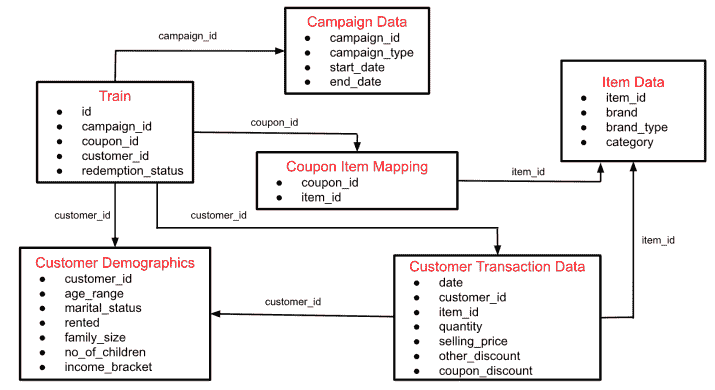
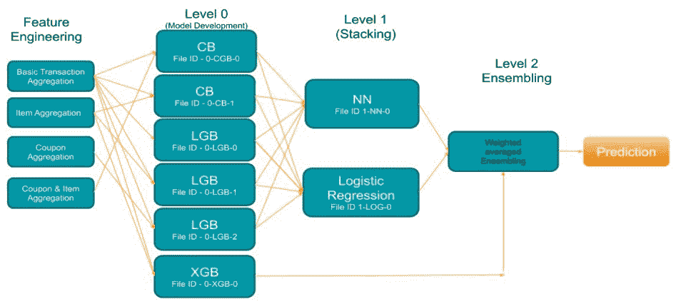

# 来自 AmExpert 2019 的五大获奖解决方案和方法—特色工程特刊！

> 原文：<https://medium.com/analytics-vidhya/top-5-winning-solutions-and-approaches-from-amexpert-2019-feature-engineering-special-bfdba0f87fee?source=collection_archive---------12----------------------->

# 概观

*   展示来自 AmExpert 2019 黑客马拉松的五大获奖解决方案和方法
*   问题陈述来自零售业，旨在预测客户行为
*   这五个获胜的解决方案有一个共同的主题，让他们赢得了这次零售黑客马拉松——请继续阅读，找出它是什么！

# 介绍

如果让我选出数据科学影响最大的五大行业，零售业肯定每次都会榜上有名。我对这些数据科学团队在全球范围内解决的各种挑战和解决方案感到敬畏。

这个行业产生的大量数据已经产生了数据科学的多个用例，这些用例正在被大型零售商如 Tesco、Target、Walmart 等成功利用。只需看看零售业中一些常见的数据科学使用案例:

*   推荐引擎
*   市场篮子分析
*   价格优化
*   存货管理
*   客户情绪分析等等

零售业中最广泛使用的销售策略之一是促销。随着竞争的白热化，零售商提供了越来越多创新的优惠和折扣。公司越来越依赖数据驱动的促销策略来获得最大的投资回报。

我敢肯定你参加过相当多的这些零售商的促销活动(你知道我说的是哪几家！).折扣营销和优惠券可能是两种最常用的促销手段，以吸引新客户，并保持和加强现有客户的忠诚度。

因此，你可以想象，衡量消费者使用优惠券的倾向，甚至预测兑换行为，将会有多大的价值。这些是评估营销活动有效性的关键参数。

***与我们的黑客马拉松合作伙伴和赞助商***[***data hack Summit 2019***](https://www.analyticsvidhya.com/datahack-summit-2019/?utm_source=blog&utm_medium=5-winning-solutions-approaches-amexpert-retail_hackathon-feature-engineering)***——美国运通合作，我们利用历史兑换数据和客户交易概念化并设计了一个与优惠券兑换预测相关的问题陈述。***

看到世界上一些最优秀的数据科学家之间激烈的竞争和参与，真是令人惊讶。我们的团队被新用户以及许多老用户的回应和友好的评价所淹没。以下是一些最重要的例子:

> *“我要感谢 AV 组织了一次伟大的黑客马拉松。这可能是今年最有趣的黑客马拉松之一。”—萨赫勒·维尔马*
> 
> “这是一场关于特征工程的精彩比赛，我非常喜欢。”— Bishwarup
> 
> *“感谢 Vidhya 分析公司和美国运通公司举办这场精彩的比赛。”—穆迪特·蒂瓦里*

对于我们的团队和所有参赛者来说，这是令人兴奋的一周，1000 多名参赛者粘在他们的机器上，尝试不同的技术，创造新的功能，以跨越 0.9 AUC-ROC 标志。让我们看看这篇文章中的五大成功解决方案和方法。

# 关于 AmExpert 2019 黑客马拉松

[AmExpert 2019](http://datahack.analyticsvidhya.com/contest/amexpert-2019-machine-learning-hackathon/?utm_source=blog&utm_medium=5-winning-solutions-approaches-amexpert-retail_hackathon-feature-engineering) 是 Analytics Vidhya 举办的最大的黑客马拉松之一。请查看这些惊人的数字和提供的奖品:

*   **总注册人数:5991 人**
*   **总提交数:14，861**
*   **奖金:MacBook、iPad Mini、智能手表&面试机会！**

这是一场令人难忘且竞争激烈的 9 天黑客马拉松，来自全国各地的各种数据科学家和数据科学专业人士参加了此次活动。

# AmExpert 2019 黑客马拉松的问题陈述:预测优惠券兑换

让我们来了解一下这次黑客马拉松背后的问题陈述。我在前面的介绍中已经暗示过了，但是让我在这里详细说明一下。

这家 XYZ 信用卡公司通过提供机器学习和分析咨询，定期帮助其商家更好地理解他们的数据，并准确地做出关键商业决策。ABC 是一家老牌实体零售商，经常为其多样化的产品系列开展营销活动。

> *ABC 已经寻求 XYZ 帮助他们利用机器学习的力量进行折扣营销。能不能戴上 AmExpert 的帽子，帮帮 ABC？*

ABC 的促销活动通过各种渠道共享，包括电子邮件、通知等。许多此类活动包括为特定产品/产品系列提供的优惠券折扣。**零售商希望能够预测客户是否会兑现跨渠道收到的优惠券，这将使零售商的营销团队能够准确设计优惠券结构，并制定更精确和更有针对性的营销策略。**

此问题中的可用数据包含以下信息，包括以前活动中使用的活动和优惠券样本的详细信息:

*   用户人口统计详细信息
*   活动和优惠券详情
*   产品详情
*   以前的交易

根据过去 18 次活动的交易和绩效数据，参与者被要求预测在测试集中每个优惠券和客户组合的下 10 次活动中优惠券被兑换的概率。一个真正迷人的挑战！

# 数据集描述

以下是不同可用数据表的模式:

在 *train.zip* 文件中为参与者提供了以下文件:

*   **Train:** Train 数据包含在 18 个活动中提供给给定客户的优惠券
*   **活动数据:**28 个活动中每一个的活动信息
*   **优惠券项目映射:**优惠券与该优惠券下可享受折扣的项目的映射
*   **客户人口统计:**某些客户的客户人口统计信息
*   **客户交易数据:**列车数据中活动期间所有客户的交易数据
*   **商品数据:**零售商销售的每个商品的商品信息
*   **测试:**包含预测兑现状态的优惠券客户组合

总结整个过程:

*   顾客在各种活动中收到优惠券，并可以选择兑现
*   他们可以根据优惠券项目映射，在活动开始日期和结束日期之间的持续时间内，用给定优惠券兑换该优惠券的任何有效产品
*   接下来，客户将在零售店用优惠券购买一件商品，这将反映在交易表的列 *coupon_discount* 中

# 评估指标

根据预测概率和观察目标之间的 ROC 曲线度量标准下的[面积对提交进行评估。](https://www.analyticsvidhya.com/blog/2019/08/11-important-model-evaluation-error-metrics/)

# AmExpert 2019 黑客马拉松的获奖者

参加黑客马拉松是第一步。但是赢得它，甚至在排行榜上名列前茅，是一项非常艰巨的任务。我个人参加过无数次黑客马拉松，可以证明登顶排行榜的难度和独创性。

因此，向 AmExpert 2019 黑客马拉松的获胜者致敬。在我们介绍他们的获胜方法之前，让我们祝贺获胜者:

*   排名 1: [苏拉布·贾](https://datahack.analyticsvidhya.com/user/profile/sourabhjha)
*   排名 2: [莫辛汗又名特兹达尔](https://datahack.analyticsvidhya.com/user/profile/Tezdhar)
*   排名 3: [萨赫勒维尔马](https://datahack.analyticsvidhya.com/user/profile/sahilv711@gmail.com)
*   排名第四:[帕拉德普·帕塔克](https://datahack.analyticsvidhya.com/user/profile/pradeeppathak9)
*   排名第五:[穆迪特·提瓦里](https://datahack.analyticsvidhya.com/user/profile/mudit97)

你可以在黑客马拉松[排行榜](https://datahack.analyticsvidhya.com/contest/amexpert-2019-machine-learning-hackathon/pvt_lb)上查看所有参与者的最终排名。

前五名选手分享了他们在比赛中的详细方法。我相信你很想知道他们的秘密，所以让我们开始吧。

*注意:我们下面提供的所有方法都是获胜者自己的话。*

# 排名第五:[穆迪特·蒂瓦里](https://datahack.analyticsvidhya.com/user/profile/mudit97)

> *“我在这次比赛中主要关注的是特征工程。”*

*   因为有 5-6 个表要连接，所以我决定从所有的表中提取数据来创建功能丰富的数据集。**我在收集了顾客、商品和优惠券行为的交易数据后，制作了 4 种数据集。**我测试并最终确定了我的验证策略。我尝试了团体 k 倍和正常 k 倍，得到了更好的结果与后者。在开发数据集后，我最终确定了 6 个模型。这 6 款车型随后用于堆叠和组装，在公开排行榜上给出了大约 **96.2 CV 和～94.46 CV**
*   **特征工程:**

—我发现最有趣的表是客户交易表。客户交易表的聚合确实有助于我的模型的性能

—需要正确使用交易数据，以避免任何泄露的可能性(我仅在每个活动 ID 的开始日期之前使用交易数据进行汇总)

—我在交易数据中做了很多新的逻辑特征，比如总折扣、折扣百分比等。

—我执行了对应于不同数值(平均值、最小值、最大值、标准偏差等)的各种聚合。)以及分类特征(模式、独特性等)。)

—每张优惠券都包含一些商品 id。因此，我决定查看每个活动对应的每个客户购买的商品数量。最终，**这个特性成为了最重要的特性**

—利用上一点的想法，我制作了两组不同的变量:

1.  对于每个活动和优惠券 ID，转到相应的交易表，并在项目中寻找趋势(称为项目级聚合)

2.对于每个活动和优惠券 ID，查看优惠券的过去趋势，如交易表中该优惠券下的独立客户数量，或其类似趋势(称为优惠券级别的聚合)

*   在第一轮模型开发之后，我知道优惠券级别的聚合没有商品级别的聚合重要
*   这种多种多样的变量和趋势是从事务数据和其他表中获取的。通过合并，我能够创建 4 个不同的数据集

> “我决定采用 3 种不同的增强技术——CatBoost、LightGBM 和 XGBoost。”

*   **最终模型:**不同的数据集和一堆不同种类的模型让我对建模过程有了一个很好的想法。我用过 k-fold，也试过用组 k-fold，但是用 k-fold 的 OOT 结果更好。Boosting 运行良好，而 bagging ( [random forest](http://www.analyticsvidhya.com/blog/2014/06/introduction-random-forest-simplified/?utm_source=blog&utm_medium=5-winning-solutions-approaches-amexpert-retail_hackathon-feature-engineering) )没有给出标准结果。我决定采用 3 种不同的增强技术——[CatBoost](http://www.analyticsvidhya.com/blog/2017/08/catboost-automated-categorical-data/?utm_source=blog&utm_medium=5-winning-solutions-approaches-amexpert-retail_hackathon-feature-engineering)、 [LightGBM](https://www.analyticsvidhya.com/blog/2017/06/which-algorithm-takes-the-crown-light-gbm-vs-xgboost/?utm_source=blog&utm_medium=5-winning-solutions-approaches-amexpert-retail_hackathon-feature-engineering) 和 [XGBoost](http://www.analyticsvidhya.com/blog/2018/09/an-end-to-end-guide-to-understand-the-math-behind-xgboost/?utm_source=blog&utm_medium=5-winning-solutions-approaches-amexpert-retail_hackathon-feature-engineering) 。**我对这三个模型和 4 个数据集进行了重复实验，并在人工参数调整和特征选择后选择了 6 个模型。**我已经提供了下面的整体示意流程图。在最终的六个模型中，除了一个 XGBoost 模型之外，所有的模型都用于两种类型的堆积——一个使用简单的逻辑回归，另一个使用人工神经网络
*   点击查看解决方案

# 排名 4: [帕拉德普·帕塔克](https://datahack.analyticsvidhya.com/user/profile/pradeeppathak9)

> *“我创建了一个包含大约 124 个特征的数据集，构建了不同的模型，并采用所有模型预测的总体平均值作为最终提交。拥有可靠的交叉验证策略是在竞争中脱颖而出的关键。”*

*   **特色工程:**

—由于问题陈述是根据过去的交易来预测用户是否会兑现优惠券，因此从中创建的功能(历史交易)变得非常重要

**——这里的关键是对交易进行子集化，以避免泄露。**因此，对于每一行，我只使用开始日期之前的事务来创建相同的特性

—我为下面提到的组创建了聚合功能。我们的想法是从不同的层面和角度创造有价值的特色，吸引顾客兑现优惠券:

1.  客户和开始日期组

2.优惠券和开始日期组

3.客户、优惠券和开始日期组

4.还使用了客户和优惠券的每日级别聚合

5.品牌(从优惠券中提取)和开始日期组

6.我也用同样的直觉尝试了许多其他级别的聚合特征，但它们并没有被证明是有用的，所以我在最终的数据集中放弃了它们

**7。创造没有任何泄漏的特色是在比赛中获得冠军的关键**

*   **最终模型:**平均预测来自具有大约 124 个特征的数据集上的 [LightGBM](https://www.analyticsvidhya.com/blog/2017/06/which-algorithm-takes-the-crown-light-gbm-vs-xgboost/?utm_source=blog&utm_medium=5-winning-solutions-approaches-amexpert-retail_hackathon-feature-engineering) 、 [XGBoost](https://www.analyticsvidhya.com/blog/2018/09/an-end-to-end-guide-to-understand-the-math-behind-xgboost/?utm_source=blog&utm_medium=5-winning-solutions-approaches-amexpert-retail_hackathon-feature-engineering) 和 [CatBoost](https://www.analyticsvidhya.com/blog/2017/08/catboost-automated-categorical-data/?utm_source=blog&utm_medium=5-winning-solutions-approaches-amexpert-retail_hackathon-feature-engineering) 模型
*   **关键要点:**创造有价值的功能是在竞争中脱颖而出的关键。使用历史数据时避免特征泄漏对于模型不过度拟合非常重要
*   点击查看解决方案

# 排名 3: [萨希尔·维尔马](https://datahack.analyticsvidhya.com/user/profile/sahilv711@gmail.com)

> 问题的关键在于创建特性时不要引入漏洞。大多数参与者都在为此挣扎。”

*   **特征工程:**

—对于给定的客户优惠券对，目标是找到该优惠券的所有商品，并找到客户使用过去的交易购买该产品的倾向。我们可以在品牌和类别层面应用类似的逻辑。除了倾向之外，我们还可以计算一系列其他变量，例如，总支出是多少，总折扣是多少，等等。

—除了客户优惠券级别，我还在仅优惠券和仅活动级别尝试了类似的方法。例如，一个优惠券代码下的项目使用优惠券折扣的概率是多少？*我们可以通过过滤属于一个优惠券*的商品的历史交易来获得

—为了避免泄漏，在行级别过滤活动日期之前的历史数据非常重要

**——这些变量是这个问题最有力的变量，我通过多次阅读问题陈述页面获得了线索。**如果你已经阅读了问题陈述的最后四行，其中的要点描述了整个过程，那么你就会明白了！

*   **最终模型:** **我的最终模型是基于两个数据集构建的 Catboost、LightGBM 和 XGBoost 的线性混合。**两个数据集之间的唯一区别是各自拥有的要素数量(因此，一个数据集拥有更多从历史数据中计算出来的统计数据)
*   **关键要点:**功能创建是关键。多次阅读问题陈述(我从这里得到了特性的概念)。尽量避免泄漏，人们普遍认为在公共排行榜上上升是好的，但它会反噬。尝试建立一个健壮的验证策略
*   点击查看解决方案

# 排名 2: [莫辛汗又名特兹达尔](https://datahack.analyticsvidhya.com/user/profile/Tezdhar)

*   **观察:**

—我最初查看了活动日期，这表明培训和测试活动在时间上是分开的。因此，我决定使用训练数据中的最后三个活动(按活动开始日期排序)作为验证数据

—另一件重要的事情是观察问题是如何设置的。每场活动都有特定的优惠券。我们想知道，给定一组客户，他们会兑换哪些优惠券。**处理这个问题的标准方法是将其转化为分类问题，这可以通过将数据集中的所有客户与所有优惠券配对来完成**

—假设有 N 个客户和 M 张优惠券—这将导致 N*M 行。这将导致大量的行，即使 N 和 m 的数量很少。因此，为了有效地解决这个问题，我们需要对行进行重新采样(一种方法是对用户没有兑换优惠券的训练数据中的行进行采样，以便数据集变得稍微平衡一些)。可以看出，每位顾客的优惠券数量平均在 16–20 张左右

—在这种情况下，客户很可能会与配对优惠券中的至少一张优惠券进行互动。因此，我们需要做的第一件事是获得每个客户的优惠券排名。此外，我们可以根据客户兑换优惠券的倾向(基于客户培训数据)对客户进行排名

*   现在，重要的问题是——你如何给顾客的优惠券排序？嗯，我们有客户交易，其中我们知道客户通常在哪些项目上兑换优惠券。如果与客户配对的优惠券有更多这些项目，他/她很可能会兑现该特定优惠券
*   因此，让我们根据与他/她的历史交易项目相同的项目对(客户、优惠券)对进行排序。类似地，我们还可以根据客户在训练数据中的“优惠券兑换均值”对他们进行排名
*   点击查看解决方案

# 排名 1: [苏拉布贾](https://datahack.analyticsvidhya.com/user/profile/sourabhjha)

> *“本地交叉验证有点难以信任，避免任何形式的泄露是获得高分的关键。”*

*   **特色工程:**

—我创建了 300 多个功能，包括客户和优惠券的聚合功能。我还使用给定活动之前的交易数据子集，从每个活动的客户交易数据中创建了一个优惠券对

—我使用[奇异值分解(SVD)](https://www.analyticsvidhya.com/blog/2019/08/5-applications-singular-value-decomposition-svd-data-science/) 和不同的时间加权 tf-idf 矩阵为客户和优惠券创建了多个潜在向量。比如，(客户 X 物品)，(客户 X 品牌)，(客户 X 优惠券)等。

—我还计算了类别和品牌类型的总支出、总储蓄、优惠券储蓄和交易数量

*   我通过基于 IDs 随机分割数据，创建了 5 重交叉验证
*   **最终模型:**我使用了 LightGBM 算法来训练模型
*   **系统配置:** 16GB 内存，4 核
*   **要点:**本地交叉验证有点难以信任，避免任何形式的泄露是获得高分的关键。由于交易数据是在商品和品牌级别提供的，使用潜在特征帮助我抽象这些特征，并在客户和优惠券级别使用。我还使用置换特征重要性来确保只有好的特征保留在最终的模型中。这有助于将功能集从 300 多个减少到 107 个
*   查看解决方案[这里](https://github.com/kunalj101/amExpert_ML_Hackathon_2019_Winners_Soultions/tree/master/Rank_1_Sourabh_Jha)

# 结束注释

竞赛中最重要的收获是定义正确的交叉验证策略、正确的数据探索和特征工程。我认为这没有什么奇怪的，因为这些都是每次黑客马拉松的获胜者反复提到的事情。然而，许多初学者也体验了处理多个表数据的工作，并获得了从历史数据创建聚合要素的技能。

我鼓励你今天就前往 [DataHack 平台](https://datahack.analyticsvidhya.com/?utm_source=blog&utm_medium=5-winning-solutions-approaches-amexpert-retail_hackathon-feature-engineering)，参加正在进行的黑客马拉松。你也可以尝试我们那里的各种练习题，磨练你的技能。

如果你有任何问题，请在下面的评论区发表。

*原载于 2019 年 10 月 21 日*[*https://www.analyticsvidhya.com*](https://www.analyticsvidhya.com/blog/2019/10/5-winning-solutions-approaches-amexpert-retail_hackathon-feature-engineering/)*。*